---
aliases:
  - OSV vulnerability diagnostics plan
tags:
  - sdd
  - plan
  - research
  - enhancement
  - deps-core
  - deps-lsp
  - security
created: 2026-08-19
status: draft
related:
  - "[[spec]]"
  - "[[constitution]]"
---

# Technical Plan: Vulnerability-aware diagnostics via OSV.dev batch API

> [!info] References
> **Spec**: [[spec]]
> **Priority**: P2 — plan produced per this project's SDD-integration threshold
> (P2–P3 enhancement = specify + plan; tasks/implementation deferred to a
> dedicated `/rust-team` session, not this research cycle)

> [!warning] Planning under open clarifications
> The spec carries five `[NEEDS CLARIFICATION]` markers. Per research-session
> rules, no code is written here, and this plan does not silently resolve
> them — each is either (a) given a stated *working assumption* so the plan
> can proceed, flagged for confirmation before `/sdd tasks`, or (b) left as a
> hard blocker where guessing would be unsafe. See [[#10. Constitution
> Compliance]] and [[#11. Risks and Mitigations]].

## 1. Architecture

### Approach

Add vulnerability lookup as a **new, ecosystem-agnostic component in
`deps-core`**, integrated into the existing diagnostics/hover/code-action
pipeline at the same layer as `generate_diagnostics_from_cache`,
`generate_hover`, and `generate_code_actions` (`crates/deps-core/src/lsp_helpers.rs`).
This mirrors how those three functions are already shared across all 10
ecosystem crates via default trait-method implementations on `Ecosystem`
(`crates/deps-core/src/ecosystem.rs`) — no ecosystem crate needs its own OSV
integration code, satisfying FR-002/US-005/NFR-003.

The OSV batch query is triggered from the same place per-dependency registry
version fetches already happen: `fetch_latest_versions_parallel`
(`crates/deps-lsp/src/document/lifecycle.rs:97`). Rather than adding OSV as
one more per-dependency task inside that function's existing fan-out, it is
issued as a **single additional concurrent future** (one batch call for the
whole dependency list) that is `tokio::join!`-ed alongside the existing
per-dependency registry fetches, so the OSV round trip does not serialize
behind — or block — the registry-fetch completion (NFR-001).

Results are stored on `DocumentState` (`crates/deps-lsp/src/document/state.rs`)
in a new field, structurally parallel to the existing `cached_versions:
HashMap<String, String>` field, so the rendering functions
(`generate_diagnostics_from_cache`, `generate_hover`, `generate_code_actions`)
consume it the same way they already consume `cached_versions` and
`resolved_versions` — read-only, from an already-populated cache, never
making network calls themselves.

### Component Diagram

```mermaid
graph TD
    subgraph deps-lsp
        A[document/lifecycle.rs<br/>handle_document_open / handle_document_change] --> B[fetch_latest_versions_parallel]
        B --> C[per-dependency registry fetch<br/>existing, unchanged]
        B --> D[NEW: osv_batch_fetch<br/>one call for all deps]
        A --> E[DocumentState<br/>+ vulnerabilities: HashMap&lt;String, Vec&lt;OsvVulnerability&gt;&gt;]
        D --> E
    end
    subgraph deps-core
        D --> F[NEW: OsvClient<br/>querybatch + vulns fetch]
        F --> G[HttpCache<br/>existing, reused unchanged]
        H[Ecosystem trait<br/>generate_diagnostics / generate_hover / generate_code_actions] --> I[lsp_helpers.rs<br/>generate_diagnostics_from_cache<br/>generate_hover<br/>generate_code_actions]
        E --> I
        I --> J[NEW: osv_ecosystem_name&#40;ecosystem_id&#41;<br/>static mapping table]
    end
    F --> K[OSV.dev API<br/>POST /v1/querybatch<br/>POST /v1/query]
```



### Key Design Decisions

| Decision | Choice | Rationale | Alternatives Considered |
|----------|--------|-----------|--------------------------|
| Integration layer | `deps-core`, not per-ecosystem crate | Only place that guarantees cross-ecosystem consistency (US-005, NFR-003); matches existing pattern for diagnostics/hover/code-actions | Per-ecosystem client in each of the 10 `deps-*` crates — rejected, direct violation of the project's cross-ecosystem-consistency rule |
| HTTP transport | `reqwest` (already a workspace dependency) | No new HTTP client dependency needed | `ureq`/other lightweight client — rejected, adds a dependency for no benefit |
| Caching | Reuse existing `HttpCache` (`crates/deps-core/src/cache.rs`) | FR-008; avoids the DRY violation already flagged in issue #120 by not adding a third caching implementation | Dedicated OSV-specific cache with a custom TTL — rejected, duplicates existing ETag/Last-Modified logic |
| Batch vs per-dependency queries | Single `POST /v1/querybatch` per diagnostics cycle (chunked at 1000 per FR-009) | Matches OSV.dev's design intent and keeps request count flat regardless of manifest size (NFR-004) | N sequential `POST /v1/query` calls, one per dependency — rejected, defeats the batch endpoint's purpose and risks rate-limiting on large manifests |
| Concurrency with registry fetch | OSV batch call runs concurrently (`tokio::join!`) with `fetch_latest_versions_parallel`'s existing per-dependency fetches, not appended after | Preserves NFR-001 — no added latency to the existing critical path in the common case | Sequential: fetch versions, then fetch OSV — rejected, doubles worst-case latency for no benefit |
| Vulnerability detail fetch | Only for IDs returned by the batch call (FR-003) | Keeps the common "no vulnerabilities" case cheap — no extra request beyond the one batch call | Always fetch full vuln records — rejected, wasteful when 0 vulnerabilities are typically found |
| Version-range matching for "is this version affected" | Delegate to OSV's own batch response (OSV performs the affected-range matching server-side; the batch endpoint already returns only vulnerabilities that match the queried version) | Avoids re-implementing per-ecosystem version-range semantics (semver, PEP 440, node-semver, etc.) a second time inside `deps-core` — OSV already does this correctly server-side | Fetch all advisories for a package name and match ranges client-side with each ecosystem's version-comparison crate — rejected, massive duplication of logic the project already has scattered across `semver`/`pep440_rs`/`node-semver`, and error-prone to reimplement generically |

## 2. Project Structure

```
crates/deps-core/src/
├── ecosystem.rs              (unchanged: Ecosystem trait keeps default-impl pattern)
├── lsp_helpers.rs            (extended: generate_diagnostics_from_cache, generate_hover,
│                               generate_code_actions read from new vulnerability map)
├── cache.rs                  (unchanged: HttpCache reused as-is)
└── osv/                      (NEW module)
    ├── mod.rs                (OsvClient, batch query orchestration, chunking per FR-009)
    ├── ecosystem_map.rs       (NEW: static ecosystem_id -> OSV ecosystem string table, FR-002)
    └── types.rs               (NEW: OsvBatchQuery, OsvBatchResult, OsvVulnerability, serde types)

crates/deps-lsp/src/document/
├── state.rs                  (extended: DocumentState gains `vulnerabilities` field)
└── lifecycle.rs              (extended: fetch_latest_versions_parallel gains a concurrent
                                OSV batch future; new osv_batch_fetch helper)

crates/deps-lsp/src/
└── config.rs                 (extended: DiagnosticsConfig gains a vulnerability-scan toggle, FR-011)
```

## 3. Data Model

```rust
// crates/deps-core/src/osv/types.rs (sketch — exact serde field names to be
// verified against the live OSV.dev schema before implementation)

#[derive(serde::Serialize)]
struct OsvBatchQuery<'a> {
    package: OsvPackage<'a>,
    version: &'a str,
}

#[derive(serde::Serialize)]
struct OsvPackage<'a> {
    ecosystem: &'a str, // from ecosystem_map.rs, e.g. "crates.io", "npm", "PyPI"
    name: &'a str,
}

#[derive(serde::Deserialize)]
struct OsvBatchResponse {
    results: Vec<OsvBatchResult>, // order-matched to the request's `queries` list
}

#[derive(serde::Deserialize)]
struct OsvBatchResult {
    #[serde(default)]
    vulns: Vec<OsvVulnId>,
}

#[derive(serde::Deserialize)]
struct OsvVulnId {
    id: String,
    modified: String, // RFC3339 timestamp, used for cache/staleness reasoning
}

/// Full advisory, fetched only for IDs present in a batch result.
#[derive(serde::Deserialize, Clone)]
pub struct OsvVulnerability {
    pub id: String,
    pub summary: Option<String>,
    pub severity: Vec<OsvSeverity>, // may be empty — see spec Open Questions
    pub affected: Vec<OsvAffected>,
}

#[derive(serde::Deserialize, Clone)]
pub struct OsvSeverity {
    #[serde(rename = "type")]
    pub kind: String, // e.g. "CVSS_V3"
    pub score: String,
}

#[derive(serde::Deserialize, Clone)]
pub struct OsvAffected {
    pub ranges: Vec<OsvRange>,
}

#[derive(serde::Deserialize, Clone)]
pub struct OsvRange {
    pub events: Vec<OsvEvent>, // look for the `fixed` variant to derive fixed_version
}

#[derive(serde::Deserialize, Clone)]
pub struct OsvEvent {
    pub introduced: Option<String>,
    pub fixed: Option<String>,
}
```

```rust
// crates/deps-lsp/src/document/state.rs — additive field on DocumentState
pub vulnerabilities: HashMap<String, Vec<deps_core::osv::OsvVulnerability>>,
// keyed the same way `cached_versions` is (normalized package name),
// cloned the same way in `impl Clone for DocumentState`
```

### Migrations

Not applicable — no persisted storage; all vulnerability data lives in
in-memory `DocumentState` and the existing `HttpCache`, both already
process-lifetime, non-persistent caches.

## 4. API Design

### Outbound (deps-lsp → OSV.dev)

| Method | Path | Description | Request | Response |
|--------|------|-------------|---------|----------|
| POST | `https://api.osv.dev/v1/querybatch` | Batch-check all dependencies' declared versions against known advisories | `{"queries": [{"package": {"ecosystem": "crates.io", "name": "time"}, "version": "0.1.43"}, ...]}` (chunked at 1000 entries per FR-009) | `{"results": [{"vulns": [{"id": "RUSTSEC-2020-0071", "modified": "..."}]}, ...]}` |
| POST | `https://api.osv.dev/v1/query` (batched by ID) or `GET /v1/vulns/{id}` | Fetch full advisory details for matched IDs only | `{"id": "RUSTSEC-2020-0071"}` or none (GET) | Full `OsvVulnerability` record — severity, summary, affected ranges, fixed version |

No inbound API changes — this feature does not add or modify any LSP-facing
request/response shape beyond the existing `Diagnostic`, `Hover`, and
`CodeAction` payloads already produced by `generate_diagnostics_from_cache`,
`generate_hover`, and `generate_code_actions`.

## 5. Integration Points

| System | Direction | Protocol | Notes |
|--------|-----------|----------|-------|
| OSV.dev | outbound | HTTPS (HTTP/2 recommended by OSV.dev for large batch responses) | Free, keyless, response capped at 32 MiB over HTTP/1.1 — no vault entry needed (NFR-006) |
| `HttpCache` (`deps-core`) | internal, reused | in-process | Provides ETag/Last-Modified conditional requests for both the batch endpoint and per-ID vuln fetches |
| `Ecosystem` trait default methods | internal | Rust trait dispatch | `generate_diagnostics`, `generate_hover`, `generate_code_actions` default impls extended to read the new `vulnerabilities` map — no per-ecosystem override needed for any of the 10 crates |

## 6. Security

- Authentication: none — OSV.dev API is public and keyless (NFR-006); no
  secrets, no new Zeph vault entries.
- Authorization: not applicable.
- Input validation: dependency names/versions passed into the OSV batch query
  are already-parsed, already-validated manifest data (same values already
  sent to each ecosystem's own registry client) — no new untrusted-input
  surface is introduced.
- Sensitive data: none transmitted beyond package name + version, which is
  not sensitive (same data already sent to public package registries for
  version lookups).
- Response handling: OSV responses are deserialized via `serde` into strongly
  typed structs (not dynamically interpreted), and a malformed/oversized
  response is treated as a fetch failure subject to FR-007's graceful
  degradation, not a parse-time panic.

## 7. Testing Strategy

| Level | Framework | What to Test | Coverage Target |
|-------|-----------|-------------|-----------------|
| Unit | `cargo nextest` | `ecosystem_map.rs` mapping table (all 10 ecosystem IDs resolve to a non-empty OSV ecosystem string); severity-mapping fallback logic; fixed-version extraction from `OsvEvent` sequences | 100% of mapping table branches |
| Unit | `mockito` (already in workspace, per `.claude/rules/testing.md`) | `OsvClient` against mocked `/v1/querybatch` and `/v1/vulns/{id}` responses — success, empty-result, malformed-JSON, timeout, non-200 status | All FR-007 degradation paths |
| Integration | `cargo nextest` + `tempfile` fixtures | End-to-end: manifest with one known-vulnerable dependency (per spec SC-001, one fixture per ecosystem) produces the expected `Diagnostic` and hover content | 10/10 ecosystems (SC-001) |
| Live/manual | per `.claude/rules/continuous-improvement.md` | Real OSV.dev batch query against a live known-vulnerable package per ecosystem, verified in a running LSP session with `RUST_LOG=debug`, per this project's Registry Integration Gate | Required before merge, not before spec/plan |
| Snapshot (`insta`) | `cargo insta` | Diagnostic message format and hover markdown layout for a vulnerability match, to catch unintended formatting drift across ecosystems (reinforces NFR-003) | New snapshot per ecosystem fixture |

## 8. Performance Considerations

- Expected load: one batch request per diagnostics refresh cycle per open
  document, chunked at 1000 dependencies (FR-009) — realistically 1 request
  per document for the vast majority of manifests.
- Bottleneck risk: OSV.dev round-trip time becomes the new tail latency for
  diagnostics if it is slower than the slowest existing per-dependency
  registry fetch; mitigated by running it concurrently (NFR-001) and applying
  the same per-fetch timeout pattern already used in
  `fetch_latest_versions_parallel` (`crates/deps-lsp/src/document/lifecycle.rs`).
- Optimization: `HttpCache`'s conditional-request (ETag/If-None-Match) support
  means repeated queries against an unchanged dependency set become cheap
  304-status round trips rather than full payload transfers (NFR-005, SC-005).

## 9. Rollout Plan

Given P2 priority and the existing SDD-integration threshold rule (P2–P3 =
specify + plan, implementation deferred to a dedicated `/rust-team` session):

1. This plan is reviewed and the open `[NEEDS CLARIFICATION]` items (see
   [[#11. Risks and Mitigations]]) are resolved with the maintainer.
2. `/sdd tasks` breaks this plan into discrete, dependency-ordered tasks in a
   dedicated implementation session (not this research cycle).
3. Feature ships gated behind the new `DiagnosticsConfig` toggle (FR-011),
   default value decided per the corresponding open question — allows an
   opt-out rollout if OSV.dev integration proves noisy or unreliable in early
   use.
4. No phased/canary rollout infrastructure exists in this project today (no
   feature-flag service) — the config toggle is the only rollout control
   available, consistent with how existing diagnostics features are gated.

## 10. Constitution Compliance

`[NEEDS CLARIFICATION: .local/specs/constitution.md does not exist yet for
this project (confirmed via file check) — this plan cannot verify formal
constitution compliance and instead cross-checks against the project's
existing enforced rules under .claude/rules/, which function as the
project's de facto constitution today.]`

| Principle (from `.claude/rules/`) | Status | Notes |
|---|---|---|
| Cross-ecosystem consistency (`continuous-improvement.md`) | Compliant by design | Single `deps-core` implementation, no per-ecosystem duplication (see [[#1. Architecture]]) |
| Registry Integration Gate (`continuous-improvement.md`) | Addressed in [[#7. Testing Strategy]] | Live verification against real OSV.dev required before merge |
| DRY / avoid duplicated caching logic | Compliant | Reuses `HttpCache` rather than adding a third cache implementation (avoids compounding the pattern already flagged in issue #120) |
| Rust code conventions (`rust-code.md`) — `thiserror` typed errors, native async traits, no `unsafe`, `tracing` logging | Planned, not yet verified | To be enforced during implementation; `OsvClient` errors should extend or compose with existing `deps_core::error` types |
| Testing conventions (`testing.md`) — `nextest`, `mockito`, `insta` | Planned | See [[#7. Testing Strategy]] |
| Dependencies rule — check current versions via context7 mcp before adding | Not yet applicable | No new dependency anticipated (`reqwest`, `serde`, `serde_json` already in workspace) — to be confirmed at implementation time |

## 11. Risks and Mitigations

| Risk | Impact | Probability | Mitigation |
|------|--------|-------------|------------|
| OSV.dev ecosystem string for Swift Package Manager is wrong or has changed | High (feature silently returns zero results for one of 10 ecosystems) | Medium | Blocking `[NEEDS CLARIFICATION]` — verify against live OSV.dev ecosystem list before `/sdd tasks`; add a unit test asserting the mapping matches the documented list |
| OSV advisories lacking a numeric severity field lead to inconsistent diagnostic severity | Medium (user-visible inconsistency, undermines NFR-003) | High (RUSTSEC/GHSA records commonly omit CVSS) | Blocking `[NEEDS CLARIFICATION]` — maintainer decides `WARNING` vs `HINT` default before implementation; document the decision in this plan once resolved |
| Gradle/Maven `groupId:artifactId` name format mismatch with OSV's expected `name` field | Medium (silently missed vulnerabilities for Gradle/Maven) | Medium | Verify via a live query against a known-vulnerable Maven Central package (per Testing Strategy's live/manual row) before considering FR-010 complete |
| OSV.dev batch endpoint rate-limits or throttles under heavy multi-document editing (many files open at once, each triggering its own batch call) | Medium (degraded UX, not a correctness bug) | Low–Medium | FR-008/NFR-005 caching mitigates repeat queries; if observed in live testing, consider debouncing or a shared per-workspace batch across open documents as a follow-up enhancement (not in this spec's scope) |
| Feature adds latency perceived by users even though it runs concurrently (NFR-001), because `tokio::join!` waits for the slowest of the two futures | Low–Medium | Medium | Apply the same per-fetch timeout already used for individual registry fetches to the OSV future, so a slow/hanging OSV call cannot extend the diagnostics cycle beyond the existing timeout ceiling |
| No project constitution exists to check formal compliance against | Low (process risk, not implementation risk) | Certain (confirmed) | Cross-checked against `.claude/rules/*.md` instead (see [[#10. Constitution Compliance]]); recommend running `/sdd init` before or alongside this feature's implementation session |

## See Also

- [[spec]] — feature specification
- [[MOC-specs]] — all specifications
- `crates/deps-core/src/ecosystem.rs`, `crates/deps-core/src/lsp_helpers.rs`, `crates/deps-core/src/cache.rs`
- `crates/deps-lsp/src/document/lifecycle.rs`, `crates/deps-lsp/src/document/state.rs`
- `crates/deps-gradle/src/ecosystem.rs` — Gradle-reuses-Maven precedent for FR-010
- `.claude/rules/continuous-improvement.md`, `.claude/rules/testing.md`, `.claude/rules/rust-code.md`
