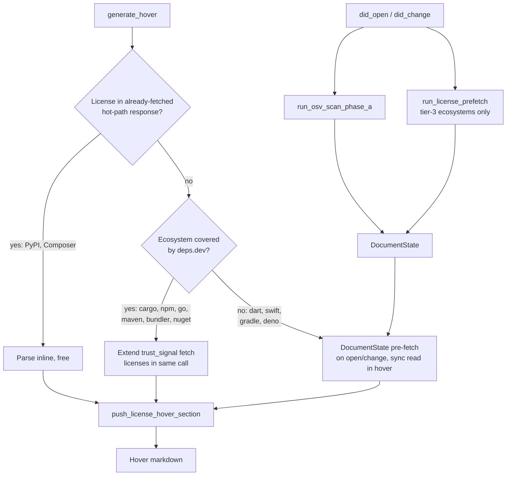

---
aliases:
  - License Hover Plan
tags:
  - sdd
  - plan
  - license
  - hover
created: 2026-09-08
status: draft
related:
  - "[[spec]]"
  - "[[MOC-specs]]"
---

# Technical Plan: License in hover + optional license-policy diagnostics

> [!info] References
> **Spec**: [[spec]]
> **Issue**: #204

## 0. Scope decision (resolves spec §9 top-level ambiguity)

Both phases ship in this plan/PR sequence: **Phase 1** (license in hover, FR-001–FR-006, FR-009,
FR-010) and **Phase 2** (SPDX allow/deny policy diagnostics, FR-007, FR-008). No project
`constitution.md` exists (per `specs.md`, this project governs via `.claude/CLAUDE.md` +
`.claude/rules/*.md` instead of the SDD constitution template) — compliance is checked against
those files in §10 below.

## 1. Architecture

### Approach

License data has three different cost profiles depending on the ecosystem, discovered by live
verification against the real registries (not assumed from docs):

| Ecosystem | License already in hover's current hot-path response? | Cheapest real source |
|---|---|---|
| PyPI | **Yes** — `info.license` / `info.license_expression` (verified live) | Free — parse existing response |
| Composer | **Yes** — `license[]` in Packagist p2 response (verified live) | Free — parse existing response |
| Cargo | No — sparse index has no `license` field (verified live) | deps.dev (covered) |
| npm | No — abbreviated packument strips it (verified live) | deps.dev (covered) |
| Go | No — module proxy `.info`/`.mod` carry **no license field at all** (verified live) | deps.dev is the *only* viable source |
| Maven, NuGet, Bundler | Not yet live-verified | deps.dev (covered) |
| Dart | No clean SPDX field — only a normalized `license:*` tag on the separate `/score` endpoint (verified live) | Native, best-effort, flagged non-authoritative |
| Swift, Gradle, Deno | Not yet live-verified | Native, to be determined per §1.4 |
| GitHub Actions, GitLab CI/CD | N/A — not versioned packages | **Out of scope** (see §1.5) |

This produces a **three-tier fetch strategy**, applied in priority order per ecosystem:

1. **Free tier** — if license is already present in the JSON response hover already fetches
   today, parse it inline. Zero new network calls, zero new latency.
2. **deps.dev-reuse tier** — for the 7 ecosystems `deps_dev_system()` maps
   (`crates/deps-core/src/deps_dev/mod.rs:183`: npm, cargo, go, maven, pypi, bundler, nuget),
   extend the *existing* `GET /v3/systems/{system}/packages/{name}/versions/{version}` call
   already made by `trust_signal()` to also parse `licenses[]`. This rides the same
   spawn-and-bounded-wait call that already exists for Scorecard/provenance — no new spawn, no
   new cache layer, no new timeout budget. This is also the *only* working license source for Go
   (its module proxy protocol carries no license metadata whatsoever).
3. **Native secondary-fetch tier** — for ecosystems deps.dev does not cover (Dart, Swift, Gradle,
   Deno; Composer and PyPI are already covered by tier 1) and that don't already have license in
   their hot-path response, do a per-ecosystem secondary registry fetch, following the same
   background-prefetch-into-`DocumentState` pattern already used for OSV scanning (see §1.3),
   rather than blocking hover on a new inline network call.

Tier 1 wins over tier 2 wherever both are available (PyPI, Composer): it is strictly cheaper —
zero network round trips versus even a warm deps.dev memo hit.

### Component Diagram



### Key Design Decisions

| Decision | Choice | Rationale | Alternatives Considered |
|---|---|---|---|
| Data model placement | `license: Vec<String>` on the per-ecosystem `Version`-implementing type (threaded into `lsp_helpers::VersionData`, `crates/deps-core/src/lsp_helpers/mod.rs:430`) | Hover never calls `Registry::search()`/`Metadata` (`registry.rs:768`, `registry.rs:234`) — confirmed via grep, zero hits in `hover.rs`. `Metadata` only feeds `completion.rs:481`. Putting license on `Metadata` would light up completions, not hover, which is not what this spec asks for. | Extend `Metadata` trait — rejected, wrong data path for hover; deferred as a follow-up for completions enrichment, out of this spec's scope |
| License shape | `Vec<String>` (one entry per declared SPDX identifier) everywhere, never a single `Option<String>` | RubyGems already returns a JSON array (`["MIT"]` or multi-license); deps.dev's `licenses[]` is also an array. A single shape avoids a `Vec` vs `Option<String>` split (the codebase currently has both — `deps-bundler` uses `Vec<String>`, `deps-dart`'s unused stub uses `Option<String>`) | Keep both shapes per-ecosystem — rejected, violates cross-ecosystem consistency (NFR-004) |
| Cargo/npm/Go/Maven/Bundler/NuGet source | Extend `trust_signal()`'s existing deps.dev call | Reuses `spawn_trust_signal_fetch` (`hover.rs:388`) + `DEPS_DEV_WAIT_BUDGET` (`hover.rs:27`, 700ms) bounded-wait + `DepsDevClient`'s memo-warm design (`hover.rs:19-26` doc comment) — zero new spawn/cache/timeout infrastructure | Per-ecosystem native secondary fetch for all 12 ecosystems — rejected after live verification showed it duplicates infrastructure that already fetches this exact data for 6 of these ecosystems, and is the *only* option for Go |
| PyPI/Composer source | Parse the field already present in the currently-fetched response | Verified live: `PypiInfo` (`deps-pypi/src/registry.rs:877`) and Composer's p2 parsing already fetch the JSON body that contains `license`/`license[]`, just don't extract it yet | deps.dev for these two — rejected, strictly more expensive (network+timeout) for data already in hand |
| Dart source | pub.dev `/score` endpoint's `license:*` tag, labeled "License (detected):" not "License:" in hover | No clean SPDX field exists anywhere in pub.dev's package/version API (verified live: `pubspec` has no license key); the `/score` tag is a best-effort SPDX-license-detector output, not registry-declared metadata | Omit Dart entirely — rejected, partial best-effort data is more useful than none, consistent with existing graceful-degradation pattern (NFR-003); requires a documented, labeled exception to NFR-005's "no normalization" rule |
| Swift / Gradle / Deno source | Not decided here — each requires the same live-verification pass Cargo/npm/PyPI/Composer/Dart already got (§1.4) | These weren't live-checked in this planning session; guessing risks another silent-wrong assumption like the one this session already caught and corrected (Cargo sparse index) | Guess from documentation — rejected, this project's Registry Integration Gate rule already mandates live verification before any registry-client PR; deferred to task-level, not invented here |
| GitHub Actions / GitLab CI/CD | Out of scope | Not versioned packages with a per-version SPDX field; a repo-level GitHub license lookup is a different data model (repo license, not package-version license) than every other ecosystem this spec covers | Repo-level GitHub API license lookup — rejected as scope creep, no demand signal, different data shape from every other row in the hover |
| Eager vs lazy | Per-tier: tier 1 eager/inline (free), tier 2 reuses existing bounded-wait (already lazy-with-timeout), tier 3 pre-fetched into `DocumentState` on open/change (OSV pattern, `lifecycle.rs:1765`/`:2372`, `run_osv_scan_phase_a` `lifecycle.rs:549-619`) | No tier introduces a *new* blocking network call inside `generate_hover`; NFR-002's <100ms-cached target holds because every tier either has zero network cost or reuses an already-async-fetched cache | A uniform "lazy with loading placeholder" for all ecosystems — rejected, unnecessary complexity where data is already free or already async |
| Policy config channel | `initializationOptions.licensePolicy { allow: [String], deny: [String] }`, validated through the existing `parse_config` (`deny_unknown_fields`) path (`crates/deps-lsp/src/server.rs`) | Reuses the one existing config-validation path per CLAUDE.md's rule ("no separate, weaker validation path for a config reload") | A new workspace config file (`.depsrc.json`) — rejected for v1, no existing file-based config infrastructure in this project; documented as an explicit follow-up if demand appears |
| Policy matching | Exact top-level SPDX identifier, set-membership against the dependency's `license: Vec<String>` | `license` is already a set of discrete identifiers (not a raw `"MIT OR Apache-2.0"` expression string) for every source this plan uses; set membership needs no new dependency | Full SPDX-expression-operator parser (`OR`/`AND`/`WITH`) — rejected, "Ask First" boundary in spec §8 flags new deps for this; no current requirement needs it |
| Allow vs deny precedence | Both independently optional; if a license matches both, **deny wins** | Defense-in-depth default, matches `cargo deny licenses`' own precedence convention cited as this feature's inspiration | Allow always wins — rejected, weaker compliance guarantee |
| Invalid SPDX identifier in policy | Log one warning at config-load time, drop the invalid entry from the effective policy, do not crash, do not block other valid entries | Matches NFR-003 (no crash) and the project's single-config-validation-path principle | Diagnostic anchored to the config file — rejected, LSP diagnostics are anchored to open text documents, not `initializationOptions` payloads which have no document URI to anchor to |

## 2. Project Structure

```
crates/deps-core/src/
├── deps_dev/
│   ├── types.rs         # DepsDevVersionInfo gains `licenses: Vec<String>` (currently ignored per types.rs:1-8)
│   └── mod.rs            # trust_signal() (mod.rs:344) threads licenses into SupplyChainTrustSignal (or a sibling LicenseSignal)
├── lsp_helpers/
│   ├── hover.rs           # push_license_hover_section (new, alongside push_trust_signal_hover_section at hover.rs:793)
│   └── mod.rs              # VersionData (mod.rs:430) gains `license: Vec<String>`
├── licenses.rs             # NEW — shared SPDX policy matcher: PolicyConfig, LicenseViolation, evaluate(license: &[String], policy: &PolicyConfig) -> Option<LicenseViolation>
└── registry.rs              # no change (Metadata trait untouched, see §1 rationale)

crates/deps-pypi/src/registry.rs      # PypiInfo gains license/license_expression parsing (already-fetched response)
crates/deps-composer/src/registry.rs  # p2 response parsing gains license[] (already-fetched response)
crates/deps-dart/src/registry.rs      # wires the existing-but-unused PackageInfo.license stub (registry.rs:211,:670) to a new /score fetch + tag extraction

crates/deps-lsp/src/
├── document/
│   ├── state.rs            # DocumentState gains a licenses cache field, mirroring `vulnerabilities` (state.rs:92)
│   └── lifecycle.rs         # run_license_prefetch (new), spawned alongside run_osv_scan_phase_a on open/change, tier-3 ecosystems only
└── handlers/
    ├── hover.rs              # passes DocumentState's license cache into generate_hover, mirrors vulnerabilities wiring (hover.rs:71)
    └── diagnostics.rs         # Phase 2: calls deps-core::licenses::evaluate per dependency when a policy is configured
```

## 3. Data Model

```rust
// crates/deps-core/src/lsp_helpers/mod.rs — VersionData gains:
pub struct VersionData<'a> {
    // ...existing fields...
    pub license: &'a [String],
    pub latest_license: &'a [String],
}

// crates/deps-core/src/licenses.rs — new module
pub struct LicensePolicy {
    pub allow: Vec<String>,
    pub deny: Vec<String>,
}

pub struct LicenseViolation {
    pub license: String,
    pub reason: ViolationReason, // Denied | NotAllowed
}

pub fn evaluate(license: &[String], policy: &LicensePolicy) -> Option<LicenseViolation>;
```

No new persistent entities beyond what §5 of the spec already describes. `LicensePolicy` is
parsed once at `initialize`/`did_change_configuration` time (existing `parse_config` path) and
held in server state, not per-document.

## 4. API Design

No new LSP methods. Existing `textDocument/hover` and `textDocument/diagnostic` responses gain
additional content:

| Surface | Change |
|---|---|
| Hover markdown | New `push_license_hover_section` line(s): `License: <SPDX>` for resolved version, `Latest version: License: <SPDX>` for latest, `License changed: <old> → <new>` when the sets differ |
| `initializationOptions` | New optional `licensePolicy: { allow?: string[], deny?: string[] }` block, validated via existing `parse_config` |
| Diagnostics (Phase 2) | New diagnostic per dependency whose `license` set violates the configured policy, anchored at the existing manifest-line range already used for outdated/vulnerability diagnostics |

## 5. Integration Points

| System | Direction | Protocol | Notes |
|---|---|---|---|
| deps.dev API v3 | outbound | HTTPS/JSON | Existing `trust_signal()` call extended, no new endpoint |
| PyPI JSON API | outbound | HTTPS/JSON | Existing hot-path call, new field parsed |
| Packagist p2 API | outbound | HTTPS/JSON | Existing hot-path call, new field parsed |
| pub.dev `/score` | outbound | HTTPS/JSON | New call, tier-3 pre-fetch pattern |
| Swift/Gradle/Deno registries | outbound | TBD | Live-verify during tasks (§1.4), tier-3 pre-fetch pattern once source confirmed |

## 6. Security

No new secrets, no new auth. All endpoints used (deps.dev, PyPI, Packagist, pub.dev) are already
in this project's `net_policy.rs`-governed keyless/public-API set. `initializationOptions.licensePolicy`
is user/editor-supplied config, not external network input — validated the same way every other
`initializationOptions` field is (`parse_config`, `deny_unknown_fields`).

## 7. Testing Strategy

| Level | Framework | What to Test | Coverage Target |
|---|---|---|---|
| Unit | `cargo nextest` | `licenses::evaluate` (allow/deny/both/neither/deny-wins-on-conflict/invalid-identifier-dropped), per-ecosystem license parsing (PyPI/Composer/deps.dev wire types) | All branches in the decision table above |
| Integration | `mockito`-backed registry tests (existing pattern in each `deps-*` crate) | Full hover generation for a dependency in each of the three tiers, license-changed flag, graceful degradation on missing/unreachable license data | One representative ecosystem per tier minimum, all 12 covered ecosystems before merge (Registry Integration Gate) |
| Snapshot | `cargo insta` | Hover markdown snapshots gain a license line; existing snapshots updated, not silently changed | All ecosystem hover snapshot tests touched by this change |
| Live | Manual, per `.claude/rules/continuous-improvement.md` Registry Integration Gate | Real hover request against a real dependency per ecosystem, before filing the PR | All 12 in-scope ecosystems |

## 8. Performance Considerations

- Tier 1 (PyPI, Composer): zero added latency, same response already parsed.
- Tier 2 (6 deps.dev ecosystems + Go): zero added latency in the common case — rides the existing
  `DEPS_DEV_WAIT_BUDGET` (700ms) bounded wait already budgeted for trust-signal data; on a cache
  miss within that budget, license arrives in the same response as trust signal already does today.
- Tier 3 (Dart, Swift, Gradle, Deno): pre-fetched asynchronously on document open/change, same as
  OSV scanning; hover reads a cache, never blocks on network.
- NFR-007's "<20% hover latency regression on 50+ dependency manifests" is expected to hold since
  no tier adds a new *synchronous* fetch to the hover critical path.

## 9. Rollout Plan

Single PR per phase is preferred over one omnibus PR, to keep the check suite fast and review
scoped:
1. PR 1 — Phase 1, tier 1+2 ecosystems (PyPI, Composer, Cargo, npm, Go, Maven, Bundler, NuGet):
   highest-confidence, live-verified or well-understood sources.
2. PR 2 — Phase 1, tier 3 ecosystems (Dart, Swift, Gradle, Deno): each needs its own live
   verification per §1.4 before implementation.
3. PR 3 — Phase 2 (policy diagnostics): depends on PR 1's `license: Vec<String>` data model
   being in place.

## 10. Constitution Compliance

No `constitution.md` exists in this project (see §0); checked instead against `.claude/CLAUDE.md`
and `.claude/rules/*.md`:

| Principle | Status | Notes |
|---|---|---|
| Cross-ecosystem consistency (`.claude/CLAUDE.md`) | Compliant | `license: Vec<String>` and `push_license_hover_section` are shared in `deps-core`, not reimplemented per ecosystem crate |
| Registry Integration Gate (`continuous-improvement.md`) | Compliant, enforced at task level | Every ecosystem's license source verified live before its PR, per §7 |
| DRY / reuse before new code (`.claude/CLAUDE.md`) | Compliant | Reuses `trust_signal()`, `DocumentState`/OSV pre-fetch pattern, `parse_config` — no parallel infrastructure introduced |
| MVP / no premature abstraction | Compliant | No SPDX-expression parser added; simple set-membership policy matching only |
| `unsafe_code = "forbid"` | Compliant | No unsafe code needed |

## 11. Risks and Mitigations

| Risk | Impact | Probability | Mitigation |
|---|---|---|---|
| Swift/Gradle/Deno license source turns out to not exist cleanly (as happened with Go/Dart) | Medium — affects 3 of 12 ecosystems | Medium (2 of 6 checked so far had surprises) | §1.4 mandates live verification before implementing each; graceful "License: (unknown)" degradation already spec'd (NFR-003) covers the failure case |
| deps.dev rate limits or deprecates the `licenses[]` field | Low — same risk already accepted for Scorecard/provenance | Low | Same mitigation already in place for trust signal (bounded wait, graceful omission) |
| Dart's `/score`-tag license is misleading if presented identically to registry-declared SPDX | Medium — could mislead a policy decision | Certain if not labeled | Explicit "License (detected):" labeling decision in §1, documented as an NFR-005 exception |

## See Also

- [[spec]] — feature specification
- [[MOC-specs]] — all specifications
