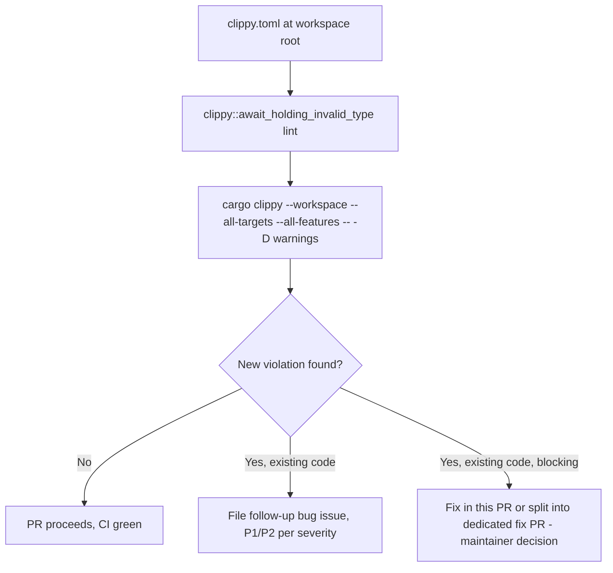

---
aliases:
  - Clippy DashMap Await-Hold Guard Plan
tags:
  - sdd
  - plan
  - enhancement
  - tooling
  - ci
created: 2026-08-24
status: draft
related:
  - "[[spec]]"
  - "[[constitution]]"
---

# Technical Plan: Add `clippy.toml` `await-holding-invalid-types` config for DashMap `Ref` guards

> [!info] References
> **Spec**: [[spec]]

## 1. Architecture

### Approach

This is a single-file, zero-code-change addition: a `clippy.toml` at the
workspace root that extends the already-active
`clippy::await_holding_invalid_type` lint (enabled today via
`[workspace.lints.clippy] all = "warn"` in the root `Cargo.toml`) with
project-specific type paths. No new lint category is introduced, no
existing lint is silenced, and no application code changes.

There is no meaningful alternative architecture to weigh here — this is the
one canonical mechanism clippy provides for registering custom
"must not be held across await" types (`await-holding-invalid-types` is
`await_holding_invalid_type`'s dedicated config key; there is no equivalent
via `#[allow]`/`#[warn]` attributes or a `build.rs` check that would be
simpler or more idiomatic).

### Component Diagram



### Key Design Decisions

| Decision | Choice | Rationale | Alternatives Considered |
|----------|--------|-----------|------------------------|
| Config mechanism | `clippy.toml` `await-holding-invalid-types` key | Purpose-built clippy feature for exactly this hazard class; zero runtime cost, enforced at every `cargo clippy` invocation including CI's existing gate | Custom `xtask`/CI grep for `Ref`/`.await` co-occurrence (rejected: fragile text-matching, false positives/negatives, duplicates work clippy already does correctly via its type-and-control-flow analysis) |
| Which types to register | `dashmap::mapref::one::{Ref, RefMut, MappedRef, MappedRefMut}` + `dashmap::mapref::multiple::{RefMulti, RefMutMulti}` | First two (`Ref`, `RefMut`) have confirmed live usage (`ServerState::get_document`); registering all six preempts the same class for future code paths (multi-key iteration, mapped refs) without needing another spec cycle later | Registering only `Ref`/`RefMut` (rejected: cheap to add the other four now, and the Goal explicitly calls for preempting future occurrences, not just patching the currently-known one) |
| File location | Workspace root `clippy.toml` (not `.clippy.toml`, not per-crate) | Clippy resolves config from the workspace root by convention; a single file covers all member crates uniformly, matching how `[workspace.lints.clippy]` is already centralized in the root `Cargo.toml` | Per-crate `clippy.toml` files (rejected: hazard applies workspace-wide — `deps-lsp`, `deps-core`, `deps-maven`, `deps-npm`, `deps-swift` all hold `DashMap`/`Arc<DashMap<...>>` state per the finding's grep evidence — a single root config is simpler and avoids drift between crates) |
| Handling of pre-existing violations if the config surfaces any | Do not fix in this PR; file a separate tracked issue (FR-006) | Keeps this PR's blast radius to "add detection," matching the finding's explicit framing that a positive result here is valuable signal, not a blocker; avoids scope creep into remediation work that would need its own review | Blocking this PR on fixing any newly found violation (rejected as default — left as a maintainer judgment call per spec Open Questions, not baked into the plan as mandatory) |

## 2. Project Structure

```
deps-lsp/
├── Cargo.toml                    (unchanged — [workspace.lints.clippy] already has `all = "warn"`)
├── clippy.toml                   (new — workspace-root lint config, this feature's only file)
├── CHANGELOG.md                  (modified — one-line entry under [Unreleased])
└── crates/
    └── ...                        (unchanged — no source files touched)
```

## 3. Data Model

Not applicable — no runtime types, no schema, no database. The only
artifact is the TOML config file itself:

```toml
# clippy.toml
#
# Registers DashMap guard types with clippy::await_holding_invalid_type
# (active workspace-wide via `[workspace.lints.clippy] all = "warn"` in
# Cargo.toml). Holding one of these guards across an `.await` point pins
# a lock on the DashMap shard for the duration of the awaited future,
# which can starve or deadlock a concurrent access to the same shard.
#
# This bug class was found and fixed three times in this project's
# history — issue #317 (inlay_hints.rs, diagnostics.rs), PR #318 (partial
# fix, left a then-inert hazard flagged with TODO(#317-followup) comments
# in deps-core/src/ecosystem.rs), and issue #319 / PR #325 (the live
# version of the same hazard in hover.rs, code_actions.rs, and
# completion.rs, the latter holding a guard across a 2s timeout).
#
# Do not remove entries here without confirming (a) no code in the
# workspace constructs that guard type at all, or (b) the type's guard is
# never held across an .await point anywhere it's constructed.
await-holding-invalid-types = [
    "dashmap::mapref::one::Ref",
    "dashmap::mapref::one::RefMut",
    "dashmap::mapref::one::MappedRef",
    "dashmap::mapref::one::MappedRefMut",
    "dashmap::mapref::multiple::RefMulti",
    "dashmap::mapref::multiple::RefMutMulti",
]
```

Note: `await-holding-invalid-types` accepts either bare type-path strings or
`{ path = "...", reason = "..." }` tables per clippy's documented config
schema. If the pinned clippy version supports the `reason` form, prefer it
for each entry so the "why" surfaces directly in the lint diagnostic (not
just in this file's header comment) — confirm support during
implementation (see Verification step below) and use whichever form the
installed clippy accepts.

## 4. API Design

Not applicable — no public API surface changes.

## 5. Integration Points

| System | Direction | Protocol | Notes |
|--------|-----------|----------|-------|
| `cargo clippy` (local + CI `check` job) | inbound config consumption | TOML file read at lint time | No network calls, no other tool integration; picked up automatically by any `cargo clippy` invocation from the workspace root, including the existing CI `check` job — no CI workflow YAML change needed |

## 6. Security

Not applicable — this is a static-analysis config file, not runtime code.
No secrets, no user input, no auth surface.

## 7. Testing Strategy

| Level | Framework | What to Test | Coverage Target |
|-------|-----------|-------------|-----------------|
| Static analysis (the feature itself) | `cargo clippy --workspace --all-targets --all-features -- -D warnings` | Confirms the config parses correctly and produces zero *new* `await_holding_invalid_type` violations against the current, post-#325 codebase | Full workspace, all features, all targets — matches the project's standard pre-commit clippy invocation exactly, no new command needed |
| Regression (existing) | `cargo nextest run --workspace --all-features --no-fail-fast` | Confirms the config addition doesn't affect runtime behavior (expected: no change at all, since this is lint-only) | Full workspace — sanity check, not testing new logic |
| Doc build | `RUSTFLAGS="-D warnings" RUSTDOCFLAGS="--deny rustdoc::broken_intra_doc_links" cargo doc --no-deps --workspace` | Confirms no incidental breakage (expected: no change) | Full workspace |

No new unit or integration tests are written as part of this feature — there
is no new code path to unit-test. The "test" for this feature *is* the full
clippy run against the real codebase, executed once during implementation
and once more in CI on the PR itself.

## 8. Performance Considerations

Negligible. `clippy.toml` type-path lookups are a constant-cost table check
already performed by the `await_holding_invalid_type` lint pass, which runs
regardless (it already checks the built-in default type list). Per NFR-002,
verify informally by comparing local `cargo clippy --workspace
--all-targets --all-features` wall-clock time before/after — no formal
benchmark needed for a config-only change.

## 9. Rollout Plan

Single-PR rollout, no feature flag, no phased deployment — this is a
CI/tooling config change with no runtime behavior to roll out gradually.

Implementation sequence (all in one PR, following the spec's Agent
Boundaries "Always" list):

1. Add `clippy.toml` at the workspace root with the six type-path entries
   (Data Model section above), verifying against the installed clippy
   version whether the `reason`-table form is supported.
2. Run `cargo clippy --workspace --all-targets --all-features -- -D
   warnings` and inspect the result.
3. **Decision point (per spec FR-006 / Open Questions)**:
   - **If clean** (expected outcome, given #325 already fixed every
     confirmed live occurrence): proceed directly to step 4.
   - **If new violations surface**: do NOT fix them as part of this PR.
     Document each violation's file/line/handler, classify severity per
     the project's Anomaly Detection process (P0-P4; a DashMap-guard-
     across-await hazard is realistically P1 if it wraps real I/O, P2 if
     the awaited future never currently yields — mirroring the #317 vs.
     #319 distinction), and file a separate GitHub issue via `gh issue
     create` with the `bug` label plus the priority label, linking back to
     this spec and to #317/#319/#325 for context. This config PR then
     proceeds to merge with the new issue referenced in the PR description
     — the config addition itself is still correct and valuable even
     though it surfaced a pre-existing gap; blocking config-hardening work
     on unrelated remediation work would delay the CI gate for no benefit.
   - Note: if the maintainer's actual preference (per the spec's open
     question) is to block on fixing rather than ship-and-file, escalate
     before merging — this plan defaults to ship-and-file but flags the
     alternative explicitly.
4. Run `cargo +nightly fmt --all -- --check`, `cargo nextest run
   --workspace --all-features --no-fail-fast`, and the rustdoc gate to
   confirm no incidental breakage.
5. Add a one-line `CHANGELOG.md` entry under `[Unreleased]`.
6. Open the PR; link the PR number into the changelog entry once known.

## 10. Constitution Compliance

No `constitution.md` exists yet in this project
(`.local/specs/constitution.md` — confirmed missing). This plan instead
complies with the project's checked-in rule files as the de facto
constitution:

| Principle (from `.claude/rules/`) | Status | Notes |
|-----------|--------|-------|
| Full pre-commit check suite before PR (`branching.md`) | Compliant | Step 4 runs fmt, clippy (the feature itself), nextest, rustdoc gate |
| CHANGELOG entry under `[Unreleased]`, one line + PR link (`branching.md`, global CLAUDE.md) | Compliant | Step 5-6 |
| Continuous-improvement session is read-only, no code fixes during CI cycles (`continuous-improvement.md`) | Compliant by design | This plan explicitly defers any newly-surfaced violation to a separate follow-up issue/PR rather than fixing inline, matching the "no direct code edits in continuous improvement sessions" rule — even though this particular PR (adding the config) is itself a small code change, not a CI-cycle-only artifact |
| YAML tooling: use `fast-yaml`/`fy` (global CLAUDE.md) | Not applicable | `clippy.toml` is TOML, not YAML — no `fy` validation needed |
| Rust code conventions: no `#[allow]` for workspace-suppressed lints (`rust-code.md`) | Compliant | This feature adds detection, explicitly forbids new `#[allow(clippy::await_holding_invalid_type)]` suppressions per spec Agent Boundaries |

## 11. Risks and Mitigations

| Risk | Impact | Probability | Mitigation |
|------|--------|-------------|------------|
| Pinned CI clippy version doesn't support `await-holding-invalid-types` key | Config silently no-ops (clippy typically ignores unknown config keys with a warning, doesn't hard-fail) — feature provides no protection | Low (key has been stable in clippy for multiple releases) | Verify locally with `cargo clippy --version` and check for a "unknown clippy.toml key" warning in step 2's output before merging (NFR-003) |
| Adding the config surfaces a real, previously-undetected violation | Requires follow-up triage work outside this PR's scope; delays full remediation | Low-medium (three prior fixes already covered every known `Ref`-returning API path per the grep evidence) | Explicit decision point in Rollout step 3 — ship the config regardless, file the issue, don't let it block the CI-hardening win |
| Future `dashmap` major version renames/removes `MappedRef`/`RefMulti` etc. | Config references a type path that no longer exists; likely silently ignored rather than erroring | Low, deferred | Out of scope per spec — covered by existing Dependency Monitoring process when `dashmap` is next upgraded |

## See Also

- [[spec]] — feature specification
- [[MOC-specs]] — all specifications
