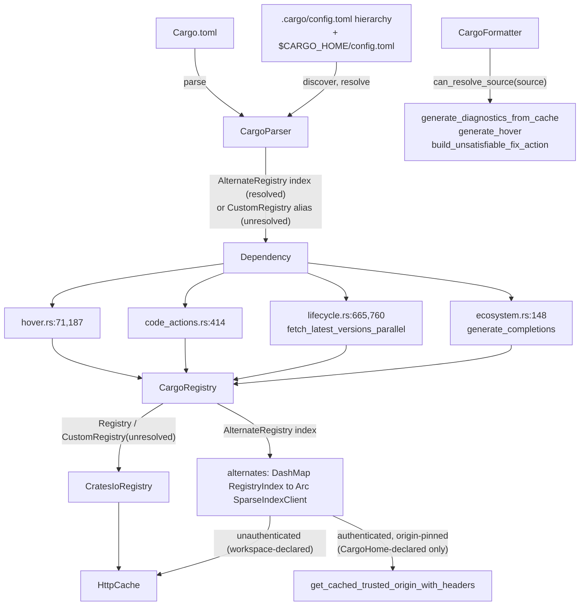

---
aliases:
  - Cargo Custom Registries plan
tags:
  - sdd
  - plan
  - enhancement
  - security
  - cargo
created: 2026-09-01
status: shipped
related:
  - "[[spec]]"
  - "[[constitution]]"
---

# Technical Plan: Cargo Custom/Private Registry & Source-Replacement Resolution

> [!info] References
> **Spec**: [[spec]]
> **Priority**: P4 — plan produced per this project's SDD-integration
> threshold despite P4, given the multi-round architecture work already
> invested (two architect rounds, two adversarial critic reviews) and the
> security-blocking nature of the credential-handling design (C2/R3)

> [!important] Sequencing — binding, adopted from both architect and critic
> Phase 1 splits into two sequential PRs against this one spec:
>
> - **1a = custom/private registries + routing + `$CARGO_HOME`-only auth.**
>   Delivers the issue's core private-registry use case standalone
>   (spec FR-001 through FR-004, FR-008-FR-012, FR-014-FR-016).
> - **1b = `[source]` replace-with.** Forces config memoization (spec
>   NFR-005) and `[source]` cycle detection (spec FR-005-FR-007) —
>   deliberately kept out of 1a so 1a stays materially simpler and lands
>   first.
>
> Do not merge 1a and 1b into one PR. Do not start 1b implementation until
> 1a is merged and its full check suite is green.

## 1. Architecture

### Approach

Resolve registry identity as far upstream as possible — at parse time, on
the dependency's own `source()` — so the rest of the pipeline (fetch,
cache, hover, diagnostics, completion) needs no new per-document plumbing.
`CargoParser` gains `.cargo/config.toml` discovery (piggybacked on the
existing `find_workspace_root` ancestor walk, `crates/deps-cargo/src/
parser.rs:357`) and rewrites `DependencySource::CustomRegistry { url:
"my-corp" }` into a resolved `DependencySource::AlternateRegistry { index:
"https://..." }` when it can. Everything downstream — the new
`CargoRegistry` router, the `EcosystemFormatter::can_resolve_source` gate,
completion's context join — reads the source that already rides on the
dependency.

This was the central architectural bet from the first design round and it
survived critique intact; what changed across the two critic rounds was
**which network paths actually see that source** (C1/R1: all five
`Registry` network methods, not just `get_versions`) and **how the auth
boundary is enforced** (C2/R3: resolved into `Option<AuthToken>` at
config-load time, not a runtime `Provenance` branch).

### Component Diagram



### Key Design Decisions

| Decision | Choice | Rationale | Alternatives Considered |
|----------|--------|-----------|--------------------------|
| Where to resolve registry identity | Parse time, on `DependencySource` | Nothing downstream needs new per-document state; the source already rides on the dependency into every consumer | Resolve in the registry (needs per-document state injected into a shared `Arc<dyn Registry>`); resolve in deps-lsp lifecycle (leaks Cargo config knowledge into the generic layer) |
| Routing contract shape | Two new defaulted `Registry` methods (`get_versions_from`, `get_latest_matching_from`) | Covers all five network-performing trait methods exhaustively (per R1); defaulted so every other ecosystem is bit-identical | A generalized `FetchContext` struct subsuming `get_versions_with` + issue #424's `minimum_stability` — rejected as a larger refactor of a shipped API for no v1 benefit |
| Resolvability gate location | `EcosystemFormatter::can_resolve_source`, not `Registry` | Zero `pub` signature churn — the formatter is already a parameter of the three affected functions and already carries this class of gate | `Registry`-level hook (rejected — ripples to 6+ unrelated call sites and injects a registry handle into the deliberately registry-free `generate_diagnostics_from_cache`) |
| Auth trust boundary | `auth: Option<AuthToken>` resolved at config-load time, populated only for `$CARGO_HOME`-declared entries | Structural gate — no downstream API surface can obtain a token for a workspace-declared registry | Runtime `Provenance` check at the token-lookup call site (rejected — identified as forgeable during the final critic re-verification) |
| `replace-with` fallback | Only `sparse+https://` reroutes; `directory`/`local-registry`/non-sparse git-index keep resolving against crates.io | Cargo verifies per-version checksums, not full content-set equivalence, for replacements — crates.io's answers remain correct for a mirror; going dark is strictly worse than today | Going dark for all non-sparse replacements — rejected, takes a working vendored workspace dark |
| `.cargo/config.toml` staleness | Document as a known limitation (spec FR-013, option b) | The existing watched-file dispatch (`did_change_watched_files`) routes every event through a lockfile-name lookup that drops anything else; building a parallel dispatch branch + reparse-scope computation is a second new subsystem for a P4 issue | Dedicated watcher branch (option a) — valid future upgrade, not required for 1a/1b |
| New `DependencySource` variant vs. reusing `CustomRegistry` | New `AlternateRegistry { index }` variant | Makes "resolved" a type-level state; avoids string-sniffing (`starts_with("http")`) to distinguish alias-vs-URL, which is fragile | Overload `CustomRegistry.url` to sometimes hold a resolved URL — rejected, ambiguous failure mode |

## 2. Project Structure

```
crates/deps-cargo/
├── src/
│   ├── config.rs           # NEW (1a): .cargo/config.toml discovery + resolution
│   │                        #   CargoConfig, ResolvedRegistryEntry, Provenance, RegistryIndex
│   ├── sparse.rs            # NEW (1a): SparseIndexClient extracted from registry.rs
│   ├── registry.rs          # MODIFIED (1a): CargoRegistry router replaces
│   │                        #   CratesIoRegistry as CargoEcosystem::registry()'s value;
│   │                        #   CratesIoRegistry narrowed to a SparseIndexClient wrapper
│   ├── formatter.rs          # MODIFIED (1a): can_resolve_source override; hover
│   │                        #   link suppression for non-crates.io sources (FR-014)
│   ├── parser.rs             # MODIFIED (1a): alias resolution into AlternateRegistry;
│   │                        #   (1b) [source] replace-with two-stage resolution
│   ├── ecosystem.rs           # MODIFIED (1a): generate_completions joins
│   │                        #   CompletionContext::Version/Feature back to
│   │                        #   parse_result.dependencies() for source-aware routing
│   └── source_replace.rs    # NEW (1b): two-stage alias-to-source-id-to-replacement-chain
│                             #   resolution, bounded iteration + cycle detection
├── Cargo.toml                # MODIFIED (1a): url dev-dep -> real dep; + dashmap real dep
└── tests/
    ├── config_test.rs         # NEW (1a)
    ├── alternate_registry_test.rs  # NEW (1a): mockito, incl. hover-fallback +
    │                          #   background-fetch-mirror path assertions (spec SC-004)
    └── source_replace_test.rs # NEW (1b)

crates/deps-core/
├── src/
│   ├── parser.rs              # MODIFIED (1a): DependencySource::AlternateRegistry variant
│   ├── registry.rs             # MODIFIED (1a): get_versions_from, get_latest_matching_from
│   │                          #   defaulted trait methods
│   ├── ecosystem.rs             # MODIFIED (1a): EcosystemFormatter::can_resolve_source
│   │                          #   defaulted hook
│   ├── cache.rs                # MODIFIED (1a): get_cached_trusted_origin_with_headers
│   └── lsp_helpers/hover.rs      # MODIFIED (1a): :71, :187 migrated to source-aware calls;
│                                #   is_version_resolvable() call site -> can_resolve_source

crates/deps-lsp/
├── src/
│   ├── document/lifecycle.rs    # MODIFIED (1a): :665 fetch_latest_versions_parallel takes
│   │                          #   (PackageName, DependencySource) pairs; :760 migrated;
│   │                          #   :1079 dedup gains the M1 collision bail-out;
│   │                          #   :4071 is_version_resolvable() -> can_resolve_source
│   ├── document/code_actions.rs # MODIFIED (1a): :202, :414 migrated
│   └── document/diagnostics.rs  # MODIFIED (1a): :498,508,540,584,611 migrated
```

## 3. Data Model

See [[spec#5. Data Model]] for the full type table. Sketch:

```rust
// crates/deps-core/src/parser.rs
pub enum DependencySource {
    // ...unchanged variants...
    CustomRegistry { url: String },       // unresolved alias (unchanged meaning)
    AlternateRegistry { index: String },  // NEW: resolved index URL
}

// crates/deps-core/src/registry.rs
pub trait Registry: Send + Sync {
    // ...unchanged existing methods...

    fn get_versions_from<'a>(
        &'a self,
        name: &'a PackageName,
        source: &'a DependencySource,
        freshness: FreshnessSettings,
    ) -> BoxFuture<'a, Result<Vec<Box<dyn Version>>>> {
        self.get_versions_with(name, freshness) // default: ignore source
    }

    fn get_latest_matching_from<'a>(
        &'a self,
        name: &'a PackageName,
        source: &'a DependencySource,
        req: &'a VersionReq,
        context: FreshnessSettings,
    ) -> BoxFuture<'a, Result<Option<Box<dyn Version>>>> {
        self.get_latest_matching_with_context(name, req, context) // default
    }
}

// crates/deps-core/src/ecosystem.rs
pub trait EcosystemFormatter: Send + Sync {
    // ...unchanged existing methods...

    fn can_resolve_source(&self, source: &DependencySource) -> bool {
        source.is_version_resolvable()
    }
}

// crates/deps-cargo/src/config.rs
pub struct RegistryIndex(url::Url); // https-only, no-userinfo, sparse+ stripped

pub enum Provenance { CargoHome, Workspace } // diagnostics only, NOT an auth gate

pub struct ResolvedRegistryEntry {
    pub index: RegistryIndex,
    pub auth: Option<AuthToken>,   // Some(..) ONLY when provenance == CargoHome
    pub provenance: Provenance,    // logging only
}

pub struct CargoConfig {
    pub registries: HashMap<String, ResolvedRegistryEntry>, // 1a
    pub source: HashMap<String, SourceEntry>,                // 1b
}

// crates/deps-cargo/src/registry.rs
pub struct CargoRegistry {
    crates_io: CratesIoRegistry,
    alternates: DashMap<RegistryIndex, Arc<SparseIndexClient>>, // capped
    cache: Arc<HttpCache>,
}
```

### Migrations
Not applicable — no persistent database.

## 4. API Design
Not applicable — no new LSP protocol surface (no new requests/
notifications). `ECOSYSTEM_GUIDE.md` documents the user-visible behavior
change (private registries now resolve).

## 5. Integration Points

| System | Direction | Protocol | Notes |
|--------|-----------|----------|-------|
| Alternate sparse index | outbound | HTTPS GET | Same wire format as the existing crates.io sparse client |
| `.cargo/config.toml` (workspace + `$CARGO_HOME`) | inbound (file read) | Local FS | New file-read surface for this LSP outside the open document set |
| `CARGO_REGISTRIES_<NAME>_INDEX`/`_TOKEN` | inbound (env read) | Process env | Precedent: `deps-swift/src/registry.rs:170`'s `GITHUB_TOKEN` |

## 6. Security

- Authentication: `Option<AuthToken>` resolved at config-load time, gated
  structurally on `$CARGO_HOME` provenance (spec FR-008/FR-009,
  NFR-001).
- Authorization: not applicable (no user-facing auth model beyond the
  registry token itself).
- Input validation: `RegistryIndex` newtype rejects non-https/userinfo URLs
  at construction (spec FR-002/NFR-002); `[source]` cycle detection reuses
  #432's untrusted-input hardening standard (spec FR-007).
- Sensitive data: tokens never logged; origin-pinned transport
  (`get_cached_trusted_origin_with_headers`) prevents cross-origin leakage
  on redirect (spec FR-010).
- **Mandatory**: security review sign-off before 1a merges, given C2/R3's
  history as the design's two blocking findings across two critic rounds.
  Flag the residual internal-network-reachability risk (spec NFR-003)
  explicitly during that review — do not let it surface for the first
  time there.

## 7. Testing Strategy

| Level | Framework | What to Test | Coverage Target |
|-------|-----------|---------------|------------------|
| Unit | `cargo nextest` | Config discovery/precedence, `RegistryIndex` validation, env-var collision handling, auth-gate structural property | All spec FR-* acceptance criteria |
| Integration | `mockito` + `tempfile::TempDir` | Alt-index fetch on the happy path AND specifically on the hover-fallback (`get_latest_matching`) and background-fetch-mirror (`get_latest_matching_with_context`) paths — spec SC-004 | Every network-performing `Registry` method touched by an `AlternateRegistry` source |
| Regression | `cargo nextest`, existing suite | Zero-custom-registry workspaces render identically | Full existing `deps-cargo` suite passes unmodified |
| Live/manual | `RUST_LOG=debug cargo run -p deps-lsp`, per `.claude/rules/continuous-improvement.md` Registry Integration Gate | Real `.cargo/config.toml` fixture against a mocked or real sparse index; hover/diagnostic/completion end-to-end | Required before merge, both 1a and 1b |

## 8. Performance Considerations

- 1a: config discovery must add zero FS reads when no dependency carries
  `registry`/`registry-index` (lazy trigger valid because 1a excludes
  `replace-with`) — spec NFR-004.
- 1b: lazy trigger no longer holds (replace-with affects plain deps);
  memoization keyed on workspace root, invalidated by contributing-file
  mtime, is required from 1b onward — spec NFR-005.
- `CargoRegistry.alternates` map: capped at a bound in the low hundreds of
  entries (spec NFR-007), exact number chosen at implementation time.

## 9. Rollout Plan

Given P4 priority, this plan is produced now because of the security-
critical nature of the design (credential handling was the review's two
blocking findings) and the value of capturing two architect/critic rounds
of analysis before it goes stale — but implementation is deferred to a
dedicated `/rust-team` session, not this planning cycle, per this
project's SDD-integration threshold.

1. This plan is reviewed; any residual open item (spec Section 9) is
   confirmed acceptable before `/sdd tasks`.
2. `/sdd tasks` breaks this plan into discrete tasks in a dedicated
   implementation session.
3. **1a merges first, standalone**, delivering the private-registry use
   case in the issue. Security review sign-off is a hard gate before 1a
   merges (see [[#6. Security]]).
4. **1b merges second**, against main post-1a, adding `[source]`
   replace-with.
5. No feature flag — this is additive resolution for sources that
   previously resolved to nothing; the no-regression requirement (spec
   NFR-008) is the safety net, verified by the unmodified existing test
   suite. If a regression is discovered post-merge, revert is a
   single-PR rollback per phase (1a and 1b are independently revertible).
6. Phase 3a/3b (git dependency in-use-version + tag-checking) is filed as
   a separate follow-up issue once this spec lands — not designed here,
   see spec's Out of Scope section.

## 10. Constitution Compliance

`[NEEDS CLARIFICATION: .local/specs/constitution.md does not exist yet for
this project (confirmed via file check) — this plan cross-checks against
the project's existing enforced rules under .claude/rules/, which function
as the project's de facto constitution today.]`

| Principle (from `.claude/rules/`) | Status | Notes |
|---|---|---|
| Dependency management (`dependencies.md`) | Compliant | `url`/`dashmap` added alphabetically to `[dependencies]`, versions inherited via `workspace = true`, no new pinned versions introduced |
| MVP scope (root CLAUDE.md) | Compliant | 1a/1b split explicitly avoids over-scoping a P4 issue into one PR |
| Doc comments on `pub` items (root CLAUDE.md) | Required at implementation | Every new `pub` type/trait method needs `///` docs with `# Examples` where non-trivial |
| Full check suite before PR (`branching.md`) | Required at implementation | `cargo +nightly fmt --check`, clippy `-D warnings`, `cargo nextest run --workspace --all-features`, rustdoc gate |
| Registry Integration Gate (`continuous-improvement.md`) | Addressed in [[#7. Testing Strategy]] | Live verification against a real/mocked sparse index required before merge, both phases |

## 11. Risks and Mitigations

| Risk | Impact | Probability | Mitigation |
|------|--------|-------------|------------|
| Routing enumeration incomplete a third time | High (repeats a leak of private crate names to crates.io) | Medium (happened twice already during design review) | Spec FR-001/SC-004 mandates a mockito test on the hover-fallback and background-fetch-mirror paths specifically, not just the happy path — a blocking acceptance criterion, not optional coverage |
| Auth gate regresses to a runtime check during implementation | Critical (credential exfiltration) | Low if spec FR-008/FR-009 followed as structural | Code review must verify no fetch code path branches on `Provenance` to decide auth attachment — grep for `Provenance` usage outside `config.rs` at review time |
| `[source]` cycle detection missed in 1b | Medium (parser hang on hostile workspace file) | Low | Reuse #432's exact hardening pattern; add a fuzz/property test with a generated cyclic graph |
| `CargoRegistry.alternates` unbounded growth | Low (memory, not correctness) | Low | Spec NFR-007 cap, tested |
| Spec FR-013(b) staleness surprises a real user | Low-Medium | Medium (documented but still a UX gap) | `ECOSYSTEM_GUIDE.md` must state it plainly; revisit with option (a) if live testing / user reports show it matters |

## See Also

- [[spec]] — feature specification
- [[MOC-specs]] — all specifications
- `crates/deps-core/src/registry.rs`, `crates/deps-core/src/parser.rs`,
  `crates/deps-core/src/ecosystem.rs`, `crates/deps-core/src/cache.rs`
- `crates/deps-cargo/src/registry.rs`, `crates/deps-cargo/src/parser.rs`
- `crates/deps-lsp/src/document/lifecycle.rs`,
  `crates/deps-lsp/src/server.rs`
- `.claude/rules/continuous-improvement.md`, `.claude/rules/branching.md`,
  `.claude/rules/dependencies.md`
- Issue #431
