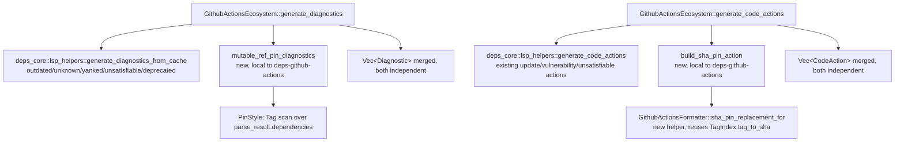

---
aliases:
  - GitHub Actions SHA-Pin Diagnostic Plan
tags:
  - sdd
  - plan
  - github-actions
  - security
created: 2026-09-02
status: draft
related:
  - "[[spec]]"
  - "[[constitution]]"
---

# Technical Plan: GitHub Actions Mutable-Ref-Pin Security Diagnostic

> [!info] References
> **Spec**: [[spec]]
> **Issue**: #473

## 1. Architecture

### Approach

Add the mutable-ref-pin diagnostic and its "Pin to commit SHA" code action as an
**additive layer on top of `GithubActionsEcosystem`**, not as a change to the shared
`deps-core` diagnostics/code-actions pipeline (`generate_diagnostics_from_cache`,
`generate_code_actions`). That shared pipeline is driven by a fixed, cross-ecosystem
`DiagnosticSeverities` struct covering exactly the four categories every ecosystem
already emits (outdated / unknown / yanked / unsatisfiable / deprecated); mutable-ref
pinning is a GitHub-Actions-only concept with no equivalent in any other ecosystem
today; per the resolved Open Questions, its diagnostic kind stays local to
`deps-github-actions`. Trying to force it through the shared per-dependency category
pipeline would require adding an ecosystem-specific branch to generic code every other
ecosystem also runs.

`GithubActionsEcosystem` already overrides `generate_hover` on top of the shared
default (see `ecosystem.rs`'s `**Resolved**` line splice) — this feature follows the
same override-then-append shape for `generate_diagnostics` and `generate_code_actions`:
call the existing default behavior first, then append the new, independent
diagnostic/action.

### Component Diagram



### Key Design Decisions

| Decision | Choice | Rationale | Alternatives Considered |
|----------|--------|-----------|--------------------------|
| Where the diagnostic is computed | Override `generate_diagnostics`/`generate_code_actions` in `crates/deps-github-actions/src/ecosystem.rs`, appending to the shared default's output | Matches the existing `generate_hover` override precedent in the same file; keeps the shared `deps-core` pipeline untouched (spec NFR-004) | Add a 6th "mutable_ref_pin" category to the shared per-dependency category pipeline in `deps-core` — rejected: that pipeline is one loop shared by every ecosystem, and no other ecosystem has this concept yet (premature generalization, matches the resolved Open Question) |
| Diagnostic code/kind location | A new `pub const MUTABLE_REF_PIN_DIAGNOSTIC_CODE: &str` in `crates/deps-github-actions` (mirrors `UNSATISFIABLE_DIAGNOSTIC_CODE`/`DEPRECATED_DIAGNOSTIC_CODE`'s shape in `deps-core`, but crate-local) | Resolved Open Question: local to `deps-github-actions`, no second ecosystem consumer yet | A shared `deps-core` "mutable pin" diagnostic kind — deferred until GitLab CI (#466) or another ecosystem actually needs the same shape |
| Severity configurability | Add `mutable_ref_pin: DiagnosticSeverity` to `deps_core::DiagnosticSeverities` (default `HINT`) and `mutable_ref_pin_severity` to `deps_lsp::config::DiagnosticsConfig`, wired through `to_severities()` | NFR-003/FR-008 require the same per-client/workspace configurability precedent as the other four categories; `DiagnosticSeverities` is shared **config plumbing**, not the diagnostic's kind/logic itself — extending it here is additive (a new field every other ecosystem's default simply never sets) and does not contradict the "kind stays local" decision above, which is about where the diagnostic *type and computation* live, not the severity DTO | Hardcode `DiagnosticSeverity::HINT` with no config knob — rejected, violates NFR-003 explicitly |
| Code action / diagnostic binding | Reuse the existing `data: {"diagnostic_codes": [...], "diagnostic_range": ...}` convention (`build_unsatisfiable_fix_action`, `build_replacement_action` in `deps-core/src/lsp_helpers/code_actions.rs`) | Already a generic, code-agnostic mechanism the `deps-lsp` handler binds by; no protocol/handler change needed | A bespoke binding mechanism — rejected, pure duplication |
| SHA replacement formatting | New `GithubActionsFormatter::sha_pin_replacement_for(&self, name: &PackageName, tag: &str) -> Option<String>` helper reusing `TagIndex.tag_to_sha`, factored out of the existing `PinStyle::Sha` branch logic in `format_version_replacing_for` | `format_version_replacing_for`'s `PinStyle::Tag` branch is for the *outdated-version* action (bump to latest tag) — semantically different from "pin current tag to its SHA" (FR-006/US-003 require both to coexist independently), so this needs its own entry point, not a repurposed branch of the existing method | Overload `format_version_replacing_for` itself with a flag — rejected, conflates two independent operations behind one method, harder to reason about and test |

## 2. Project Structure

No new files. All changes are additive edits to existing modules:

```
crates/deps-github-actions/src/
├── ecosystem.rs   (+ generate_diagnostics override, generate_code_actions override)
├── formatter.rs   (+ sha_pin_replacement_for helper)
├── lib.rs         (+ pub const MUTABLE_REF_PIN_DIAGNOSTIC_CODE, re-export)
└── types.rs       (unchanged — PinStyle already has everything needed)

crates/deps-core/src/
└── lsp_helpers/diagnostics.rs  (DiagnosticSeverities: + mutable_ref_pin field)

crates/deps-lsp/src/
└── config.rs      (DiagnosticsConfig: + mutable_ref_pin_severity field,
                     default_mutable_ref_pin_severity(), to_severities() update)
```

## 3. Data Model

No new persistent entities (per spec §5). Concrete additions:

```rust
// crates/deps-github-actions/src/lib.rs
/// Stable Diagnostic::code for the mutable-ref-pin diagnostic (issue #473).
/// Local to this crate — see spec 031's resolved Open Questions for why this
/// is not lifted into a shared deps-core diagnostic kind yet.
pub const MUTABLE_REF_PIN_DIAGNOSTIC_CODE: &str = "mutable-ref-pin";

// crates/deps-core/src/lsp_helpers/diagnostics.rs — DiagnosticSeverities
pub struct DiagnosticSeverities {
    pub outdated: DiagnosticSeverity,
    pub unknown: DiagnosticSeverity,
    pub yanked: DiagnosticSeverity,
    pub unsatisfiable: DiagnosticSeverity,
    pub deprecated: DiagnosticSeverity,
    /// Severity for a GitHub Actions `uses:` step pinned to a mutable ref
    /// (tag) instead of a full commit SHA (issue #473). Unused by every
    /// ecosystem except `deps-github-actions` today.
    pub mutable_ref_pin: DiagnosticSeverity,
}
// Default::default() sets mutable_ref_pin: DiagnosticSeverity::HINT (FR-008)
```

### Migrations

None (no persistent storage involved).

## 4. API Design

Not applicable — this is an internal LSP-response-shaping change, no new endpoints.
Effect on existing LSP responses:

| Method | Effect |
|--------|--------|
| `textDocument/publishDiagnostics` (GitHub Actions docs only) | One additional `Diagnostic` per `PinStyle::Tag` step, `code: "mutable-ref-pin"`, `severity` from config (default `Hint`) |
| `textDocument/codeAction` (GitHub Actions docs only) | One additional quickfix ("Pin `{name}` to commit SHA") when the position's dependency is `PinStyle::Tag` and `TagIndex` has a matching entry |

## 5. Integration Points

| System | Direction | Protocol | Notes |
|--------|-----------|----------|-------|
| `TagIndex` (`crates/deps-github-actions/src/registry.rs`) | inbound (read-only) | in-process `DashMap` read | Already populated by the existing outdated-version resolution path — zero new network calls (NFR-001) |
| `deps_lsp::config::DiagnosticsConfig` | inbound | LSP `workspace/configuration` (existing mechanism) | New `mutable_ref_pin_severity` field follows the exact same serde/default pattern as the other four severity fields |

## 6. Security

- No new attack surface: the diagnostic is a pure classification over already-parsed,
  already-validated `PinStyle` values and an already-cached SHA lookup. No new
  network call, no new deserialization of untrusted registry data.
- The code action's replacement text is sourced from `TagIndex.tag_to_sha`, which is
  itself sourced from the GitHub tags API response already validated by
  `crate::registry`'s existing SHA-shape checks (`is_full_sha`) — no new validation
  gap introduced.
- Input validation: none new — reuses `dep.name()`/`dep.version_req` which are already
  parsed and range-tracked by the existing parser.

## 7. Testing Strategy

| Level | Framework | What to Test | Coverage Target |
|-------|-----------|---------------|-------------------|
| Unit | `cargo nextest` | `sha_pin_replacement_for`: hit (returns `{sha} # {tag}`), miss (returns `None`), tag with/without `v` prefix | All branches |
| Unit | `cargo nextest` | Mutable-ref-pin diagnostic emission: `PinStyle::Tag` fires, `PinStyle::Sha`/`PinStyle::Branch`/`None` do not (FR-001/FR-003) | All `PinStyle` variants |
| Unit | `cargo nextest` | Both diagnostics (mutable-ref-pin + outdated-version) fire independently on the same stale-tag step, distinct codes (US-003/FR-006) | Co-occurrence case |
| Unit | `cargo nextest` | Code action absent on `TagIndex` cache miss (FR-005) — no destructive/no-op edit | Miss case |
| Unit | `cargo nextest` | `DiagnosticSeverities`/`DiagnosticsConfig` default is `Hint`; config override propagates through `to_severities()` | Default + override |
| Doc-test | `cargo test --doc` | `MUTABLE_REF_PIN_DIAGNOSTIC_CODE` and the new formatter method get a `# Examples` section per user's Rust doc-comment rule | Compiles and passes |
| Live | Manual, per `.claude/rules/continuous-improvement.md` | Real workflow file mixing tag/SHA/branch pins, both stale and current — verify hover unaffected, diagnostics correct, quickfix applies and produces exactly `{sha} # {tag}` | Before marking shipped |

No new integration or mock-registry tests needed — `TagIndex` is already covered by
`crates/deps-github-actions/src/registry.rs`'s existing tests; this feature only reads it.

## 8. Performance Considerations

- Expected load: same as any other GitHub Actions diagnostic pass — one document scan
  per edit/open event, unchanged frequency.
- Bottlenecks: none expected — `mutable_ref_pin_diagnostics` is an `O(n)` scan over
  already-parsed dependencies with an `O(1)` `DashMap` lookup per `PinStyle::Tag` step
  (NFR-002); no new allocation-heavy work.
- Optimization plan: not needed at this scale (typical workflow file: single-digit to
  low-hundreds of `uses:` steps).

## 9. Rollout Plan

Ships on by default in the next `deps-github-actions`/`deps-lsp` release (no feature
flag — this is a new diagnostic category, not a behavior change to existing ones, and
every other deps-lsp diagnostic ships the same way). Users who don't want the signal
can set `mutable_ref_pin_severity` to a suppressing value via existing config, same as
any other diagnostic category.

## 10. Constitution Compliance

No `specs/constitution.md` exists in this project; compliance is evaluated instead
against `.claude/rules/*.md` and root `CLAUDE.md`, which function as the project's
constitution:

| Principle | Status | Notes |
|-----------|--------|-------|
| MVP / no premature abstraction (`CLAUDE.md`) | Compliant | Diagnostic kind kept local to `deps-github-actions`; no speculative `deps-core` generalization |
| DRY (`CLAUDE.md`) | Compliant | Reuses `TagIndex`, extends (not duplicates) `format_version_replacing_for`'s SHA-lookup logic via a small shared helper |
| Cross-ecosystem consistency (`continuous-improvement.md`) | N/A for this feature | Feature has no cross-ecosystem equivalent yet by design (resolved Open Question); nothing to keep consistent |
| Rust doc conventions (`CLAUDE.md`) | Planned | New `pub const`, new public formatter method, and the `DiagnosticSeverities` field all get `///` docs with rationale, per existing file's doc-comment density |
| Live Testing Principle (`continuous-improvement.md`) | Planned | Live-test pass against a real mixed-pin workflow file required before marking shipped (spec §8 Agent Boundaries) |

## 11. Risks and Mitigations

| Risk | Impact | Probability | Mitigation |
|------|--------|--------------|------------|
| `DiagnosticSeverities`/`DiagnosticsConfig` struct-literal changes break other ecosystems' construction sites (many `DiagnosticSeverities::default()` call sites in tests) | medium (compile breakage across the workspace) | low | New field only, `Default` impl updated in the same commit; `..Default::default()`-style test literals already used in several tests continue to compile. Full struct-literal sites (`to_severities()`) get the new field added explicitly |
| Confusing two diagnostics on the same step (mutable-ref-pin + outdated-version) | low (UX clarity) | medium | Distinct `code`, distinct default severity (`Hint` vs `Hint`/`Warning` per existing `outdated` default), distinct message wording naming "mutable ref" vs "newer version" explicitly (US-003) |
| Scope creep into branch-pin resolution during implementation | medium (violates NFR-001, adds a network call) | low | Explicitly listed under spec §8 "Never" and "Ask First"; `PinStyle::Branch` is a no-op match arm with a code comment pointing at the deferred follow-up |

## See Also

- [[spec]] — feature specification
- [[tasks]] — implementation tasks (next phase)
- [[MOC-specs]] — all specifications
- `crates/deps-github-actions/src/ecosystem.rs` — existing `generate_hover` override this plan's shape mirrors
- `crates/deps-core/src/lsp_helpers/code_actions.rs` — existing `diagnostic_codes`/`diagnostic_range` binding convention
- `crates/deps-lsp/src/config.rs` — existing `DiagnosticsConfig`/`to_severities()` pattern this plan extends
