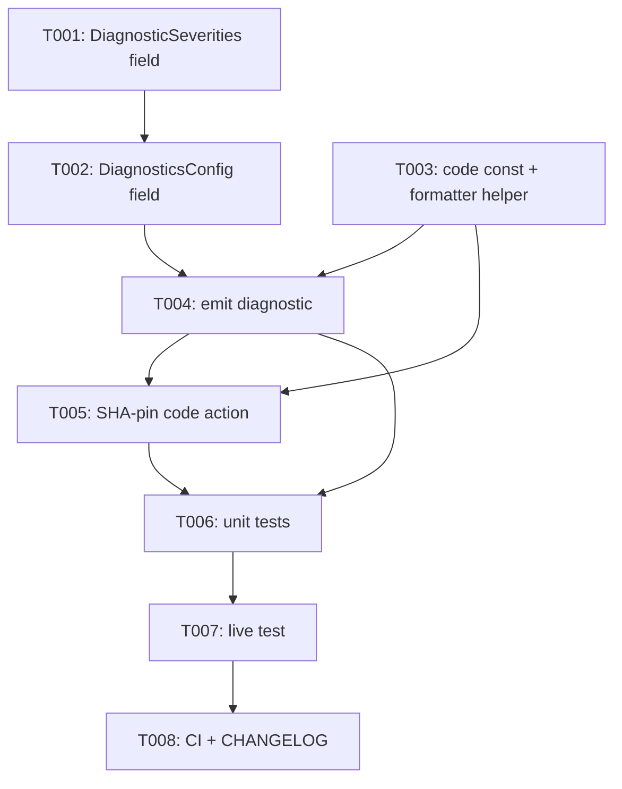

---
aliases:
  - GitHub Actions SHA-Pin Diagnostic Tasks
tags:
  - sdd
  - tasks
  - github-actions
  - security
created: 2026-09-02
status: draft
related:
  - "[[spec]]"
  - "[[plan]]"
---

# Implementation Tasks: GitHub Actions Mutable-Ref-Pin Security Diagnostic

> [!info] References
> **Spec**: [[spec]]
> **Plan**: [[plan]]
> **Issue**: #473
> **Total tasks**: 8

## Progress

- [ ] T001: Extend `DiagnosticSeverities` with `mutable_ref_pin`
- [ ] T002: Extend `deps-lsp` `DiagnosticsConfig` with `mutable_ref_pin_severity`
- [ ] T003: Add diagnostic code constant and SHA-replacement formatter helper
- [ ] T004: Emit the mutable-ref-pin diagnostic
- [ ] T005: Offer the "Pin to commit SHA" code action
- [ ] T006: Unit test coverage
- [ ] T007: Live test pass
- [ ] T008: CI checks, CHANGELOG, docs gate

---

## Dependency Graph

---

### T001: Extend `DiagnosticSeverities` with `mutable_ref_pin`

**Context**: Shared config DTO threaded from `deps-lsp` through
`Ecosystem::generate_diagnostics` into `generate_diagnostics_from_cache`. Needs a
sixth field so the new diagnostic's severity is configurable per the same precedent
as `outdated`/`unknown`/`yanked`/`unsatisfiable`/`deprecated` (plan §1 "Severity
configurability" decision).
**Spec reference**: [[spec#FR-008]], [[spec#NFR-003]]
**Acceptance criteria**:
- [ ] `DiagnosticSeverities` (`crates/deps-core/src/lsp_helpers/diagnostics.rs`) gets a
      new `pub mutable_ref_pin: DiagnosticSeverity` field with a `///` doc comment
- [ ] `Default for DiagnosticSeverities` sets `mutable_ref_pin: DiagnosticSeverity::HINT`
- [ ] The struct's existing doc-test (`# Examples` block asserting each field's default)
      is extended to assert `severities.mutable_ref_pin == DiagnosticSeverity::HINT`
- [ ] Every non-`..Default::default()` full struct-literal construction site of
      `DiagnosticSeverities` in the workspace (grep for `DiagnosticSeverities {`)
      compiles with the new field added explicitly
- [ ] `cargo check --workspace --all-features` passes
**Dependencies**: none
**Files**: `crates/deps-core/src/lsp_helpers/diagnostics.rs`
**Complexity**: low

---

### T002: Extend `deps-lsp` `DiagnosticsConfig` with `mutable_ref_pin_severity`

**Context**: LSP-facing config surface (workspace/client `workspace/configuration`)
that maps 1:1 onto `DiagnosticSeverities` via `to_severities()`. Needs the matching
field, default function, and serde wiring so a user can tune this diagnostic's
severity the same way as the other four.
**Spec reference**: [[spec#FR-008]], [[spec#NFR-003]]
**Acceptance criteria**:
- [ ] `DiagnosticsConfig` (`crates/deps-lsp/src/config.rs`) gets
      `pub mutable_ref_pin_severity: DiagnosticSeverity` with `#[serde(default = "default_mutable_ref_pin_severity")]`,
      matching the shape of the existing four severity fields exactly
- [ ] `fn default_mutable_ref_pin_severity() -> DiagnosticSeverity` returns `DiagnosticSeverity::HINT`, mirroring the existing `default_outdated_severity` etc.
- [ ] `impl Default for DiagnosticsConfig` sets the new field via the default fn
- [ ] `to_severities()` maps `mutable_ref_pin: self.mutable_ref_pin_severity`
- [ ] `to_severities()`'s doc-test `# Examples` block asserts
      `severities.mutable_ref_pin == config.mutable_ref_pin_severity`
- [ ] `cargo test --doc -p deps-lsp` passes
**Dependencies**: T001
**Files**: `crates/deps-lsp/src/config.rs`
**Complexity**: low

---

### T003: Add diagnostic code constant and SHA-replacement formatter helper

**Context**: Foundation both the diagnostic-emission task (T004) and the code-action
task (T005) build on: a stable `Diagnostic::code` string (crate-local per the
resolved Open Question — see plan §1) and a formatter method that looks up a tag's
commit SHA in the already-populated `TagIndex`, distinct from
`format_version_replacing_for`'s existing `PinStyle::Tag`/`PinStyle::Sha` branches
(plan §1 "SHA replacement formatting" decision).
**Spec reference**: [[spec#FR-004]], [[spec#FR-007]]
**Acceptance criteria**:
- [ ] `pub const MUTABLE_REF_PIN_DIAGNOSTIC_CODE: &str = "mutable-ref-pin";` added to
      `crates/deps-github-actions/src/lib.rs` with a `///` doc comment explaining its
      purpose and cross-referencing `UNSATISFIABLE_DIAGNOSTIC_CODE`'s shape in `deps-core`
- [ ] `GithubActionsFormatter::sha_pin_replacement_for(&self, name: &PackageName, tag: &str) -> Option<String>`
      added to `crates/deps-github-actions/src/formatter.rs`: looks up `tag` in
      `self.tag_index.get(name).and_then(|i| i.tag_to_sha.get(tag).cloned())`, returns
      `Some(format!("{sha} # {tag}"))` on hit, `None` on miss (no `TagIndex` entry for
      the repo, or no entry for this specific tag)
- [ ] Doc comment includes a `# Examples` section (per root `CLAUDE.md`'s Rust doc
      convention) demonstrating a hit and the `None` miss case
- [ ] Unit tests: hit returns the expected `{sha} # {tag}` string; miss (no repo entry)
      returns `None`; miss (repo entry exists, tag doesn't) returns `None`
**Dependencies**: none
**Files**: `crates/deps-github-actions/src/lib.rs`, `crates/deps-github-actions/src/formatter.rs`
**Complexity**: low

---

### T004: Emit the mutable-ref-pin diagnostic

**Context**: The core diagnostic-emission logic: override `GithubActionsEcosystem::generate_diagnostics`
to call the existing shared default first, then append one diagnostic per
`PinStyle::Tag` step (plan §1 "Where the diagnostic is computed" decision).
**Spec reference**: [[spec#FR-001]], [[spec#FR-003]], [[spec#FR-006]], [[spec#US-001]], [[spec#US-003]]
**Acceptance criteria**:
- [ ] `GithubActionsEcosystem` overrides `generate_diagnostics` in
      `crates/deps-github-actions/src/ecosystem.rs`: calls
      `deps_core::lsp_helpers::generate_diagnostics_from_cache(...)` (same args the
      current default forwards) to get the base `Vec<Diagnostic>`, then appends the
      new diagnostics computed by a new private fn `mutable_ref_pin_diagnostics(parse_result, severity)`
- [ ] `mutable_ref_pin_diagnostics` iterates `parse_result.dependencies()`, downcasts to
      `GithubActionsDependency`, and for every dep with `pin == Some(PinStyle::Tag)` **and**
      a `Some(version_range)`, emits a `Diagnostic` with:
      `range: version_range`, `severity: Some(severity)` (the passed-in
      `severities.mutable_ref_pin`), `code: Some(NumberOrString::String(MUTABLE_REF_PIN_DIAGNOSTIC_CODE.into()))`,
      `source`, and a message naming the step's tag and recommending SHA pinning
- [ ] `PinStyle::Sha { .. }`, `PinStyle::Branch`, and `None` produce no diagnostic from
      this function (FR-003)
- [ ] A step that is both stale (`PinStyle::Tag`, outdated) and mutable gets both the
      existing outdated-version diagnostic **and** this new one, with different `code`
      values, neither suppressing the other (FR-006/US-003)
- [ ] `cargo clippy -p deps-github-actions --all-targets --all-features -- -D warnings` passes
**Dependencies**: T002, T003
**Files**: `crates/deps-github-actions/src/ecosystem.rs`
**Complexity**: medium

---

### T005: Offer the "Pin to commit SHA" code action

**Context**: Override `generate_code_actions` the same way T004 overrode
`generate_diagnostics`: call the existing default, then append a quickfix when the
position's dependency is `PinStyle::Tag` and `sha_pin_replacement_for` (T003) returns
a hit. Bound to the T004 diagnostic via the existing `diagnostic_codes`/`diagnostic_range`
`data` convention (plan §1 "Code action / diagnostic binding" decision) so no
`deps-lsp` handler change is needed.
**Spec reference**: [[spec#FR-004]], [[spec#FR-005]], [[spec#FR-007]], [[spec#US-002]]
**Acceptance criteria**:
- [ ] `GithubActionsEcosystem` overrides `generate_code_actions`: calls the existing
      default first, then appends the result of a new private fn
      `build_sha_pin_action(parse_result, position, uri, formatter)`
- [ ] `build_sha_pin_action` finds the dependency at `position` (same lookup pattern as
      `generate_hover`'s existing `parse_result.dependencies().into_iter().find(...)`),
      returns `None` if it's not `PinStyle::Tag`, has no `version_range`, or
      `sha_pin_replacement_for` misses (FR-005 — no destructive/no-op edit on a cache miss)
- [ ] On a hit, builds a `CodeAction` titled `"Pin {name} to commit SHA"`,
      `kind: QUICKFIX`, a single-file `TextEdit` replacing `version_range` with the
      `{sha} # {tag}` text from T003, and
      `data: {"diagnostic_codes": [MUTABLE_REF_PIN_DIAGNOSTIC_CODE], "diagnostic_range": version_range}`
- [ ] The replacement's trailing-comment shape (`# {tag}`) is byte-identical to what
      `format_version_replacing_for`'s existing `PinStyle::Sha` branch produces for the
      same `(name, tag)` pair (FR-007, spec SC-005) — covered by a unit test comparing
      both outputs directly
- [ ] `cargo clippy -p deps-github-actions --all-targets --all-features -- -D warnings` passes
**Dependencies**: T003, T004
**Files**: `crates/deps-github-actions/src/ecosystem.rs`
**Complexity**: medium

---

### T006: Unit test coverage

**Context**: Consolidates targeted test coverage across T001–T005 per plan §7's
testing strategy — one pass to fill any gaps the per-task acceptance criteria didn't
already force, plus the cross-cutting co-occurrence and severity-config cases.
**Spec reference**: [[spec#SC-003]], [[spec#SC-004]], [[spec#SC-005]], [[plan#7-testing-strategy]]
**Acceptance criteria**:
- [ ] Fixture workflow with steps covering every `PinStyle` variant (`Tag` current,
      `Tag` stale, `Sha` with/without comment, `Branch`, non-resolvable) — 100% of
      `PinStyle::Tag` steps get the diagnostic (SC-003), 0% of `Sha`-pinned steps do (SC-004)
- [ ] `DiagnosticSeverities::default().mutable_ref_pin == DiagnosticSeverity::HINT` and a
      `DiagnosticsConfig` override propagates through `to_severities()` end-to-end
- [ ] Applying the code action on a `TagIndex`-hit step produces byte-identical output
      to `format_version_replacing_for`'s `PinStyle::Sha` branch for the same pair (SC-005)
- [ ] `cargo nextest run -p deps-github-actions -p deps-core -p deps-lsp --all-features` passes
**Dependencies**: T004, T005
**Files**: `crates/deps-github-actions/src/ecosystem.rs`, `crates/deps-github-actions/src/formatter.rs`, `crates/deps-core/src/lsp_helpers/diagnostics.rs`, `crates/deps-lsp/src/config.rs`
**Complexity**: medium

---

### T007: Live test pass

**Context**: Project's Live Testing Principle (`.claude/rules/continuous-improvement.md`)
requires empirical verification before marking a feature shipped — unit tests alone
are explicitly insufficient. Spec §8 "Always" and "Never" sections mandate this
explicitly for this feature.
**Spec reference**: [[spec#8-agent-boundaries]]
**Acceptance criteria**:
- [ ] `RUST_LOG=debug cargo run -p deps-lsp` against a real repository workflow file
      mixing current-tag, stale-tag, SHA-with-comment, and branch pins
- [ ] Confirm via editor (or LSP trace) that: mutable-ref-pin diagnostics fire only on
      tag-pinned steps; the stale+mutable step shows both diagnostics distinctly; the
      quickfix produces the expected `{sha} # {tag}` edit; hover/inlay-hints/code-lens
      output for GitHub Actions is unchanged (SC-002)
- [ ] No new `WARN`/`ERROR`/panic in `.local/testing/debug/session.log` attributable to
      this feature
- [ ] Record the session per `.claude/rules/continuous-improvement.md` conventions
**Dependencies**: T006
**Files**: none (verification only)
**Complexity**: low

---

### T008: CI checks, CHANGELOG, docs gate

**Context**: Final gate before PR per `.claude/rules/branching.md`.
**Spec reference**: n/a (project-wide gate)
**Acceptance criteria**:
- [ ] `cargo +nightly fmt --all -- --check`
- [ ] `cargo clippy --workspace --all-targets --all-features -- -D warnings`
- [ ] `cargo nextest run --workspace --all-features --no-fail-fast`
- [ ] `RUSTFLAGS="-D warnings" RUSTDOCFLAGS="--deny rustdoc::broken_intra_doc_links" cargo doc --no-deps --workspace`
- [ ] `CHANGELOG.md` `[Unreleased]` gets a one-line entry (PR link added once known)
- [ ] `specs/MOC-specs.md`'s row 031 updated to `tasks` phase / ready-for-implementation
**Dependencies**: T007
**Files**: `CHANGELOG.md`, `specs/MOC-specs.md`
**Complexity**: low

---

## Implementation Notes

### Order of execution

T001 → T002 can run before or in parallel with T003 (independent surfaces: config
plumbing vs. diagnostic code/formatter helper). T004 needs both branches merged
(severity value from T002, code constant + helper from T003). T005 depends on T004
existing so the code action's `data` can name a diagnostic code that's actually
being emitted. T006 through T008 are strictly sequential gates.

### Common patterns

- Mirror `GithubActionsEcosystem::generate_hover`'s existing override shape exactly:
  call the shared default, get the base result, then conditionally enrich/append.
- Mirror `build_unsatisfiable_fix_action`/`build_replacement_action` in
  `deps-core/src/lsp_helpers/code_actions.rs` for the `data:` binding shape.
- Mirror the four existing severity fields in `DiagnosticSeverities`/`DiagnosticsConfig`
  exactly (field naming, default-fn naming, serde attribute) for the new fifth field —
  do not introduce a different convention.

### Gotchas

- `TagIndex.tag_to_sha` keys are exact tag strings as returned by the GitHub tags API
  (`v4.2.0`, not normalized) — `sha_pin_replacement_for` must look up the dependency's
  *own* declared tag text (`version_req`/`version_literal`), not a normalized or
  `v`-stripped form, or every lookup will miss.
- Do not reuse `format_version_replacing_for`'s `PinStyle::Tag` branch for this
  feature — that branch bumps to the *latest* tag (outdated-version semantics); this
  feature pins the *current* tag to its own SHA (mutability semantics). Confusing the
  two produces a silently wrong edit (bumps the version instead of just pinning it).
- `PinStyle::Branch` must remain a strict no-op across every new code path added here
  (diagnostic and code action both) — see spec §8 "Never" and plan §11's scope-creep risk.

## See Also

- [[spec]] — feature specification
- [[plan]] — technical plan
- [[MOC-specs]] — all specifications
