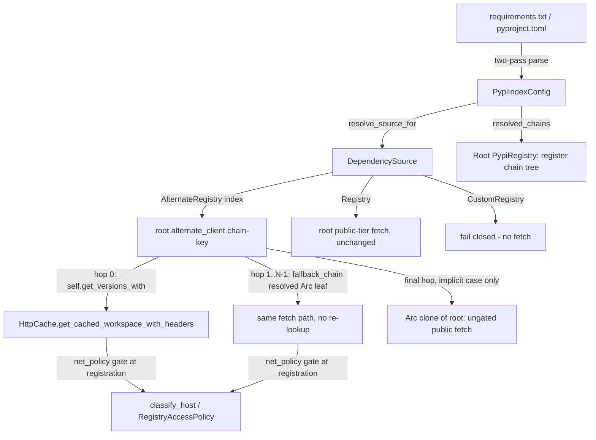

---
aliases:
  - PyPI Private Index Plan
tags:
  - sdd
  - plan
  - pypi
  - security
created: 2026-09-02
status: draft
related:
  - "[[spec]]"
  - "[[constitution]]"
---

# Technical Plan: PyPI Private/Custom Index Resolution

> [!info] References
> **Spec**: [[spec]]
> **Issue**: #513
> **Closest analogue**: [[032-npm-npmrc-registry-support/plan|032 npm .npmrc plan]] — structural template for this plan; deviations are called out explicitly where PyPI's config surface differs from npm's.

> [!warning] Revision History
> **r2 (2026-09-02)** — full rewrite of §1/§3 after a `rust-critic` design review
> found 4 Critical and 7 Significant defects in r1, verified against the live
> `deps-npm`/`deps-pypi` source and against pip's and Poetry's own documentation:
> - **C1**: r1's chain-fallback lookup called `self.alternate_client(...)` from
>   an *alternate* client instance, whose `alternates` map is always empty by
>   the npm invariant it copied — every hop resolved to `None`. Fixed by
>   resolving the chain to `Vec<Arc<PypiRegistry>>` (concrete clients) once, at
>   registration time on the root, instead of `Vec<PypiIndexUrl>` needing a
>   second lookup at fetch time.
> - **C2**: r1 keyed the shared `alternates` map by primary URL alone, but the
>   value carried per-file `fallback_chain` state — two files sharing a primary
>   with different extras would alias onto one chain, and an edited
>   `--extra-index-url` would never take effect (contradicting FR-012). Fixed
>   by keying on the full ordered-hop chain identity.
> - **C3 (security-relevant)**: r1's "implicit primary" rule made `pypi.org`
>   the primary — checked *before* declared extras — whenever a file had
>   `--extra-index-url` but no explicit `--index-url` (the exact US-002 Azure
>   Artifacts scenario). Verified against pip's own docs: pip states
>   "there is no priority in the locations that are searched... the best
>   match... is selected" and explicitly warns `--extra-index-url` is unsafe
>   for private packages for exactly this reason. r1's claim that
>   primary-then-extras "matches pip's own documented default precedence
>   intent" was wrong. Fixed by inverting the implicit case: declared extras
>   are checked before the implicit public fallback, never the reverse — see
>   [[spec#FR-005|spec FR-005]]'s r2 text.
> - **C4**: r1 reused `PypiRegistry.index_url`, which is the package-name
>   *search*-index URL (`crate::search::SIMPLE_INDEX_URL`), as if it were the
>   version-fetch base. Version fetches actually go through the free function
>   `simple_api_url` + module const `PYPI_SIMPLE_BASE`
>   (`crates/deps-pypi/src/registry.rs:65-67,200`), which r1 never
>   parameterized — an alternate client would have silently kept fetching
>   `pypi.org`. Fixed by adding a distinct `simple_base` field.
> - **S1**: r1's Poetry unlabeled-source → `supplemental` mapping was verified
>   against current Poetry docs and found backwards — Poetry documents
>   unlabeled sources as `primary`. Fixed in [[spec#FR-007|spec FR-007]].
> - **S2, S4, S5, S6, S7**: position-independent `--index-url` capture (two-pass
>   parsing), a tier guard on `search`/`warm_search_index`/`get_package_metadata`
>   for workspace-declared clients, a precise PackageNotFound-vs-genuine-error
>   failure taxonomy, never gating the implicit public fallback behind
>   `workspace_registries`, and a `test-util` feature for integration tests —
>   all folded into this revision, detailed inline below.
> - Also brought `uv`'s `[tool.uv.sources] { index = "<name>" }` shape into
>   scope (was previously excluded, leaving named uv indexes unreachable) —
>   see [[spec#FR-013|spec FR-013]] r2.
>
> Full critic findings: `.local/handoff/2026-09-02T21-55-03-critic.md`.
> **r1 (2026-09-02)** — initial plan, superseded above.
>
> **r3 (2026-09-02)** — a second critic pass on r2 (verdict: downgraded from
> `critical` to `significant` — all 16 r1 findings confirmed genuinely fixed,
> no redesign needed) found 6 new Significant defects introduced by r2's own
> fixes, all closed in this revision:
> - **N1**: `register_chain` cannot construct the implicit-public final hop as
>   specified (`self: &Arc<Self>` receivers are unstable, and `Arc::clone` of
>   the root creates a root↔head reference cycle). Fixed: takes `root:
>   &Arc<Self>` as a plain parameter (the ecosystem already holds one), and
>   the final hop is a freshly-built `Public`-tier client (identical ungated
>   behavior, no cycle) rather than a clone of the root itself.
> - **N2**: the uv `default`/`explicit` mapping was backwards — verified live
>   against `docs.astral.sh/uv/concepts/indexes/`. Non-`default`/non-`explicit`
>   `[tool.uv.index]` entries are searched automatically (chain hops, not
>   named-only); `default = true` is uv's *lowest-priority, last-resort*
>   index, replacing the implicit public fallback in the final chain slot —
>   not a checked-first primary. Fixed in FR-013 and §1/§3 below.
> - **N3**: T006 (r2) parameterized both `simple_api_url` *and* `metadata_url`
>   on the new `simple_base` field, but `PYPI_BASE`/`PYPI_SIMPLE_BASE` are
>   different roots — that would 404 the public client's metadata fetch.
>   Fixed: only `simple_api_url` takes `simple_base`; `metadata_url` is
>   untouched (and already tier-guarded off for alternates by T008 regardless).
> - **N4**: the failure taxonomy's "any other `Err` is terminal" rule means an
>   unreachable declared extra (FR-005(b), no explicit primary) now halts
>   resolution for *every* dependency in that file, public ones included —
>   strictly worse than today for that failure mode. Confirmed as an
>   intentional trade-off (the alternative — falling through on transport
>   failure — would leak every affected package's name to `pypi.org`
>   whenever the private index is merely unreachable, exactly what NFR-003(2)
>   exists to prevent) and now explicitly documented with a required
>   distinguishable diagnostic (spec FR-005(c)/NFR-003(3)).
> - **N5**: a zero-hop chain (every extra dropped, e.g. under
>   `workspace_registries = off`, with no explicit primary) was undefined —
>   exactly the scenario T010's own test exercises. Fixed: resolves to plain
>   `DependencySource::Registry`, `resolved_chains()` emits nothing for it.
> - **N6**: the newline-joined, `<pypi.org>`-suffixed chain-key violates
>   `deps-core`'s documented contract for `AlternateRegistry.index` ("the
>   resolved index URL") — latent (no consumer renders it today) but a
>   shared-type invariant future readers rely on. Fixed: chain sources now
>   store an opaque, single-line hashed token (`pypi-chain:<hex digest>`),
>   never a value that looks like or claims to be a URL; spec.md's Data Model
>   section now documents this as a stated widening of the field's doc
>   comment (not a type change).
> - Two minor findings also folded in: the missing second half of the Poetry
>   citation (FR-007 — "if you configure at least one primary source, the
>   implicit PyPI source is disabled", load-bearing for why case (a) appends
>   no public hop) and an explicit note that the "supplemental" stop
>   condition approximates Poetry's version-aware one.
>
> Full second-pass findings: `.local/handoff/2026-09-02T22-18-42-critic.md`.

## 1. Architecture

### Approach

Parse-time resolution, identical in spirit to Cargo/npm: each `deps-pypi` parser
resolves every dependency's `DependencySource` using a per-file
`PypiIndexConfig` built from whatever index declarations are present in that
file.

**The two-pass fix (S2) applies to `requirements.rs` only.** `requirements.txt`
is line-oriented, so pass 1 collects every `--index-url`/`--extra-index-url`
occurrence across the whole file regardless of line position, and pass 2
resolves every dependency's source using the fully-collected config — this
matters because pip applies index options file-wide, not from-this-line-down,
and an r1 draft that resolved sources in a single top-to-bottom pass would
have left dependencies declared *before* a late `--index-url` line silently
unrouted. **`pyproject.toml` needs no such restructuring** (clarified
2026-09-02, second critic pass): `toml_edit`/`toml_span` already parses the
whole document before `pyproject.rs` does anything with it, so Poetry's
`[[tool.poetry.source]]` and uv's `[tool.uv.index]`/`[tool.uv.sources]` tables
are simply read once, in full, before dependency resolution begins — there is
no line-position hazard to guard against there, and no "second pass" to add.

No new `DependencySource` variant and no `deps-pypi`-local source enum — every
resolved state lands in exactly one of the three existing `deps-core` states:

- `DependencySource::Registry` — no index override anywhere in the file (US-004,
  byte-identical to today).
- `DependencySource::AlternateRegistry { index, mirrors_crates_io: false }` — a
  successfully validated, policy-permitted index or chain. Reused for
  `--index-url`, `--extra-index-url` (additively, see below), Poetry sources,
  and uv indexes.
- `DependencySource::CustomRegistry { url }` — an **explicit primary**
  (`--index-url`, Poetry `primary`/`default` source, uv `default = true`
  index) or a **named-source reference** (Poetry `source = "<name>"`, uv
  `index = "<name>"`) that is invalid/policy-blocked (FR-006), fails closed,
  never falls back to `pypi.org` (closes the #248 bug class). An invalid
  **extra** (`--extra-index-url`, a supplemental/secondary Poetry source) is
  *not* treated this way — see FR-006's r2 text: it is dropped from the chain
  with a warning, not escalated to a whole-dependency failure, since an extra
  is additive/optional by definition.

### The FR-005 resolution-order rule (corrected in r2 — read this section first)

`--extra-index-url`'s additive, multi-index fallback has no single-index
equivalent in npm's or Cargo's data model — both of those ecosystems resolve a
dependency to exactly one concrete index at parse time. The *routing decision*
(which index actually served the package) cannot always be known at parse
time — it depends on which index the package name is found on. This plan
pushes that fallback into the registry client, not into `DependencySource`
(see Key Design Decisions), and resolves a "plain" dependency (no
per-dependency source binding) to `AlternateRegistry { index: <chain-key> }`.

Two sub-cases, per spec FR-005(a)/(b):

- **(a) Explicit primary present** (`--index-url`, or a Poetry `primary`/
  `default`-priority source, or a uv index with `default = true`): the chain
  is `[primary, ...extras]`, in that order. **No implicit public hop is
  appended** — an explicit `--index-url` *replaces* the default index per
  pip's own semantics (`--extra-index-url` *adds* to it), so a file that wants
  `pypi.org` reachable alongside an explicit primary must list it as an extra
  itself. This direction was never problematic (r1 had it right): the user
  explicitly chose this index, so checking it first is the deliberate,
  requested behavior — no name-disclosure or confusion-inversion risk.
- **(b) No explicit primary, but extras exist**: the chain is
  `[...extras, <implicit public fallback>]`, extras in declaration order,
  the public `pypi.org` root **always last**. This is the corrected direction
  (r1 had it backwards): a private-only package name (US-002) is checked
  against the user's own declared indexes first and is never sent to
  `pypi.org` before that, and a same-named public package can never silently
  shadow a private one the user explicitly configured. See spec NFR-003's r2
  text for the full security rationale and the pip-documentation citation
  that drove this correction.

A file with **no** `--index-url`/`--extra-index-url`/Poetry-source/uv-index
declaration anywhere never enters either case — every dependency stays plain
`DependencySource::Registry`, byte-identical to today (US-004), and the
registry's `alternates` map is never touched.

**Zero-hop chain (fixes N5)**: if every extra in a case-(b) file is dropped
(FR-006 — e.g. all blocked by `workspace_registries = off`) and no explicit
primary was ever declared, the resulting chain would have zero hops. This is
explicitly defined, not left implicit: `resolve_source_for` returns plain
`DependencySource::Registry` in this case (byte-identical to a file with no
declarations at all — this also incidentally avoids M1's suppressed hover
link for exactly the dependencies that end up resolving publicly anyway), and
`resolved_chains()` emits nothing for it.

A Poetry `source = "<name>"` / uv `index = "<name>"`-scoped dependency
resolves directly to that named source's own URL as a single-hop chain (chain
length 1) — no implicit fallback to public or to other named sources (matches
US-003: a named source is a direct, deliberate route).

**uv's chain shape is its own third case (fixes N2)**: uv has no
`--index-url`-equivalent "explicit primary checked first" concept at all — its
own documented model is "every non-`explicit` index is searched automatically,
with the `default = true` index always checked *last* regardless of
declaration position, replacing the implicit `pypi.org` slot rather than
occupying the primary slot." Concretely, a uv config's chain is built as:
`[...every [tool.uv.index] entry that is neither default nor explicit, in
declaration order..., <default entry if one exists, else the implicit public
fallback>]`. This always routes through the FR-005(b)-shaped chain model
(`PypiIndexConfig.primary` stays `None` for pure-uv configs — uv never
populates it), never through (a)'s primary-first model. An `explicit = true`
entry is parsed into `named_sources` only, consulted via `[tool.uv.sources] {
index = "<name>" }` (FR-013), exactly like a Poetry `explicit`-priority
source.

### Chain resolution mechanism (fixes C1)

The shared `alternates: Arc<DashMap<String, Arc<PypiRegistry>>>` map lives
**only on the root** (`Public`-tier) `PypiRegistry` instance that
`PypiEcosystem` holds and that every `get_versions_from`/`get_latest_matching_from`
call is actually dispatched through (this mirrors the npm invariant precisely:
"only the root registry ever registers or looks up further alternates").
Registration and chain-building happen **once, at parse time, entirely on the
root**:

1. For each `ResolvedChain` produced by `PypiIndexConfig::resolved_chains()`
   (see §3), construct a self-contained tree of `PypiRegistry` leaf clients:
   hop 0 becomes the returned client's own `simple_base`/`tier`; hops 1..N-1
   become freshly-constructed leaf `Arc<PypiRegistry>` clients (each with an
   *empty* `fallback_chain` — they are never themselves looked up by key,
   only walked positionally); if `implicit_public_fallback` is set, the very
   last hop is a **freshly-constructed `Public`-tier client** (`simple_base:
   PYPI_SIMPLE_BASE.to_string()`, same ungated transport as the root — fixes
   N1: r2 specified `Arc::clone(&root)` here, but that both requires an
   `Arc<Self>` unobtainable from `&self` — `self: &Arc<Self>` receivers are
   unstable — and creates a root→`alternates`→head→`fallback_chain`→root
   reference cycle. A fresh `Public`-tier leaf is behaviorally identical —
   same URL, same tier, same lack of gating — with neither problem).
2. The resulting head client (hop 0 + the rest of the tree in its own
   `fallback_chain: Vec<Arc<PypiRegistry>>`) is inserted into the root's
   `alternates` map under `ResolvedChain::key` — the **only** thing
   `DependencySource::AlternateRegistry { index }` needs to look up.
3. A named-source (Poetry/uv) resolution registers a single-hop leaf (empty
   `fallback_chain`) under that source's own URL as the key.

Registration is performed by an associated function that takes the root
explicitly rather than as `&self` (fixes N1's second issue): `PypiRegistry::
register_chain(root: &Arc<Self>, chain: &ResolvedChain)` and `PypiRegistry::
register_named_source(root: &Arc<Self>, index: &PypiIndexUrl)`. `PypiEcosystem`
already holds `registry: Arc<PypiRegistry>` and passes it directly at both
call sites — no new plumbing needed.

No further map lookup happens at fetch time — `get_versions_chained`
(a private helper, not a trait method) tries `self.get_versions_with(name,
freshness)` first (using `self`'s own `simple_base`/`tier` — correctly hits
hop 0), then walks `self.fallback_chain` in order, calling each already-resolved
hop's own `get_versions_with` directly. Stops at the first hop whose result is
neither `PackageNotFound` nor an empty version list (see the Failure Taxonomy
subsection below); returns the last hop's answer if every hop misses.

Leaf clients built for hops 1..N-1 of one chain are **not** deduplicated
against leaves built for other chains that happen to reference the same URL
(a deliberate simplification over trying to safely mutate/share leaves across
chains, which would reopen a C2-shaped aliasing risk at the leaf level). The
underlying `HttpCache` (shared `Arc<HttpCache>`, keyed by URL) still
deduplicates the actual HTTP-level caching regardless of how many small
`PypiRegistry` wrapper structs reference the same URL, so this costs a few
extra lightweight allocations, not extra network requests.

### Chain-key identity (fixes C2, and its representation fixes N6)

`ResolvedChain::key` is derived from the ordered hops plus the
`implicit_public_fallback` flag, so an explicit-primary chain `[A, B]` can
never collide with an implicit chain that resolves to the same `[A, B]` but
additionally wants the public root appended. Two files with the same primary
but *different* extras therefore produce different keys and register
independently; editing a file's `--extra-index-url` list changes its
`ResolvedChain::key` on the next reparse, so FR-012's "stale until reparse"
promise is now literally true (the *old* key's registration lingers unused in
the map — harmless, bounded by the existing `MAX_ALTERNATE_REGISTRIES = 256`
cap) rather than being silently reused (r1's C2 bug).

**Representation (fixes N6, second critic pass)**: r2 built this key by
joining the hop URLs with `"\n"` and a `"\n<pypi.org>"` suffix — a value that
looks like a URL (and would appear so in a `tracing::warn!` log line) but is
not one, violating `deps-core`'s documented contract for
`DependencySource::AlternateRegistry.index` ("the resolved index URL" —
`crates/deps-core/src/parser.rs:890-896`). No `deps-core` consumer renders or
parses this field today, so the violation is latent, not live — but it is a
shared type whose stated invariant future readers rely on. r3 uses an opaque,
single-line hashed token instead: `format!("pypi-chain:{:016x}", digest)`,
where `digest` is computed by hashing the ordered hop strings and the
`implicit_public_fallback` flag through `std::collections::hash_map::
DefaultHasher` (no new dependency — this only needs to be stable within one
running process for map-key purposes, not across restarts or Rust versions).
spec.md's Data Model section is updated to document this as a stated
widening of `AlternateRegistry.index`'s doc comment (a chain source stores an
opaque parser-owned routing key, not a URL; a single-hop named-source
dependency still stores a literal URL, matching Cargo/npm's convention) — a
documentation change, not a type change, so it does not touch the "Never
widen the trait surface" boundary.

**Risk note**: because the cap now counts distinct *chain identities* rather
than distinct index *URLs*, a large multi-config monorepo with many files
declaring different extras combinations against the same primary could
exhaust the 256-entry cap faster than Cargo/npm's simpler one-registration-
per-URL model. Acceptable for phase 1 (npm's own cap was chosen without this
concern applying); revisit if it proves too low in practice.

### Failure taxonomy (fixes S5)

`get_versions_chained`/`get_latest_matching_chained` distinguish three
outcomes per hop:

1. **`Ok(versions)` with `versions` non-empty** → terminal, this hop's answer
   wins.
2. **`Err(PackageNotFound)`, or `Ok(versions)` with `versions` empty** (some
   PEP 503 indexes answer `200` with an empty listing for an unknown project
   rather than `404` — both must trigger fallthrough identically) → continue
   to the next hop.
3. **Any other `Err`** (5xx, timeout, network error, malformed response) →
   **terminal, propagated immediately** — does *not* fall through to the next
   hop. A broken/unreachable primary must surface as an error, not be
   silently masked by a lucky extra that happens to answer; this also means
   an unauthenticated 401/403 (the real Azure Artifacts case, see SC-002's r2
   caveat) terminates the chain rather than silently trying `pypi.org` next.

**Confirmed trade-off (fixes N4, second critic pass)**: rule 3 applied to a
case-(b) chain (FR-005(b), no explicit primary — hop 0 is a declared extra)
means an unreachable extra (a developer off the corporate VPN, say) halts
resolution for *every* dependency in that file, ordinary public ones
included — strictly worse for that one failure mode than today's behavior
(where everything just resolves against `pypi.org`). This is confirmed
intentional, not an oversight: the alternative (falling through to `pypi.org`
on transport failure) would send every affected package's name to the public
index precisely when the private index is merely unreachable — exactly the
disclosure NFR-003(2) exists to prevent, and arguably the more likely
real-world trigger for that disclosure than a genuinely missing package
(SC-004's regression scenario). Per NFR-003(3), THE SYSTEM SHALL surface a
distinguishable diagnostic for this case (e.g. "extra index unreachable —
resolution halted, not falling back to pypi.org") rather than a generic fetch
error, so a developer can tell it apart from a genuinely broken/nonexistent
package. Connection timeout and 5xx are treated identically (both terminal) —
no further split by failure kind for phase 1.

`get_latest_matching_chained` is derived from `get_versions_chained` +
the existing `select_latest_matching`/`select_latest_matching_with_context`
helpers (fixes M4) rather than re-implementing its own walk — this removes
the risk of hover and diagnostics disagreeing on "latest" via two different
code paths, a failure mode both npm and the shared `deps-core` helpers already
go out of their way to avoid. The one semantic choice this requires: if the
*winning* hop (first hop with a non-empty version list) has no version
matching the requirement, that is **terminal** — `Ok(None)`, not a trigger to
keep searching later hops for a "better" match. Continuing to search would
reintroduce exactly the cross-index version comparison this design avoids for
security reasons (dependency confusion is fundamentally a "which index's
version wins" problem).

### Tier guard on search endpoints (fixes S4, M3, M5)

`search`, `warm_search_index`, and `get_package_metadata` are all overridden
(or gated inline) to return empty/no-op immediately for any `WorkspaceDeclared`-
tier `PypiRegistry` instance — mirroring `NpmRegistry::search`'s existing tier
guard and its documented rationale ("enforced here rather than relied on via
the call graph"). Without this, an unguarded `search`/`warm_search_index` on
an alternate client would trigger a full project-listing download from the
private host (the multi-MB Simple index, not a single-package fetch), and
`get_package_metadata` (currently `pub`, ungated, unrouted, and unused by any
in-workspace caller today — confirmed latent by the critic review) would send
a private package name to `pypi.org`'s JSON API the moment any future call
site reaches it. Once this guard is in place, per-leaf `IndexCell` allocation
(M5) is harmless — it is never populated for a workspace-declared client.

### `workspace_registries = off` never gates the implicit public hop *itself* (fixes S6) — narrowed 2026-09-02

Because the implicit public fallback hop is a **freshly-constructed
`Public`-tier client** (same `simple_base`, same ungated transport as the
root — not an `Arc::clone` of the root itself, see N1's fix above) rather
than a `PypiIndexUrl` that would need to pass `classify_host`/
`RegistryAccessPolicy` validation, setting `workspace_registries = off`
blocks only the *explicitly-declared* primary/extras/named sources (which
correctly fail validation and drop out of the chain or fail closed per
FR-006) — it never touches the public hop's own gate. **This is a narrower
claim than "off never blocks ordinary public-package resolution in the
file"** (validator finding, second pass) — whether public resolution
survives depends on whether a case-(a) explicit primary is present, since
case (a) never has an implicit public hop to fall back to at all:

- **A file with only extras declared** (no explicit primary), all now
  blocked: the chain has zero hops. Per N5's fix (see above), every plain
  dependency in that file resolves as plain `DependencySource::Registry` —
  there is no per-package distinction at parse time, so this is *every*
  dependency in the file, not just the "ordinary" ones, degrading gracefully
  to the same behavior as a file with no declarations at all, rather than
  failing closed for the whole file. **Here, and only here, is "off never
  blocks public resolution" actually true.**
- **A file with an explicit primary** plus a blocked extra, where the
  *primary itself* is still valid under the current policy: the chain still
  has a working hop (the primary), so every dependency resolves via it
  exactly as under `public_only`/`all` — only the extra's contribution is
  lost. This is Test A's scenario, and it requires the primary to pass
  validation — under literal `off` (which blocks every host class
  unconditionally), no primary ever passes, so this outcome is only reached
  under `public_only`/`all` with a *different*, still-blocked extra.
- **A file with an explicit primary that itself fails validation** (always
  true under literal `off`, since `off` blocks every host class): FR-005(a)
  means an explicit primary *replaces* the default index rather than adding
  to it, so there is no implicit public hop in this case at all — the
  primary fails closed to `CustomRegistry` (FR-006) and **every** dependency
  in the file loses version data. `off` does **not** degrade to public
  resolution here.

r1's design routed *every* dependency in an extras-carrying file through the
gated chain regardless of whether any hop remained valid, which would have
made `off` incorrectly break public resolution project-wide for such a file
in every case — this is fixed by construction in r2/r3's chain-hop design
(a chain either keeps working via its remaining valid hops, or degrades to
plain `Registry` once it has none left), not by an extra check.

### Alternatives considered and rejected

- *Widen `AlternateRegistry` with a `Vec<String>` fallback field* — rejected: a
  `deps-core` trait/type change the spec's "Never" boundary explicitly forbids
  ("widen the `deps-core` `Registry`/`EcosystemFormatter` trait surface"); every
  hook this feature needs already exists generically.
- *Resolve the winning index at parse time by eagerly probing every configured
  index* — rejected: turns every parse into N network calls before any hover/
  diagnostic can render, violating NFR-004's zero-regression-cost bar and adding
  latency Cargo/npm never pay.
- *(r1, superseded)* Look up each fallback hop by string key at fetch time via
  `self.alternate_client(...)` — rejected in r2: structurally broken (C1), since
  an alternate client's own `alternates` map is always empty by the same
  invariant npm relies on.
- *(r1, superseded)* Key the `alternates` map by primary URL alone — rejected
  in r2: collides across files with differing extras and defeats FR-012's
  reparse-staleness contract (C2).

### Component Diagram



### Key Design Decisions

| Decision | Choice | Rationale | Alternatives Considered |
|----------|--------|-----------|--------------------------|
| Fallback-chain location | Registry-client-side (`fallback_chain: Vec<Arc<PypiRegistry>>`, resolved once at registration), not in `DependencySource` | Keeps `deps-core` untouched; matches the "Never widen deps-core trait surface" boundary | Widen `AlternateRegistry` with a chain field (deps-core change, rejected); eager multi-index probe at parse time (latency regression, rejected) |
| Chain resolution timing | Resolve every hop to a concrete `Arc<PypiRegistry>` **once, at registration time on the root** — no further map lookup at fetch time | Fixes r1's C1 defect (an alternate client's own `alternates` map is always empty) | Look up each hop by string key at fetch time (r1, structurally broken) |
| Implicit-case ordering | Declared extras checked **before** the implicit public `pypi.org` fallback | Fixes r1's C3 defect — verified against pip's own docs (no precedence, `--extra-index-url` documented as unsafe for private packages); avoids name-disclosure and confusion-inversion | Implicit-primary-first (r1, verified backwards against pip's docs and rejected) |
| Chain-key identity | An opaque, single-line hashed token (`pypi-chain:<hex digest>` of the ordered hops + fallback flag), never a URL-shaped value | Fixes r1's C2 defect (prevents cross-file aliasing, honors FR-012) *and* N6 (second critic pass — a `"\n"`-joined URL-shaped key violated `deps-core`'s documented `AlternateRegistry.index` contract) | Primary-URL-only key (r1, collides across files with differing extras); newline-joined URL-shaped key (r2, contract violation, latent) |
| `register_chain`/`register_named_source` signature | Associated functions taking `root: &Arc<Self>` as a plain parameter, not `&self` | Fixes N1 (second critic pass) — `self: &Arc<Self>` receivers are unstable, and constructing the implicit-public final hop needs an owned `Arc<Self>` | `fn register_chain(&self, ...)` (r2) with `Arc::clone(&root)` for the final hop — unstable receiver type, plus a root↔head reference cycle |
| Implicit-public final hop | A freshly-constructed `Public`-tier leaf client (same URL, same ungated transport) | Fixes N1's second half — behaviorally identical to cloning the root, without the reference cycle `Arc::clone(&root)` would create | `Arc::clone(&root)` (r2, creates a root→alternates→head→fallback_chain→root cycle) |
| Version-fetch base | New `simple_base: String` field, distinct from the existing `index_url` (search-index URL), consumed **only** by `simple_api_url` | Fixes r1's C4 defect — `index_url` is `crate::search::SIMPLE_INDEX_URL`, consumed only by `search`/`warm_search_index`. Narrowed to `simple_api_url` only (not `metadata_url`) to fix N6/N3 (second critic pass) — `PYPI_BASE`/`PYPI_SIMPLE_BASE` are different roots; parameterizing `metadata_url` too would 404 | Reuse `index_url` as both search base and fetch base (r1, silently kept fetching `pypi.org`); parameterize `metadata_url` on `simple_base` too (r2, wrong root, would 404) |
| Invalid-entry handling | Explicit primary/named-source: fail closed (`CustomRegistry`, unchanged from r1). Invalid **extra**: drop from the chain with a warning, do not fail the whole dependency | An extra is additive/optional by definition; one misconfigured extra must not block resolution via the primary or remaining valid hops | Fail the whole chain closed on any invalid entry (r1's original FR-006 wording, too strict for extras) |
| Transport-failure handling mid-chain | Terminal — propagated immediately, never falls through to the next hop, even on a case-(b) extra | Confirmed intentional (N4, second critic pass) — falling through would leak the affected package's name to `pypi.org` whenever the private index is merely unreachable, the exact disclosure NFR-003(2) prevents; a distinguishable diagnostic (NFR-003(3)) offsets the availability cost | Fall through to the next hop on any error (rejected — reopens the name-disclosure risk C3 fixed); split by error kind (connect-timeout falls through, 5xx terminal) — considered, rejected as unneeded phase-1 nuance |
| Zero-hop chain (every extra dropped, no explicit primary) | Resolves to plain `DependencySource::Registry`, `resolved_chains()` emits nothing | Fixes N5 (second critic pass) — was undefined, exactly the scenario the `workspace_registries = off` test exercises | Leave undefined (r2, would pin whichever behavior the developer happened to implement) |
| Poetry `priority` mapping (Poetry has 5 documented values: `primary`, `default`, `secondary` (deprecated), `supplemental`, `explicit`) | `primary`/`default`/**no `priority` key** → primary-equivalent (`--index-url`-equivalent); `supplemental`/`secondary` → extra-equivalent; `explicit` → named-source-only, never auto-included. When a primary/default source exists, **no implicit public hop is appended** (Poetry: "the implicit PyPI source is disabled") | Fixes r1's S1 defect — verified live against current Poetry docs ("Sources without a priority are considered primary sources, too" / "if you configure at least one primary source, the implicit PyPI source is disabled" — the second sentence added to close N7) | Unlabeled → `supplemental` (r1, verified backwards) |
| uv scope and mapping | `[tool.uv.index]` entries that are neither `default` nor `explicit` → chain hops (extras-equivalent, automatic); `default = true` → last-resort hop replacing the implicit-public slot; `explicit = true` → named-source only, reached via `[tool.uv.sources] { index = "<name>" }` (FR-013) | Fixes r2's N2 defect — verified live against `docs.astral.sh/uv/concepts/indexes/`; r2 had put every non-default entry in `named_sources` only (unreachable) and mapped `default = true` to the checked-first primary slot (backwards — it's uv's lowest-priority slot) | Index-declaration tables only, no per-dependency binding (r1, left named uv indexes dead code); non-default entries named-source-only, default-as-primary (r2, both backwards vs uv's own docs) |
| Search/metadata endpoints on workspace-declared clients | Hard tier guard: no-op/empty, never fetched | Fixes S4/M3 — prevents a full private-index listing download and a latent private-name-to-`pypi.org` leak through `get_package_metadata` | Rely on the call graph never reaching these (r1 had no guard at all; rejected per this project's own "a gate before a match proves coverage of that function only" principle) |
| Config scope | Per-file (per `requirements.txt`/`pyproject.toml`), not per-workspace | Matches spec's edge-case table; avoids inventing a new workspace-aggregation concept `deps-core` has no precedent for | Workspace-wide merged config (rejected — no PyPI analogue to Cargo's `.cargo/config.toml` or npm's ancestor-walked `.npmrc`) |
| `-r`/`-c` include propagation | Not implemented — documented known limitation | Confirmed 2026-09-02: keeps phase-1 scope contained, matches per-file model | Propagate config along the include graph (deferred, real scope growth) |
| `pip.conf`/env vars | Not read at all (Out of Scope, unchanged from spec) | Explicit spec decision; no plan-level work needed | N/A |

## 2. Project Structure

```
crates/deps-pypi/
├── Cargo.toml                  (MODIFIED — add `test-util = []` feature, fixes S7)
└── src/
    ├── config.rs               (NEW — PypiIndexUrl, PypiIndexConfig, InvalidEntry,
    │                             ResolvedChain, validation against net_policy,
    │                             requirements.txt and pyproject.toml
    │                             index-declaration parsing glue)
    ├── registry.rs             (MODIFIED — PypiRegistryTier, alternates map,
    │                             simple_base field, with_base, register_chain,
    │                             alternate_client, fallback_chain: Vec<Arc<Self>>,
    │                             get_versions_from/get_latest_matching_from
    │                             overrides, get_versions_chained/
    │                             get_latest_matching_chained, tier guards on
    │                             search/warm_search_index/get_package_metadata)
    ├── formatter.rs            (MODIFIED — PypiFormatter::can_resolve_source
    │                             override)
    ├── ecosystem.rs            (MODIFIED — threads each parser's resolved
    │                             index config into the pipeline (two-pass
    │                             only for requirements.rs — see §1), registers
    │                             resolved chains
    │                             with the root registry, wires deps-lsp's shared
    │                             RegistryAccessPolicy through)
    ├── parser/
    │   ├── requirements.rs     (MODIFIED — two-pass: collect --index-url/
    │   │                        --extra-index-url/-i values file-wide first,
    │   │                        then resolve every dependency's source)
    │   └── pyproject.rs        (MODIFIED — parse [[tool.poetry.source]] table +
    │                             per-dependency `source = "<name>"` key;
    │                             parse [tool.uv.index] table entries +
    │                             [tool.uv.sources] `index = "<name>"` key)
    └── lib.rs                  (MODIFIED — re-export PypiIndexConfig/PypiIndexUrl
                                  if any cross-crate test util needs them, mirroring
                                  npm's `#[cfg(any(test, feature = "test-util"))]`
                                  loopback carve-out)
```

No `deps-core` or `deps-lsp/src/config.rs` changes — `registries.workspace_registries`
/ `RegistryAccessPolicy` / `classify_host` are already shared, cross-ecosystem
infrastructure (per the npm/Cargo work); this feature only *consumes* them.

## 3. Data Model

```rust
// crates/deps-pypi/src/config.rs (NEW)

/// Why an index URL could not be resolved into a fetchable `PypiIndexUrl`.
pub enum PypiIndexUrlError {
    InvalidUrl,
    NotHttps,
    UserInfoPresent,
    BlockedHost { class: deps_core::net_policy::HostClass },
}

/// A validated, normalized, https-only PyPI-protocol index URL with no
/// embedded userinfo. Mirrors `NpmRegistryIndex` exactly (see FR-006/FR-011);
/// kept `deps-pypi`-local rather than promoted to `deps-core` per this
/// spec's Open Questions (consolidate only once a third near-identical type
/// makes the duplication concrete).
pub struct PypiIndexUrl {
    normalized: String,
}

impl PypiIndexUrl {
    /// Validates `raw` against `policy`: must parse as an `https` URL (loopback
    /// carve-out under `#[cfg(any(test, feature = "test-util"))]` only, never in
    /// release builds), must carry no `username()`/`password()`, and its host
    /// must be permitted by `classify_host`/`policy.get().allows(class)`.
    pub fn new(raw: &str, policy: &deps_core::net_policy::RegistryAccessPolicy)
        -> Result<Self, PypiIndexUrlError> { /* ... */ }

    pub fn as_str(&self) -> &str { &self.normalized }
}

/// A present-but-unusable index entry, carrying what FR-006 needs to build
/// `CustomRegistry` (explicit primary/named source) or to warn-and-drop
/// (extra) — the raw, unexpanded value only.
pub struct InvalidEntry {
    pub raw: String,
    pub reason: PypiIndexUrlError,
}

/// Resolved index configuration for one `requirements.txt` or `pyproject.toml`
/// file. Built once per parse (two-pass, see §1), consulted per-dependency.
pub struct PypiIndexConfig {
    /// Explicit `--index-url`, or a Poetry `primary`/`default`-priority
    /// source (including one with no `priority` key at all — FR-007 r2), or
    /// a uv `[tool.uv.index]` entry with `default = true`. `None` when no
    /// explicit primary is declared (spec FR-005(b) applies instead).
    primary: Option<Result<PypiIndexUrl, InvalidEntry>>,
    /// `--extra-index-url` values (declaration order preserved) plus Poetry
    /// `supplemental`/`secondary`-priority sources — FR-005's fallback
    /// chain. An `Err(InvalidEntry)` here is dropped (with a warning) rather
    /// than escalated, per FR-006's extra-specific rule.
    extras: Vec<Result<PypiIndexUrl, InvalidEntry>>,
    /// Poetry `[[tool.poetry.source]]` entries keyed by `name` (all
    /// priorities, including `explicit`) plus uv `[tool.uv.index]` entries
    /// keyed by their own `name`, consulted only when a dependency declares
    /// `source = "<name>"` (Poetry) or `[tool.uv.sources] foo = { index =
    /// "<name>" }` (uv) — never auto-included in the primary/extras chain.
    named_sources: std::collections::HashMap<String, Result<PypiIndexUrl, InvalidEntry>>,
}

impl PypiIndexConfig {
    /// FR-002/003/005/006/007/013: resolves one dependency's
    /// `DependencySource`. `named_source` is `Some("internal")` for a
    /// dependency declaring `source = "internal"` (Poetry) or an `index =
    /// "internal"` uv-sources binding; `None` for every other dependency
    /// (routes through `primary`+`extras` per FR-005 instead).
    pub fn resolve_source_for(&self, named_source: Option<&str>)
        -> deps_core::parser::DependencySource { /* ... */ }

    /// Every chain this config implies, ready for registration —
    /// FR-005(a)/(b) resolved to concrete hop lists. Empty when the file
    /// declares no primary and no extras (US-004 — nothing to register).
    pub fn resolved_chains(&self) -> Vec<ResolvedChain> { /* ... */ }
}

/// One fully-resolved, ready-to-register routing chain.
pub struct ResolvedChain {
    /// Composite identity — becomes both the `alternates` map key and the
    /// `DependencySource::AlternateRegistry.index` value. An opaque,
    /// single-line token — `format!("pypi-chain:{:016x}", digest)`, where
    /// `digest` hashes the ordered hop strings plus `implicit_public_fallback`
    /// through `std::collections::hash_map::DefaultHasher` (fixes C2's
    /// aliasing *and* N6's URL-shaped-key contract violation — see §1;
    /// never a literal URL, unlike a single-hop named-source registration).
    pub key: String,
    /// Ordered, already-validated hops. Hop 0 becomes the registered
    /// client's own `simple_base`; the rest become its `fallback_chain`.
    /// Never empty for a chain produced by `primary`/`extras`; exactly
    /// one entry for a named-source chain.
    pub hops: Vec<PypiIndexUrl>,
    /// True only for spec FR-005(b) — no explicit primary was declared, so
    /// the existing Public-tier root is appended as the final, ungated hop
    /// at registration time (see §1's "workspace_registries = off" fix).
    pub implicit_public_fallback: bool,
}
```

```rust
// crates/deps-pypi/src/registry.rs (MODIFIED)

enum PypiRegistryTier {
    Public,             // fetches via HttpCache::get_cached_with_headers
    WorkspaceDeclared,  // fetches via HttpCache::get_cached_workspace_with_headers,
                        // re-classifying every redirect hop (existing HttpCache
                        // behavior, reused as-is — no deps-core change)
}

pub struct PypiRegistry {
    cache: Arc<HttpCache>,
    index_url: String,        // UNCHANGED meaning — package-name *search* index
                               // base (crate::search::SIMPLE_INDEX_URL by default),
                               // consumed only by search/warm_search_index
    simple_base: String,      // NEW (fixes C4) — version-fetch base for THIS
                               // client's own hop, consumed ONLY by
                               // simple_api_url (PEP 503/691 Simple API).
                               // Public tier: PYPI_SIMPLE_BASE. Unused on a
                               // client only ever reached via fallback_chain.
                               // Does NOT parameterize metadata_url — fixes
                               // N3 (second critic pass): PYPI_BASE and
                               // PYPI_SIMPLE_BASE are different roots
                               // (/pypi vs /simple), so metadata_url stays
                               // hardcoded to PYPI_BASE and is unreachable
                               // for any WorkspaceDeclared client anyway
                               // (T008's tier guard disables it entirely).
    index: Arc<crate::search::IndexCell>,
    tier: PypiRegistryTier,                          // NEW
    alternates: Arc<DashMap<String, Arc<Self>>>,      // NEW, root-owned only,
                                                       // keyed by ResolvedChain::key
                                                       // or a named source's own URL
    fallback_chain: Vec<Arc<Self>>,                   // NEW, resolved concrete
                                                       // clients (fixes C1) — empty
                                                       // for Public tier and every
                                                       // leaf/named-source client
}

impl PypiRegistry {
    /// Production constructor for one hop (leaf or head). `fallback_chain` is
    /// empty for every call except the head of a multi-hop chain.
    pub fn with_base(cache: Arc<HttpCache>, simple_base: &PypiIndexUrl,
        fallback_chain: Vec<Arc<Self>>) -> Self { /* tier: WorkspaceDeclared */ }

    /// Builds the full hop tree for one `ResolvedChain` and inserts the head
    /// into `root.alternates` under `chain.key`. Idempotent per key (a repeat
    /// registration for the same key is a no-op), capacity-capped at
    /// `MAX_ALTERNATE_REGISTRIES = 256` (matching npm's cap — see §1's risk
    /// note on this cap now counting chain identities). Called only from
    /// `PypiEcosystem::parse_manifest` over `PypiIndexConfig::resolved_chains()`,
    /// at parse time only. Takes `root: &Arc<Self>` as a plain parameter
    /// (fixes N1, second critic pass) rather than `&self` — `self: &Arc<Self>`
    /// receivers are unstable, and building the implicit-public final hop
    /// needs an owned `Arc<Self>`; `PypiEcosystem` already holds
    /// `registry: Arc<PypiRegistry>` and passes it here directly.
    fn register_chain(root: &Arc<Self>, chain: &ResolvedChain) { /* ... */ }

    /// Registers a single-hop named-source client under its own URL, into
    /// `root.alternates`. Same idempotency/capacity rules and `root:
    /// &Arc<Self>` parameter shape as `register_chain`.
    fn register_named_source(root: &Arc<Self>, index: &PypiIndexUrl) { /* ... */ }

    fn alternate_client(&self, index: &str) -> Option<Arc<Self>> { /* map lookup */ }

    /// FR-005/NFR-006: tries `self` (hop 0) first, then each resolved
    /// `fallback_chain` entry in order. See §1's Failure Taxonomy for the
    /// exact PackageNotFound-vs-genuine-error stop condition.
    async fn get_versions_chained(&self, name: &PackageName, freshness: FreshnessSettings)
        -> Result<Vec<Box<dyn Version>>> { /* ... */ }

    /// Derived from `get_versions_chained` + `select_latest_matching[_with_context]`
    /// (fixes M4) — never re-walks the chain independently.
    async fn get_latest_matching_chained(&self, name: &PackageName, req: &VersionReq,
        minimum_stability: Option<&str>) -> Result<Option<Box<dyn Version>>> { /* ... */ }
}

impl deps_core::Registry for PypiRegistry {
    fn get_versions_from<'a>(&'a self, name: &'a PackageName,
        source: &'a DependencySource, freshness: FreshnessSettings)
        -> BoxFuture<'a, Result<Vec<Box<dyn Version>>>> {
        match source {
            DependencySource::AlternateRegistry { index, .. } => match self.alternate_client(index) {
                Some(client) => client.get_versions_chained(name, freshness),
                None => /* Err(PackageNotFound { registry: "alternate registry (not registered)" }) */,
            },
            _ => self.get_versions_with(name, freshness),
        }
    }
    // get_latest_matching_from mirrors this exactly, delegating to
    // get_latest_matching_chained.

    fn search<'a>(&'a self, query: &'a str, limit: usize)
        -> BoxFuture<'a, Result<Vec<Box<dyn Metadata>>>> {
        if matches!(self.tier, PypiRegistryTier::WorkspaceDeclared) {
            return Box::pin(async { Ok(Vec::new()) }); // fixes S4
        }
        /* unchanged existing implementation */
    }
    // warm_search_index and get_package_metadata gain the identical guard
    // (fixes S4/M3).
}
```

```rust
// crates/deps-pypi/src/formatter.rs (MODIFIED)

impl EcosystemFormatter for PypiFormatter {
    fn can_resolve_source(&self, source: &deps_core::DependencySource) -> bool {
        matches!(source,
            deps_core::DependencySource::Registry
            | deps_core::DependencySource::AlternateRegistry { .. })
    }
    // suppress_package_url: no override needed — the default
    // `!self.source_is_public_registry_content(source)` (itself defaulted to
    // `matches!(source, Registry)`) already does the right thing for a
    // dependency that resolves via an explicit AlternateRegistry chain.
    // Known cosmetic limitation (M1, not fixed): a plain dependency in an
    // extras-only file (FR-005b) is classified AlternateRegistry at parse
    // time, before the winning hop is known — if it actually resolves via
    // the implicit public fallback, its pypi.org hover link is still
    // suppressed. Accepted for phase 1; documented in ECOSYSTEM_GUIDE.md.
}
```

## 4. API Design

Not a REST/gRPC API — this feature's "API" is outbound HTTP content negotiation
against a workspace-declared index, reusing the exact pattern `deps-pypi`
already implements for `pypi.org` (FR-004):

| Step | Request | Success | Fallback |
|------|---------|---------|----------|
| 1 | `GET {simple_base}/{normalized_name}/` with `Accept: application/vnd.pypi.simple.v1+json` | PEP 691 JSON body | — |
| 2 | (if step 1 returns `text/html` or a non-JSON body) | — | Parse as PEP 503 Simple HTML (existing `deps-pypi` HTML parser, unchanged) |
| 3 | (if step 1/2 return 404, or 200 with an empty listing) | — | FR-005: try next hop in `fallback_chain`, else `PackageNotFound` (terminal) |
| 4 | (if step 1/2 return any other error — 5xx, timeout, malformed) | — | Terminal, propagated immediately — does **not** try the next hop (§1 Failure Taxonomy) |

## 5. Integration Points

| System | Direction | Protocol | Notes |
|--------|-----------|----------|-------|
| Workspace-declared PyPI-protocol index (devpi/Artifactory/Nexus/Azure Artifacts/self-hosted) | outbound | HTTPS, PEP 503/691 Simple API | Gated by `net_policy::classify_host` + `RegistryAccessPolicy` at registration time (shared `registries.workspace_registries`, default `public_only`); fetches routed through `HttpCache::get_cached_workspace_with_headers` (existing, re-classifies every redirect hop) |
| `pypi.org` (implicit fallback, FR-005(b) only) | outbound | HTTPS, PEP 503/691 | A freshly-constructed `Public`-tier client (same `simple_base`, same ungated transport as the root — not an `Arc::clone` of the root itself, fixes N1's reference-cycle issue) used as the chain's final hop — never validated as a `PypiIndexUrl`, never subject to `workspace_registries` (fixes S6) |

## 6. Security

- **Authentication**: none in phase 1 (Out of Scope). Any index URL with
  embedded userinfo is rejected at validation time (FR-006/FR-011) — never
  stripped-and-proceeded. An unauthenticated 401/403 from a real private feed
  (e.g. Azure Artifacts) is a *terminal* chain error per the Failure Taxonomy,
  not a silent fallthrough — see SC-002's r2 caveat.
- **Authorization**: `RegistryAccessPolicy` (shared, cross-ecosystem) gates
  every *explicitly-declared* resolved index's host classification before any
  fetch; default `public_only` blocks RFC1918/loopback/link-local/cloud-metadata/
  etc. hosts unless the user opts into `all`. The implicit public fallback hop
  is never gated (§1).
- **Input validation**: `PypiIndexUrl::new` rejects non-`https`, malformed URLs,
  and userinfo-bearing URLs before any network call. An invalid **explicit
  primary or named source** routes to `CustomRegistry` (fail-closed); an
  invalid **extra** is dropped from its chain with a warning (FR-006 r2) —
  neither path ever falls back to `pypi.org` for an explicitly-configured
  index.
- **Outbound name disclosure** (new in r2, closes C3): FR-005(b) mandates
  declared extras are queried before the implicit `pypi.org` fallback,
  specifically so a private package's name is never sent to the public index
  before the user's own declared index has had a chance.
- **Sensitive data**: `InvalidEntry.raw` and every log line use the raw,
  as-written value — no expansion step exists for PyPI config (unlike npm's
  `${VAR}` env-var expansion), so there's no equivalent "log the unexpanded
  value, not the expanded one" concern; still, no field in `PypiIndexConfig`,
  `PypiIndexUrl`, or `InvalidEntry` is capable of holding a credential value at
  all (NFR-001), verified structurally in tests (SC-005).

## 7. Testing Strategy

| Level | Framework | What to Test | Coverage Target |
|-------|-----------|---------------|-------------------|
| Unit | `cargo nextest` | `PypiIndexUrl::new` validation matrix (https/http, userinfo present/absent, blocked/allowed host classes, malformed URL) | Every `PypiIndexUrlError` variant |
| Unit | `cargo nextest` | `PypiIndexConfig::resolve_source_for` / `resolved_chains` — primary-only (case a), extras-only (case b, implicit fallback), primary+extras, named-source (Poetry `explicit` / uv `index=`), unlabeled Poetry source → primary mapping | FR-002/003/005/006/007/013, the corrected decision table above |
| Unit | `cargo nextest` | `ResolvedChain::key` uniqueness: same primary + different extras → different keys; explicit `[A,B]` vs implicit-fallback-to-`[A,B]` → different keys | Fixes C2, regression test for the aliasing bug |
| Unit | `cargo nextest` | `requirements.txt` `--index-url`/`--extra-index-url`/`-i` value capture from a two-pass parse, including a fixture with the flag positioned **after** the first dependency line | FR-001, fixes S2 |
| Unit | `cargo nextest` | `[[tool.poetry.source]]` table parsing (`name`/`url`/`priority`, including no-`priority`-key) and per-dependency `source = "<name>"` resolution | FR-007 |
| Unit | `cargo nextest` | `[tool.uv.index]` table entry parsing (`name`/`url`/`default`) and `[tool.uv.sources] { index = "<name>" }` per-dependency binding | FR-013 |
| Integration | `mockito` (Registry Integration Gate) | FR-005(a): package present on both explicit primary and an extra → primary wins. FR-005(b): package present on both a declared extra and the (mocked) public index → extra wins, no public request issued for that name until the extra misses. Package present only on an extra → resolves there in both cases (SC-002/US-002/NFR-006) | SC-001, SC-002, SC-004 |
| Integration | `mockito` | Failure taxonomy: primary returns 500/timeout → chain terminates with that error, does **not** try extras; primary returns 404 → falls through; primary returns 200+empty listing → falls through identically to 404 | Fixes S5 |
| Integration | `mockito` | Alternate index returns PEP 503 HTML instead of PEP 691 JSON → parsed via existing fallback path | FR-004 |
| Integration | `mockito` | `search`/`warm_search_index`/`get_package_metadata` on a `WorkspaceDeclared`-tier client issue **no** HTTP request and return empty | Fixes S4/M3 |
| Integration | `mockito` | `workspace_registries = off`, two scenarios: (A) explicit valid primary + a blocked extra — the chain still works via the primary hop (fixes S6); (B) extras-only, no primary — the chain zero-hops and every dependency degrades to plain `Registry` (fixes N5) rather than failing closed per-package | Fixes S6, N5 |
| Regression | existing suite | Every existing `deps-pypi` test unchanged (no index declaration anywhere) | SC-003, NFR-004, NFR-005 |
| Structural | `cargo nextest` | `PypiIndexConfig`/`PypiIndexUrl`/`InvalidEntry` have no field capable of holding a credential-shaped value | NFR-001, SC-005 |
| Live (per Registry Integration Gate) | manual, `RUST_LOG=debug` | Hover against a real or `mockito`-mocked devpi/Artifactory-shaped fixture before filing the implementation PR | `.claude/rules/continuous-improvement.md` |

`test-util` feature (fixes S7): `crates/deps-pypi/Cargo.toml` gains
`test-util = []`, mirroring `crates/deps-npm/Cargo.toml:27` — `PypiIndexUrl`'s
loopback carve-out is gated on `cfg(any(test, feature = "test-util"))`, and
the integration tests under `crates/deps-pypi/tests/` (a separate crate from
the library, where `cfg(test)` does not apply) enable this feature to
construct a `http://127.0.0.1`-based `mockito` fixture as a valid alternate
index.

## 8. Performance Considerations

- **Zero-regression path** (NFR-004): a file with no index declaration anywhere
  never constructs more than an empty `PypiIndexConfig`, never calls
  `resolved_chains`/`register_chain`, and takes the exact same code path as
  today.
- **Chain fetch cost**: a dependency absent from every configured index pays
  `len(hops)` requests worst-case (mirrors pip's own real-world worst case,
  since pip's resolver also queries every configured index). `HttpCache`'s
  existing TTL/conditional-request machinery caches each hop's result, so
  repeated hovers don't re-pay the full chain cost. A genuine error (5xx/
  timeout) on an early hop terminates the chain immediately per the Failure
  Taxonomy, so a broken primary costs exactly one failed request, not a full
  chain walk.
- **Leaf allocation**: each `ResolvedChain`'s non-deduplicated leaf clients
  (§1) are lightweight (`Arc<HttpCache>` clone + empty `IndexCell`, never
  populated thanks to the S4 tier guard) — not a meaningful memory cost even
  without cross-chain deduplication.

## 9. Rollout Plan

No feature flag. Ships gated entirely by the existing, already-shipped
`registries.workspace_registries` setting (default `public_only`) — a workspace
that has never touched that setting gets `--index-url`/`--extra-index-url`
resolution against public-classified hosts immediately (safe, no internal-network
exposure) and internal-host resolution only after the user opts into `all`,
identical to how Cargo's and npm's equivalents rolled out. `off` continues to
allow ordinary public-package resolution in every file, including one that
declares `--extra-index-url` (fixes S6 — see §1).

## 10. Constitution Compliance

No `constitution.md` exists yet for this project (per spec.md's own note) —
cross-checked against `.claude/rules/*.md` instead:

| Principle (from `.claude/rules/`) | Status | Notes |
|---|---|---|
| DRY — reuse existing implementations (`CLAUDE.md`) | Compliant | Zero new `deps-core` types; reuses `DependencySource::AlternateRegistry`/`CustomRegistry`, `Registry` trait defaults, `net_policy`, `HttpCache::get_cached_workspace_with_headers`, `select_latest_matching[_with_context]` as-is |
| MVP — minimum necessary functionality (`CLAUDE.md`) | Compliant | `pip.conf`/env vars and `[[tool.uv.sources]]`'s git/path/workspace variants explicitly deferred; `-r`/`-c` include propagation explicitly deferred (2026-09-02) |
| Verify security claims empirically, not from unchecked assumption (project practice) | Compliant (r2) | r1's FR-005/NFR-003 security claims about pip's "documented precedence" and Poetry's default priority were both verified live against current documentation in r2 and corrected where wrong — see Revision History |
| Registry Integration Gate (`continuous-improvement.md`) | Planned | Live verification against a real/mocked private-index fixture required before filing the implementation PR (§7 above) |
| Cross-ecosystem consistency (`continuous-improvement.md`) | Compliant | Hover/diagnostics/code-actions behave identically to Cargo's/npm's equivalent alternate-registry dependencies; no PyPI-specific UX divergence introduced beyond the documented M1 cosmetic limitation |

## 11. Risks and Mitigations

| Risk | Impact | Probability | Mitigation |
|------|--------|--------------|------------|
| Fallback-chain worst-case latency (N indexes probed for a genuinely-missing package) | Low — hover-only, not a blocking install path | Medium (typo'd package names, genuinely removed packages) | `HttpCache` caches negative (404/empty) results per its existing TTL; a genuine error terminates the chain early rather than walking every hop |
| `MAX_ALTERNATE_REGISTRIES` cap now counts chain identities, not URLs — a monorepo with many differing extras combinations against the same primary could exhaust it faster than Cargo/npm | Low-Medium — degrades to `CustomRegistry`-shaped fail-closed behavior for new registrations past the cap, not a crash | Low (needs many distinct chain shapes in one process) | Documented in §1; revisit the cap if it proves too low in practice |
| M1 (unfixed): a plain dependency in an extras-only file loses its `pypi.org` hover link even when it actually resolves via the implicit public fallback | Low — cosmetic only, no data-correctness impact | Certain, for every such dependency | Documented in `ECOSYSTEM_GUIDE.md` and §3's formatter note; fixing it would require deferring source classification to fetch time, out of scope for phase 1 |
| Config is per-file, not per-workspace — a package might resolve differently in two `requirements/*.txt` files with different `--index-url` values, and `-r`/`-c` includes do not propagate config | Low — matches pip's own actual per-invocation behavior for the first case; documented known limitation for the second | Low | Spec's edge-case table documents both as accepted limitations, not bugs |
| Unauthenticated phase-1 chain cannot actually reach a real auth-gated private feed (e.g. Azure Artifacts) — SC-002 is only provably correct against a fixture | Medium — the feature's flagship motivating scenario (US-002/Dependi #292) is not fully solved end-to-end until the deferred auth spec ships | Certain for any auth-gated feed | Documented in spec SC-002's r2 caveat; the routing/fallback mechanism itself is still correct and immediately useful for any *unauthenticated* private index (devpi with anonymous read, an internal mirror behind network-level access control rather than HTTP auth) |

## See Also

- [[spec]] — feature specification
- [[tasks]] — implementation tasks (next phase)
- [[MOC-specs]] — all specifications
- [[032-npm-npmrc-registry-support/plan|032 npm .npmrc plan]] — structural template, `NpmRegistry`/`NpmConfig` reference implementation this plan mirrors
- `crates/deps-npm/src/config.rs`, `crates/deps-npm/src/registry.rs` — the executed npm reference implementation (file/line references gathered live this session)
- `.local/handoff/2026-09-02T21-55-03-critic.md` — the full critic review this r2 revision addresses
