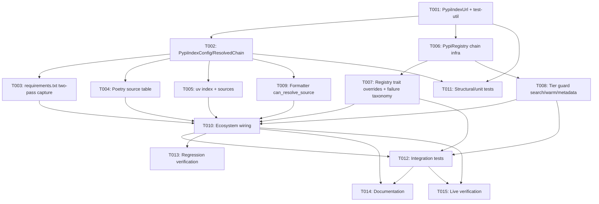

---
aliases:
  - PyPI Private Index Tasks
tags:
  - sdd
  - tasks
  - pypi
  - security
created: 2026-09-02
status: draft
related:
  - "[[spec]]"
  - "[[plan]]"
---

# Implementation Tasks: PyPI Private/Custom Index Resolution

> [!info] References
> **Spec**: [[spec]]
> **Plan**: [[plan]]
> **Issue**: #513
> **Total tasks**: 15

> [!warning] Revision History
> **r2 (2026-09-02)** — rewritten after a `rust-critic` review of r1's plan.md
> found 4 Critical defects encoded directly into r1's T006/T007 acceptance
> criteria (chain lookup structurally could not resolve; global chain-key
> aliasing; implicit-primary leaked private package names to `pypi.org` and
> inverted the dependency-confusion protection; wrong base-URL field reused).
> T001-T009 below reflect the corrected plan.md r2 design. Two tasks added:
> T006a (tier guard) and T015/T016 folded from r1's T013/T014 with expanded
> criteria.
>
> **r3 (2026-09-02)** — a second critic pass on r2 (verdict downgraded
> `critical` → `significant`; all r1 findings confirmed genuinely fixed) found
> 6 new Significant defects in r2's own fixes, closed here: T002 gains the
> zero-hop-chain case and the opaque hashed chain-key (not URL-shaped); T005's
> uv mapping is corrected (was backwards vs uv's own docs — `default = true`
> is a last-resort hop, not primary; non-`default`/non-`explicit` entries are
> automatic chain hops, not named-only); T006's `register_chain`/
> `register_named_source` take `root: &Arc<Self>` (not `&self`) and the
> implicit-public hop is a fresh `Public`-tier client (not `Arc::clone(&root)`,
> which would cycle); T006 narrows `simple_base` parameterization to
> `simple_api_url` only (not `metadata_url`, which would 404 on the wrong
> root); T007 documents the confirmed terminal-on-transport-error trade-off
> and its required diagnostic. Do not implement against any r1- or r2-era task
> description — plan.md's Revision History has the full corrected rationale
> for every fix in this list.

## Progress

- [ ] T001: `PypiIndexUrl` validation type + `test-util` feature
- [ ] T002: `PypiIndexConfig`/`ResolvedChain` data model and resolution logic
- [ ] T003: `requirements.txt` two-pass `--index-url`/`--extra-index-url`/`-i` capture
- [ ] T004: Poetry `[[tool.poetry.source]]` table + per-dependency `source =` parsing
- [ ] T005: uv `[tool.uv.index]` + `[tool.uv.sources] { index = "<name>" }` parsing
- [ ] T006: `PypiRegistry` chain infrastructure (`simple_base`, root-owned `alternates`, resolved `fallback_chain`)
- [ ] T007: `Registry` trait overrides with chained fallback + failure taxonomy (FR-005)
- [ ] T008: Tier guard on `search`/`warm_search_index`/`get_package_metadata`
- [ ] T009: `PypiFormatter::can_resolve_source` override
- [ ] T010: Ecosystem wiring — thread config into the two-pass parse pipeline
- [ ] T011: Structural/unit tests — validation, resolution, chain-key uniqueness, credential-safety
- [ ] T012: Integration tests — FR-005(a)/(b) ordering, failure taxonomy, `workspace_registries = off`
- [ ] T013: Regression verification — zero change for public-only projects
- [ ] T014: Documentation — CHANGELOG, ECOSYSTEM_GUIDE, testing knowledge base
- [ ] T015: Live verification against a real/mocked private-index fixture

---

## Dependency Graph

---

### T001: `PypiIndexUrl` validation type + `test-util` feature

**Context**: Every other task depends on a validated, normalized index URL type.
Mirrors `NpmRegistryIndex::new_for_log` exactly (https-only, no userinfo,
`classify_host`/`RegistryAccessPolicy` gated). Includes the `test-util` feature
fix (S7) upfront since T012's integration tests need it.

**Spec reference**: [[spec#FR-006]], [[spec#FR-011]], [[spec#NFR-002]]
**Plan reference**: [[plan#3-data-model]]
**Acceptance criteria**:
- [ ] `crates/deps-pypi/src/config.rs` created with `PypiIndexUrlError`,
      `PypiIndexUrl::new`/`new_for_log`, `PypiIndexUrl::as_str`
- [ ] Rejects non-`https` URLs (except the test-only loopback carve-out)
- [ ] Rejects any URL with `username()`/`password()` present
- [ ] Classifies host via `deps_core::net_policy::classify_host` and gates via
      `RegistryAccessPolicy::get().allows(class)`
- [ ] Normalizes by trimming a trailing `/` (PEP 503 `/simple/{name}/` path
      convention, matching `simple_api_url`'s existing join logic)
- [ ] `crates/deps-pypi/Cargo.toml` gains `test-util = []`, mirroring
      `crates/deps-npm/Cargo.toml:27` — the loopback carve-out is gated on
      `cfg(any(test, feature = "test-util"))`
- [ ] Unit tests cover every `PypiIndexUrlError` variant
**Dependencies**: none
**Files**: `crates/deps-pypi/src/config.rs` (new), `crates/deps-pypi/Cargo.toml`
**Complexity**: low

---

### T002: `PypiIndexConfig`/`ResolvedChain` data model and resolution logic

**Context**: The per-file resolved-config type every parser populates and every
dependency consults, plus the `ResolvedChain` type that drives chain
registration. Implements the corrected FR-005(a)/(b) structure and the
corrected Poetry-priority mapping.

**Spec reference**: [[spec#FR-002]], [[spec#FR-003]], [[spec#FR-005]],
[[spec#FR-006]], [[spec#FR-007]], [[spec#FR-013]]
**Plan reference**: [[plan#3-data-model]], [[plan#1-architecture]] (chain-key
identity subsection)
**Acceptance criteria**:
- [ ] `InvalidEntry { raw, reason }`, `PypiIndexConfig { primary, extras,
      named_sources }`, and `ResolvedChain { key, hops, implicit_public_fallback }`
      added to `config.rs`
- [ ] `resolve_source_for(named_source: Option<&str>) -> DependencySource`:
      no override anywhere → `Registry`; explicit primary present → routes
      through the primary+extras chain (case a); no explicit primary but
      extras present → routes through the extras+implicit-public chain
      (case b); named source requested → that source's own URL, or
      `CustomRegistry` if unresolved; an invalid **explicit primary** or
      **named source** → `CustomRegistry`; an invalid **extra** does **not**
      produce `CustomRegistry` — it is simply excluded from the chain (see
      `resolved_chains`)
- [ ] `resolved_chains() -> Vec<ResolvedChain>` returns one chain for the
      primary/extras case (if either is present) and one single-hop chain per
      named source — empty `Vec` when the file declares nothing (US-004)
      **or when every extra was dropped by FR-006 and no explicit primary
      exists (the zero-hop case — see below)**
- [ ] **Zero-hop case (fixes N5)**: when a case-(b) file's extras are all
      dropped (e.g. `workspace_registries = off`) and no explicit primary was
      declared, `resolve_source_for(None)` returns plain
      `DependencySource::Registry` — **not** an `AlternateRegistry` pointing
      at an empty chain. Test this explicitly; do not leave it to whatever
      the zero-hop registration code happens to do
- [ ] `ResolvedChain::key` construction: an opaque, single-line hashed token
      (`format!("pypi-chain:{:016x}", digest)`, `digest` from
      `std::collections::hash_map::DefaultHasher` over the ordered hop
      strings + the `implicit_public_fallback` flag) — **never** a
      newline-joined or otherwise URL-shaped value (fixes N6 — violates
      `deps-core`'s documented `AlternateRegistry.index` contract). **Test
      asserts** an explicit chain `[A, B]` and an implicit chain that
      resolves to hops `[A, B]` (plus the fallback flag) produce *different*
      keys (regression test for the C2 aliasing defect)
- [ ] Poetry priority mapping implemented exactly as plan.md's corrected
      decision table: `primary`/`default`/**no `priority` key** → primary;
      `supplemental`/`secondary` → extras; `explicit` → named-source only
- [ ] Unit tests: primary-only (case a), extras-only with no primary
      (case b), primary+extras, named-source via `explicit`, unlabeled
      Poetry source → primary (not supplemental) behavior, an invalid extra
      dropped from `resolved_chains` without producing `CustomRegistry`
**Dependencies**: T001
**Files**: `crates/deps-pypi/src/config.rs`
**Complexity**: medium

---

### T003: `requirements.txt` two-pass `--index-url`/`--extra-index-url`/`-i` capture

**Context**: Today these tokens are recognized only to correctly classify the
line as "not a dependency" (`KNOWN_OPTIONS`); the URL value is discarded.
This task captures the value into a `PypiIndexConfig` under construction for
the file, using a **two-pass** parse (fixes S2 — pip applies index options
file-wide regardless of line position; a single top-to-bottom pass would
leave dependencies declared before a late `--index-url` line unrouted).

**Spec reference**: [[spec#FR-001]], [[spec#US-001]], [[spec#US-002]]
**Plan reference**: [[plan#1-architecture]] (two-pass parse)
**Acceptance criteria**:
- [ ] Pass 1 scans the whole file and collects every `--index-url <url>`,
      `--index-url=<url>`, `-i <url>`, `--extra-index-url <url>`, and
      `--extra-index-url=<url>` occurrence into a `PypiIndexConfig`,
      regardless of position relative to dependency lines
- [ ] Pass 2 resolves every dependency's source using the fully-collected
      config via `resolve_source_for(None)`
- [ ] **Test**: a fixture with `--index-url` positioned *after* the first
      dependency line — that earlier dependency still resolves against the
      declared primary, not `pypi.org` (regression test for the S2 defect)
- [ ] Existing `KNOWN_OPTIONS`/`strong_signal` classification behavior is
      unchanged for every other option token
**Dependencies**: T002
**Files**: `crates/deps-pypi/src/parser/requirements.rs`
**Complexity**: medium

---

### T004: Poetry `[[tool.poetry.source]]` table + per-dependency `source =` parsing

**Context**: `pyproject.toml`'s Poetry-specific private-source declaration and
per-dependency source binding — the direct analogue of npm's `@scope:registry=`.

**Spec reference**: [[spec#FR-007]], [[spec#US-003]]
**Acceptance criteria**:
- [ ] `[[tool.poetry.source]]` entries (`name`, `url`, `priority`) parsed into
      `PypiIndexConfig.named_sources` and, per the corrected Poetry-priority
      mapping (T002), into `primary`/`extras` as applicable — **including**
      an entry with no `priority` key mapping to primary, not extras
- [ ] A Poetry dependency declaring `source = "<name>"` resolves via
      `resolve_source_for(Some("<name>"))`
- [ ] A `source = "<name>"` with no matching `[[tool.poetry.source]]` entry
      resolves to `CustomRegistry` (per spec's edge-case table), not a silent
      `pypi.org` fallback
- [ ] Existing Poetry `git`/`path`/`url`-derived `PypiDependencySource`
      handling is unchanged for dependencies that declare none of these
**Dependencies**: T002
**Files**: `crates/deps-pypi/src/parser/pyproject.rs`
**Complexity**: medium

---

### T005: uv `[tool.uv.index]` + `[tool.uv.sources] { index = "<name>" }` parsing

**Context**: uv's index-declaration table plus its per-dependency
index-routing binding — the direct uv analogue of Poetry's `source = "<name>"`
(FR-007). Scope expanded 2026-09-02 (critic review): without the `index =`
binding, a named/`explicit`-equivalent uv index is entirely unreachable. The
mapping below was itself corrected 2026-09-02 by a second critic pass after
verification against `docs.astral.sh/uv/concepts/indexes/` found the first
draft backwards — implement exactly as written here, not per any earlier
description.

**Spec reference**: [[spec#FR-013]]
**Plan reference**: [[plan#1-architecture]] ("uv's chain shape is its own
third case")
**Acceptance criteria**:
- [ ] `[tool.uv.index]` array-of-tables entries (`name`, `url`, `default`,
      `explicit`) parsed using the same `PypiIndexUrl` validation and
      `RegistryAccessPolicy` gate as T003/T004
- [ ] An entry with neither `default = true` nor `explicit = true` is
      appended to `extras` in declaration order — it is searched
      **automatically** for every dependency (uv's own documented default),
      the direct analogue of `--extra-index-url`, **not** `named_sources`-only
- [ ] An entry with `default = true` (uv permits at most one) becomes the
      **final** hop of the chain — uv's lowest-priority, last-resort index,
      replacing the implicit public fallback in that slot. It does **not**
      populate `PypiIndexConfig.primary` and is **not** checked first — a
      test must assert a package present on both a non-default entry and the
      `default` entry resolves via the non-default one
- [ ] An entry with `explicit = true` is registered into `named_sources`
      only, never auto-included in the chain
- [ ] `[tool.uv.sources] <dep> = { index = "<name>" }` parsed and resolves
      that dependency via `resolve_source_for(Some("<name>"))` — works for
      both `explicit` and non-`explicit` named entries, mirroring FR-007's
      Poetry handling
- [ ] A pure-uv `pyproject.toml`'s `PypiIndexConfig.primary` stays `None` —
      uv never populates the `primary`/FR-005(a) slot; its chain always
      routes through the FR-005(b) shape (test this explicitly, it is easy to
      get backwards)
- [ ] Every other `[tool.uv.sources]` shape (`git =`, `path =`,
      `workspace = true`, or any combination without an `index =` key) is
      **not** parsed by this feature — confirmed by a test asserting their
      presence has no effect
**Dependencies**: T002
**Files**: `crates/deps-pypi/src/parser/pyproject.rs`
**Complexity**: medium

---

### T006: `PypiRegistry` chain infrastructure

**Context**: The routing infrastructure `get_versions_from`/
`get_latest_matching_from` dispatch through. This is the task whose r1
acceptance criteria the critic identified as directly encoding two Critical
defects (C1: chain lookup structurally could not resolve; C4: wrong base-URL
field reused) — the criteria below are the corrected r2 design and **must**
be implemented as written here, not per any earlier description.

**Spec reference**: [[spec#FR-002]], [[spec#FR-003]], [[spec#FR-005]],
[[spec#FR-008]]
**Plan reference**: [[plan#1-architecture]] (Chain resolution mechanism,
Chain-key identity), [[plan#3-data-model]]
**Acceptance criteria**:
- [ ] `PypiRegistryTier` enum (`Public`/`WorkspaceDeclared`) added to
      `registry.rs`
- [ ] `PypiRegistry` gains a **new `simple_base: String` field, distinct
      from the existing `index_url` field** (which remains the package-name
      *search*-index base, untouched in meaning) — only `simple_api_url`
      (PEP 503/691 version fetches, currently built from the module const
      `PYPI_SIMPLE_BASE`) is parameterized to use `self.simple_base`.
      **`metadata_url`/`PYPI_BASE` is left untouched** (fixes N3, second
      critic pass — `PYPI_BASE` and `PYPI_SIMPLE_BASE` are different roots;
      parameterizing `metadata_url` on `simple_base` too would 404 the
      public client, and no alternate client ever reaches it anyway once
      T008's tier guard lands). **This is the fix for C4** — verify with a
      test that an alternate client's version fetch actually hits the
      configured private host, not `pypi.org`
- [ ] `PypiRegistry` gains `tier`, `alternates: Arc<DashMap<String,
      Arc<Self>>>` (root-owned only), `fallback_chain: Vec<Arc<Self>>`
      (**resolved concrete clients, not raw URLs — this is the fix for C1**)
- [ ] `with_base(cache, simple_base: &PypiIndexUrl, fallback_chain: Vec<Arc<Self>>)
      -> Self` constructs one hop (`WorkspaceDeclared` tier)
- [ ] `register_chain(root: &Arc<Self>, chain: &ResolvedChain)` — takes the
      root as a **plain parameter, not `&self`** (fixes N1, second critic
      pass — `self: &Arc<Self>` receivers are unstable). Builds the full hop
      tree (hop 0 as the returned client's own `simple_base`/`tier`; hops
      1..N-1 as freshly-constructed leaf clients with empty `fallback_chain`;
      when `implicit_public_fallback` is set, the final hop is a **freshly-
      constructed `Public`-tier client** — same `simple_base`/transport as
      the root, but **not** `Arc::clone(root)`, which would create a
      root→alternates→head→fallback_chain→root reference cycle) and inserts
      the head into `root.alternates` under `chain.key`. Idempotent per key,
      capped at `MAX_ALTERNATE_REGISTRIES = 256`
- [ ] `register_named_source(root: &Arc<Self>, index: &PypiIndexUrl)`
      registers a single-hop leaf under the source's own URL into
      `root.alternates` — same `root` parameter shape as `register_chain`
- [ ] `alternate_client(index: &str) -> Option<Arc<Self>>` is a plain map
      lookup — called **only on the root** (verify: a test constructing a
      non-root chain client and calling `alternate_client` on it directly
      returns `None` for everything, documenting the invariant, not
      asserting it should work — this is intentionally the C1 invariant, not
      a bug to fix here)
- [ ] `WorkspaceDeclared`-tier fetches route through
      `HttpCache::get_cached_workspace_with_headers` (existing, unchanged)
- [ ] Test: no reference cycle — dropping the `PypiEcosystem`/root after
      registering at least one implicit-fallback chain actually deallocates
      (verifies N1's second fix; a naive `Arc::clone(root)` would leak)
**Dependencies**: T001
**Files**: `crates/deps-pypi/src/registry.rs`
**Complexity**: high

---

### T007: `Registry` trait overrides with chained fallback + failure taxonomy (FR-005)

**Context**: The fetch-time logic that makes the FR-005(a)/(b) chain actually
work, including the corrected failure taxonomy (S5) that distinguishes
`PackageNotFound`/empty-listing (continue) from a genuine error (terminate).

**Spec reference**: [[spec#FR-005]], [[spec#NFR-006]], [[spec#SC-004]]
**Plan reference**: [[plan#1-architecture]] (Failure taxonomy subsection)
**Acceptance criteria**:
- [ ] `get_versions_from`/`get_latest_matching_from` overridden on
      `PypiRegistry`, dispatching on `DependencySource::AlternateRegistry`
      exactly as `NpmRegistry` does for the non-chained case
- [ ] `get_versions_chained` (private helper): tries `self.get_versions_with`
      (hop 0, using `self.simple_base`) first, then each `self.fallback_chain`
      entry's own `get_versions_with` in order — **no further map lookup at
      any point** (verifies T006's C1 fix actually resolves a hop end to end)
- [ ] Stop condition implements the plan's three-way taxonomy exactly:
      `Ok(non-empty)` → terminal, return; `Err(PackageNotFound)` or
      `Ok(empty)` → continue to next hop; any other `Err` → terminal,
      propagate immediately, do **not** try the next hop
- [ ] **Confirmed trade-off (N4, second critic pass)**: this applies to a
      case-(b) chain exactly as to case (a) — an unreachable hop 0 (a
      declared extra, when no explicit primary exists) halts resolution for
      every dependency in that file, public ones included. This is
      intentional, not a bug to soften. THE SYSTEM SHALL surface a
      distinguishable diagnostic for this case (spec NFR-003(3) — e.g.
      "extra index unreachable — resolution halted, not falling back to
      pypi.org"), not a generic fetch-error message. Test: a case-(b) chain
      whose sole extra times out produces this distinguishable message, and
      no request reaches the implicit public fallback
- [ ] `get_latest_matching_chained` derived from `get_versions_chained` +
      `select_latest_matching[_with_context]` — **no independent chain walk**
      (fixes M4); a winning hop with no version matching the requirement is
      terminal (`Ok(None)`), not a trigger to search further hops
- [ ] `AlternateRegistry` with no registered `alternate_client` returns
      `PackageNotFound { registry: "alternate registry (not registered)" }`
- [ ] Every hop reuses FR-004's existing PEP 691-then-PEP 503 content
      negotiation unchanged
**Dependencies**: T006
**Files**: `crates/deps-pypi/src/registry.rs`
**Complexity**: high

---

### T008: Tier guard on `search`/`warm_search_index`/`get_package_metadata`

**Context**: New task (2026-09-02, critic review S4/M3) — without this guard,
an unguarded `search`/`warm_search_index` on a `WorkspaceDeclared`-tier client
would trigger a full project-listing download from the private host, and the
existing but currently-unrouted `get_package_metadata` would send a private
package name to `pypi.org`'s JSON API the moment any future call site reaches
it.

**Spec reference**: [[spec#FR-014]]
**Plan reference**: [[plan#1-architecture]] (Tier guard on search endpoints)
**Acceptance criteria**:
- [ ] `search` returns `Ok(vec![])` immediately for any `WorkspaceDeclared`-
      tier client, issuing no HTTP request
- [ ] `warm_search_index` no-ops immediately for any `WorkspaceDeclared`-tier
      client, never triggering `trigger_index_build`
- [ ] `get_package_metadata` gains the identical tier guard, even though it
      has no in-workspace caller today — closing the latent leak before any
      future call site can reach it
- [ ] Test asserts all three issue zero HTTP requests when called on a
      `WorkspaceDeclared`-tier client (mockito assertion: no matcher hit)
**Dependencies**: T006
**Files**: `crates/deps-pypi/src/registry.rs`
**Complexity**: low

---

### T009: `PypiFormatter::can_resolve_source` override

**Context**: The single override point gating hover/diagnostics/code-actions
on a resolved `AlternateRegistry` source — without it, `is_version_resolvable()`
(which is `false` for `AlternateRegistry`) would incorrectly suppress a
successfully-routed private-index dependency.

**Spec reference**: [[spec#FR-009]]
**Acceptance criteria**:
- [ ] `PypiFormatter::can_resolve_source` overridden to accept
      `Registry | AlternateRegistry { .. }`, mirroring `NpmFormatter` exactly
- [ ] `CustomRegistry` continues to fall through to the default
      (`is_version_resolvable() == false`) — no separate override needed
- [ ] Hover/diagnostics/completion tests confirm an `AlternateRegistry`
      dependency renders identically in shape to a `Registry` one
- [ ] Document the M1 cosmetic limitation (a plain dependency in an
      extras-only file loses its pypi.org hover link even when it actually
      resolves via the implicit public fallback) as a code comment near the
      override, per plan.md §3's formatter note — not something to fix here
**Dependencies**: T002
**Files**: `crates/deps-pypi/src/formatter.rs`
**Complexity**: low

---

### T010: Ecosystem wiring — thread config into the two-pass parse pipeline

**Context**: Connects T003/T004/T005's per-file `PypiIndexConfig` to T006/T007's
registry client, so a parsed manifest's dependencies actually route through the
new machinery. The integration point mirrors `NpmEcosystem::parse_manifest`'s
registration call, adapted for `resolved_chains()`'s chain-based (not
single-URL) registration.

**Spec reference**: [[spec#FR-008]]
**Plan reference**: [[plan#2-project-structure]]
**Acceptance criteria**:
- [ ] `PypiEcosystem::parse_manifest` builds one `PypiIndexConfig` per parsed
      file (via T003/T004/T005's two-pass parsers) and calls
      `PypiIndexConfig::resolved_chains()` to `register_chain` every chain,
      plus `register_named_source` for every named source, with the **root**
      `PypiRegistry` instance
- [ ] The existing shared `RegistryAccessPolicy` (`registries.workspace_registries`)
      is threaded through to `PypiIndexUrl::new` — no new `pypi.*` config key
      introduced
- [ ] A file with no index declaration anywhere never constructs more than an
      empty/default `PypiIndexConfig` and never calls `register_chain`
- [ ] **Test A (S6, mixed chain)**: `workspace_registries = off` with a file
      declaring an **explicit valid `--index-url`** plus an
      `--extra-index-url` — the extra drops out of the chain (FR-006), but
      the chain still has a working hop (the explicit primary), so every
      dependency in the file resolves via that primary exactly as it would
      under `public_only`/`all`. This is the S6 scenario: a blocked extra
      must not break a chain that still has a valid remaining hop
- [ ] **Test B (N5, zero-hop, second critic pass)**: `workspace_registries =
      off` with a file declaring **only** `--extra-index-url` entries (no
      explicit primary) — every extra is blocked, the chain has zero hops,
      and per N5's fix every plain dependency in that file resolves as
      **plain `DependencySource::Registry`** (not `CustomRegistry`, not a
      structurally-broken empty `AlternateRegistry`) — i.e. it degrades
      gracefully to ordinary public resolution for the whole file, same as a
      file with no declarations at all. Do **not** write this test expecting
      per-package fail-closed behavior — there is no per-package distinction
      at parse time; every plain dependency in an extras-only file shares one
      `DependencySource`
**Dependencies**: T003, T004, T005, T007, T008, T009
**Files**: `crates/deps-pypi/src/ecosystem.rs`, `crates/deps-pypi/src/lib.rs`
**Complexity**: medium

---

### T011: Structural/unit tests — validation, resolution, chain-key uniqueness, credential-safety

**Context**: NFR-001/SC-005's structural guarantee that no credential-shaped
value can ever be held, plus the full validation/resolution/chain-key matrix
(including the C2 regression test already required inline by T002).

**Spec reference**: [[spec#NFR-001]], [[spec#SC-005]]
**Plan reference**: [[plan#7-testing-strategy]]
**Acceptance criteria**:
- [ ] A structural test asserts `PypiIndexConfig`/`PypiIndexUrl`/`InvalidEntry`
      have no field capable of holding a credential-shaped value (mirrors
      Cargo's/npm's NFR-001 test pattern)
- [ ] Full `PypiIndexUrlError` matrix covered (already partially in T001;
      this task closes any remaining gaps found during T002-T005)
- [ ] `PypiIndexConfig::resolve_source_for`/`resolved_chains` matrix:
      case (a) primary-only, case (a) primary+extras, case (b) extras-only,
      named-source, unlabeled-Poetry-source-as-primary, invalid-extra-dropped
      (not `CustomRegistry`)
- [ ] `ResolvedChain::key` uniqueness test (already required by T002 — confirm
      it exists and passes, not a duplicate task)
**Dependencies**: T001, T002
**Files**: `crates/deps-pypi/src/config.rs` (test module), possibly
`crates/deps-pypi/tests/`
**Complexity**: medium

---

### T012: Integration tests — FR-005(a)/(b) ordering, failure taxonomy, `workspace_registries = off`

**Context**: End-to-end verification of both FR-005 sub-cases, the corrected
failure taxonomy, and the S6 gating fix, per the Registry Integration Gate.

**Spec reference**: [[spec#SC-001]], [[spec#SC-002]], [[spec#SC-004]],
[[spec#NFR-006]], [[spec#FR-004]]
**Acceptance criteria**:
- [ ] **Case (a)**: explicit primary + extra, package on both → primary
      wins (NFR-006)
- [ ] **Case (b)**: no explicit primary, extra + implicit public, package on
      both → **extra wins, no request to the public fixture for that name**
      until the extra is confirmed to miss (this is the regression test for
      the C3 security fix — must assert request-count/order via mockito, not
      just the final result)
- [ ] Package present only on an extra (either case) → resolves there, not
      "not found" (US-002/SC-002)
- [ ] Failure taxonomy: primary returns 500/timeout → chain terminates with
      that error, extras/public are **not** queried; primary returns 404 →
      falls through; primary returns 200+empty listing → falls through
      identically to 404 (S5)
- [ ] **Case (b) transport failure (N4, second critic pass)**: no explicit
      primary, sole declared extra times out/errors → chain terminates with
      a *distinguishable* diagnostic (not a generic fetch error), the
      implicit public fallback is **not** queried, and — cross-checked
      against a second dependency in the same file that has no relation to
      the private feed — that ordinary dependency **also** fails to resolve
      in this scenario (confirming N4's confirmed trade-off is real, not
      accidentally scoped to only the affected package)
- [ ] Alternate index returning PEP 503 HTML (not PEP 691 JSON) parses
      correctly via the existing HTML-fallback path (FR-004)
- [ ] `search`/`warm_search_index`/`get_package_metadata` issue zero requests
      on a `WorkspaceDeclared`-tier client (cross-check with T008's unit test
      — this is the integration-level confirmation)
- [ ] `workspace_registries = off`, **Test A** (mixed: valid explicit primary
      + blocked extra) — chain still resolves via the primary (S6)
- [ ] `workspace_registries = off`, **Test B** (extras-only, no primary,
      every extra blocked) — zero-hop chain, every dependency in the file
      resolves as plain `Registry` (N5), not per-package fail-closed
**Dependencies**: T007, T008, T010
**Files**: `crates/deps-pypi/tests/` (new or existing integration test file)
**Complexity**: high

---

### T013: Regression verification — zero change for public-only projects

**Context**: US-004/NFR-004/NFR-005's non-negotiable zero-regression bar.

**Spec reference**: [[spec#US-004]], [[spec#NFR-004]], [[spec#NFR-005]],
[[spec#SC-003]]
**Acceptance criteria**:
- [ ] Full existing `deps-pypi` test suite passes unchanged
- [ ] `cargo nextest run -p deps-pypi --all-features` produces identical pass
      count to the pre-feature baseline
- [ ] Manual hover check on a `requirements.txt`/`pyproject.toml` with no
      index declaration confirms byte-identical output to pre-feature
**Dependencies**: T010
**Files**: none (verification only)
**Complexity**: low

---

### T014: Documentation — CHANGELOG, ECOSYSTEM_GUIDE, testing knowledge base

**Context**: Required by this spec's "Always" agent boundary and the project's
`branching.md`/`continuous-improvement.md` rules. Must document the M1
cosmetic limitation and the FR-005(b) ordering rationale, since both are
user-visible/security-relevant behaviors a reader would otherwise not expect.

**Spec reference**: [[spec#8-agent-boundaries]]
**Acceptance criteria**:
- [ ] `CHANGELOG.md` `[Unreleased]` entry added (one line, PR link added once
      known)
- [ ] `ECOSYSTEM_GUIDE.md` updated to describe PyPI private-index support,
      including the FR-005(a)/(b) ordering rule in plain language and the M1
      hover-link limitation
- [ ] `.local/testing/coverage.md` PyPI row updated
- [ ] `.local/testing/playbooks/pypi.md` created (if absent) or updated with
      private-index test positions
- [ ] `.local/testing/regressions.md` gets the minimal reproduction manifest
      for the #248-class regression this feature must not reintroduce, plus
      a manifest reproducing the C3 name-disclosure scenario this revision
      fixed (extras-only file, package present on both extra and public)
**Dependencies**: T010, T012
**Files**: `CHANGELOG.md`, `ECOSYSTEM_GUIDE.md`, `.local/testing/coverage.md`,
`.local/testing/playbooks/pypi.md`, `.local/testing/regressions.md`
**Complexity**: low

---

### T015: Live verification against a real/mocked private-index fixture

**Context**: The Registry Integration Gate (`.claude/rules/continuous-improvement.md`)
requires live verification before filing the implementation PR — unit/mock
tests alone are insufficient per that rule.

**Spec reference**: [[spec#8-agent-boundaries]] (Always: "Follow the Registry
Integration Gate")
**Acceptance criteria**:
- [ ] `RUST_LOG=debug cargo run -p deps-lsp` launched against a fixture
      project with (1) a `requirements.txt` containing an explicit
      `--index-url` + `--extra-index-url` (case a), and (2) a separate
      fixture with only `--extra-index-url` (case b), both pointed at a real
      or `mockito`-mocked devpi/Artifactory-shaped index
- [ ] Hover output inspected and confirmed correct for a dependency resolved
      via the private index in both cases, and confirmed that case (b) does
      not issue a request to the real `pypi.org` for a name that resolves on
      the mocked extra (network trace or log inspection)
- [ ] Session log reviewed for `WARN`/`ERROR`/panics per
      `continuous-improvement.md`'s manual-testing checklist
**Dependencies**: T010, T012
**Files**: none (verification only)
**Complexity**: medium

---

## Implementation Notes

### Order of execution

T001 → T002 unlock everything else and should land first. T003/T004/T005 (the
three parser surfaces) and T006 (registry infra) can proceed in parallel once
T002 lands. T007 and T008 both depend only on T006 and can proceed together.
T009 depends only on T002. T010 is the integration point and must wait for
all of T003/T004/T005/T007/T008/T009. T011 can start as soon as T001/T002
land. T012-T015 are the closing sequence.

### Common patterns

Follow `crates/deps-npm/src/config.rs` and `crates/deps-npm/src/registry.rs`
line-for-line where the shape matches (`PypiIndexUrl` ≈ `NpmRegistryIndex`).
Deviate where plan.md's r2 Architecture section explicitly calls for it — the
`simple_base` field, the resolved (not string-keyed) `fallback_chain`, and the
`ResolvedChain`-based registration have no npm equivalent and exist
specifically because npm never needed a multi-hop fallback chain.

### Gotchas

- **Never** let `CustomRegistry` (explicit primary or named-source failure)
  fall through to a `pypi.org` fetch anywhere — the exact #248 regression
  class. An invalid **extra**, by contrast, must NOT produce `CustomRegistry`
  — it is dropped from its chain, not escalated. Getting this distinction
  backwards in either direction is a defect.
- **The implicit public fallback (`ResolvedChain::implicit_public_fallback`)
  must always be the *last* hop, never the first** — this is the C3 fix and
  the single most security-relevant invariant in this feature. A test that
  only checks "the right data eventually comes back" will not catch a
  reintroduction of the r1 bug; T012's case-(b) test must assert *request
  order/count*, not just the final result.
- `alternate_client` must only ever be called on the **root** registry
  instance. A chain client's own `alternates` map is always empty by
  construction (T006) — this is intentional, not a bug, and `get_versions_chained`
  must never call `self.alternate_client(...)` on itself; it walks the
  already-resolved `fallback_chain: Vec<Arc<Self>>` instead.
- `simple_base` and `index_url` are **different fields with different
  meanings** — do not reuse one for the other (the C4 defect). `index_url` is
  search-only; `simple_base` is the version-fetch base every hop actually
  uses.
- `MAX_ALTERNATE_REGISTRIES = 256` now caps distinct chain *identities*, not
  distinct index URLs — see plan.md §1's risk note.
- Log every `InvalidEntry` with the **raw, as-written** value only — no
  expansion step exists for PyPI config (unlike npm's `${VAR}`), so this is
  simpler than npm's case, but still don't reformat/normalize before logging
  a rejected value.

## See Also

- [[spec]] — feature specification
- [[plan]] — technical plan
- [[MOC-specs]] — all specifications
- `.local/handoff/2026-09-02T21-55-03-critic.md` — the critic review this
  revision addresses
