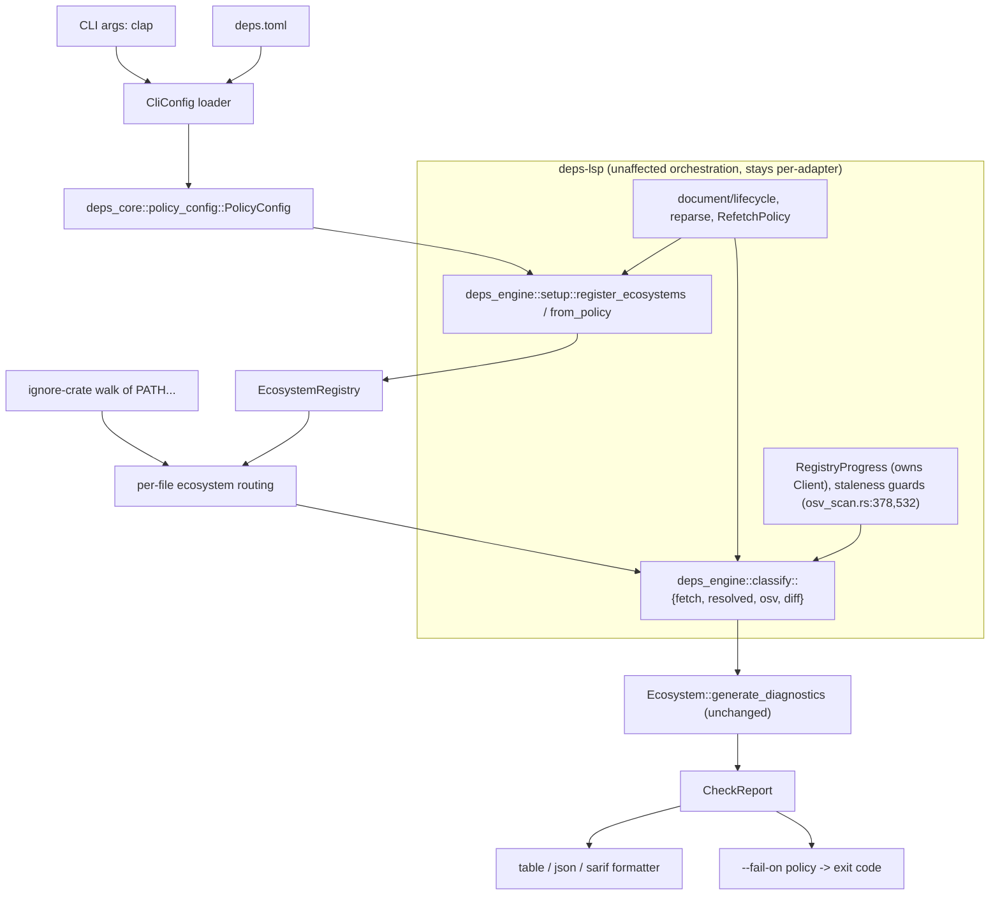

---
aliases:
  - CLI Check Mode Plan
  - deps-cli Plan
tags:
  - sdd
  - plan
  - cli
  - ci
created: 2026-09-14
status: draft
related:
  - "[[spec]]"
  - "[[constitution]]"
  - "[[architecture-decision]]"
---

# Technical Plan: CLI Check Mode (`deps-cli check`)

> [!info] References
> **Spec**: [[spec]]
> **Architecture decision**: [[architecture-decision]]

## Revision History

- **v1** (2026-09-14): Initial plan. §1's "Ecosystem registration location" decision proposed
  moving `register_ecosystems`/`EcosystemRuntime` into `deps_core::ecosystem_setup`.
- **v2** (2026-09-14, this revision): During implementation of PR 1, that extraction (task
  T002) hit a hard Cargo circular-dependency wall — `deps-core` cannot depend on any
  `deps-<ecosystem>` crate, and all 14 already depend on `deps-core`. Two rounds of
  architect/adversarial-critic review (round 1: `significant`, four structural gaps; round 2:
  `minor`, one mandatory scope correction) produced [[architecture-decision]], which this
  revision carries into §1, §2, §3, §6, §7, §9, §10, and §11. The config extraction (PR 1a,
  T001/T003) required no changes and is implemented. **No change to [[spec]]'s WHAT/WHY** — the
  user-facing `deps-cli check` behavior, flags, and output formats are unaffected; only the
  internal crate boundary that gets `deps-cli` there changes.

## 1. Architecture

### Architectural framing

This plan follows **hexagonal architecture (ports & adapters)**, with one Rust-specific
amendment forced by Cargo's acyclic package graph: the composition root that wires every
driven adapter (each `deps-<ecosystem>` crate) is itself a *crate* — `deps-engine` — not a
function inside the outermost binary, because three driving adapters (`deps-lsp`, `deps-cli`,
future `deps-mcp`, issue #710) cannot each depend on the same composition code without either
duplicating it or introducing a crate cycle. See [[architecture-decision]] §2 for the full
evaluation (onion rejected — would require splitting `deps-core`'s already-appropriate I/O
ownership for no testability gain `mockito` doesn't already provide; DDD — vocabulary only, no
structural change) and §3.3 for the placement rule this plan applies throughout: *if a type
must name a concrete ecosystem, it belongs in `deps-engine`; otherwise it belongs in
`deps-core`.*

### Approach

Three sequenced changes:

1. **Config extraction (PR 1a — implemented).** Move the policy-relevant sections of
   `deps-lsp::config::DepsConfig` into `deps_core::policy_config`; `deps-lsp::config::DepsConfig`
   composes it via `#[serde(flatten)]`. Already implemented on this branch and confirmed
   correct by [[architecture-decision]] §4 — no further work.
2. **`deps-engine` crate (PR 1b + PR 1c — NEW, replaces v1's `deps_core::ecosystem_setup`
   extraction).** A new leaf crate depending on `deps-core` and all 14 ecosystem crates
   (feature-gated, default-on, forwarded from each adapter's own Cargo features) and nothing
   else in the workspace. Contains, added across separate steps (§9):
   - `deps_engine::setup` — `EcosystemRuntime`, `register_ecosystems`, the
     `ecosystem!`/`register!` macros, moved verbatim from `deps-lsp/src/lib.rs:39-522`, plus
     new `EcosystemRuntime::from_policy`.
   - `deps_engine::classify::{fetch, resolved, osv, diff}` — the ~950-line pure
     verdict-classification layer (yanked/deprecated/fetch-failed/in-use-version/OSV-key
     decisions, and normalizing raw fetch results into `DependencyOutcomes`), moved from
     `deps-lsp/src/document/{fetch,resolved,osv_scan,diff}.rs`. This is what makes FR-005 a
     structural guarantee instead of an aspiration once `deps-cli` exists — see
     [[architecture-decision]] §1.4/§5.6.
   - `deps_engine::progress` — `ProgressSender`, `ProgressUpdate` (made `pub`), and a new
     `pub fn channel(total)` factory — a designed port, not a verbatim move (see
     [[architecture-decision]]'s N2 correction).
   Orchestration — progress lifecycle, mid-flight staleness rejection, incremental diffing,
   document lifecycle — stays in `deps-lsp` by design; see [[architecture-decision]] §3.2/§3.5
   for exactly which functions move and which stay, and why the split requires touching
   neither `ServerState` nor `DocumentState`.
3. **New `deps-cli` crate.** Unchanged in spirit from v1: a thin binary that parses CLI flags,
   loads `deps.toml` through `deps_core::policy_config`, builds an `EcosystemRegistry` via
   `deps_engine::setup::register_ecosystems` (not a `deps-core`-hosted function — this is the
   corrected call site), walks the target path with `ignore`, and for every discovered
   manifest calls `deps_engine::classify::*` to assemble that manifest's `VersionData` before
   calling its ecosystem's `Ecosystem::generate_diagnostics` — the identical call the LSP's
   `handlers/diagnostics.rs` makes. Results become one `CheckReport`.

This keeps `deps-cli` from forking a second classification implementation (constitution
principle 1) while avoiding both a `deps-cli → deps-lsp` dependency and the Cargo cycle that
made a `deps-core`-hosted composition root impossible (`deps-core` can never name
`deps-cargo`, `deps-npm`, etc. — verified by grepping every `crates/*/Cargo.toml`; see
[[architecture-decision]] §1.1). Note the original rationale for rejecting `deps-cli →
deps-lsp` ("pulls in `tower-lsp-server` for no reason") was itself incorrect — `deps-core`
already depends on `tower-lsp-server` non-optionally and re-exports it
(`deps-core/src/lib.rs:149`), so `deps-cli` links it regardless of which option is chosen.
The option is still rejected, but for the reasons in [[architecture-decision]] §5.3 (making
`deps-lsp`'s `pub` surface the de-facto SDK for two unrelated protocols, not a transport-size
concern).

### Component Diagram



### Key Design Decisions

| Decision | Choice | Rationale | Alternatives Considered |
|----------|--------|-----------|--------------------------|
| Policy-config location | `deps_core::policy_config` (implemented, unchanged by this revision) | Constitution principle 1; both `deps-lsp` and `deps-cli` compose it | Duplicate the struct in `deps-cli` (rejected: DRY violation); `deps-cli` depends on `deps-lsp` (rejected: see below) |
| Ecosystem registration + classification location | New leaf crate `deps-engine` — composition root (`setup`) *and* the pure verdict-classification layer (`classify`) — depended on by every driving adapter | Cargo forbids `deps-core` naming any `deps-<ecosystem>` crate: a hard cycle, verified by grepping every `crates/*/Cargo.toml`, not a preference. Capability B (verdict classification) must also be shared, not just capability A's registration, or FR-005 ("CLI and LSP verdicts cannot structurally drift") is aspirational rather than structural once `deps-cli` exists — see [[architecture-decision]] §1.3/§1.4 | Keep in `deps-core` (rejected: impossible, Cargo cycle — this was v1's decision); each front end re-implements registration (rejected: three hand-maintained, non-uniform copies of per-ecosystem wiring, a security regression risk for the `config::reparse_scope` #592 M1 invariant); adapters depend on `deps-lsp` as a library (rejected: makes `deps-lsp`'s `pub` surface a de-facto two-protocol SDK); `inventory`/`linkme` self-registration (rejected: `unsafe` machinery against workspace-wide `unsafe_code = "forbid"`, link-order-dependent registration reintroduces `EcosystemRegistry::for_uri`'s known precedence bug class, defeats the #758 exhaustiveness check); `deps-engine` for registration only, classification left in `deps-lsp` (rejected as an endpoint — `deps-cli` would still write its own classification, reopening the FR-005 drift risk). Full evaluation: [[architecture-decision]] §5 |
| Directory walk | `ignore` 0.4.33 (new workspace dependency) | Battle-tested `.gitignore` semantics (same crate `ripgrep` uses); avoids reimplementing gitignore precedence/negation rules | Hand-rolled walker on `fs_probe` (rejected per user decision — correctness risk for negated/nested `.gitignore` rules) |
| CLI argument parsing | `clap` 4.6 (derive API, new workspace dependency) | The flag surface (`PATH...`, `--format`, `--fail-on` multi-value, `--offline`, `--cooldown`, `--config`) is materially richer than `deps-lsp/src/main.rs`'s three hand-rolled flags; `clap derive` keeps validation (enum-valued `--format`) declarative instead of hand-rolled matching | Hand-rolled parsing matching `main.rs`'s existing style (rejected: `--fail-on`'s comma-separated multi-value enum and `--format`'s validated enum would need to reimplement what `clap`'s `ValueEnum` derive already gives for free; flagged as an "Ask First" dependency addition per spec §8 — confirm before implementing) |
| SARIF serialization | `serde-sarif` 0.8.0 (new workspace dependency) | Matches the version the source issue already scoped; typed SARIF 2.1.0 struct model avoids hand-rolling the schema | Hand-rolled `serde_json::json!` SARIF construction (rejected: schema drift risk, no compile-time field checking) |
| TOML parsing for `deps.toml` | `toml_span` (already a workspace dependency, used by `deps-cargo`/`deps-lsp`) | Existing project convention — no second TOML parser | The `toml` crate (rejected: not used anywhere else in this workspace) |
| `deps-cli`'s publish status | Published from first release (constitution principle 8 applies day one) | User decision; keeps a single compatibility policy across all published crates (`deps-engine` is the 17th, `deps-cli` the 18th — see §10) | Ship unpublished until stabilized (rejected — see spec §9) |

## 2. Project Structure

```
crates/
├── deps-core/
│   └── src/
│       └── policy_config.rs        (DONE — PolicyConfig + section types; T001/T003, unaffected)
├── deps-engine/                    (NEW — composition root + classification layer)
│   ├── Cargo.toml                  (deps-core + 14 ecosystem crates, all feature-gated;
│   │                                 #![recursion_limit = "256"], matching deps-lsp/deps-core)
│   └── src/
│       ├── lib.rs
│       ├── setup.rs                 (EcosystemRuntime, register_ecosystems, ecosystem!/register!
│       │                             macros, from_policy — moved verbatim from
│       │                             deps-lsp/src/lib.rs:39-522)
│       ├── progress.rs              (ProgressSender, ProgressUpdate (made pub), pub fn
│       │                             channel(total) factory — designed port, not verbatim;
│       │                             adapted from deps-lsp/src/progress.rs:36-62)
│       └── classify/
│           ├── mod.rs
│           ├── fetch.rs             (dedup_dependencies_by_source, composer_minimum_stability,
│           │                         FetchResult, fetch_latest_versions_parallel,
│           │                         fetch_and_classify_package, + the pure half of
│           │                         merge_registry_fetch_result — moved from
│           │                         deps-lsp/src/document/fetch.rs:29-716,:896-913)
│           ├── resolved.rs          (collect_in_use_versions, dependency_version_map,
│           │                         cached_versions_from_lockfile, split_resolved_packages,
│           │                         load_resolved_versions reparameterized to
│           │                         &Arc<LockFileCache> — moved from
│           │                         deps-lsp/src/document/resolved.rs:50-210, excl. RefetchPolicy)
│           ├── osv.rs               (build_scan_targets, resolve_fix_target,
│           │                         collect_fix_target_resolutions,
│           │                         apply_live_fix_target_statuses — moved from
│           │                         deps-lsp/src/document/osv_scan.rs:66,635,685,721)
│           └── diff.rs              (merge_deprecations_after_fetch,
│                                     merge_no_comparable_versions_after_fetch, reparameterized
│                                     from &mut DocumentState to &mut DependencyOutcomes —
│                                     moved from deps-lsp/src/document/diff.rs:106-155,156+)
├── deps-lsp/
│   ├── tests/
│   │   └── public_api_paths.rs      (NEW — compile-only non-breakage gate, §7)
│   └── src/
│       ├── lib.rs                   (MODIFIED — pub use deps_engine::setup::{EcosystemRuntime,
│       │                             register_ecosystems}; ~110 ecosystem!-generated re-exports
│       │                             forwarded identically)
│       ├── config.rs                (DONE — composes deps_core::policy_config::PolicyConfig)
│       ├── progress.rs              (MODIFIED — RegistryProgress stays, owns Client + LSP
│       │                             progress lifecycle; constructs deps_engine::progress::channel)
│       └── document/
│           ├── fetch.rs             (MODIFIED — keeps fetch_registry_versions_for_change,
│           │                         fetch_failure_toast, and merge_registry_fetch_result's
│           │                         ~12-line state.documents shell)
│           ├── resolved.rs          (MODIFIED — keeps RefetchPolicy only)
│           ├── osv_scan.rs          (MODIFIED — keeps the four run_* orchestrators and the
│           │                         doc.content == snapshot staleness guards at :378/:532)
│           └── diff.rs              (MODIFIED — keeps ONLY preserve_cache and
│                                     drop_cache_for_forced_refetch (editor-only cache
│                                     reconciliation); merge_deprecations_after_fetch and
│                                     merge_no_comparable_versions_after_fetch move to
│                                     deps-engine (see below) — this file's remaining callers
│                                     adapt to the new &mut DependencyOutcomes signature)
├── deps-cli/                        (NEW crate — unchanged from v1 except call sites target
│   │                                 deps_engine, not deps_core::ecosystem_setup)
│   ├── Cargo.toml
│   ├── .pre-commit-hooks.yaml
│   └── src/                         (unchanged from v1 — cli.rs, config.rs, walk.rs, report.rs,
│                                     exit.rs, format/; report.rs additionally calls
│                                     deps_engine::classify::* to assemble VersionData, see §3)
└── github-action/                   (unchanged from v1)
    └── action.yml
```

## 3. Data Model

```rust
// crates/deps-core/src/policy_config.rs (already implemented, unaffected by this revision)
#[derive(Debug, Clone, Deserialize, Default)]
pub struct PolicyConfig {
    #[serde(default)]
    pub diagnostics: DiagnosticsConfig,
    #[serde(default)]
    pub cache: CacheConfig,
    #[serde(default)]
    pub freshness: FreshnessConfig,
    #[serde(default)]
    pub supply_chain: SupplyChainConfig,
    #[serde(default)]
    pub registries: RegistriesConfig,
    #[serde(default)]
    pub network: NetworkConfig,
    #[serde(default)]
    pub license_policy: LicensePolicyConfig,
}
// Deliberately NOT #[non_exhaustive] (unlike deps-core's general enum convention — see
// constitution principle 2's per-enum carve-out). See "Accepted trade-off" below.

// crates/deps-lsp/src/config.rs (implemented)
#[non_exhaustive]
#[derive(Debug, Deserialize, Default)]
#[serde(deny_unknown_fields)]
pub struct DepsConfig {
    #[serde(default)]
    pub inlay_hints: InlayHintsConfig,
    #[serde(default)]
    pub code_lens: CodeLensConfig,
    #[serde(default)]
    pub loading_indicator: LoadingIndicatorConfig,
    #[serde(flatten)]
    pub policy: deps_core::policy_config::PolicyConfig,
}

// crates/deps-cli/src/config.rs
#[non_exhaustive]
#[derive(Debug, Deserialize, Default)]
#[serde(deny_unknown_fields)]
pub struct CliConfig {
    #[serde(flatten)]
    pub policy: deps_core::policy_config::PolicyConfig,
}

// crates/deps-engine/src/setup.rs (NEW — moved verbatim, plus one new constructor)
pub struct EcosystemRuntime { /* unchanged fields, moved from deps-lsp/src/lib.rs */ }

impl EcosystemRuntime {
    /// Builds the runtime's `EcosystemRegistry` from policy config alone.
    /// Construction only — does not touch `ServerState::cache`/`cold_start_limiter`
    /// or any LSP-side warning path; those remain the caller's responsibility.
    pub fn from_policy(policy: &deps_core::policy_config::PolicyConfig) -> Self { /* ... */ }
}

// crates/deps-cli/src/report.rs
pub struct CheckReport {
    pub findings: Vec<CheckFinding>,
    pub summary: BTreeMap<Category, usize>,
}

pub struct CheckFinding {
    pub ecosystem: EcosystemId,
    pub manifest_path: PathBuf,
    pub dependency_name: String,
    pub requirement: Option<String>,
    pub category: Category,
    pub severity: DiagnosticSeverity,
    pub range: Range,   // reuses tower_lsp_server::ls_types::Range's line/column shape
    pub message: String,
}

#[derive(Clone, Copy, PartialEq, Eq, PartialOrd, Ord)]
pub enum Category {
    Outdated,
    Yanked,
    Vulnerable,
    Unsatisfiable,
    MutableRefPin,
    License,
    Deprecated,
}
```

> [!warning] `[NEEDS CLARIFICATION: O-4]`
> [[architecture-decision]] §9 recommends `Category`/`CheckFinding`'s code→category mapping
> live in a new `deps_core::finding` module (next to the diagnostic codes it maps from —
> `UNSATISFIABLE_DIAGNOSTIC_CODE`, `LICENSE_POLICY_VIOLATION_DIAGNOSTIC_CODE`, …) rather than
> in `deps-cli::report`, since a future `deps-mcp` needs the identical mapping and a copy per
> adapter is exactly the duplication principle 1 exists to stop. This was **not decided**
> during architecture review because it further widens `deps-core`'s published surface (on top
> of the trade-off below). Until resolved, this plan keeps `Category`/`CheckFinding` in
> `deps-cli::report` as v1 had it — implementers must not move it to `deps-core` without this
> being explicitly settled first.

**Verification required before implementation**: `#[serde(flatten)]` interacting with
`DepsConfig`'s top-level `deny_unknown_fields` has already been checked empirically (T003, see
`config.rs`'s `test_flatten_preserves_deny_unknown_fields_rejection` and
`test_flatten_still_tolerates_unknown_key_nested_inside_a_known_section`) — the asymmetry is
intentional: an unknown top-level key is rejected, an unknown key nested inside a known
section is tolerated for forward-compat. This is now a documented contract `deps-cli::CliConfig`
must reproduce exactly (§6), not an open risk.

### Accepted trade-off: exhaustive `policy_config` structs vs. `deps-core` API stability

None of `PolicyConfig`, `DiagnosticsConfig`, `CacheConfig`, `FreshnessConfig`,
`SupplyChainConfig`, `RegistriesConfig`, `NetworkConfig`, `LicensePolicyConfig` is
`#[non_exhaustive]` (only `WorkspaceRegistriesSetting` is). This is deliberate, documented in
`policy_config.rs`'s own module doc comment: `deps-lsp::config::reparse_scope` exhaustively
destructures every field of every section here (issue #592 security M1) so the compiler
rejects a build when a new field is added without an explicit decision on whether it
invalidates already-open documents; `#[non_exhaustive]` on a cross-crate type would force a
`..` rest pattern at that destructure site and silently defeat that guarantee.

Now that `PolicyConfig` moving into `deps-core` is confirmed (not reversed) by
[[architecture-decision]], this trade-off becomes explicit and load-bearing: **adding a
config field, previously a `deps-lsp`-internal edit, is now a breaking change to `deps-core`
under principle 8** (§10). This is an accepted cost, not an oversight — see
`[NEEDS CLARIFICATION: O-6]` below for the alternative that was considered and deferred.

> [!warning] `[NEEDS CLARIFICATION: O-6]`
> Should `policy_config`'s structs gain `#[non_exhaustive]` + constructor functions after all,
> trading struct-literal ergonomics for the ability to add a config field without a
> `deps-core` major version bump? The developer's exhaustive-destructuring rationale (above)
> is sound on its own terms, but was decided before this principle-8 cost was on the table.
> [[architecture-decision]] §9 (O-6) explicitly routes this to the user rather than deciding
> it during architecture review — do not silently pick an answer during implementation.

### Cross-crate invariant to preserve: `config::reparse_scope` (#592 security M1)

`deps-lsp/src/config.rs`'s `reparse_scope` relies on `register_ecosystems`'s return value as
its single source of truth for which open documents must be reparsed when workspace-registry
settings change (guarded by the #758 completeness test). After `register_ecosystems` moves to
`deps_engine::setup`, this becomes a **cross-crate** invariant between `deps-lsp` and
`deps-engine` — still testable, but implementers must not "simplify" `deps-engine`'s return
type in a later change without re-verifying this invariant, since it is a security boundary,
not incidental plumbing.

### Migrations

None — no persistent storage. `deps.toml`/`initializationOptions` schemas are unaffected by
this revision (physical Rust location of the *classification* code changes; the config
schemas already verified stable in T003 do not change further).

## 4. API Design

Not a network API — the CLI surface and JSON output schema (unchanged from v1):

| Flag | Type | Description |
|------|------|-------------|
| `PATH...` | positional, 0+ | Paths to walk; defaults to `.` |
| `--format <table\|json\|sarif>` | enum, default `table` | Output format |
| `--fail-on <cat>[,<cat>...]` | comma-separated enum list | Categories that produce exit 1; default `vulnerable,yanked,unsatisfiable` |
| `--offline` | flag | Serve only already-cached data, never make a new request |
| `--cooldown <duration>` | e.g. `3d` | Overrides `freshness.cooldown_secs` for this run |
| `--config <path>` | path, default `./deps.toml` if present | Explicit config file path |

`json` output schema (versioned so downstream tooling can detect a future breaking change per
constitution principle 8):

```json
{
  "schema_version": 1,
  "findings": [
    {
      "ecosystem": "cargo",
      "manifest_path": "Cargo.toml",
      "dependency_name": "tokio",
      "requirement": "1.0",
      "category": "outdated",
      "severity": "hint",
      "range": { "start": { "line": 12, "character": 4 }, "end": { "line": 12, "character": 20 } },
      "message": "..."
    }
  ],
  "summary": { "outdated": 1, "vulnerable": 0 }
}
```

`sarif` output: standard SARIF 2.1.0 `sarifLog` with one `run`, `tool.driver.name
= "deps-cli"`, `tool.driver.rules` populated from the distinct diagnostic codes present, and
one `result` per `CheckFinding`.

## 5. Integration Points

| System | Direction | Protocol | Notes |
|--------|-----------|----------|-------|
| Package registries (crates.io, npm, PyPI, ...) | outbound | HTTPS (existing `HttpCache`) | Unchanged — same clients the LSP uses, reached through `deps_engine::classify` instead of `deps-lsp`-internal code |
| OSV.dev / deps.dev | outbound | HTTPS (existing clients) | Unchanged |
| GitHub API | outbound | HTTPS | `GITHUB_TOKEN` env var read exactly as `deps-lsp` already does (FR-019) |
| GitHub code scanning | outbound (consumer's own workflow) | `github/codeql-action/upload-sarif` | `deps-cli` only produces the SARIF file; uploading is the consumer's action step, not bundled |
| pre-commit framework | inbound (invocation) | `language: rust` hook, `.pre-commit-hooks.yaml` | Installs from source, runs `deps-cli check` on staged files pre-commit passes |

## 6. Security

- **Input validation**: `deps.toml` goes through `deny_unknown_fields`-enforced `toml_span`
  deserialization (FR-014/FR-016) — malformed or unrecognized config is a hard error (exit 2),
  not a silent default, since a CLI run has no prior known-good configuration to fall back to
  (unlike the LSP's live-reload path). The `flatten`/`deny_unknown_fields` asymmetry
  (top-level rejected, nested-in-a-section tolerated) is a documented contract (§3) `CliConfig`
  must reproduce exactly.
- **Filesystem**: directory walk and every file read go through `fs_probe`'s existing capped,
  TOCTOU-safe read path (NFR-002); the `ignore` crate only supplies path discovery, never
  performs the actual file read. This is unaffected by the `deps-engine` move — `fs_probe`
  stays in `deps-core`.
- **Secrets**: `GITHUB_TOKEN` (and any future credential) is never echoed into
  `table`/`json`/`sarif` output; `RegistriesConfig`'s existing `Debug` redaction (via
  `RedactedUrl`) is preserved unchanged through the `deps-core` relocation and again through
  the `deps-engine` move (neither touches `RegistriesConfig` itself).
- **SSRF**: workspace-declared registry host classification (`net_policy`) applies identically
  to CLI-triggered fetches — no CLI-specific bypass. `net_policy` stays in `deps-core`,
  reached identically from `deps-engine::classify` and any future adapter.

### CI guards this design adds ([[architecture-decision]] §7.4)

1. Extend the existing `test-util` leak guard (`cargo tree -p deps-lsp -e features,no-dev`) to
   `deps-engine` and `deps-cli` — `deps-engine` sits between the adapters and the ecosystem
   crates and is a new potential leak path for `deps-core`'s and individual ecosystem crates'
   `test-util` HTTPS-relaxation features. Security gate, not a style check.
2. New adapter-isolation guard: assert no driving-adapter crate appears in another's
   dependency tree (`cargo tree -p deps-cli -e no-dev` must not mention `deps-lsp`, and vice
   versa). Machine-checks §1's "no driving adapter depends on another" invariant instead of
   leaving it a convention.
3. `deps-engine` carries `#![recursion_limit = "256"]` from its first commit, matching
   `deps-lsp`/`deps-core` (both already need it for the same boxed-future `Send`-bound
   proving pattern — rust-lang/rust#159228).

## 7. Testing Strategy

| Level | Framework | What to Test | Coverage Target |
|-------|-----------|---------------|------------------|
| Unit | `cargo nextest` | `CliConfig` parsing (valid, unknown-field rejection, flag-override precedence), `--fail-on` category matching, exit-code mapping | All FR-009 through FR-016 branches |
| Unit | `cargo nextest` + `insta` | `table`/`json` formatter output snapshots | One snapshot per category combination |
| Contract | manual + CI | `sarif` output validated against the SARIF 2.1.0 JSON schema | Every emitted document in CI (SC-002) |
| Integration | `mockito` + fixture manifests | End-to-end `check` run against a fixture repo with at least one manifest per ecosystem, mocked registries | Cross-ecosystem parity (one fixture set reused from `.local/testing/regressions.md` where possible) |
| Cross-tool parity | automated (FR-005 parity test, PR 2) + manual live test (per `.claude/rules/continuous-improvement.md`) | Same manifest+lockfile pair produces identical verdicts through `deps-cli check --format json` and the LSP's `textDocument/diagnostic`, exercising the shared `deps_engine::classify` layer on both paths | SC-001 |
| Network-isolation | integration test with network disabled (e.g. a mock `HttpCache` that panics on a new request) | `--offline` issues zero outbound requests | SC-004 |
| Non-breakage | compile-only test, `deps-lsp/tests/public_api_paths.rs` | `use`s every previously-public `deps_lsp` path (`EcosystemRuntime`, `register_ecosystems`, `config::*`, the ~110 `ecosystem!`-generated type re-exports) — a fast, local, pre-push check that complements CI's blocking `cargo-semver-checks` gate (`ci.yml:239-263`), since the CLI itself cannot run directly in this local dev sandbox (`error: unsupported rustdoc format v60`) | Every re-exported path, run on every PR/push |
| Adapter isolation | `cargo tree` CI step | No driving-adapter crate (`deps-lsp`, `deps-cli`, future `deps-mcp`) depends on another | Every PR/push |
| Doctest | `cargo test --workspace --doc --all-features` | Every new `pub` item's `# Examples` | Per project convention |

## 8. Performance Considerations

- Expected load: CI runs against monorepos with up to a few hundred manifests (NFR-004) — no
  new load profile beyond what `deps-lsp`'s own multi-document fetch path already handles.
- Bottleneck: registry round-trips, not the directory walk itself — `check` must reuse
  `CacheConfig::max_concurrent_fetches` as its own concurrency ceiling
  (`futures::stream::buffer_unordered`, mirroring `deps_engine::classify::fetch`'s moved
  pattern, unchanged from `deps-lsp/src/document/fetch.rs`'s original) rather than introducing
  a second, uncapped concurrency knob.
- No new caching layer in this spec (disk-persistent cache is `#700`'s scope); `HttpCache` is
  constructed fresh per `deps-cli` process invocation.

## 9. Rollout Plan

Critic-confirmed sequencing ([[architecture-decision]] §8), replacing v1's three-PR plan with
one already-complete sub-step plus a two-part PR 1 and the original PR 2/PR 3:

1. **PR 1a — config extraction (implemented, this branch).** `deps_core::policy_config` +
   `DepsConfig`/`CliConfig` composition via `#[serde(flatten)]`. Gate: the two flatten tests in
   `config.rs`. No further work.
2. **PR 1b-i — create `deps-engine`, move composition verbatim.** `deps_engine::setup`
   (capability A) moved byte-for-byte from `deps-lsp/src/lib.rs:39-522`; `deps-lsp` re-exports;
   the 14 ecosystem feature flags forward through `deps-engine`; add the §6 CI guards 1–3 and
   the §7 compile-only public-API-path test. Gate: full existing LSP suite unchanged + the new
   compile test + the new adapter-isolation guard.
3. **PR 1b-ii — `EcosystemRuntime::from_policy`, de-duplicated.** Add `from_policy` (construction
   only — not the withdrawn, wrong-arity `apply_policy`) and use it to replace the duplicated
   `PolicyConfig`→`EcosystemRuntime` wiring currently at `server.rs:524` and `server.rs:712`.
   Sequenced strictly **after** PR 1b-i (verbatim move first, dedup second — the dedup is a
   real behavior-preserving refactor of `deps-lsp`-side call sites and should not be entangled
   with the mechanical crate-creation step). The `state.cache`/`state.cold_start_limiter`
   writes and the `warn_if_gitlab_instance_host_invalid` call at both sites, under documented
   ordering constraints, remain in `deps-lsp` — only the `EcosystemRuntime` construction itself
   is deduplicated. Gate: config-reload behavior tests unchanged; the ordering comments
   preserved verbatim.
4. **PR 1c — classification layer, four steps** (not three — see [[architecture-decision]]
   N3):
   - **1c-i**: `deps_engine::progress` (designed port, `ProgressUpdate` made `pub`, new
     `channel(total)` factory) + `resolved.rs`'s four pure helpers + `load_resolved_versions`
     reparameterized to `&Arc<LockFileCache>` only. `RefetchPolicy` stays.
   - **1c-ii**: `osv_scan.rs`'s four pure helpers (`build_scan_targets` visibility bumped).
     Staleness guards (`:378`,`:532`) and all four `run_*` orchestrators stay.
   - **1c-iii**: `fetch.rs:29-716`'s pure functions. `fetch_registry_versions_for_change`,
     `fetch_failure_toast` stay.
   - **1c-iv** (mandatory, critic N3): the pure half of `merge_registry_fetch_result`
     (`fetch.rs:896-913`) plus `diff.rs`'s two helpers, reparameterized to
     `&mut DependencyOutcomes`. Without this step, PR 2's `deps-cli` orchestrator has no
     shared code to build `DependencyOutcomes` correctly, reopening exactly the FR-005 gap
     Option F exists to close.
   Each step's own gate is in [[architecture-decision]] §8's table (moved tests relocate and
   pass; the handful of `ServerState`-constructing tests per module stay in `deps-lsp` and pass
   unchanged — verified counts, not "tests move unchanged" as a blanket claim).
5. **PR 2 — `deps-cli` core, `table`/`json` formats only.** New crate, `check` subcommand,
   `--fail-on`, `--offline`, exit codes, `deps.toml` loading, and its own ~100-150-line
   orchestrator calling `deps_engine::classify::*` to assemble `VersionData` before
   `generate_diagnostics`. No SARIF, no pre-commit hook, no GitHub Action yet. Gate: the
   **FR-005 parity test** — one fixture through both the LSP and CLI paths, asserting
   identical findings.
6. **PR 3 — SARIF + pre-commit + GitHub Action wrapper.** Unchanged from v1. Depends on PR 2's
   `CheckReport` model being stable.

Each PR updates `CHANGELOG.md`'s `[Unreleased]` section per project convention.

**Correction (found during commit review, not caught by either critic pass)**: PR 1a *does*
need a "Breaking"-labeled entry. §7's compile-only `public_api_paths.rs` test only proves that
previously-public *type paths* still resolve (T004/T005's concern — capability A's ~110
re-exports plus `EcosystemRuntime`/`register_ecosystems`); it does not construct a `DepsConfig`
and read a field, so it cannot and does not prove non-breakage for PR 1a's actual change.
`DepsConfig` (`#[non_exhaustive]`, so external construction/destructuring was already blocked,
but direct field *reads* were legal) lost seven top-level fields — `diagnostics`, `cache`,
`freshness`, `supply_chain`, `registries`, `network`, `license_policy` — replaced by one
`policy: PolicyConfig` field. Any external code doing `config.diagnostics` compiles today and
will not after this PR. This is confirmed as a real, checkable `cargo-semver-checks` violation
(`struct_missing_pub_field`-class lint), not merely a theoretical one.

**Disposition (user-confirmed)**: label it `Breaking (public API)` in `CHANGELOG.md` (done),
but do not bump any crate/workspace version for this PR alone — `deps-lsp` has zero reverse
dependencies on crates.io (verified during the architecture review, §9's A-1), and this
project batches version bumps at release time (`/rust-release`) rather than per-PR, gathering
`[Unreleased]` `Breaking` entries across PR 1a through PR 3 before the next release decides the
bump. PR 1b/1c/2/3 still don't need their own `Breaking` entries unless they introduce a
similar field/path removal — re-check each PR's own diff against this same field-read
distinction (`use`-path resolution vs. direct field access) rather than assuming the compile-only
test covers both.

## 10. Constitution Compliance

| Principle | Status | Notes |
|-----------|--------|-------|
| 1. One fix, one place | Compliant | `policy_config` (implemented) + `deps-engine::setup`/`classify` extraction is the concrete mechanism; `deps-cli` calls the same `deps_engine::classify::*` + `generate_diagnostics` the LSP does — this is *more* compliant than v1, which left classification undere-used until PR 1c |
| 2. Exhaustive `EcosystemId` matches | Compliant | `deps-cli`'s `Category`/output formatters do not branch on `EcosystemId` themselves — they consume whatever `generate_diagnostics` already produced |
| 3. Non-blocking LSP surface | N/A | `deps-cli` is not the LSP process; its own concurrency is bounded per NFR-004/§8, not "non-blocking" in the LSP-handler sense |
| 4. No hand-rolled version comparison | Compliant | No new version-comparison logic introduced |
| 5. Verify live, not just in CI | Compliant | SC-001's cross-tool parity check is a live-verification requirement, backed by the automated FR-005 parity test (§9 PR 2) |
| 6. Secrets never touch plaintext | Compliant | §6 — no new secret-handling path; reuses `Redacted`/`RedactedUrl`, unaffected by the `deps-engine` move |
| 8. Post-1.0 breaking-change policy | Compliant, with named costs | `deps-engine` is the workspace's **17th** published crate, `deps-cli` the **18th** (v1 undercounted this as "17th" for `deps-cli` alone, not accounting for `deps-engine`). PR 1's moves must not change `deps-lsp`'s accepted wire format or its Rust-level public paths — verified via §7's compile-only `public_api_paths.rs` test as a fast local pre-push check, alongside CI's `semver` job, which remains the authoritative, blocking `cargo-semver-checks` gate (the CLI itself just cannot run directly in this local dev sandbox: `error: unsupported rustdoc format v60`; see [[architecture-decision]] §7.1). Two accepted, named costs under this principle: (a) `deps-lsp`'s re-export of `deps-engine` types means a `deps-engine` major forces a `deps-lsp` major, and `deps-engine`'s own re-export of ecosystem-crate types propagates a further hop — this is issue #851's open question replicated at a new boundary, routed there rather than re-litigated; (b) `policy_config`'s exhaustive structs (§3's trade-off) mean a future config field addition is a `deps-core` breaking change. **Separately flagged, not part of this plan's own compliance**: `specs/constitution.md` principle 8's parenthetical calling `cargo-semver-checks` "advisory/`continue-on-error` on normal PR/push runs" is stale — `ci.yml:239-263` blocks on it for every PR/push; only the scheduled weekly run is `continue-on-error`. This needs its own correction to `constitution.md`, tracked as a handoff item rather than made here. |

## 11. Risks and Mitigations

| Risk | Impact | Probability | Mitigation |
|------|--------|-------------|------------|
| `deps-engine` becomes a dumping ground for anything adapter-agnostic, eroding the boundary | Medium | Medium | [[architecture-decision]] §3.3's mechanical placement rule ("names a concrete ecosystem type → `deps-engine`; otherwise `deps-core`") + §3.2's split rule ("decides a verdict → `deps-engine`; decides when to ask → adapter"), both enforced by the §6 adapter-isolation and test-util-leak CI guards |
| Adapter-isolation invariant stays convention-only and erodes before #710 (`deps-mcp`) lands | Medium | Medium | §6 CI guard 2 (`cargo tree` check) makes it machine-checked from PR 1b-i onward, not deferred to #710 |
| Per-adapter orchestrators (`deps-lsp`, `deps-cli`, future `deps-mcp`) drift despite sharing `deps_engine::classify` | High if it happens | Low | The PR 2 FR-005 parity test catches drift automatically; cheap specifically because both paths now call the same classification functions |
| Public-dependency coupling (`deps-lsp` → `deps-engine` → ecosystem crates) forces cascading major version bumps over time | Medium | Medium | Named explicitly in §10 and routed to issue #851 rather than solved here; not blocking for this plan |
| `policy_config`'s exhaustive structs make every future config-field addition a `deps-core` breaking change | Medium, recurring | High (config sections grow often in this project) | Stated as an accepted trade-off in §3; `[NEEDS CLARIFICATION: O-6]` records the deferred alternative (`#[non_exhaustive]` + constructors) for the user to decide separately |
| `cargo-semver-checks` CLI cannot run locally in this environment, so a contributor cannot self-verify non-breakage before pushing | Low | Low | CI's `semver` job (`ci.yml:239-263`) already blocks on every PR/push, so this is a self-check gap, not a coverage gap; §7's `public_api_paths.rs` compile-only test closes it for the common case (Rust-level path removal) without requiring the local CLI |
| PR 1c-iv (the N3 scope correction — moving `merge_registry_fetch_result`'s pure half + `diff.rs`'s two helpers) is skipped or treated as optional cleanup | High — reopens the exact FR-005 hole Option F exists to close, silently | Low if this plan is followed | §9 sequences it as a **mandatory** fourth PR 1c step, not a follow-up; PR 2 cannot build a correct `deps-cli` orchestrator without it |
| `ignore` crate's walk semantics differ subtly from what a real `.gitignore`-authoring team expects (e.g. `.git/info/exclude`, global gitignore) | Low-medium | Low | Document in `deps-cli`'s README which ignore sources are honored; not a spec blocker since `ignore`'s defaults already match `git`'s own precedence closely |
| Scope creep: CLI flag surface grows beyond spec during implementation | Medium | Medium | PR 2 stays scoped to exactly FR-001 through FR-017; anything else becomes a follow-up issue, not an in-PR addition |

## See Also

- [[spec]] — feature specification
- [[architecture-decision]] — the full design rationale, alternative-framing evaluation, and
  critic-verified measurements this plan summarizes
- [[tasks]] — implementation tasks (next phase)
- [[MOC-specs]] — all specifications
- `crates/deps-lsp/src/lib.rs`, `crates/deps-lsp/src/document/{fetch,resolved,osv_scan,diff}.rs`,
  `crates/deps-lsp/src/progress.rs` — code this plan relocates from
- `crates/deps-core/src/ecosystem_registry.rs` — `EcosystemRegistry`, reused unchanged
