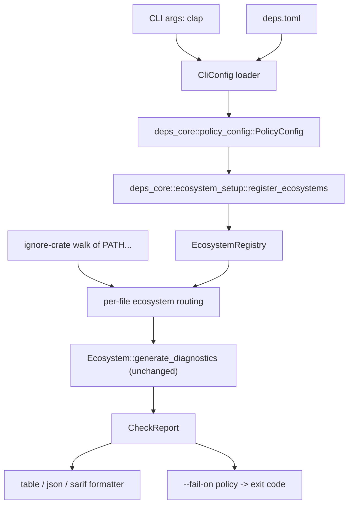

---
aliases:
  - CLI Check Mode Plan
  - deps-cli Plan
tags:
  - sdd
  - plan
  - cli
  - ci
created: 2026-09-14
status: draft
related:
  - "[[spec]]"
  - "[[constitution]]"
---

# Technical Plan: CLI Check Mode (`deps-cli check`)

> [!info] References
> **Spec**: [[spec]]

## 1. Architecture

### Approach

Two sequenced changes, not one:

1. **Extraction refactor (no user-visible behavior change).** Move the
   policy-relevant sections of `deps-lsp::config::DepsConfig` — `diagnostics`
   severities, `cache`, `network`, `freshness`, `supply_chain`, `registries`,
   `license_policy` — into a new `deps-core` module (`deps_core::policy_config`),
   plus `register_ecosystems`/`EcosystemRuntime` (`crates/deps-lsp/src/lib.rs`),
   which already take only `deps-core` types (`EcosystemRegistry`, `HttpCache`)
   and have no `tower-lsp-server` dependency despite currently living in
   `deps-lsp`. `deps-lsp::config::DepsConfig` keeps its editor-only sections
   (`inlay_hints`, `loading_indicator`, `code_lens`) and composes
   `deps_core::policy_config::PolicyConfig` for the rest via `#[serde(flatten)]`
   or an explicit nested field (decided in §3), preserving the exact same JSON
   shape LSP clients already send — this is the refactor's one hard constraint.
2. **New `deps-cli` crate.** A thin binary that parses CLI flags, loads
   `deps.toml` through `deps_core::policy_config` (the same validating,
   `deny_unknown_fields` path the LSP uses), calls the now-relocated
   `deps_core::ecosystem_setup::register_ecosystems` to build an
   `EcosystemRegistry` exactly as `deps-lsp` does, walks the target path with
   the `ignore` crate (respecting `.gitignore`), and for every manifest
   `EcosystemRegistry` routes to, calls that ecosystem's
   `Ecosystem::generate_diagnostics` — the identical call the LSP's
   `handlers/diagnostics.rs` makes. Results become one `CheckReport`, rendered
   as `table`/`json`/`sarif`, and mapped to an exit code via `--fail-on`.

This keeps `deps-cli` from forking a second parse/diagnostics implementation
(constitution principle 1) while avoiding a `deps-cli → deps-lsp` crate
dependency (which would pull in `tower-lsp-server` and the whole LSP transport
stack for no reason).

### Component Diagram



### Key Design Decisions

| Decision | Choice | Rationale | Alternatives Considered |
|----------|--------|-----------|--------------------------|
| Policy-config location | New `deps_core::policy_config` module | Constitution principle 1; both `deps-lsp` and `deps-cli` compose it | Duplicate the struct in `deps-cli` (rejected: DRY violation); `deps-cli` depends on `deps-lsp` (rejected: pulls in `tower-lsp-server`) |
| Ecosystem registration location | Move `register_ecosystems`/`EcosystemRuntime` to `deps_core::ecosystem_setup` | Already LSP-decoupled in practice; avoids a second hand-written registration list drifting from `deps-lsp`'s | Keep in `deps-lsp` and have `deps-cli` depend on it as a library (rejected: same transport-dependency problem as above) |
| Directory walk | `ignore` 0.4.33 (new workspace dependency) | Battle-tested `.gitignore` semantics (same crate `ripgrep` uses); avoids reimplementing gitignore precedence/negation rules | Hand-rolled walker on `fs_probe` (rejected per user decision — correctness risk for negated/nested `.gitignore` rules) |
| CLI argument parsing | `clap` 4.6 (derive API, new workspace dependency) | The flag surface (`PATH...`, `--format`, `--fail-on` multi-value, `--offline`, `--cooldown`, `--config`) is materially richer than `deps-lsp/src/main.rs`'s three hand-rolled flags; `clap derive` keeps validation (enum-valued `--format`) declarative instead of hand-rolled matching | Hand-rolled parsing matching `main.rs`'s existing style (rejected: `--fail-on`'s comma-separated multi-value enum and `--format`'s validated enum would need to reimplement what `clap`'s `ValueEnum` derive already gives for free; flagged as an "Ask First" dependency addition per spec §8 — confirm before implementing) |
| SARIF serialization | `serde-sarif` 0.8.0 (new workspace dependency) | Matches the version the source issue already scoped; typed SARIF 2.1.0 struct model avoids hand-rolling the schema | Hand-rolled `serde_json::json!` SARIF construction (rejected: schema drift risk, no compile-time field checking) |
| TOML parsing for `deps.toml` | `toml_span` (already a workspace dependency, used by `deps-cargo`/`deps-lsp`) | Existing project convention — no second TOML parser | The `toml` crate (rejected: not used anywhere else in this workspace) |
| `deps-cli`'s publish status | Published from first release (constitution principle 8 applies day one) | User decision; keeps a single compatibility policy across all 17 crates | Ship unpublished until stabilized (rejected — see spec §9) |

## 2. Project Structure

```
crates/
├── deps-core/
│   └── src/
│       ├── policy_config.rs        (NEW — PolicyConfig + section types, moved from deps-lsp::config)
│       └── ecosystem_setup.rs      (NEW — register_ecosystems + EcosystemRuntime, moved from deps-lsp)
├── deps-lsp/
│   └── src/
│       ├── config.rs               (MODIFIED — keeps inlay_hints/loading_indicator/code_lens;
│       │                             composes deps_core::policy_config::PolicyConfig for the rest)
│       └── lib.rs                  (MODIFIED — register_ecosystems/EcosystemRuntime become
│                                     thin re-exports of deps_core::ecosystem_setup, or are removed
│                                     in favor of direct deps_core:: calls at call sites)
└── deps-cli/                       (NEW crate)
    ├── Cargo.toml
    ├── .pre-commit-hooks.yaml      (NEW — shipped from crate root per pre-commit's convention)
    └── src/
        ├── main.rs                 (entry point; clap parsing, dispatch to `check`)
        ├── cli.rs                  (clap derive: `Cli`, `Format`, `FailOnCategory`)
        ├── config.rs               (`CliConfig`: loads deps.toml via toml_span + composes
        │                            deps_core::policy_config::PolicyConfig; flag overrides)
        ├── walk.rs                 (ignore-crate walk -> Vec<PathBuf>, routed through
        │                            EcosystemRegistry's existing manifest_* matchers)
        ├── report.rs               (CheckReport, CheckFinding, Category, FailOnPolicy;
        │                            builds a CheckReport from generate_diagnostics output)
        ├── exit.rs                 (exit-code mapping: 0 clean / 1 policy violation / 2 error)
        └── format/
            ├── mod.rs
            ├── table.rs
            ├── json.rs             (versioned JSON schema, see §4)
            └── sarif.rs            (serde-sarif-backed SARIF 2.1.0 writer)
└── github-action/                  (NEW, repo-root-level, not a crate — composite action wrapper)
    └── action.yml
```

## 3. Data Model

```rust
// crates/deps-core/src/policy_config.rs (illustrative — exact field list matches
// today's DepsConfig sections verbatim; this is a relocation, not a redesign)
#[non_exhaustive]
#[derive(Debug, Clone, Deserialize, Default)]
pub struct PolicyConfig {
    #[serde(default)]
    pub diagnostics: DiagnosticsConfig,
    #[serde(default)]
    pub cache: CacheConfig,
    #[serde(default)]
    pub freshness: FreshnessConfig,
    #[serde(default)]
    pub supply_chain: SupplyChainConfig,
    #[serde(default)]
    pub registries: RegistriesConfig,
    #[serde(default)]
    pub network: NetworkConfig,
    #[serde(default)]
    pub license_policy: LicensePolicyConfig,
}

// crates/deps-lsp/src/config.rs (after refactor)
#[non_exhaustive]
#[derive(Debug, Deserialize, Default)]
#[serde(deny_unknown_fields)]
pub struct DepsConfig {
    #[serde(default)]
    pub inlay_hints: InlayHintsConfig,
    #[serde(default)]
    pub code_lens: CodeLensConfig,
    #[serde(default)]
    pub loading_indicator: LoadingIndicatorConfig,
    #[serde(flatten)]
    pub policy: deps_core::policy_config::PolicyConfig,
}

// crates/deps-cli/src/config.rs
#[non_exhaustive]
#[derive(Debug, Deserialize, Default)]
#[serde(deny_unknown_fields)]
pub struct CliConfig {
    #[serde(flatten)]
    pub policy: deps_core::policy_config::PolicyConfig,
}

// crates/deps-cli/src/report.rs
pub struct CheckReport {
    pub findings: Vec<CheckFinding>,
    pub summary: BTreeMap<Category, usize>,
}

pub struct CheckFinding {
    pub ecosystem: EcosystemId,
    pub manifest_path: PathBuf,
    pub dependency_name: String,
    pub requirement: Option<String>,
    pub category: Category,
    pub severity: DiagnosticSeverity,
    pub range: Range,   // reuses tower_lsp_server::ls_types::Range's line/column shape
    pub message: String,
}

#[derive(Clone, Copy, PartialEq, Eq, PartialOrd, Ord)]
pub enum Category {
    Outdated,
    Yanked,
    Vulnerable,
    Unsatisfiable,
    MutableRefPin,
    License,
    Deprecated,
}
```

**Verification required before implementation**: `#[serde(flatten)]` interacting
with `DepsConfig`'s top-level `deny_unknown_fields` must be checked directly —
`serde`'s `flatten` + `deny_unknown_fields` combination is a known historical
footgun (an unrecognized key inside the flattened struct can either be silently
accepted or rejected depending on serde version/derive details). If flattening
does not preserve today's exact rejection behavior, use an explicit nested
`policy: PolicyConfig` field instead of `flatten` and confirm the wire JSON
shape LSP clients send does not need to change (issue: today's config is flat
at the top level — `{"cache": {...}, "network": {...}}` — introducing a nested
`policy` key would be a breaking wire-format change and must not happen; this
is why `flatten` is the first choice, not the nested field).

### Migrations

None — no persistent storage. `deps.toml`/`initializationOptions` schemas
change in physical Rust location only, not in accepted JSON/TOML shape (must be
verified per the note above).

## 4. API Design

Not a network API — the CLI surface and JSON output schema:

| Flag | Type | Description |
|------|------|-------------|
| `PATH...` | positional, 0+ | Paths to walk; defaults to `.` |
| `--format <table\|json\|sarif>` | enum, default `table` | Output format |
| `--fail-on <cat>[,<cat>...]` | comma-separated enum list | Categories that produce exit 1; default `vulnerable,yanked,unsatisfiable` |
| `--offline` | flag | Serve only already-cached data, never make a new request |
| `--cooldown <duration>` | e.g. `3d` | Overrides `freshness.cooldown_secs` for this run |
| `--config <path>` | path, default `./deps.toml` if present | Explicit config file path |

`json` output schema (versioned so downstream tooling can detect a future
breaking change per constitution principle 8):

```json
{
  "schema_version": 1,
  "findings": [
    {
      "ecosystem": "cargo",
      "manifest_path": "Cargo.toml",
      "dependency_name": "tokio",
      "requirement": "1.0",
      "category": "outdated",
      "severity": "hint",
      "range": { "start": { "line": 12, "character": 4 }, "end": { "line": 12, "character": 20 } },
      "message": "..."
    }
  ],
  "summary": { "outdated": 1, "vulnerable": 0 }
}
```

`sarif` output: standard SARIF 2.1.0 `sarifLog` with one `run`, `tool.driver.name
= "deps-cli"`, `tool.driver.rules` populated from the distinct diagnostic codes
present, and one `result` per `CheckFinding`.

## 5. Integration Points

| System | Direction | Protocol | Notes |
|--------|-----------|----------|-------|
| Package registries (crates.io, npm, PyPI, ...) | outbound | HTTPS (existing `HttpCache`) | Unchanged — same clients the LSP uses |
| OSV.dev / deps.dev | outbound | HTTPS (existing clients) | Unchanged |
| GitHub API | outbound | HTTPS | `GITHUB_TOKEN` env var read exactly as `deps-lsp` already does (FR-019) |
| GitHub code scanning | outbound (consumer's own workflow) | `github/codeql-action/upload-sarif` | `deps-cli` only produces the SARIF file; uploading is the consumer's action step, not bundled |
| pre-commit framework | inbound (invocation) | `language: rust` hook, `.pre-commit-hooks.yaml` | Installs from source, runs `deps-cli check` on staged files pre-commit passes |

## 6. Security

- **Input validation**: `deps.toml` goes through `deny_unknown_fields`-enforced
  `toml_span` deserialization (FR-014/FR-016) — malformed or unrecognized
  config is a hard error (exit 2), not a silent default, since a CLI run has no
  prior known-good configuration to fall back to (unlike the LSP's live-reload
  path).
- **Filesystem**: directory walk and every file read go through `fs_probe`'s
  existing capped, TOCTOU-safe read path (NFR-002); the `ignore` crate only
  supplies path discovery, never performs the actual file read.
- **Secrets**: `GITHUB_TOKEN` (and any future credential) is never echoed into
  `table`/`json`/`sarif` output; `RegistriesConfig`'s existing `Debug`
  redaction (via `RedactedUrl`) is preserved unchanged by the relocation to
  `deps-core`.
- **SSRF**: workspace-declared registry host classification (`net_policy`)
  applies identically to CLI-triggered fetches — no CLI-specific bypass.

## 7. Testing Strategy

| Level | Framework | What to Test | Coverage Target |
|-------|-----------|---------------|------------------|
| Unit | `cargo nextest` | `CliConfig` parsing (valid, unknown-field rejection, flag-override precedence), `--fail-on` category matching, exit-code mapping | All FR-009 through FR-016 branches |
| Unit | `cargo nextest` + `insta` | `table`/`json` formatter output snapshots | One snapshot per category combination |
| Contract | manual + CI | `sarif` output validated against the SARIF 2.1.0 JSON schema | Every emitted document in CI (SC-002) |
| Integration | `mockito` + fixture manifests | End-to-end `check` run against a fixture repo with at least one manifest per ecosystem, mocked registries | Cross-ecosystem parity (one fixture set reused from `.local/testing/regressions.md` where possible) |
| Cross-tool parity | manual live test (per `.claude/rules/continuous-improvement.md`) | Same manifest+lockfile pair produces identical verdicts through `deps-cli check --format json` and the LSP's `textDocument/diagnostic` | SC-001 |
| Network-isolation | integration test with network disabled (e.g. a mock `HttpCache` that panics on a new request) | `--offline` issues zero outbound requests | SC-004 |
| Doctest | `cargo test --workspace --doc --all-features` | Every new `pub` item's `# Examples` | Per project convention |

## 8. Performance Considerations

- Expected load: CI runs against monorepos with up to a few hundred manifests
  (NFR-004) — no new load profile beyond what `deps-lsp`'s own multi-document
  fetch path already handles.
- Bottleneck: registry round-trips, not the directory walk itself — `check`
  must reuse `CacheConfig::max_concurrent_fetches` as its own concurrency
  ceiling (`futures::stream::buffer_unordered`, mirroring
  `deps-lsp/src/document/fetch.rs`'s existing pattern) rather than introducing
  a second, uncapped concurrency knob.
- No new caching layer in this spec (disk-persistent cache is `#700`'s scope);
  `HttpCache` is constructed fresh per `deps-cli` process invocation.

## 9. Rollout Plan

Three sequenced PRs, matching this project's existing small-PR convention:

1. **PR 1 — internal refactor, zero behavior change**: extract
   `deps_core::policy_config` and `deps_core::ecosystem_setup`; `deps-lsp`
   composes/re-exports them. Full existing `deps-lsp` test suite must pass
   unchanged; a config-shape regression test (parse a real-world
   `initializationOptions` fixture before/after the refactor, assert identical
   `DepsConfig`) gates this PR specifically.
2. **PR 2 — `deps-cli` crate, `table`/`json` formats only**: new crate,
   `check` subcommand, `--fail-on`, `--offline`, exit codes, `deps.toml`
   loading. No SARIF, no pre-commit hook, no GitHub Action yet — keeps the PR
   reviewable.
3. **PR 3 — SARIF + pre-commit + GitHub Action wrapper**: `--format sarif`,
   `.pre-commit-hooks.yaml`, `action.yml`. Depends on PR 2's `CheckReport`
   model being stable.

Each PR updates `CHANGELOG.md`'s `[Unreleased]` section per project convention;
PR 2 is the one that needs a "Breaking"-labeled entry only if it changes any
already-published crate's public API (it should not — `deps-cli` is new).

## 10. Constitution Compliance

| Principle | Status | Notes |
|-----------|--------|-------|
| 1. One fix, one place | Compliant | `policy_config`/`ecosystem_setup` extraction is the concrete mechanism; `deps-cli` calls the same `generate_diagnostics` the LSP does |
| 2. Exhaustive `EcosystemId` matches | Compliant | `deps-cli`'s `Category`/output formatters do not branch on `EcosystemId` themselves — they consume whatever `generate_diagnostics` already produced |
| 3. Non-blocking LSP surface | N/A | `deps-cli` is not the LSP process; its own concurrency is bounded per NFR-004/§8, not "non-blocking" in the LSP-handler sense |
| 4. No hand-rolled version comparison | Compliant | No new version-comparison logic introduced |
| 5. Verify live, not just in CI | Compliant | SC-001's cross-tool parity check is a live-verification requirement, not just unit tests |
| 6. Secrets never touch plaintext | Compliant | §6 — no new secret-handling path; reuses `Redacted`/`RedactedUrl` |
| 8. Post-1.0 breaking-change policy | Compliant | `deps-cli` publishes under the same contract from day one (spec §9); PR 1's config relocation must not change `deps-lsp`'s accepted wire format — verified via `cargo-semver-checks` and the config-shape regression test in §9 |

## 11. Risks and Mitigations

| Risk | Impact | Probability | Mitigation |
|------|--------|-------------|------------|
| `#[serde(flatten)] + deny_unknown_fields` does not reject unknown keys the way today's flat `DepsConfig` does | High (silent config-validation regression for existing LSP users) | Medium | Verify empirically before merging PR 1 (see §3's note); fall back to explicit field + manual re-flattening in a custom `Deserialize` impl if `flatten` doesn't preserve rejection behavior |
| `cargo-semver-checks` flags PR 1 as breaking even though the wire format is unchanged | Medium | Medium | Run the gate locally before opening PR 1; if it flags a Rust-level (not wire-level) break in `deps-lsp`'s public `config` module (e.g. a moved public type path), treat that as a real breaking change per principle 8 and version/document it accordingly rather than suppressing the check |
| `ignore` crate's walk semantics differ subtly from what a real `.gitignore`-authoring team expects (e.g. `.git/info/exclude`, global gitignore) | Low-medium | Low | Document in `deps-cli`'s README which ignore sources are honored; not a spec blocker since `ignore`'s defaults already match `git`'s own precedence closely |
| Scope creep: CLI flag surface grows beyond spec during implementation | Medium | Medium | PR 2 stays scoped to exactly FR-001 through FR-017; anything else becomes a follow-up issue, not an in-PR addition |
| `deps-cli` binary size/build time regresses CI due to `clap` + `ignore` + `serde-sarif` | Low | Low | These are common, well-optimized crates already widely used in the Rust CLI ecosystem; monitor CI build-time job after PR 2 lands |

## See Also

- [[spec]] — feature specification
- [[tasks]] — implementation tasks (next phase)
- [[MOC-specs]] — all specifications
- `crates/deps-lsp/src/config.rs`, `crates/deps-lsp/src/lib.rs` — code this plan relocates from
- `crates/deps-core/src/ecosystem_registry.rs` — `EcosystemRegistry`, reused unchanged
