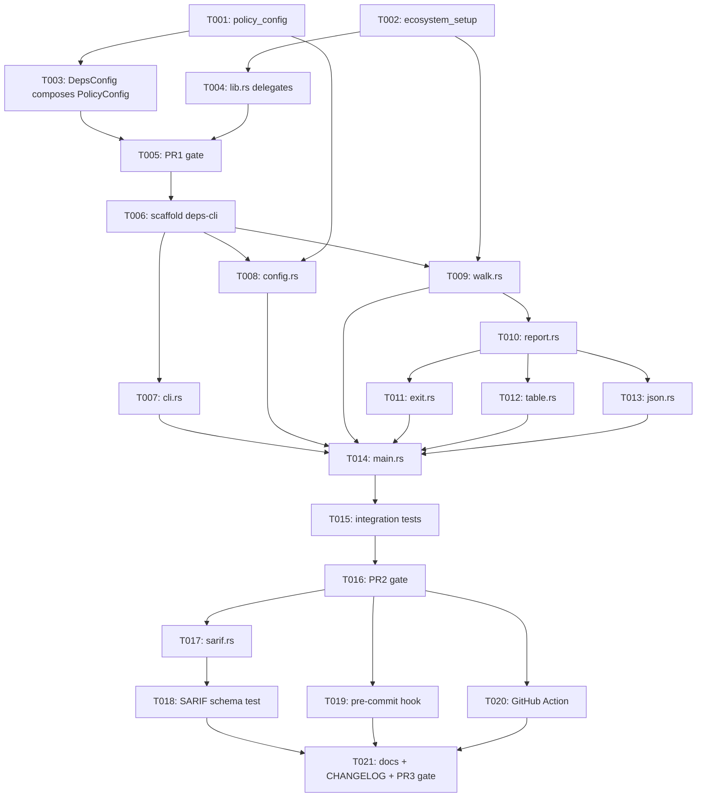

---
aliases:
  - CLI Check Mode Tasks
  - deps-cli Tasks
tags:
  - sdd
  - tasks
  - cli
  - ci
created: 2026-09-14
status: draft
related:
  - "[[spec]]"
  - "[[plan]]"
---

# Implementation Tasks: CLI Check Mode (`deps-cli check`)

> [!info] References
> **Spec**: [[spec]]
> **Plan**: [[plan]]
> **Issue**: #711
> **Total tasks**: 21 (across 3 PRs — see [[plan#9-rollout-plan]])

## Progress

- [ ] T001: Extract `deps_core::policy_config` (PR 1)
- [ ] T002: Extract `deps_core::ecosystem_setup` (PR 1)
- [ ] T003: `deps-lsp::config::DepsConfig` composes `PolicyConfig`
- [ ] T004: `deps-lsp::lib.rs` delegates to `deps_core::ecosystem_setup`
- [ ] T005: PR 1 verification gate (semver, config-shape regression, full CI)
- [ ] T006: Scaffold `deps-cli` crate
- [ ] T007: `cli.rs` — clap argument surface
- [ ] T008: `config.rs` — `CliConfig` + `deps.toml` loading
- [ ] T009: `walk.rs` — `.gitignore`-aware directory walk + ecosystem routing
- [ ] T010: `report.rs` — `CheckReport`/`CheckFinding`/`Category`/`FailOnPolicy`
- [ ] T011: `exit.rs` — exit-code mapping
- [ ] T012: `format/table.rs`
- [ ] T013: `format/json.rs`
- [ ] T014: `main.rs` — wire `check` subcommand end to end
- [ ] T015: Integration + cross-tool-parity tests for PR 2
- [ ] T016: PR 2 verification gate
- [ ] T017: `format/sarif.rs`
- [ ] T018: SARIF schema validation test
- [ ] T019: `.pre-commit-hooks.yaml`
- [ ] T020: GitHub Action composite wrapper
- [ ] T021: Docs + CHANGELOG + PR 3 verification gate

---

## Dependency Graph

---

## PR 1 — Internal refactor (zero user-visible behavior change)

### T001: Extract `deps_core::policy_config`

**Context**: `deps-lsp::config::DepsConfig` currently mixes editor-only
sections with policy-relevant ones the CLI also needs. Per constitution
principle 1 and the spec's resolved Open Question on config code-sharing, the
policy-relevant sections move into `deps-core` so both `deps-lsp` and
`deps-cli` compose the same type instead of each parsing its own copy.
**Spec reference**: [[spec#9-open-questions]] (Config code-sharing — RESOLVED)
**Acceptance criteria**:
- [ ] New `crates/deps-core/src/policy_config.rs` module defines `PolicyConfig`
      and re-homes `DiagnosticsConfig`, `CacheConfig`, `FreshnessConfig`,
      `SupplyChainConfig`, `RegistriesConfig` (+ `WorkspaceRegistriesSetting`),
      `NetworkConfig`, `LicensePolicyConfig` verbatim (field names, defaults,
      custom deserializers, doc comments, and existing doc-tests all preserved)
- [ ] `deps-core/src/lib.rs` declares `pub mod policy_config;`
- [ ] `deps-lsp/src/config.rs` no longer defines these types itself
- [ ] `cargo doc --workspace --no-deps --all-features` (with
      `RUSTFLAGS="-D warnings" RUSTDOCFLAGS="-D warnings"`) passes for the
      moved module
- [ ] `cargo test --workspace --doc --all-features` passes (moved doc-tests
      still compile and run from their new location)
**Dependencies**: none
**Files**: `crates/deps-core/src/policy_config.rs` (new), `crates/deps-core/src/lib.rs`, `crates/deps-lsp/src/config.rs`
**Complexity**: medium

---

### T002: Extract `deps_core::ecosystem_setup`

**Context**: `register_ecosystems`/`EcosystemRuntime` (`crates/deps-lsp/src/lib.rs`)
already take only `deps-core` types (`EcosystemRegistry`, `HttpCache`) and have
no `tower-lsp-server` dependency. Relocating them lets `deps-cli` build an
identical `EcosystemRegistry` without depending on `deps-lsp`.
**Spec reference**: [[plan#1-architecture]] (Ecosystem registration location decision)
**Acceptance criteria**:
- [ ] New `crates/deps-core/src/ecosystem_setup.rs` defines `EcosystemRuntime`
      and `register_ecosystems` with identical signatures and per-ecosystem
      `#[cfg(feature = "...")]` gating as today's `deps-lsp` version
- [ ] Every ecosystem crate's optional dependency + matching Cargo feature
      already declared in `deps-core`'s own `Cargo.toml` (add any missing
      optional deps/features there — `deps-core` currently may not declare
      per-ecosystem features; this task must reconcile that before the move
      compiles)
- [ ] `deps-core/src/lib.rs` declares `pub mod ecosystem_setup;`
- [ ] `cargo check -p deps-core --all-features` passes
**Dependencies**: none
**Files**: `crates/deps-core/src/ecosystem_setup.rs` (new), `crates/deps-core/Cargo.toml`, `crates/deps-core/src/lib.rs`
**Complexity**: high (feature-flag reconciliation across the workspace is the risky part — `deps-core` today has no per-ecosystem optional-dependency features; this task defines them)

---

### T003: `deps-lsp::config::DepsConfig` composes `PolicyConfig`

**Context**: `DepsConfig` must keep accepting the exact same
`initializationOptions` JSON shape existing LSP clients already send —
this task is where the `#[serde(flatten)]` vs. nested-field risk from
[[plan#3-data-model]] gets resolved empirically.
**Spec reference**: [[spec#FR-014]], [[plan#3-data-model]]
**Acceptance criteria**:
- [ ] `DepsConfig` keeps `inlay_hints`, `loading_indicator`, `code_lens` as its
      own fields and adds the policy sections via `deps_core::policy_config::PolicyConfig`
      (flattened or nested — whichever preserves current behavior, see next criterion)
- [ ] A new regression test feeds a real-world `initializationOptions` JSON
      fixture (captured from an existing test or hand-built covering every
      section) through `DepsConfig`'s `Deserialize` both before this task's
      change (baseline, from git history/CI) and after, asserting byte-for-byte
      identical parsed values
- [ ] A second regression test asserts an unknown top-level key is still
      rejected (today's `deny_unknown_fields` behavior) — this is the specific
      case that could regress silently if `flatten` doesn't propagate rejection
- [ ] All existing `deps-lsp` config tests pass unchanged
- [ ] `cargo clippy --workspace --all-targets --all-features -- -D warnings` passes
**Dependencies**: T001
**Files**: `crates/deps-lsp/src/config.rs`, new test file/module for the regression tests
**Complexity**: medium

---

### T004: `deps-lsp::lib.rs` delegates to `deps_core::ecosystem_setup`

**Context**: Once `register_ecosystems`/`EcosystemRuntime` live in `deps-core`,
`deps-lsp` must not keep a second, drifting copy.
**Spec reference**: [[plan#1-architecture]]
**Acceptance criteria**:
- [ ] `crates/deps-lsp/src/lib.rs` re-exports `deps_core::ecosystem_setup::{register_ecosystems, EcosystemRuntime}`
      (`pub use`) rather than defining them itself
- [ ] Every internal call site in `deps-lsp` (`server.rs`, tests) compiles
      unchanged against the re-export
- [ ] `deps-lsp`'s public API surface (`pub use deps_lsp::{register_ecosystems, EcosystemRuntime, ...}`)
      is unchanged from a downstream consumer's point of view
- [ ] `cargo build --workspace` and `cargo nextest run -p deps-lsp --all-features` pass
**Dependencies**: T002
**Files**: `crates/deps-lsp/src/lib.rs`
**Complexity**: low

---

### T005: PR 1 verification gate

**Context**: This PR must be provably behavior-neutral before `deps-cli` is
built on top of it (plan §9, risk table).
**Spec reference**: [[plan#10-constitution-compliance]], [[plan#11-risks-and-mitigations]]
**Acceptance criteria**:
- [ ] `RUSTDOCFLAGS="--deny rustdoc::broken_intra_doc_links" cargo doc --no-deps --workspace` (or the project's stricter documented variant) passes
- [ ] `cargo +nightly fmt --all -- --check` passes
- [ ] `cargo clippy --workspace --all-targets --all-features -- -D warnings` passes
- [ ] `cargo nextest run --workspace --all-features --no-fail-fast` passes with the same pass count as before this PR (no test silently dropped by the move)
- [ ] `cargo-semver-checks` run against `deps-lsp` and `deps-core` — any flagged break is either fixed or, if it is a genuine Rust-level API move (not a wire-format change), documented as a "Breaking" `CHANGELOG.md` entry per constitution principle 8
- [ ] `CHANGELOG.md` `[Unreleased]` gets a one-line entry for the internal move (even though it is not user-visible, per this project's "every implementation phase" changelog rule)
**Dependencies**: T003, T004
**Files**: `CHANGELOG.md`
**Complexity**: medium

---

## PR 2 — `deps-cli` core (`table`/`json` formats)

### T006: Scaffold `deps-cli` crate

**Context**: First commit of the new, 17th published crate.
**Spec reference**: [[spec#9-open-questions]] (Crate publishing — RESOLVED)
**Acceptance criteria**:
- [ ] `crates/deps-cli/Cargo.toml` created: `publish = true`, `version.workspace = true` (etc., mirroring `deps-lsp/Cargo.toml`'s package-metadata shape), `author` set from `gh auth status` per global `CLAUDE.md`
- [ ] Root `Cargo.toml`'s `[workspace.dependencies]` gains `deps-cli = { version = "1.0.0", path = "crates/deps-cli" }` in alphabetical position, plus new external deps `clap = "4.6"` (`derive` feature enabled at the crate level, not the workspace-dependency line, matching this project's "no features in workspace.dependencies" convention) and `ignore = "0.4"`, alphabetically sorted with the rest
- [ ] `deps-cli` depends on `deps-core` (workspace), `clap`, `ignore`, `toml-span`, `serde`, `serde_json`, `tokio` (matching the async registry-fetch pattern `deps-lsp` already uses), `tracing`/`tracing-subscriber`
- [ ] `crates/deps-cli/src/main.rs` exists with a stub `fn main()` and the crate builds: `cargo build -p deps-cli`
- [ ] `[workspace] members` picks up the new crate automatically (root `Cargo.toml` uses the `crates/*` glob) — verify with `cargo metadata` or `cargo check --workspace`
**Dependencies**: T005
**Files**: `crates/deps-cli/Cargo.toml` (new), `crates/deps-cli/src/main.rs` (new), root `Cargo.toml`
**Complexity**: low

---

### T007: `cli.rs` — clap argument surface

**Context**: Defines the exact flag surface from [[spec#4-non-functional-requirements]]/[[plan#4-api-design]].
**Spec reference**: [[spec#FR-001]], [[spec#FR-006]], [[spec#FR-007]], [[spec#FR-008]], [[spec#FR-009]], [[spec#FR-010]], [[spec#FR-013]], [[spec#FR-014]]
**Acceptance criteria**:
- [ ] `Cli` struct (clap `derive(Parser)`) with a `check` subcommand: `PATH...` (0+ positional, default `.`), `--format <table|json|sarif>` (clap `ValueEnum`, default `table`), `--fail-on <list>` (comma-separated, parsed into `Vec<Category>`), `--offline` (flag), `--cooldown <duration>`, `--config <path>`
- [ ] Every `///` doc comment on a public item includes a `# Examples` doctest per project convention
- [ ] `deps-cli check --help` output is reviewed manually for clarity (not just that it compiles)
- [ ] Unit tests: valid `--fail-on` list parses to the right `Vec<Category>`; an unrecognized category is a clap parse error, not a silent no-op
**Dependencies**: T006
**Files**: `crates/deps-cli/src/cli.rs` (new)
**Complexity**: medium

---

### T008: `config.rs` — `CliConfig` + `deps.toml` loading

**Context**: Loads the shared `PolicyConfig` from a TOML file, with the same
fail-closed contract the LSP's `initializationOptions` parsing has, adapted
for a CLI run's lack of a "previous known-good configuration" (spec FR-016).
**Spec reference**: [[spec#FR-014]], [[spec#FR-015]], [[spec#FR-016]]
**Acceptance criteria**:
- [ ] `CliConfig` struct (`#[serde(deny_unknown_fields)]`) wraps/flattens `deps_core::policy_config::PolicyConfig`, parsed via `toml_span` from `deps.toml` (or `--config` path)
- [ ] Missing `deps.toml` is not an error — `CliConfig::default()` is used
- [ ] Malformed/unknown-key `deps.toml` prints the parse error to stderr and the caller (T014) exits 2 — this function itself returns a `Result`, does not call `std::process::exit` directly (testability)
- [ ] CLI flags (`--offline`, `--cooldown`, `--fail-on`) override the loaded file's corresponding value for the run (FR-015) — implemented as a small merge step, not by re-parsing
- [ ] Unit tests: valid file, missing file (defaults), malformed TOML (error), unknown key (error), flag-overrides-file precedence
**Dependencies**: T001, T006
**Files**: `crates/deps-cli/src/config.rs` (new)
**Complexity**: medium

---

### T009: `walk.rs` — `.gitignore`-aware directory walk + ecosystem routing

**Context**: Discovery step feeding manifests into the diagnostics pipeline.
**Spec reference**: [[spec#FR-001]], [[spec#FR-002]], [[spec#FR-003]], [[spec#FR-004]]
**Acceptance criteria**:
- [ ] Walks each given `PATH` with the `ignore` crate (respects `.gitignore`, `.git/info/exclude`, global gitignore — `ignore`'s defaults)
- [ ] Every discovered path is routed through the `EcosystemRegistry` built by `deps_core::ecosystem_setup::register_ecosystems` (T002), using its existing `manifest_filenames()`/`manifest_patterns()`/`manifest_extensions()`/`manifest_directory_patterns()` resolution unchanged
- [ ] Every file read (once a manifest is identified) goes through `deps_core::fs_probe::read_to_string_capped` — no new unbounded read path introduced (NFR-002)
- [ ] Total file count is capped consistent with existing `fs_probe`/`MAX_CONFIG_ANCESTOR_DEPTH`-style bounds; exceeding the cap logs a warning and truncates rather than hanging or OOMing
- [ ] Unit/integration tests: empty directory (zero manifests, not an error), a fixture tree with one manifest per ecosystem all discovered, a `.gitignore`'d manifest correctly skipped
**Dependencies**: T002, T006
**Files**: `crates/deps-cli/src/walk.rs` (new)
**Complexity**: high

---

### T010: `report.rs` — `CheckReport`/`CheckFinding`/`Category`/`FailOnPolicy`

**Context**: The shared in-memory model every output formatter and the
exit-code logic both consume, built directly from `Ecosystem::generate_diagnostics` — the identical call the LSP makes.
**Spec reference**: [[spec#5-data-model]], [[spec#FR-005]]
**Acceptance criteria**:
- [ ] `CheckFinding` is built from each ecosystem's `generate_diagnostics` output with no re-derivation of verdicts — this task must not reimplement any outdated/yanked/vulnerable/etc. classification logic
- [ ] `Category` enum covers exactly `outdated`, `yanked`, `vulnerable`, `unsatisfiable`, `mutable-ref`, `license`, `deprecated` (FR-009's list)
- [ ] `FailOnPolicy::matches(&self, findings: &[CheckFinding]) -> bool` is a pure function, unit-tested against every category combination named in FR-009/FR-010
- [ ] `CheckReport::summary` is a per-category count derived from `findings`, not maintained as separate mutable state
- [ ] A cross-ecosystem regression test asserts the CLI's `CheckFinding` for a known fixture (e.g. an existing `.local/testing/regressions.md` manifest, or a new equivalent fixture under `crates/deps-cli/tests/fixtures/`) matches the LSP's own diagnostic output for the same manifest byte-for-byte on the fields both sides share (SC-001's first, non-live check — the full live cross-tool parity check is T015)
**Dependencies**: T009
**Files**: `crates/deps-cli/src/report.rs` (new)
**Complexity**: medium

---

### T011: `exit.rs` — exit-code mapping

**Context**: CI-gating contract (spec FR-011/FR-012).
**Spec reference**: [[spec#FR-011]], [[spec#FR-012]]
**Acceptance criteria**:
- [ ] Pure function `exit_code(report: &CheckReport, policy: &FailOnPolicy, had_registry_error: bool) -> i32` returns 0 (clean), 1 (policy violation), or 2 (execution error) per FR-011/FR-012 — registry-unreachable takes precedence over a clean policy result
- [ ] Unit tests for all three branches, including the precedence case (both a registry error and a policy violation present)
**Dependencies**: T010
**Files**: `crates/deps-cli/src/exit.rs` (new)
**Complexity**: low

---

### T012: `format/table.rs`

**Spec reference**: [[spec#FR-006]]
**Context**: Default, human-facing output.
**Acceptance criteria**:
- [ ] Renders a `CheckReport` as a table grouped by file, then severity
- [ ] `insta` snapshot test covering: no findings, one finding, findings across multiple categories/files
**Dependencies**: T010
**Files**: `crates/deps-cli/src/format/table.rs` (new), `crates/deps-cli/src/format/mod.rs` (new)
**Complexity**: low

---

### T013: `format/json.rs`

**Spec reference**: [[spec#FR-007]], [[plan#4-api-design]]
**Context**: Machine-facing output with the versioned schema from the plan.
**Acceptance criteria**:
- [ ] Emits the `schema_version: 1` document shape from [[plan#4-api-design]] exactly (field names, nesting)
- [ ] `insta` snapshot test(s) covering the same cases as T012
- [ ] A doc-test or unit test round-trips the JSON back through `serde_json::from_str` into a matching internal shape, guarding against an accidental future field-name typo
**Dependencies**: T010
**Files**: `crates/deps-cli/src/format/json.rs` (new)
**Complexity**: low

---

### T014: `main.rs` — wire `check` subcommand end to end

**Context**: Integration point for T007–T013.
**Spec reference**: [[spec#3-functional-requirements]] (FR-001 through FR-016 collectively)
**Acceptance criteria**:
- [ ] `main()` parses `Cli` (T007), loads `CliConfig` (T008) — a config-load error prints to stderr and exits 2 without panicking
- [ ] Builds `EcosystemRegistry` via `deps_core::ecosystem_setup::register_ecosystems` (same call `deps-lsp` makes) using an `HttpCache` respecting `CliConfig`'s `cache`/`network` sections
- [ ] Runs the walk (T009), builds the report (T010), applies `--fail-on` (T011), prints via the selected formatter (T012/T013), calls `std::process::exit` with the mapped code
- [ ] `--offline`: verified to issue zero new outbound requests (this is where NFR-004/FR-013's contract is actually enforced end-to-end, not just unit-tested in isolation)
- [ ] Concurrency uses `futures::stream::buffer_unordered` bounded by `CliConfig`'s `cache.max_concurrent_fetches`, mirroring `deps-lsp/src/document/fetch.rs`'s existing pattern (plan §8) — not a second, uncapped concurrency path
- [ ] Manual smoke test: run `deps-cli check` against this repository's own `crates/*/Cargo.toml` fixtures and a hand-built multi-ecosystem fixture directory; confirm sane output for both `--format table` and `--format json`
**Dependencies**: T007, T008, T009, T011, T012, T013
**Files**: `crates/deps-cli/src/main.rs`
**Complexity**: high

---

### T015: Integration + cross-tool-parity tests for PR 2

**Context**: This is where SC-001 (cross-tool parity) and SC-004 (offline
zero-requests) get their full, live-ish verification, not just the unit-level
checks embedded in earlier tasks.
**Spec reference**: [[spec#7-success-criteria]] (SC-001, SC-004), [[plan#7-testing-strategy]]
**Acceptance criteria**:
- [ ] `mockito`-backed integration test: a fixture repo with one manifest per enabled ecosystem, mocked registry responses, asserts `deps-cli check --format json` produces the expected `CheckReport` for every ecosystem
- [ ] Network-isolation test: `--offline` against a fixture with a partially-warm cache produces the "unknown (offline, no cached data)" result for the cold entry and issues no request (assert via a `Registry`/`HttpCache` test double that panics on an unexpected call, matching this project's existing mock-registry test patterns in `deps-lsp/src/test_utils.rs`)
- [ ] Live cross-tool parity check performed manually per `.claude/rules/continuous-improvement.md`'s live-testing principle: run the same manifest+lockfile through both `deps-cli check --format json` and the LSP's `textDocument/diagnostic`, confirm identical verdicts; document the result in this PR's description (not a persisted `.local/testing/` artifact, since continuous-improvement cycles own that directory's ongoing bookkeeping — this is a one-time implementation-review check)
**Dependencies**: T014
**Files**: `crates/deps-cli/tests/check_integration.rs` (new)
**Complexity**: high

---

### T016: PR 2 verification gate

**Acceptance criteria**:
- [ ] Full pre-commit check suite from `.claude/rules/branching.md` passes
- [ ] `cargo deny check` passes with the three new dependencies (`clap`, `ignore`, plus whatever `ignore` pulls transitively) — no new advisory, no license conflict, no duplicate-major-version bloat beyond what's already accepted
- [ ] `CHANGELOG.md` `[Unreleased]` gets a one-line entry: new `deps-cli check` command (table/json)
- [ ] `README.md` gets a short mention that `deps-cli` exists (full usage docs can follow in T021, but the tool's existence must not go undocumented across two PRs)
**Dependencies**: T015
**Files**: `CHANGELOG.md`, `README.md`
**Complexity**: low

---

## PR 3 — SARIF, pre-commit, GitHub Action

### T017: `format/sarif.rs`

**Spec reference**: [[spec#FR-008]], [[spec#US-002]]
**Context**: GitHub code-scanning integration output.
**Acceptance criteria**:
- [ ] Root `Cargo.toml`'s `[workspace.dependencies]` gains `serde-sarif = "0.8"` (alphabetically sorted)
- [ ] Emits a SARIF 2.1.0 `sarifLog` with `tool.driver.name = "deps-cli"`, one `run`, `tool.driver.rules` populated from the distinct diagnostic codes present in the report, one `result` per `CheckFinding` with its LSP range translated to a SARIF physical-location region
- [ ] `insta` snapshot test(s) covering the same cases as T012/T013
**Dependencies**: T016
**Files**: `crates/deps-cli/src/format/sarif.rs` (new), root `Cargo.toml`
**Complexity**: medium

---

### T018: SARIF schema validation test

**Spec reference**: [[spec#SC-002]]
**Acceptance criteria**:
- [ ] An automated test validates every SARIF fixture the snapshot tests produce against the SARIF 2.1.0 JSON schema (vendor the schema file under `crates/deps-cli/tests/fixtures/` or use a crate that embeds it — decide based on `serde-sarif`'s own validation support, checked during implementation)
- [ ] Test runs in CI (`cargo nextest run -p deps-cli`), not only as a manual step
**Dependencies**: T017
**Files**: `crates/deps-cli/tests/sarif_schema.rs` (new)
**Complexity**: medium

---

### T019: `.pre-commit-hooks.yaml`

**Spec reference**: [[spec#FR-017]], [[spec#US-003]]
**Acceptance criteria**:
- [ ] `.pre-commit-hooks.yaml` at the repository root (or `crates/deps-cli/`, per pre-commit's own convention for a hook repo — confirm during implementation which location pre-commit actually expects for a non-dedicated-hook-repo project) defines an `id: deps-lsp-check` entry, `language: rust`, `entry: deps-cli check`
- [ ] Manually verified: a local checkout of this repo with `.pre-commit-config.yaml` referencing the local path installs and runs the hook successfully
**Dependencies**: T016
**Files**: `.pre-commit-hooks.yaml` (new)
**Complexity**: low

---

### T020: GitHub Action composite wrapper

**Spec reference**: [[spec#FR-018]], [[spec#US-002]]
**Acceptance criteria**:
- [ ] `action.yml` (composite action) at the repository root or a dedicated `action/` directory: builds/installs `deps-cli`, runs `deps-cli check --format sarif`, writes the result to a file path the action outputs — does **not** itself call `upload-sarif` (FR-018: that step stays in the consumer's own workflow)
- [ ] A short example workflow snippet in the action's own README/docs showing a consumer wiring `upload-sarif` after this action
**Dependencies**: T016
**Files**: `action.yml` (new), `action/README.md` (new, if a dedicated directory is used)
**Complexity**: medium

---

### T021: Docs + CHANGELOG + PR 3 verification gate

**Acceptance criteria**:
- [ ] `crates/deps-cli/README.md` created via `/readme-generator` conventions: installation, `deps.toml` schema, full flag reference, SARIF/pre-commit/GitHub Action usage examples
- [ ] Root `README.md` updated (ecosystem/tool table or a new "CLI & CI" section) — use `/readme-generator` skill per `.claude/rules/branching.md`
- [ ] `ECOSYSTEM_GUIDE.md` updated only if this PR changed which ecosystems are covered (it does not — no update needed unless scope changed during implementation)
- [ ] `CHANGELOG.md` `[Unreleased]` gets a one-line entry: SARIF output, pre-commit hook, GitHub Action
- [ ] Full pre-commit check suite from `.claude/rules/branching.md` passes
- [ ] `specs/MOC-specs.md`'s row for spec 062 updated to `shipped` with the three PR numbers once merged
**Dependencies**: T018, T019, T020
**Files**: `crates/deps-cli/README.md` (new), `README.md`, `CHANGELOG.md`, `specs/MOC-specs.md`
**Complexity**: low

---

## Implementation Notes

### Order of execution

Strictly PR 1 → PR 2 → PR 3, as scoped in [[plan#9-rollout-plan]]. Within PR 2,
T007/T008/T009 can be implemented in parallel (no inter-dependency); T010
onward is sequential. Within PR 3, T017→T018 is sequential; T019 and T020 can
proceed in parallel once T016 (the PR 2 gate) is merged.

### Common patterns

- Reuse `deps-lsp/src/document/fetch.rs`'s `buffer_unordered` concurrency
  pattern (T014) rather than inventing a new one.
- Reuse `deps-lsp/src/test_utils.rs`'s mock `Registry`/`HttpCache` test-double
  patterns for T015's network-isolation test.
- Follow `deps-cargo`/`deps-github-actions`'s existing crate layout as the
  template for `deps-cli`'s own module organization (per this project's
  "Adding a new ecosystem" convention, adapted — `deps-cli` is a binary
  consumer, not an `Ecosystem` implementor, so it has no `ecosystem.rs`).

### Gotchas

- T003's `#[serde(flatten)] + deny_unknown_fields` risk is the single highest-
  risk step in the whole plan (see [[plan#11-risks-and-mitigations]]) — do not
  skip its regression tests even under time pressure.
- T002's feature-flag reconciliation (`deps-core` gaining per-ecosystem
  optional dependencies it didn't have before) can ripple into `cargo-machete`
  false positives, `cargo deny`'s duplicate-version checks, and the existing
  `deps-lsp`-only `test-util`-leak CI guard — re-run that guard
  (`cargo tree -p deps-lsp -e features,no-dev`) after T002, and add the
  equivalent check for `deps-cli` if it also gains a `test-util`-gated path.
- `ignore`'s default walk behavior includes hidden-file filtering; confirm a
  dotfile-named manifest (none exist among today's 14 ecosystems, but verify)
  would not be silently skipped.

## See Also

- [[spec]] — feature specification
- [[plan]] — technical plan
- [[MOC-specs]] — all specifications
