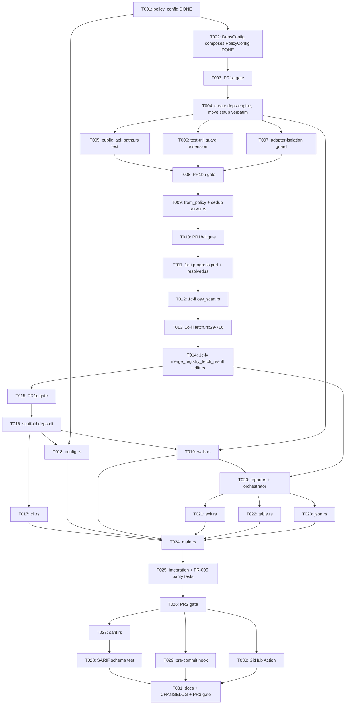

---
aliases:
  - CLI Check Mode Tasks
  - deps-cli Tasks
tags:
  - sdd
  - tasks
  - cli
  - ci
created: 2026-09-14
status: draft
related:
  - "[[spec]]"
  - "[[plan]]"
  - "[[architecture-decision]]"
---

# Implementation Tasks: CLI Check Mode (`deps-cli check`)

> [!info] References
> **Spec**: [[spec]]
> **Plan**: [[plan]]
> **Architecture decision**: [[architecture-decision]]
> **Issue**: #711
> **Total tasks**: 31 (across 3 PRs, PR 1 split into 1a/1b-i/1b-ii/1c-i..iv — see [[plan#9-rollout-plan]])

## Revision note

v1's T002 ("Extract `deps_core::ecosystem_setup`") and T004 ("`deps-lsp::lib.rs` delegates to
`deps_core::ecosystem_setup`") are **unimplementable as written** — `deps-core` cannot depend
on any `deps-<ecosystem>` crate (a hard Cargo cycle; all 14 already depend on `deps-core`).
This revision replaces them with tasks that create a new `deps-engine` crate instead, per
[[architecture-decision]]. v1's T001 and T003 (policy-config extraction) required no design
change and are marked completed below, reflecting the developer's actual implementation on
this branch. See the renumbering map at the end of this document for the old→new task ID
mapping.

---

## Progress

- [x] T001: Extract `deps_core::policy_config` (PR 1a) — **implemented**
- [x] T002: `deps-lsp::config::DepsConfig` composes `PolicyConfig` (PR 1a) — **implemented**
- [x] T003: PR 1a verification gate — **implemented**
- [ ] T004: Create `deps-engine` crate; move composition (`setup`) verbatim (PR 1b-i)
- [ ] T005: Compile-only public-API-path non-breakage test (PR 1b-i)
- [ ] T006: CI guard — extend `test-util` leak check to `deps-engine`/`deps-cli` (PR 1b-i)
- [ ] T007: CI guard — adapter-isolation check (PR 1b-i)
- [ ] T008: PR 1b-i verification gate
- [ ] T009: `EcosystemRuntime::from_policy` + de-duplicate `server.rs` wiring (PR 1b-ii)
- [ ] T010: PR 1b-ii verification gate
- [x] T011: Design `deps_engine::progress` port + move `resolved.rs` pure helpers (PR 1c-i) — **implemented**
- [x] T012: Move `osv_scan.rs` pure helpers (PR 1c-ii) — **implemented**
- [x] T013: Move `fetch.rs` pure functions (PR 1c-iii) — **implemented**
- [x] T014: Move `merge_registry_fetch_result`'s pure half + `diff.rs` helpers (PR 1c-iv) — **implemented**
- [x] T015: PR 1c verification gate — **implemented**
- [ ] T016: Scaffold `deps-cli` crate
- [ ] T017: `cli.rs` — clap argument surface
- [ ] T018: `config.rs` — `CliConfig` + `deps.toml` loading
- [ ] T019: `walk.rs` — `.gitignore`-aware directory walk + ecosystem routing
- [ ] T020: `report.rs` — `CheckReport`/`CheckFinding`/`Category`/`FailOnPolicy` + classification orchestrator
- [ ] T021: `exit.rs` — exit-code mapping
- [ ] T022: `format/table.rs`
- [ ] T023: `format/json.rs`
- [ ] T024: `main.rs` — wire `check` subcommand end to end
- [ ] T025: Integration + cross-tool-parity (FR-005) tests for PR 2
- [ ] T026: PR 2 verification gate
- [ ] T027: `format/sarif.rs`
- [ ] T028: SARIF schema validation test
- [ ] T029: `.pre-commit-hooks.yaml`
- [ ] T030: GitHub Action composite wrapper
- [ ] T031: Docs + CHANGELOG + PR 3 verification gate

---

## Dependency Graph

---

## PR 1a — Config extraction (implemented)

### T001: Extract `deps_core::policy_config` — COMPLETED

**Context**: `deps-lsp::config::DepsConfig` mixed editor-only sections with policy-relevant
ones the CLI also needs. Per constitution principle 1 and the spec's resolved Open Question on
config code-sharing, the policy-relevant sections moved into `deps-core` so both `deps-lsp`
and `deps-cli` compose the same type instead of each parsing its own copy.
**Spec reference**: [[spec#9-open-questions]] (Config code-sharing — RESOLVED)
**Status**: implemented on this branch (`crates/deps-core/src/policy_config.rs`), confirmed
correct and unaffected by the `deps-engine` architecture revision
([[architecture-decision]] §4).
**Acceptance criteria** (verified against the current implementation):
- [x] `crates/deps-core/src/policy_config.rs` defines `PolicyConfig` and re-homes
      `DiagnosticsConfig`, `CacheConfig`, `FreshnessConfig`, `SupplyChainConfig`,
      `RegistriesConfig` (+ `WorkspaceRegistriesSetting`), `NetworkConfig`,
      `LicensePolicyConfig`, with doc comments explaining why none of them (except
      `WorkspaceRegistriesSetting`) is `#[non_exhaustive]` (the `reparse_scope` exhaustive-
      destructuring guard, issue #592 M1)
      **Superseded**: as of `specs/063-deps-core-domain-boundary-hardening` (issue #1064), the 7
      leaf structs *are* now `#[non_exhaustive]` — the exhaustive-destructuring guard moved into
      `PolicyConfig::diff` inside `deps-core`. This bullet describes the pre-#1064 state.
- [x] `deps-core/src/lib.rs` declares `pub mod policy_config;`
- [x] `deps-lsp/src/config.rs` no longer defines these types itself
- [ ] `cargo doc --workspace --no-deps --all-features` (with `RUSTFLAGS="-D warnings"
      RUSTDOCFLAGS="-D warnings"`) passes for the moved module — verify as part of T003
- [ ] `cargo test --workspace --doc --all-features` passes — verify as part of T003
**Dependencies**: none
**Files**: `crates/deps-core/src/policy_config.rs`, `crates/deps-core/src/lib.rs`, `crates/deps-lsp/src/config.rs`
**Complexity**: medium

---

### T002: `deps-lsp::config::DepsConfig` composes `PolicyConfig` — COMPLETED

**Context**: `DepsConfig` keeps accepting the exact same `initializationOptions` JSON shape
existing LSP clients already send. This is where the `#[serde(flatten)]` vs. nested-field risk
from [[plan#3-data-model]] was resolved empirically, in favor of `flatten`.
**Spec reference**: [[spec#FR-014]], [[plan#3-data-model]]
**Status**: implemented on this branch — `DepsConfig` flattens `PolicyConfig` and both
regression tests exist and pass.
**Acceptance criteria** (verified against the current implementation):
- [x] `DepsConfig` keeps `inlay_hints`, `loading_indicator`, `code_lens` as its own fields and
      adds the policy sections via `#[serde(flatten)] policy: deps_core::policy_config::PolicyConfig`
- [x] `test_flatten_preserves_deny_unknown_fields_rejection` (an unknown top-level key still
      rejects the whole payload) exists in `crates/deps-lsp/src/config.rs`
- [x] `test_flatten_still_tolerates_unknown_key_nested_inside_a_known_section` (an unknown key
      nested inside a known section is tolerated, forward-compat) exists alongside it
- [ ] All existing `deps-lsp` config tests pass unchanged — verify as part of T003
- [ ] `cargo clippy --workspace --all-targets --all-features -- -D warnings` passes — verify as
      part of T003
**Dependencies**: T001
**Files**: `crates/deps-lsp/src/config.rs`
**Complexity**: medium

---

### T003: PR 1a verification gate

**Context**: Confirms T001/T002's already-written code is provably behavior-neutral before
building `deps-engine` (PR 1b) on top of it.
**Spec reference**: [[plan#10-constitution-compliance]], [[plan#11-risks-and-mitigations]]
**Status**: implemented and verified on this branch.
**Acceptance criteria**:
- [x] `cargo +nightly fmt --all -- --check` passes
- [x] `cargo clippy --workspace --all-targets --all-features -- -D warnings` passes
- [x] `cargo nextest run --workspace --all-features --no-fail-fast` passes, including both
      flatten regression tests from T002 (5569 passed, 0 failed, 60 skipped)
- [x] `cargo test --workspace --doc --all-features` passes (moved doc-tests from T001 compile
      and run from their new location)
- [x] `RUSTFLAGS="-D warnings" RUSTDOCFLAGS="-D warnings" cargo doc --workspace --no-deps --all-features` passes
- [x] `CHANGELOG.md` `[Unreleased]` gets a one-line entry for the internal config move, labeled
      `Breaking (public API)` — `DepsConfig` loses seven top-level fields in favor of one
      `policy: PolicyConfig` field, a real field-read break the compile-only `use`-path test
      (T005) does not and cannot cover (see [[plan#9-rollout-plan]]'s correction note); no
      version bump this PR, per this project's release-time batching convention
**Dependencies**: T001, T002
**Files**: `CHANGELOG.md`
**Complexity**: low

---

## PR 1b — `deps-engine`: composition root

### T004: Create `deps-engine` crate; move composition (`setup`) verbatim

**Context**: `register_ecosystems`/`EcosystemRuntime` (`crates/deps-lsp/src/lib.rs:39-522`)
cannot move into `deps-core` (Cargo cycle — verified: `deps-core` would have to depend on
`deps-cargo`, `deps-npm`, etc., which already depend on `deps-core`). A new leaf crate
depending on `deps-core` + all 14 ecosystem crates resolves this. This step is a byte-for-byte
move — no behavior change, no `from_policy` yet (T009).
**Spec reference**: [[architecture-decision]] §1.1, §3.1, §3.2, §5.1; [[plan#1-architecture]]
**Acceptance criteria**:
- [ ] `crates/deps-engine/Cargo.toml` created: depends on `deps-core` (workspace) and all 14
      `deps-<ecosystem>` crates as optional dependencies, each gated behind a matching Cargo
      feature (e.g. `cargo = ["dep:deps-cargo"]`), default-on, mirroring today's
      `deps-lsp/Cargo.toml` feature list exactly
- [ ] `crates/deps-engine/src/lib.rs` declares `#![recursion_limit = "256"]` (matching
      `deps-lsp/src/lib.rs:8` and `deps-core/src/lib.rs:9`) and `pub mod setup;`
- [ ] `crates/deps-engine/src/setup.rs` contains `EcosystemRuntime`, `register_ecosystems`, and
      the `ecosystem!`/`register!` macros, moved verbatim (identical logic, per-ecosystem
      `#[cfg(feature = "...")]` gating, and the ~110 concrete-type re-exports) from
      `deps-lsp/src/lib.rs:39-522`
- [ ] `crates/deps-lsp/src/lib.rs` replaces its own definitions with
      `pub use deps_engine::setup::{EcosystemRuntime, register_ecosystems, /* ...ecosystem re-exports */};`
- [ ] `crates/deps-lsp/Cargo.toml`'s 14 per-ecosystem optional dependencies + features are
      replaced by a single `deps-engine` dependency whose own features `deps-lsp`'s features
      forward to (e.g. `cargo = ["deps-engine/cargo"]`) — `deps-lsp`'s
      `[package.metadata.cargo-machete] ignored` list for these dependencies is removed as part
      of this simplification
- [ ] `composer_minimum_stability` (`fetch.rs:111-119`, `#[cfg(feature = "composer")]`) is
      **not** moved in this task (it moves in T013) — noted here only so this task's Cargo
      feature wiring anticipates it: `deps-engine`'s `composer` feature must exist before T013
- [ ] `cargo build --workspace --all-features` and `cargo nextest run -p deps-lsp --all-features` pass
**Dependencies**: T003
**Files**: `crates/deps-engine/Cargo.toml` (new), `crates/deps-engine/src/lib.rs` (new),
`crates/deps-engine/src/setup.rs` (new), `crates/deps-lsp/src/lib.rs`,
`crates/deps-lsp/Cargo.toml`, root `Cargo.toml` (`[workspace.dependencies]` + `members`)
**Complexity**: high (feature-flag reconciliation across the workspace is the risky part, same
as v1's T002 warned about — but now applied to a new crate instead of `deps-core`)

---

### T005: Compile-only public-API-path non-breakage test

**Context**: CI's `semver` job (`obi1kenobi/cargo-semver-checks-action`) is advisory-only on
every PR/push as of commit `1777dce8f` (2026-09-14, #1049) — it hard-fails only on the weekly
scheduled sweep, and is excluded from `ci-success`'s `needs`. The `cargo-semver-checks` CLI
itself also cannot be run directly in this local dev sandbox (`error: unsupported rustdoc
format v60`). Neither environment blocks an individual PR on this move's public-API-path
claim, so this compile-only test — which runs in the ordinary, blocking test job — is the
actual enforcement for that claim, not a convenience layered on top of a stronger gate.
**Spec reference**: [[architecture-decision]] §7.1
**Acceptance criteria**:
- [ ] `crates/deps-lsp/tests/public_api_paths.rs` created: a test module (does not need to
      execute anything at runtime — a `#[test] fn public_api_paths_still_resolve() {}` with the
      `use` statements above it is sufficient) that `use`s `deps_lsp::{EcosystemRuntime,
      register_ecosystems}`, every `deps_lsp::config::*` type, and every one of the ~110
      `ecosystem!`-generated type re-exports from T004
- [ ] Deliberately breaking one re-export locally (e.g. commenting out one `pub use` in
      `deps-lsp/src/lib.rs`) is manually confirmed to fail this test, to validate the test
      actually gates on the paths it claims to
- [ ] `cargo nextest run -p deps-lsp --all-features` includes and passes this test
**Dependencies**: T004
**Files**: `crates/deps-lsp/tests/public_api_paths.rs` (new)
**Complexity**: low

---

### T006: CI guard — extend `test-util` leak check to `deps-engine`/`deps-cli`

**Context**: The existing `cargo tree -p deps-lsp -e features,no-dev` CI guard prevents
`test-util`'s HTTPS-relaxation features from leaking into the shipped `deps-lsp` binary.
`deps-engine` now sits between the adapters and the ecosystem crates and is a new potential
leak path for `deps-core`'s and individual ecosystem crates' `test-util` carve-outs.
**Spec reference**: [[architecture-decision]] §7.4 guard 1; [[plan#6-security]]
**Acceptance criteria**:
- [ ] The CI guard step is extended (or duplicated) to also run
      `cargo tree -p deps-engine -e features,no-dev` and, once T016 exists, `cargo tree -p
      deps-cli -e features,no-dev`, each asserting no `test-util` feature appears
- [ ] The guard fails loudly (non-zero exit, clear message naming which crate leaked which
      feature) if a `test-util` path is found
**Dependencies**: T004
**Files**: `.github/workflows/ci.yml` (or the dedicated guard script it invokes)
**Complexity**: low

---

### T007: CI guard — adapter-isolation check

**Context**: The design's core invariant — no driving-adapter crate (`deps-lsp`, `deps-cli`,
future `deps-mcp`) may depend on another — is currently a convention only. Without a machine
check it will erode, most likely rediscovered painfully at #710.
**Spec reference**: [[architecture-decision]] §3.1, §7.4 guard 2
**Acceptance criteria**:
- [ ] New CI step asserts `cargo tree -p deps-cli -e no-dev` does not mention `deps-lsp` (and,
      once T016 exists, the reverse: `deps-lsp` does not mention `deps-cli`)
- [ ] The check is written so a future `deps-mcp` crate is added to the same assertion set with
      a one-line change, not a rewrite
**Dependencies**: T004
**Files**: `.github/workflows/ci.yml` (or the dedicated guard script it invokes)
**Complexity**: low

---

### T008: PR 1b-i verification gate

**Acceptance criteria**:
- [ ] `cargo +nightly fmt --all -- --check` passes
- [ ] `cargo clippy --workspace --all-targets --all-features -- -D warnings` passes
- [ ] `cargo nextest run --workspace --all-features --no-fail-fast` passes with the same pass
      count as before this step (no test silently dropped by the move)
- [ ] T005's compile-only test passes
- [ ] T006 and T007's CI guards pass
- [ ] `CHANGELOG.md` `[Unreleased]` gets a one-line entry for the internal composition move
**Dependencies**: T005, T006, T007
**Files**: `CHANGELOG.md`
**Complexity**: medium

---

### T009: `EcosystemRuntime::from_policy` + de-duplicate `server.rs` wiring

**Context**: `server.rs:524-546` and `server.rs:712-755` currently hand-build an
`EcosystemRuntime` from `PolicyConfig` twice, independently. v1's proposed `apply_policy` was
wrong-arity (it conflated runtime construction with `state.cache`/`state.cold_start_limiter`
writes and the `warn_if_gitlab_instance_host_invalid` call, which have their own ordering
constraints and must stay in `deps-lsp`). **Sequenced after T008, not combined with it** —
this is a real behavior-preserving refactor of `deps-lsp` call sites, distinct from T004's
mechanical crate-creation move.
**Spec reference**: [[architecture-decision]] §8 PR 1b-ii
**Acceptance criteria**:
- [ ] `deps_engine::setup::EcosystemRuntime::from_policy(&PolicyConfig) -> EcosystemRuntime` is
      added, scoped to construction only
- [ ] `server.rs:524` and `server.rs:712` both call `EcosystemRuntime::from_policy` instead of
      each hand-building the runtime; the `state.cache`/`state.cold_start_limiter` writes and
      the `warn_if_gitlab_instance_host_invalid(&self.client, …)` call remain in `deps-lsp` at
      both call sites, with their existing ordering-constraint comments preserved verbatim
- [ ] Existing config-reload integration tests (covering both `server.rs:524` and `:712` code
      paths) pass unchanged
**Dependencies**: T008
**Files**: `crates/deps-engine/src/setup.rs`, `crates/deps-lsp/src/server.rs`
**Complexity**: medium

---

### T010: PR 1b-ii verification gate

**Acceptance criteria**:
- [ ] `cargo +nightly fmt --all -- --check` passes
- [ ] `cargo clippy --workspace --all-targets --all-features -- -D warnings` passes
- [ ] `cargo nextest run --workspace --all-features --no-fail-fast` passes, including the
      config-reload tests from T009
- [ ] `CHANGELOG.md` `[Unreleased]` gets a one-line entry for the de-duplicated wiring
**Dependencies**: T009
**Files**: `CHANGELOG.md`
**Complexity**: low

---

## PR 1c — `deps-engine`: classification layer (four steps, per critic N3)

### T011: Design `deps_engine::progress` port + move `resolved.rs`'s pure helpers (1c-i)

**Context**: First step of the classification-layer move. `ProgressSender`/`ProgressUpdate`
are **not** a verbatim move — their fields are private today, so a `pub` constructor is
required at the crate boundary (critic N2). `resolved.rs` is 4/5 pure already; only
`load_resolved_versions` needs reparameterizing, and only to `&Arc<LockFileCache>` (critic N5
correction — not `(&EcosystemRegistry, &Arc<LockFileCache>)` as v2's first draft had it,
since `resolved.rs:208-210` is its sole `state` touch and the ecosystem itself arrives as
`&dyn Ecosystem`).
**Spec reference**: [[architecture-decision]] §3.2, §3.5(a), N2, N5; [[plan#2-project-structure]]
**Acceptance criteria**:
- [ ] `crates/deps-engine/src/progress.rs` defines `ProgressSender`, a now-`pub`
      `ProgressUpdate`, and `pub fn channel(total: usize) -> (ProgressSender, mpsc::Receiver<ProgressUpdate>)`
- [ ] `deps-lsp/src/progress.rs`'s `RegistryProgress` (owns the `Client`, runs the LSP
      begin→report→end progress lifecycle) stays in `deps-lsp` and calls
      `deps_engine::progress::channel` instead of constructing the moved types' struct literals
      directly
- [ ] `crates/deps-engine/src/classify/resolved.rs` contains `collect_in_use_versions`,
      `dependency_version_map`, `cached_versions_from_lockfile`, `split_resolved_packages`, and
      `load_resolved_versions` reparameterized to take `&Arc<LockFileCache>` (not `&ServerState`
      and not the two-argument form)
- [ ] `deps-lsp/src/document/resolved.rs` keeps only `RefetchPolicy` (`:26-36`); its call sites
      pass `&state.lockfile_cache` to the now-`deps_engine` `load_resolved_versions`
- [ ] `fetch.rs:9`'s import of `RefetchPolicy` still resolves after this move
- [ ] The moved functions' existing unit tests move with them into
      `crates/deps-engine/src/classify/resolved.rs` and pass unchanged
**Dependencies**: T010
**Files**: `crates/deps-engine/src/progress.rs` (new), `crates/deps-engine/src/classify/resolved.rs` (new),
`crates/deps-engine/src/classify/mod.rs` (new), `crates/deps-lsp/src/progress.rs`,
`crates/deps-lsp/src/document/resolved.rs`
**Complexity**: medium

---

### T012: Move `osv_scan.rs`'s pure helpers (1c-ii)

**Context**: `osv_scan.rs` has exactly 3 production `ServerState` references (`:191,:311,:447`),
all inside its four `run_*` orchestrators, which stay. The staleness-rejection guards are at
`:378` and `:532` only (critic N4 correction — `:197`/`:320` are snapshot *captures*, not
guards, and `:274` is a doc comment).
**Spec reference**: [[architecture-decision]] §3.2, §3.5(b), N4, N5
**Acceptance criteria**:
- [ ] `crates/deps-engine/src/classify/osv.rs` contains `build_scan_targets` (visibility
      bumped from `pub(crate)`/private to `pub` per N5 — it was previously a private `fn`),
      `resolve_fix_target`, `collect_fix_target_resolutions`, `apply_live_fix_target_statuses`,
      moved verbatim from `deps-lsp/src/document/osv_scan.rs:66,635,685,721`
- [ ] `deps-lsp/src/document/osv_scan.rs` keeps `run_osv_scan_phase_a`,
      `run_license_prefetch`, `run_osv_phase_b_and_commit`, `run_osv_fix_target_verification`,
      and the `doc.content == snapshot` staleness guards at `:378` and `:532` unchanged, now
      calling into `deps_engine::classify::osv::*`
- [ ] The 7 test functions in `osv_scan.rs` that reference `ServerState`
      (`:786,:811,:835,:877,:919,:966,:1011`) stay in `deps-lsp` and pass **unchanged** — they
      test the orchestrators, which did not move
- [ ] The moved functions' own unit tests move with them and pass
**Dependencies**: T011
**Files**: `crates/deps-engine/src/classify/osv.rs` (new), `crates/deps-lsp/src/document/osv_scan.rs`
**Complexity**: medium

---

### T013: Move `fetch.rs:29-716`'s pure functions (1c-iii)

**Context**: `fetch.rs`'s production half touches `ServerState` at exactly `:757,:875` and
`Client` at exactly `:758` — all inside orchestration that stays. Of its 51 test functions (10
`#[test]` + 41 `#[tokio::test]` — critic N4 correction of v2's inflated first-draft count of
213, which counted every `fn` in the test region including mocks/helpers/closures), 46
reference the moving functions and only 2 construct `ServerState`.
**Spec reference**: [[architecture-decision]] §5.6.1, §5.6.3, N4
**Acceptance criteria**:
- [ ] `crates/deps-engine/src/classify/fetch.rs` contains `dedup_dependencies_by_source`,
      `composer_minimum_stability` (feature-gated `#[cfg(feature = "composer")]`, reading
      `deps-engine`'s own `composer` feature — note per critic N1 that under Cargo's workspace
      feature unification this can make another adapter's build compile in a path a
      `--no-default-features` `deps-lsp` build previously excluded on its own; document this in
      a code comment, do not silently treat it as a pure verbatim move), `FetchResult`,
      `fetch_latest_versions_parallel`, `fetch_and_classify_package`, moved from
      `deps-lsp/src/document/fetch.rs:29-716`
- [ ] `deps-lsp/src/document/fetch.rs` keeps `fetch_registry_versions_for_change` and
      `fetch_failure_toast`; `merge_registry_fetch_result` is **not yet fully addressed** —
      leave it calling the moved functions for now, its own pure/impure split is T014
- [ ] 46 of the 51 existing `fetch.rs` test functions move with the code they test and pass
      unchanged in `deps-engine`; the 2 `ServerState`-constructing tests stay in `deps-lsp` and
      pass unchanged
**Dependencies**: T012
**Files**: `crates/deps-engine/src/classify/fetch.rs` (new), `crates/deps-lsp/src/document/fetch.rs`
**Complexity**: high

---

### T014: Move `merge_registry_fetch_result`'s pure half + `diff.rs` helpers (1c-iv)

**Context**: **Mandatory scope correction from the second architecture review (critic N3)** —
without this step, `deps-cli`'s classification orchestrator (T020) has no shared code to build
`DependencyOutcomes` correctly, reopening exactly the FR-005 drift hole Option F exists to
close. `merge_registry_fetch_result` (`fetch.rs:874-934`) is not pure loop-and-store: it does
raw→normalized re-keying (`:896-903`) and applies the `set_fetch_failure_if_absent` collision
rule (`:905-913`, "impl-critic M2"), then calls `diff.rs`'s
`merge_deprecations_after_fetch`/`merge_no_comparable_versions_after_fetch` (the "I2"
normalized-dedup + "fetched and clean" S1 rule) — both pure except for a
`doc: &mut DocumentState` parameter that only ever touches `doc.outcomes`
(`deps_core::lsp_helpers::DependencyOutcomes`).
**Spec reference**: [[architecture-decision]] §3.2 (N3 row), §5.6.1, §8 (PR 1c-iv)
**Acceptance criteria**:
- [ ] `crates/deps-engine/src/classify/fetch.rs` gains the pure half of
      `merge_registry_fetch_result` (`fetch.rs:896-913`: raw→normalized re-keying +
      `set_fetch_failure_if_absent`)
- [ ] `crates/deps-engine/src/classify/diff.rs` contains `merge_deprecations_after_fetch` and
      `merge_no_comparable_versions_after_fetch`, reparameterized from `doc: &mut DocumentState`
      to `outcomes: &mut deps_core::lsp_helpers::DependencyOutcomes`
- [ ] `deps-lsp/src/document/diff.rs` keeps **only** `preserve_cache` and
      `drop_cache_for_forced_refetch` (editor-only cache reconciliation) — these two do **not**
      move; do not leave the whole file in `deps-lsp` under a mistaken "diff.rs stays" reading
- [ ] `deps-lsp/src/document/fetch.rs` keeps only the ~12-line remainder of
      `merge_registry_fetch_result`: the `state.documents.get_mut(...)` lookup and the
      `set_loaded()`/`set_failed()` calls, now calling into the `deps_engine`-hosted pure
      functions for the classification decision itself
- [ ] The two moved `diff.rs` functions' existing unit tests pass against the new
      `&mut DependencyOutcomes` signature (adapted from constructing a `DocumentState` to
      constructing a bare `DependencyOutcomes`)
- [ ] `deps-lsp`'s remaining ~12-line shell compiles and its own tests (the 2
      `ServerState`-constructing tests identified in T013) pass unchanged
**Dependencies**: T013
**Files**: `crates/deps-engine/src/classify/fetch.rs`, `crates/deps-engine/src/classify/diff.rs` (new),
`crates/deps-lsp/src/document/fetch.rs`, `crates/deps-lsp/src/document/diff.rs`
**Complexity**: medium

---

### T015: PR 1c verification gate

**Acceptance criteria**:
- [ ] `cargo +nightly fmt --all -- --check` passes
- [ ] `cargo clippy --workspace --all-targets --all-features -- -D warnings` passes
- [ ] `cargo nextest run --workspace --all-features --no-fail-fast` passes with the same total
      pass count as before PR 1c (tests relocated, none dropped)
- [ ] T005's compile-only public-API-path test still passes (capability B's moved items are
      all `pub(crate)` today except `ProgressSender`, which is re-exported the same way as
      capability A's items)
- [ ] `CHANGELOG.md` `[Unreleased]` gets a one-line entry for the classification-layer move
**Dependencies**: T014
**Files**: `CHANGELOG.md`
**Complexity**: medium

---

## PR 2 — `deps-cli` core (`table`/`json` formats)

### T016: Scaffold `deps-cli` crate

**Context**: First commit of the workspace's 18th published crate (`deps-engine` is the 17th —
see [[plan#10-constitution-compliance]]).
**Spec reference**: [[spec#9-open-questions]] (Crate publishing — RESOLVED)
**Acceptance criteria**:
- [ ] `crates/deps-cli/Cargo.toml` created: `publish = true`, `version.workspace = true` (etc.,
      mirroring `deps-lsp/Cargo.toml`'s package-metadata shape), `author` set from
      `gh auth status` per global `CLAUDE.md`
- [ ] Root `Cargo.toml`'s `[workspace.dependencies]` gains `deps-cli = { version = "1.0.0",
      path = "crates/deps-cli" }` in alphabetical position, plus new external deps `clap =
      "4.6"` (`derive` feature enabled at the crate level, not the workspace-dependency line)
      and `ignore = "0.4"`, alphabetically sorted with the rest
- [ ] `deps-cli` depends on `deps-core` (workspace, for `policy_config`/`fs_probe`),
      `deps-engine` (workspace, for `setup`/`classify`), `clap`, `ignore`, `toml-span`,
      `serde`, `serde_json`, `tokio`, `tracing`/`tracing-subscriber`
- [ ] `crates/deps-cli/src/main.rs` exists with a stub `fn main()` and the crate builds:
      `cargo build -p deps-cli`
- [ ] `[workspace] members` picks up the new crate automatically (root `Cargo.toml` uses the
      `crates/*` glob) — verify with `cargo metadata` or `cargo check --workspace`
- [ ] T007's adapter-isolation CI guard is extended to include `deps-cli` (its second half,
      deferred in T007 until this crate existed)
**Dependencies**: T015
**Files**: `crates/deps-cli/Cargo.toml` (new), `crates/deps-cli/src/main.rs` (new), root `Cargo.toml`
**Complexity**: low

---

### T017: `cli.rs` — clap argument surface

**Context**: Defines the exact flag surface from [[spec#4-non-functional-requirements]]/[[plan#4-api-design]]. Unaffected by the `deps-engine` architecture revision.
**Spec reference**: [[spec#FR-001]], [[spec#FR-006]], [[spec#FR-007]], [[spec#FR-008]], [[spec#FR-009]], [[spec#FR-010]], [[spec#FR-013]], [[spec#FR-014]]
**Acceptance criteria**:
- [ ] `Cli` struct (clap `derive(Parser)`) with a `check` subcommand: `PATH...` (0+ positional,
      default `.`), `--format <table|json|sarif>` (clap `ValueEnum`, default `table`),
      `--fail-on <list>` (comma-separated, parsed into `Vec<Category>`), `--offline` (flag),
      `--cooldown <duration>`, `--config <path>`
- [ ] Every `///` doc comment on a public item includes a `# Examples` doctest per project
      convention
- [ ] `deps-cli check --help` output is reviewed manually for clarity (not just that it compiles)
- [ ] Unit tests: valid `--fail-on` list parses to the right `Vec<Category>`; an unrecognized
      category is a clap parse error, not a silent no-op
**Dependencies**: T016
**Files**: `crates/deps-cli/src/cli.rs` (new)
**Complexity**: medium

---

### T018: `config.rs` — `CliConfig` + `deps.toml` loading

**Context**: Loads the shared `PolicyConfig` (unaffected by the `deps-engine` revision — it
still lives in `deps-core`) from a TOML file, with the same fail-closed contract the LSP's
`initializationOptions` parsing has, adapted for a CLI run's lack of a "previous known-good
configuration" (spec FR-016).
**Spec reference**: [[spec#FR-014]], [[spec#FR-015]], [[spec#FR-016]]
**Acceptance criteria**:
- [ ] `CliConfig` struct (`#[serde(deny_unknown_fields)]`) wraps/flattens
      `deps_core::policy_config::PolicyConfig`, parsed via `toml_span` from `deps.toml` (or
      `--config` path) — reproducing the flatten/deny_unknown_fields asymmetry documented and
      tested in T002 (top-level unknown key rejected, nested unknown key tolerated)
- [ ] Missing `deps.toml` is not an error — `CliConfig::default()` is used
- [ ] Malformed/unknown-key `deps.toml` prints the parse error to stderr and the caller (T024)
      exits 2 — this function itself returns a `Result`, does not call `std::process::exit`
      directly (testability)
- [ ] CLI flags (`--offline`, `--cooldown`, `--fail-on`) override the loaded file's
      corresponding value for the run (FR-015) — implemented as a small merge step, not by
      re-parsing
- [ ] Unit tests: valid file, missing file (defaults), malformed TOML (error), unknown key
      (error), flag-overrides-file precedence, and the top-level-vs-nested unknown-key asymmetry
**Dependencies**: T001, T016
**Files**: `crates/deps-cli/src/config.rs` (new)
**Complexity**: medium

---

### T019: `walk.rs` — `.gitignore`-aware directory walk + ecosystem routing

**Context**: Discovery step feeding manifests into the classification pipeline. Now builds its
`EcosystemRegistry` via `deps_engine::setup::register_ecosystems`, not a `deps-core`-hosted
function.
**Spec reference**: [[spec#FR-001]], [[spec#FR-002]], [[spec#FR-003]], [[spec#FR-004]]
**Acceptance criteria**:
- [ ] Walks each given `PATH` with the `ignore` crate (respects `.gitignore`,
      `.git/info/exclude`, global gitignore — `ignore`'s defaults)
- [ ] Every discovered path is routed through the `EcosystemRegistry` built by
      `deps_engine::setup::register_ecosystems` (T004) or `EcosystemRuntime::from_policy` (T009),
      using its existing `manifest_filenames()`/`manifest_patterns()`/`manifest_extensions()`/`manifest_directory_patterns()`
      resolution unchanged
- [ ] Every file read (once a manifest is identified) goes through
      `deps_core::fs_probe::read_to_string_capped` — no new unbounded read path introduced
      (NFR-002)
- [ ] Total file count is capped consistent with existing `fs_probe`/`MAX_CONFIG_ANCESTOR_DEPTH`-style
      bounds; exceeding the cap logs a warning and truncates rather than hanging or OOMing
- [ ] Unit/integration tests: empty directory (zero manifests, not an error), a fixture tree
      with one manifest per ecosystem all discovered, a `.gitignore`'d manifest correctly skipped
**Dependencies**: T004, T016
**Files**: `crates/deps-cli/src/walk.rs` (new)
**Complexity**: high

---

### T020: `report.rs` — `CheckReport`/`CheckFinding`/`Category`/`FailOnPolicy` + classification orchestrator

**Context**: **Materially different from v1's T010.** v1 assumed `generate_diagnostics`'s
inputs (`cached_versions`, `resolved_versions`, `vulnerabilities`, `outcomes`, `licenses`, ...)
were already available; [[architecture-decision]] §1.4 established they are not — this task
now includes the ~100-150-line orchestrator that calls `deps_engine::classify::{fetch, resolved,
osv, diff}` to actually assemble that `VersionData` before calling `generate_diagnostics`.
**Spec reference**: [[spec#5-data-model]], [[spec#FR-005]]; [[architecture-decision]] §5.6.2
**Acceptance criteria**:
- [ ] A `deps-cli`-local orchestrator function calls, in order: `deps_engine::classify::resolved::load_resolved_versions`
      (in-use versions from the lockfile), `deps_engine::classify::fetch::fetch_latest_versions_parallel`
      + `fetch_and_classify_package` (registry fetch), the T014-moved pure half of
      `merge_registry_fetch_result` plus `deps_engine::classify::diff`'s two helpers (assembling
      `DependencyOutcomes`), and `deps_engine::classify::osv::build_scan_targets` +
      `apply_live_fix_target_statuses` (OSV verdicts) — then calls that ecosystem's
      `Ecosystem::generate_diagnostics` with the assembled `VersionData`. This task must not
      reimplement any outdated/yanked/vulnerable/etc. classification logic itself — every
      verdict decision is a call into `deps_engine::classify`
- [ ] `CheckFinding` is built 1:1 from each ecosystem's `generate_diagnostics` output
- [ ] `Category` enum covers exactly `outdated`, `yanked`, `vulnerable`, `unsatisfiable`,
      `mutable-ref`, `license`, `deprecated` (FR-009's list) — kept in `deps-cli::report` per
      [[plan#3-data-model]]'s `[NEEDS CLARIFICATION: O-4]` marker; do not move it to
      `deps-core` as part of this task without that question being separately resolved
- [ ] `FailOnPolicy::matches(&self, findings: &[CheckFinding]) -> bool` is a pure function,
      unit-tested against every category combination named in FR-009/FR-010
- [ ] `CheckReport::summary` is a per-category count derived from `findings`, not maintained as
      separate mutable state
- [ ] A cross-ecosystem regression test asserts the CLI's `CheckFinding` for a known fixture
      (e.g. an existing `.local/testing/regressions.md` manifest, or a new equivalent fixture
      under `crates/deps-cli/tests/fixtures/`) matches the LSP's own diagnostic output for the
      same manifest byte-for-byte on the fields both sides share (SC-001's first, non-live
      check — the full live cross-tool parity check and the automated FR-005 parity test are T025)
**Dependencies**: T014, T019
**Files**: `crates/deps-cli/src/report.rs` (new)
**Complexity**: high (raised from v1's "medium" — this task now includes the classification
orchestrator v1 mistakenly assumed was unnecessary)

---

### T021: `exit.rs` — exit-code mapping

**Spec reference**: [[spec#FR-011]], [[spec#FR-012]]
**Context**: CI-gating contract. Unaffected by the `deps-engine` architecture revision.
**Acceptance criteria**:
- [ ] Pure function `exit_code(report: &CheckReport, policy: &FailOnPolicy, had_registry_error: bool) -> i32`
      returns 0 (clean), 1 (policy violation), or 2 (execution error) per FR-011/FR-012 —
      registry-unreachable takes precedence over a clean policy result
- [ ] Unit tests for all three branches, including the precedence case (both a registry error
      and a policy violation present)
**Dependencies**: T020
**Files**: `crates/deps-cli/src/exit.rs` (new)
**Complexity**: low

---

### T022: `format/table.rs`

**Spec reference**: [[spec#FR-006]]
**Context**: Default, human-facing output. Unaffected by the `deps-engine` architecture revision.
**Acceptance criteria**:
- [ ] Renders a `CheckReport` as a table grouped by file, then severity
- [ ] `insta` snapshot test covering: no findings, one finding, findings across multiple
      categories/files
**Dependencies**: T020
**Files**: `crates/deps-cli/src/format/table.rs` (new), `crates/deps-cli/src/format/mod.rs` (new)
**Complexity**: low

---

### T023: `format/json.rs`

**Spec reference**: [[spec#FR-007]], [[plan#4-api-design]]
**Context**: Machine-facing output with the versioned schema from the plan. Unaffected by the
`deps-engine` architecture revision.
**Acceptance criteria**:
- [ ] Emits the `schema_version: 1` document shape from [[plan#4-api-design]] exactly (field
      names, nesting)
- [ ] `insta` snapshot test(s) covering the same cases as T022
- [ ] A doc-test or unit test round-trips the JSON back through `serde_json::from_str` into a
      matching internal shape, guarding against an accidental future field-name typo
**Dependencies**: T020
**Files**: `crates/deps-cli/src/format/json.rs` (new)
**Complexity**: low

---

### T024: `main.rs` — wire `check` subcommand end to end

**Context**: Integration point for T017–T023. Now builds its `EcosystemRegistry` via
`deps_engine::setup`/`from_policy` rather than a `deps-core`-hosted function.
**Spec reference**: [[spec#3-functional-requirements]] (FR-001 through FR-016 collectively)
**Acceptance criteria**:
- [ ] `main()` parses `Cli` (T017), loads `CliConfig` (T018) — a config-load error prints to
      stderr and exits 2 without panicking
- [ ] Builds `EcosystemRegistry` via `deps_engine::setup::EcosystemRuntime::from_policy` (same
      construction path `deps-lsp` uses after T009) using an `HttpCache` respecting
      `CliConfig`'s `cache`/`network` sections
- [ ] Runs the walk (T019), builds the report via the classification orchestrator (T020),
      applies `--fail-on` (T021), prints via the selected formatter (T022/T023), calls
      `std::process::exit` with the mapped code
- [ ] `--offline`: verified to issue zero new outbound requests (this is where NFR-004/FR-013's
      contract is actually enforced end-to-end, not just unit-tested in isolation)
- [ ] Concurrency uses `futures::stream::buffer_unordered` bounded by `CliConfig`'s
      `cache.max_concurrent_fetches`, mirroring `deps_engine::classify::fetch`'s moved pattern
      (plan §8) — not a second, uncapped concurrency path
- [ ] Manual smoke test: run `deps-cli check` against this repository's own `crates/*/Cargo.toml`
      fixtures and a hand-built multi-ecosystem fixture directory; confirm sane output for both
      `--format table` and `--format json`
**Dependencies**: T017, T018, T019, T021, T022, T023
**Files**: `crates/deps-cli/src/main.rs`
**Complexity**: high

---

### T025: Integration + cross-tool-parity (FR-005) tests for PR 2

**Context**: This is where SC-001 (cross-tool parity), FR-005 (structural non-drift), and
SC-004 (offline zero-requests) get their full, live-ish verification, not just the unit-level
checks embedded in earlier tasks. The FR-005 parity test is the backstop
[[architecture-decision]] §5.6.2 names for what per-adapter orchestration (T020) gives up.
**Spec reference**: [[spec#7-success-criteria]] (SC-001, SC-004), [[plan#7-testing-strategy]]
**Acceptance criteria**:
- [ ] `mockito`-backed integration test: a fixture repo with one manifest per enabled
      ecosystem, mocked registry responses, asserts `deps-cli check --format json` produces the
      expected `CheckReport` for every ecosystem
- [ ] **FR-005 parity test** (automated, not manual-only as v1 had it): the same
      manifest+lockfile fixture run through both `deps-cli check --format json`'s orchestrator
      (T020) and the LSP's `handlers/diagnostics.rs` path, both now calling the same
      `deps_engine::classify::*` functions, asserting identical findings on every shared field
- [ ] Network-isolation test: `--offline` against a fixture with a partially-warm cache
      produces the "unknown (offline, no cached data)" result for the cold entry and issues no
      request (assert via a `Registry`/`HttpCache` test double that panics on an unexpected
      call, matching this project's existing mock-registry test patterns in
      `deps-lsp/src/test_utils.rs`)
- [ ] Live cross-tool parity check performed manually per
      `.claude/rules/continuous-improvement.md`'s live-testing principle, as a supplement to
      the automated FR-005 test above: run the same manifest+lockfile through both `deps-cli
      check --format json` and the LSP's `textDocument/diagnostic`, confirm identical
      verdicts; document the result in this PR's description
**Dependencies**: T024
**Files**: `crates/deps-cli/tests/check_integration.rs` (new), `crates/deps-cli/tests/fr005_parity.rs` (new)
**Complexity**: high

---

### T026: PR 2 verification gate

**Acceptance criteria**:
- [ ] Full pre-commit check suite from `.claude/rules/branching.md` passes
- [ ] `cargo deny check` passes with the three new dependencies (`clap`, `ignore`, plus
      whatever `ignore` pulls transitively) — no new advisory, no license conflict, no
      duplicate-major-version bloat beyond what's already accepted
- [ ] T006's `test-util` leak guard and T007's adapter-isolation guard both pass for `deps-cli`
- [ ] `CHANGELOG.md` `[Unreleased]` gets a one-line entry: new `deps-cli check` command
      (table/json)
- [ ] `README.md` gets a short mention that `deps-cli` exists (full usage docs can follow in
      T031, but the tool's existence must not go undocumented across two PRs)
**Dependencies**: T025
**Files**: `CHANGELOG.md`, `README.md`
**Complexity**: low

---

## PR 3 — SARIF, pre-commit, GitHub Action

(Unchanged from v1 except renumbering — no `deps-engine`-related content affects this PR.)

### T027: `format/sarif.rs`

**Spec reference**: [[spec#FR-008]], [[spec#US-002]]
**Context**: GitHub code-scanning integration output.
**Acceptance criteria**:
- [ ] Root `Cargo.toml`'s `[workspace.dependencies]` gains `serde-sarif = "0.8"` (alphabetically
      sorted)
- [ ] Emits a SARIF 2.1.0 `sarifLog` with `tool.driver.name = "deps-cli"`, one `run`,
      `tool.driver.rules` populated from the distinct diagnostic codes present in the report,
      one `result` per `CheckFinding` with its LSP range translated to a SARIF physical-location
      region
- [ ] `insta` snapshot test(s) covering the same cases as T022/T023
**Dependencies**: T026
**Files**: `crates/deps-cli/src/format/sarif.rs` (new), root `Cargo.toml`
**Complexity**: medium

---

### T028: SARIF schema validation test

**Spec reference**: [[spec#SC-002]]
**Acceptance criteria**:
- [ ] An automated test validates every SARIF fixture the snapshot tests produce against the
      SARIF 2.1.0 JSON schema (vendor the schema file under `crates/deps-cli/tests/fixtures/`
      or use a crate that embeds it — decide based on `serde-sarif`'s own validation support,
      checked during implementation)
- [ ] Test runs in CI (`cargo nextest run -p deps-cli`), not only as a manual step
**Dependencies**: T027
**Files**: `crates/deps-cli/tests/sarif_schema.rs` (new)
**Complexity**: medium

---

### T029: `.pre-commit-hooks.yaml`

**Spec reference**: [[spec#FR-017]], [[spec#US-003]]
**Acceptance criteria**:
- [ ] `.pre-commit-hooks.yaml` at the repository root (or `crates/deps-cli/`, per pre-commit's
      own convention for a hook repo — confirm during implementation which location pre-commit
      actually expects for a non-dedicated-hook-repo project) defines an `id: deps-lsp-check`
      entry, `language: rust`, `entry: deps-cli check`
- [ ] Manually verified: a local checkout of this repo with `.pre-commit-config.yaml`
      referencing the local path installs and runs the hook successfully
**Dependencies**: T026
**Files**: `.pre-commit-hooks.yaml` (new)
**Complexity**: low

---

### T030: GitHub Action composite wrapper

**Spec reference**: [[spec#FR-018]], [[spec#US-002]]
**Acceptance criteria**:
- [ ] `action.yml` (composite action) at the repository root or a dedicated `action/`
      directory: builds/installs `deps-cli`, runs `deps-cli check --format sarif`, writes the
      result to a file path the action outputs — does **not** itself call `upload-sarif`
      (FR-018: that step stays in the consumer's own workflow)
- [ ] A short example workflow snippet in the action's own README/docs showing a consumer
      wiring `upload-sarif` after this action
**Dependencies**: T026
**Files**: `action.yml` (new), `action/README.md` (new, if a dedicated directory is used)
**Complexity**: medium

---

### T031: Docs + CHANGELOG + PR 3 verification gate

**Acceptance criteria**:
- [ ] `crates/deps-cli/README.md` created via `/readme-generator` conventions: installation,
      `deps.toml` schema, full flag reference, SARIF/pre-commit/GitHub Action usage examples
- [ ] Root `README.md` updated (ecosystem/tool table or a new "CLI & CI" section) — use
      `/readme-generator` skill per `.claude/rules/branching.md`; also mention `deps-engine` as
      an internal (non-user-facing) crate if the crate table lists every published crate
- [ ] `ECOSYSTEM_GUIDE.md` updated only if this PR changed which ecosystems are covered (it
      does not — no update needed unless scope changed during implementation)
- [ ] `CHANGELOG.md` `[Unreleased]` gets a one-line entry: SARIF output, pre-commit hook,
      GitHub Action
- [ ] Full pre-commit check suite from `.claude/rules/branching.md` passes
- [ ] `specs/MOC-specs.md`'s row for spec 062 updated to `shipped` with the PR numbers once merged
**Dependencies**: T028, T029, T030
**Files**: `crates/deps-cli/README.md` (new), `README.md`, `CHANGELOG.md`, `specs/MOC-specs.md`
**Complexity**: low

---

## Implementation Notes

### Order of execution

Strictly PR 1a → PR 1b-i → PR 1b-ii → PR 1c (i→ii→iii→iv, in order — each step's `deps-engine`
module builds on structure the previous step created) → PR 2 → PR 3, per
[[plan#9-rollout-plan]]. Within PR 2, T017/T018/T019 can be implemented in parallel (no
inter-dependency); T020 onward is sequential. Within PR 3, T027→T028 is sequential; T029 and
T030 can proceed in parallel once T026 (the PR 2 gate) is merged.

### Common patterns

- Reuse `deps_engine::classify::fetch`'s `buffer_unordered` concurrency pattern (T024) rather
  than inventing a new one.
- Reuse `deps-lsp/src/test_utils.rs`'s mock `Registry`/`HttpCache` test-double patterns for
  T025's network-isolation test.
- Follow `deps-cargo`/`deps-github-actions`'s existing crate layout as the template for
  `deps-cli`'s own module organization (per this project's "Adding a new ecosystem"
  convention, adapted — `deps-cli` is a binary consumer, not an `Ecosystem` implementor, so it
  has no `ecosystem.rs`).

### Gotchas

- T014 (PR 1c-iv) is the single most likely step to be skipped or under-scoped — it was added
  only in the second architecture review round. Do not treat it as optional cleanup: without
  it, T020's orchestrator has no correct way to build `DependencyOutcomes`, and the FR-005
  guarantee silently regresses to "usually agrees" rather than "cannot structurally drift".
- T004's feature-flag reconciliation (creating `deps-engine`'s 14 per-ecosystem optional
  dependencies) can ripple into `cargo-machete` false positives and `cargo deny`'s
  duplicate-version checks — re-run T006's `test-util` leak guard after T004, not just at the
  end of PR 1b-i.
- `ignore`'s default walk behavior includes hidden-file filtering; confirm a dotfile-named
  manifest (none exist among today's 14 ecosystems, but verify) would not be silently skipped.
- `[NEEDS CLARIFICATION: O-4]` and `[NEEDS CLARIFICATION: O-6]` (see [[plan#3-data-model]]) are
  both still open. Do not resolve either implicitly while implementing T020 (O-4, `Category`
  location) or T001/policy_config's shape (O-6, `#[non_exhaustive]`) — surface them to the
  user/team-lead if implementation pressure makes either decision feel urgent.

---

## Renumbering map (v1 → v2)

| v1 ID | v1 subject | v2 ID | Note |
|---|---|---|---|
| T001 | Extract `deps_core::policy_config` | T001 | unchanged, now COMPLETED |
| T002 | Extract `deps_core::ecosystem_setup` | — | **withdrawn** (Cargo cycle); replaced by T004 (`deps-engine`, different crate/design) |
| T003 | `DepsConfig` composes `PolicyConfig` | T002 | unchanged, now COMPLETED |
| T004 | `lib.rs` delegates to `ecosystem_setup` | — | **withdrawn**; replaced by T004 (new) re-exporting from `deps-engine` |
| T005 | PR 1 verification gate | T003, T008, T010, T015 | split across PR 1a/1b-i/1b-ii/1c gates, since PR 1 is now four sequenced sub-steps, not one |
| T006 | Scaffold `deps-cli` crate | T016 | same scope, now also depends on `deps-engine` |
| T007 | `cli.rs` | T017 | unchanged |
| T008 | `config.rs` | T018 | unchanged |
| T009 | `walk.rs` | T019 | updated to call `deps_engine::setup` |
| T010 | `report.rs` | T020 | scope expanded — now includes the classification orchestrator |
| T011 | `exit.rs` | T021 | unchanged |
| T012 | `format/table.rs` | T022 | unchanged |
| T013 | `format/json.rs` | T023 | unchanged |
| T014 | `main.rs` | T024 | updated call sites |
| T015 | Integration + parity tests | T025 | FR-005 parity test made automated, not manual-only |
| T016 | PR 2 verification gate | T026 | adds T006/T007 guard checks |
| T017 | `format/sarif.rs` | T027 | unchanged |
| T018 | SARIF schema validation test | T028 | unchanged |
| T019 | `.pre-commit-hooks.yaml` | T029 | unchanged |
| T020 | GitHub Action wrapper | T030 | unchanged |
| T021 | Docs + CHANGELOG + PR3 gate | T031 | unchanged |
| — | (new) | T004–T007, T009, T011–T014 | new tasks for `deps-engine` creation, CI guards, and the four-step classification move |

## See Also

- [[spec]] — feature specification
- [[plan]] — technical plan
- [[architecture-decision]] — the design rationale this task breakdown implements
- [[MOC-specs]] — all specifications
