---
aliases:
  - deps-core Domain Boundary Hardening Plan
tags:
  - sdd
  - plan
  - deps-core
  - architecture
created: 2026-09-15
status: draft
related:
  - "[[spec]]"
  - "[[constitution]]"
---

# Technical Plan: deps-core Domain Boundary Hardening

> [!info] References
> **Spec**: [[spec]]

## 1. Architecture

### Approach

Two independent work-streams, sequenced as two separate PRs so each stays
reviewable and revertable on its own (mirrors spec 062's own PR 1/2/3
convention):

- **PR A — protocol-agnostic domain types (#1071).** Introduce
  `deps_core::position::{Position, Range}` and switch `Dependency`'s range
  accessors, `ParseResult::uri()`, and `parse_manifest`'s `uri` parameter
  from `tower_lsp_server::ls_types::{Uri, Position, Range}` to
  `url::Url`/`deps_core::position::{Position, Range}`. Because these are
  trait-level signatures shared by all 14 ecosystem crates, this is
  necessarily one atomic, workspace-wide (but mechanical) change — the
  workspace cannot compile in an intermediate state where only some
  ecosystem crates have migrated.
- **PR B — `policy_config` extensibility (#1064 / spec 062 O-6).**
  Independent of PR A: add `#[non_exhaustive]` + constructors to the 7
  `policy_config` structs, add a `deps-core`-internal diff API, and rewrite
  `deps-lsp::config::reparse_scope` to consume it instead of destructuring
  across the crate boundary. Confined to `deps-core::policy_config` and
  `deps-lsp::config`.

PR A is materially larger (touches every ecosystem crate) and should land
first so PR B's diff isn't rebasing across it.

### Component Diagram

```mermaid
graph TD
    subgraph "PR A: domain type decoupling"
        Pos["deps_core::position::{Position, Range}<br/>(new)"]
        Dep["Dependency trait<br/>(ecosystem.rs)"]
        PR["ParseResult::uri()<br/>parse_manifest(..., uri)"]
        LFC["LockFileCache<br/>(lockfile.rs)"]
        Eco["14 × deps-&lt;ecosystem&gt; crates<br/>(Dependency/ParseResult impls)"]
        Engine["deps-engine::classify::{resolved,fetch,osv}"]
        Boundary["deps-lsp adapter boundary<br/>(free fn conversions to/from ls_types)"]
        LSPHandlers["deps-lsp handlers/*<br/>(hover, diagnostics, code_actions, ...)"]

        Pos --> Dep
        Pos --> PR
        Dep --> Eco
        PR --> Eco
        PR --> LFC
        Eco --> Engine
        Engine --> Boundary
        LFC --> Boundary
        Boundary --> LSPHandlers
    end

    subgraph "PR B: policy_config extensibility"
        PC["PolicyConfig + 7 sections<br/>(#[non_exhaustive] + new()/with_*)"]
        Diff["PolicyConfig::diff()<br/>-&gt; PolicyConfigDiff<br/>(same-crate exhaustive destructure)"]
        Reparse["deps-lsp::config::reparse_scope<br/>(consumes PolicyConfigDiff)"]

        PC --> Diff
        Diff --> Reparse
    end
```



### Key Design Decisions

| Decision | Choice | Rationale | Alternatives Considered |
|----------|--------|-----------|--------------------------|
| File-identity type | `url::Url` (already a workspace dependency, 2.5) | Already has `Hash`/`Eq`/`Ord`/`Display`/`FromStr`/`from_file_path`/`to_file_path` — a complete drop-in for `LockFileCache`'s `HashMap` key and `ParseResult::uri()`'s return type, with zero new dependencies | A bespoke `DocumentUri` newtype — rejected: more boilerplate for no behavioral gain, since `url::Url`'s semantics already match every current use (all constructed via `Uri::from_file_path`/equivalent) |
| Position/range type | New `deps_core::position::{Position, Range}`, field-for-field identical to `ls_types::{Position, Range}` (`line: u32`, `character: u32`) | `ls_types` has no third-party equivalent already in the workspace; a minimal same-shape struct keeps the conversion at the `deps-lsp` boundary a trivial field copy | Reusing a `(u32, u32)` tuple pair — rejected: loses field names, worse ergonomics for the ~14 crates constructing ranges during parsing |
| `ls_types` ↔ new-type conversion mechanism | Free functions in `deps-lsp` (e.g. `to_lsp_range`, `from_lsp_uri`), not `From`/`Into` trait impls | A `From<ls_types::Uri> for url::Url` (or the reverse) impl in `deps-lsp` violates Rust's orphan rule: neither type nor the `From` trait is local to `deps-lsp`. Free functions have no such constraint and keep `tower-lsp-server` entirely out of `deps-core`'s dependency graph (not even as an optional/feature-gated dependency) | A `deps-core` feature flag (`lsp`) gating `From` impls defined in `deps-core` itself — rejected: still requires `tower-lsp-server` as an optional dependency of `deps-core`, which is unnecessary when free functions in `deps-lsp` fully suffice and keep `deps-core`'s `Cargo.toml` untouched by `tower-lsp-server` altogether |
| `reparse_scope`'s completeness guard after `#[non_exhaustive]` | A `deps-core`-internal diff API (`PolicyConfig::diff`/`DepsConfig`-level equivalent) that performs the exhaustive, `..`-free destructuring inside `deps-core` (same-crate — `#[non_exhaustive]` only restricts *other* crates), returning a small, deliberately non-`#[non_exhaustive]` diff/signal struct that `deps-lsp` consumes | Preserves the exact fail-closed property (E0027 on an unhandled new field) by relocating the destructuring to where it can still be exhaustive, rather than trying to preserve cross-crate exhaustiveness that `#[non_exhaustive]` structurally forecloses | A field-listing macro/proc-macro generating a matching enum — rejected: adds a second bespoke macro to a codebase that issue #985 already flags for having one macro (`impl_parse_result!`) grown too complex; a plain function is simpler and needs no new macro infrastructure |
| `deps-engine`'s direct `tower-lsp-server` dependency | Removed in the same PR A, since `classify::{resolved,fetch,osv}`'s only use of `ls_types` types is the `Dependency`/`Uri` fields this PR already changes | Deferring to a fast-follow issue was considered and rejected by the user — the fix falls out of PR A for free once the trait signatures change |

## 2. Project Structure

```
crates/deps-core/src/
├── position.rs                  (new — Position, Range)
├── ecosystem.rs                 (Dependency trait: range accessors retyped)
├── lockfile.rs                  (LockFileCache keyed on url::Url)
├── policy_config.rs             (7 structs: #[non_exhaustive] + new()/with_*; + diff() API)
├── macros.rs                    (impl_parse_result!: uri()/range accessors retyped)
├── lsp_helpers/                 (hover.rs, diagnostics.rs, code_actions.rs, code_lenses.rs,
│                                  inlay_hints.rs, formatter.rs, git_ref.rs, in_use_version.rs,
│                                  test_support.rs — all consume the new types instead of ls_types)
├── completion.rs                (Position/Range references retyped)
├── dependency_cap.rs             (Uri -> url::Url)
├── ecosystem_registry.rs         (Uri -> url::Url, as needed)
├── conformance.rs                (test harness signatures retyped)
└── test_util.rs                  (test fixtures retyped)

crates/deps-<ecosystem>/src/      (all 14: bundler, cargo, composer, dart, deno,
                                    github-actions, gitlab-ci, go, gradle, maven, npm,
                                    nuget, pypi, swift)
├── ecosystem.rs / parser.rs      (ParseResult/Dependency impls: field types retyped,
                                    parse_manifest's uri param retyped)

crates/deps-engine/src/classify/
├── resolved.rs                   (LockFileCache key -> url::Url)
├── fetch.rs                      (Dependency range/uri accessors -> new types)
├── osv.rs                        (same)
Cargo.toml (deps-engine)           (tower-lsp-server dependency removed)

crates/deps-lsp/src/
├── lsp_types_interop.rs          (new — free-function conversions: to_lsp_uri/from_lsp_uri,
│                                    to_lsp_range/from_lsp_range, to_lsp_position/from_lsp_position)
├── handlers/*.rs                 (hover, completion, diagnostics, code_actions, code_lens,
│                                  inlay_hints, document_link — convert at the boundary)
├── document/*.rs                 (state.rs, lifecycle.rs, loader.rs, reparse.rs — uri handling)
└── config.rs                     (reparse_scope rewritten to consume PolicyConfig::diff())

.github/workflows/ci.yml          (new/extended guard: deps-cli's dependency tree
                                    must not contain tower-lsp-server)
CHANGELOG.md                       (two "Breaking" entries, one per PR)
```

## 3. Data Model

```rust
// crates/deps-core/src/position.rs

/// A zero-indexed line/UTF-16-code-unit-offset position, field-for-field
/// identical to `tower_lsp_server::ls_types::Position` but carrying no
/// dependency on `tower-lsp-server`.
#[non_exhaustive]
#[derive(Debug, Clone, Copy, PartialEq, Eq, Default)]
pub struct Position {
    pub line: u32,
    pub character: u32,
}

/// A `[start, end)` span over `Position`s, field-for-field identical to
/// `tower_lsp_server::ls_types::Range`.
#[non_exhaustive]
#[derive(Debug, Clone, Copy, PartialEq, Eq, Default)]
pub struct Range {
    pub start: Position,
    pub end: Position,
}
```

```rust
// crates/deps-core/src/ecosystem.rs (signature changes only — bodies unaffected)

pub trait Dependency {
    fn name_range(&self) -> crate::position::Range;
    fn version_range(&self) -> Option<crate::position::Range>;
    fn features_range(&self) -> Option<crate::position::Range> { None }
    fn markers_range(&self) -> Option<crate::position::Range> { None }
}

pub trait ParseResult {
    fn uri(&self) -> &url::Url;
    // ...
}

pub trait Ecosystem {
    fn parse_manifest(&self, content: &str, uri: &url::Url) -> Box<dyn ParseResult>;
    // ...
}
```

```rust
// crates/deps-core/src/lockfile.rs

pub trait LockFileProvider {
    fn locate_lockfile(&self, manifest_uri: &url::Url) -> Option<PathBuf>;
}

pub struct LockFileCache {
    // was: HashMap<tower_lsp_server::ls_types::Uri, ...>
    entries: HashMap<url::Url, /* unchanged value type */>,
    // ...
}
```

```rust
// crates/deps-core/src/policy_config.rs

#[non_exhaustive]
#[derive(Debug, Clone, Deserialize, Default)]
pub struct DiagnosticsConfig { /* fields unchanged */ }
// ... same #[non_exhaustive] added to CacheConfig, FreshnessConfig,
// SupplyChainConfig, RegistriesConfig, NetworkConfig, LicensePolicyConfig

impl DiagnosticsConfig {
    #[must_use]
    pub fn new(/* required fields, if any are not Default-able */) -> Self { /* ... */ }
    #[must_use]
    pub fn with_vulnerabilities_enabled(mut self, enabled: bool) -> Self {
        self.vulnerabilities_enabled = enabled;
        self
    }
    // one with_* per field, mirroring InlayHintsConfig's existing pattern
}
// ... same constructor pattern for the other 6 structs

/// Which leaf fields changed between two `PolicyConfig` snapshots.
///
/// Deliberately **not** `#[non_exhaustive]`: `deps-lsp::config::reparse_scope`
/// destructures this exhaustively to guarantee every leaf field is mapped to a
/// `ReparseScope` classification. The exhaustive destructuring this replaces
/// used to happen directly on `PolicyConfig`/`DepsConfig`; it is now performed
/// here, inside `deps-core`, where `#[non_exhaustive]` (added above) does not
/// restrict same-crate destructuring — see spec 063 §9 O-6 (issue #1064).
#[derive(Debug, Clone, Default)]
pub struct PolicyConfigDiff {
    pub diagnostics_changed: bool,
    pub cache_changed: bool,
    pub freshness_changed: bool,
    pub supply_chain_changed: bool,
    pub registries_changed: bool,
    pub network_changed: bool,
    pub license_policy_changed: bool,
    // NOTE: finer-than-section granularity (e.g. today's per-field
    // `registries.nuget_user_profile_sources` vs. `registries.gitlab_instance_host`
    // distinction) is preserved by adding one bool per *leaf field currently
    // classified individually in reparse_scope*, not one bool per section —
    // exact field list to be confirmed against the current reparse_scope body
    // during implementation (T0xx), not guessed here.
}

impl PolicyConfig {
    /// Exhaustively destructures `old` and `new` (same-crate — `#[non_exhaustive]`
    /// does not block this) and reports which leaf fields differ.
    #[must_use]
    pub fn diff(old: &Self, new: &Self) -> PolicyConfigDiff {
        let Self { diagnostics: od, cache: oc, freshness: of, supply_chain: os,
                    registries: or, network: on, license_policy: ol } = old;
        let Self { diagnostics: nd, cache: nc, freshness: nf, supply_chain: ns,
                    registries: nr, network: nn, license_policy: nl } = new;
        // Each section then destructured exhaustively field-by-field, same
        // pattern reparse_scope uses today — moved here verbatim, not redesigned.
        PolicyConfigDiff {
            diagnostics_changed: od /* != */ != nd, // placeholder — real diff
            // ...
            ..PolicyConfigDiff::default()
        }
    }
}
```

```rust
// crates/deps-lsp/src/config.rs (reparse_scope, rewritten)

pub(crate) fn reparse_scope(
    old: &DepsConfig,
    new: &DepsConfig,
    workspace_registry_ecosystems: &[&'static str],
) -> Option<ReparseScope> {
    // DepsConfig's own 5 top-level fields (inlay_hints, cold_start,
    // loading_indicator, code_lens, policy) are NOT non_exhaustive (unaffected
    // by this spec) — that part of the exhaustive-destructure guard is
    // unchanged. Only PolicyConfig's 7 sections route through the new diff API:
    let diff = PolicyConfig::diff(&old.policy, &new.policy);
    // ... map diff.*_changed fields to ReparseScope, same classification
    // decisions as today's reparse_scope body, now driven by bools instead of
    // by destructured values.
}
```

### Migrations

Not applicable — no persisted/serialized data changes shape. `Deserialize`
impls for `policy_config` structs are unaffected by `#[non_exhaustive]` (it
only restricts literal construction and exhaustive destructuring by other
crates, not `serde` derive behavior).

## 4. API Design

Not applicable (no new HTTP/RPC endpoints) — this plan only changes Rust-level
public API shapes within the existing `Ecosystem`/`ParseResult`/`Dependency`/
`LockFileProvider`/`PolicyConfig` traits and types.

## 5. Integration Points

| System | Direction | Protocol | Notes |
|--------|-----------|----------|-------|
| `deps-lsp` ⇄ `deps-core`/`deps-engine` | bidirectional (in-process) | Rust trait calls | `deps-lsp` becomes the sole place `tower_lsp_server::ls_types` types are constructed/consumed; conversion free functions live in a new `crates/deps-lsp/src/lsp_types_interop.rs` |
| `deps-cli` ⇄ `deps-core`/`deps-engine` | in-process | Rust trait calls | No conversion needed at all — `deps-cli` never touches `ls_types`; this is the entire point of PR A |
| 14 × `deps-<ecosystem>` ⇄ `deps-core` | in-process | Trait impls (`Ecosystem`, `ParseResult`, `Dependency`) | Each crate's `parse_manifest`/`ParseResult`/`Dependency` impl signatures change type only — parsing logic itself is untouched |
| CI (`ci.yml`) | one-way (verification) | `cargo tree` | New/extended guard step, alongside the existing #1073/#1079 "no ecosystem crate is a direct non-dev dependency of deps-lsp/deps-cli" check |

## 6. Security

- No new attack surface — this is a type-safety/dependency-hygiene refactor,
  not a change to what data flows where.
- `PolicyConfigDiff` must not become the new "silent gap" the original
  `reparse_scope` guard was designed to prevent (issue #592 M1): NFR-004 in
  the spec requires a compile-fail (or equivalent guaranteed-detection) test
  proving an unclassified new field breaks the build. This test must exercise
  the **real** `PolicyConfig`/`PolicyConfigDiff` types, not a test-local
  stand-in — the existing `reparse_scope_tests` module explicitly notes its
  current test-local `TEST_WORKSPACE_REGISTRY_ECOSYSTEMS` stand-in exists for
  a different reason (the ecosystem list, not the field-completeness check)
  and should not be conflated with this one.

## 7. Testing Strategy

| Level | Framework | What to Test | Coverage Target |
|-------|-----------|---------------|------------------|
| Unit | `cargo nextest` | `PolicyConfig::diff` produces correct `PolicyConfigDiff` for every currently-classified field (port `reparse_scope_tests`' existing cases) | All cases from the current `reparse_scope_tests` module ported, none dropped |
| Unit | `cargo nextest` | Each of the 14 ecosystem crates' existing `Dependency`/`ParseResult` tests still pass against the new `url::Url`/`Position`/`Range` types (mechanical type swap, not new test cases) | 100% of existing tests, zero skips |
| Compile-fail | trybuild or equivalent (TBD in tasks) | Adding a field to `PolicyConfigDiff`'s source `PolicyConfig` sections without updating `PolicyConfig::diff` fails to compile | New test, satisfies spec NFR-004/SC-004 |
| Dependency-graph | `cargo tree -p deps-cli -e features,no-dev` | `tower-lsp-server` absent from `deps-cli`'s tree | New CI step, satisfies FR-005/SC-001 |
| Live/manual | `RUST_LOG=debug cargo run -p deps-lsp` | Hover/diagnostics for ≥2 ecosystems (Cargo, npm) produce identical LSP responses before/after | Per constitution principle 5 and spec SC-005 |
| Doctest | `cargo test --doc --all-features` | Every doc example referencing `ls_types::Uri`/`Position`/`Range` in `deps-core` (all the `/// use tower_lsp_server::ls_types::...` lines found across `ecosystem.rs`, `completion.rs`, `lockfile.rs`, `lsp_helpers/*`, `conformance.rs`) updated to the new types and still compiles | Zero broken doctests |

## 8. Performance Considerations

- `url::Url` parsing/comparison and the new `Position`/`Range` structs are no
  heavier than `ls_types`'s equivalents (same field shapes, no added
  allocation) — no expected regression (NFR-002).
- `PolicyConfig::diff` runs once per `did_change_configuration` notification,
  not on the hover/completion hot path — no latency concern.

## 9. Rollout Plan

Two sequential PRs (A then B, per §1). Each gets its own `CHANGELOG.md`
"Breaking" entry per constitution principle 8 (no major version bump required
yet — pre-1.0.0 batching convention, NFR-001). No feature flag / phased
rollout needed: both changes are compile-time-only and covered by the full
check suite before merge.

## 10. Constitution Compliance

| Principle | Status | Notes |
|-----------|--------|-------|
| 1. One fix, one place | Compliant | All 14 ecosystem crates migrated in the same PR A — no partial migration |
| 2. `EcosystemId` exhaustive matches | Unaffected | This plan does not touch `EcosystemId` |
| 3. Non-blocking LSP surface | Compliant | `PolicyConfig::diff`/conversion functions are O(1)/O(field-count), not registry I/O |
| 4. No hand-rolled version comparison | Unaffected | Not touched by this plan |
| 5. Verify live, not just in CI | Compliant | §7's live/manual testing step required before either PR is considered done |
| 6. Secrets never touch plaintext | Unaffected | Not touched by this plan |
| 7/8. Pre-/post-1.0 breaking-change policy | Compliant | Both PRs are breaking changes, documented in `CHANGELOG.md` under "Breaking", no major bump required (still `[Unreleased]`) |

## 11. Risks and Mitigations

| Risk | Impact | Probability | Mitigation |
|------|--------|-------------|------------|
| PR A's mechanical scope (14 ecosystem crates) hides a real behavioral change in one crate | Silent regression in one ecosystem | Medium | Task-per-crate in tasks.md, each requiring its own existing test suite to pass unmodified; no test assertions may be loosened to make the migration compile |
| `PolicyConfigDiff`'s field list drifts from `PolicyConfig`'s real fields over time (the same class of risk `#[non_exhaustive]` was supposed to close for external consumers, now reintroduced *internally*) | A future field silently isn't classified | Low (compile-time forced by same-crate exhaustive destructuring) | The compile-fail test (§7) is the actual enforcement — must be added, not assumed from the design alone |
| Free-function conversion in `deps-lsp` is forgotten at some call site, leaking a raw `url::Url` where `ls_types::Uri` is expected (or vice versa) | Compile error at that call site (good) — but if a `From`/`Into`-adjacent blanket conversion is added later to "fix" it, could silently bypass the intended boundary | Low | Code review; `lsp_types_interop.rs` is the single, named place these conversions must live — call out in its module doc |
| Scope creep into issue #851 (should `deps-core` wrap *all* third-party types, not just LSP ones) | PR A balloons beyond its stated scope | Medium | Explicitly out-of-scope per spec §1 "Out of Scope" — reviewers should reject any #851-flavored addition riding along |

## See Also

- [[spec]] — feature specification
- [[tasks]] — implementation tasks (next)
- [[../062-cli-check-mode/architecture-decision|spec 062 architecture decision]] — origin of #1064 (O-6) and the PR-sequencing convention this plan follows
- [[MOC-specs]] — all specifications
