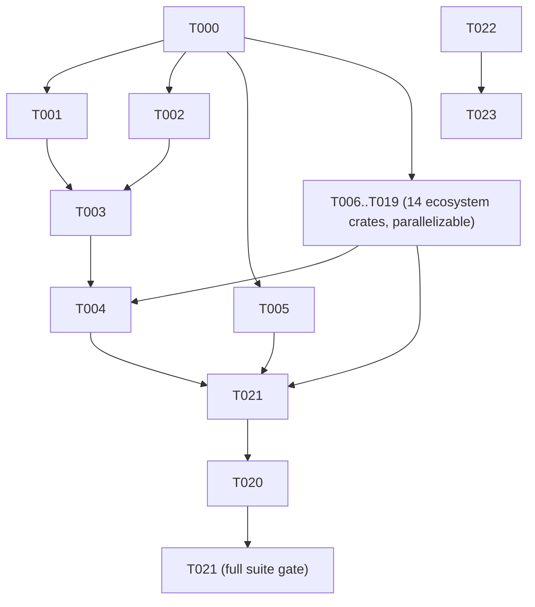

---
aliases:
  - deps-core Domain Boundary Hardening Tasks
tags:
  - sdd
  - tasks
  - deps-core
created: 2026-09-15
status: draft
related:
  - "[[spec]]"
  - "[[plan]]"
---

# Implementation Tasks: deps-core Domain Boundary Hardening

> [!info] References
> **Spec**: [[spec]]
> **Plan**: [[plan]]
> **Total tasks**: 24 (PR A: T000-T017, PR B: T018-T023)

## Progress

- [ ] T000: `deps_core::position` module + `Dependency`/`ParseResult`/`Ecosystem` trait signatures
- [ ] T001: `deps-core` internal call sites (`lsp_helpers/*`, `completion.rs`, `dependency_cap.rs`, `ecosystem_registry.rs`, `conformance.rs`, `test_util.rs`, `macros.rs`)
- [ ] T002: `LockFileCache` keyed on `url::Url` (`lockfile.rs`)
- [ ] T003: `deps-lsp` boundary — `lsp_types_interop.rs` conversion functions
- [ ] T004: `deps-lsp` handlers + `document/*` updated to convert at the boundary
- [ ] T005: `deps-engine::classify::{resolved,fetch,osv}` migrated; `tower-lsp-server` removed from `deps-engine`'s `Cargo.toml`
- [ ] T006-T019: migrate each of the 14 `deps-<ecosystem>` crates (one task per crate)
- [ ] T020: CI guard — `deps-engine` dependency tree excludes `tower-lsp-server` (descoped from `deps-cli`, see spec's "Out of Scope")
- [ ] T021: full check suite + live manual test (≥2 ecosystems) + `CHANGELOG.md` "Breaking" entry for PR A
- [x] T022: `policy_config`'s 7 structs → `#[non_exhaustive]` + `new()`/`with_*` constructors
- [x] T023: `PolicyConfig::diff`/`PolicyConfigDiff` + `reparse_scope` rewrite + compile-fail test + `CHANGELOG.md` "Breaking" entry for PR B

---

## Dependency Graph

PR A = T000–T021. PR B = T022–T023, independent of PR A and can start in
parallel (different files: `policy_config.rs` + `deps-lsp/src/config.rs`
only), but should merge second per plan.md §1 to avoid rebasing PR B's diff
across PR A's mechanical churn.

---

### T000: `deps_core::position` module + trait signature changes

**Context**: Foundation for all of PR A — every other task in this PR depends
on these types and signatures existing.
**Spec reference**: [[spec#FR-001]], [[spec#FR-002]]
**Acceptance criteria**:
- [ ] New `crates/deps-core/src/position.rs` with `Position`/`Range` structs exactly as specified in [[plan#3-data-model]]
- [ ] Exported from `deps-core`'s crate root (`pub use position::{Position, Range};` or `pub mod position;`, matching this project's existing re-export convention — check `lib.rs`)
- [ ] `Dependency` trait's `name_range`/`version_range`/`features_range`/`markers_range` retyped to `deps_core::position::Range`
- [ ] `ParseResult::uri()` retyped to `&url::Url`
- [ ] `Ecosystem::parse_manifest`'s `uri` parameter retyped to `&url::Url`
- [ ] `impl_parse_result!` macro (`macros.rs`) updated to generate the new signatures
- [ ] Both new structs have `///` doc comments + a runnable `# Examples` doctest per this project's Rust API doc convention
- [ ] Workspace does not yet compile after this task alone (expected — every ecosystem crate implementing these traits needs T006-T019) — this is fine as an intermediate commit within the same PR/branch, not a mergeable state on its own
**Dependencies**: none
**Files**: `crates/deps-core/src/position.rs` (new), `crates/deps-core/src/ecosystem.rs`, `crates/deps-core/src/macros.rs`, `crates/deps-core/src/lib.rs`
**Complexity**: medium

---

### T001: Migrate `deps-core`'s own internal call sites

**Context**: `deps-core` itself has ~15 files referencing `ls_types::{Uri,Position,Range}` beyond the trait definitions (found via `grep -rln "ls_types::\(Uri\|Position\|Range\)" crates/deps-core/src`) — `lsp_helpers/hover.rs`, `diagnostics.rs`, `code_actions.rs`, `code_lenses.rs`, `inlay_hints.rs`, `formatter.rs`, `git_ref.rs`, `in_use_version.rs`, `test_support.rs`, plus `completion.rs`, `dependency_cap.rs`, `ecosystem_registry.rs`, `conformance.rs`, `test_util.rs`.
**Spec reference**: [[spec#FR-001]], [[spec#FR-002]], [[spec#NFR-005]]
**Acceptance criteria**:
- [ ] Every listed file's production code and doctests use `deps_core::position::{Position,Range}`/`url::Url` instead of `ls_types` equivalents
- [ ] `deps-core/src/lib.rs`'s "API stability (issue #769)" section doc updated to mention the new types where it previously implied LSP-type coupling (NFR-005)
- [ ] `cargo test --workspace --doc -p deps-core --all-features` passes (every updated doctest compiles)
**Dependencies**: T000
**Files**: see file list above under crates/deps-core/src/
**Complexity**: medium

---

### T002: `LockFileCache` keyed on `url::Url`

**Context**: `lockfile.rs`'s `LockFileCache` and `LockFileProvider::locate_lockfile` are keyed/parameterized on `ls_types::Uri` today.
**Spec reference**: [[spec#FR-002]]
**Acceptance criteria**:
- [ ] `LockFileCache`'s internal map keyed on `url::Url`
- [ ] `LockFileProvider::locate_lockfile(&self, manifest_uri: &url::Url)`
- [ ] All doctests in `lockfile.rs` (currently `Uri::from_file_path(...)`) updated to `Url::from_file_path(...)`
- [ ] Existing `lockfile.rs` unit tests pass unmodified in assertions (only construction syntax changes)
**Dependencies**: T000
**Files**: `crates/deps-core/src/lockfile.rs`
**Complexity**: low

---

### T003: `deps-lsp` boundary conversion functions

**Context**: `deps-lsp` is now the only crate allowed to construct/consume `tower_lsp_server::ls_types` types when talking to `deps-core`/`deps-engine`. Per plan.md's orphan-rule analysis, these must be free functions, not `From`/`Into` impls.
**Spec reference**: [[spec#FR-003]]
**Acceptance criteria**:
- [ ] New `crates/deps-lsp/src/lsp_types_interop.rs` with `to_lsp_uri`/`from_lsp_uri` (`url::Url` ⇄ `ls_types::Uri`), `to_lsp_range`/`from_lsp_range`, `to_lsp_position`/`from_lsp_position`
- [ ] Module doc states this is the single place these conversions are allowed to live (plan.md risk mitigation)
- [ ] Unit tests round-tripping each conversion pair
**Dependencies**: T000, T002
**Files**: `crates/deps-lsp/src/lsp_types_interop.rs` (new), `crates/deps-lsp/src/lib.rs` (module registration)
**Complexity**: low

---

### T004: Migrate `deps-lsp` handlers and document state to the boundary

**Context**: Every LSP handler (`handlers/hover.rs`, `completion.rs`, `diagnostics.rs`, `code_actions.rs`, `code_lens.rs`, `inlay_hints.rs`, `document_link.rs`) and `document/*.rs` currently pass `ls_types` values straight through to/from `deps-core`/`deps-engine`. They must now convert via T003's functions at the boundary.
**Spec reference**: [[spec#FR-003]], [[spec#SC-005]]
**Acceptance criteria**:
- [ ] Every handler converts incoming `ls_types::Uri`/`Position`/`Range` to the new types before calling into `deps-core`/`deps-engine`, and converts results back before returning to the LSP client
- [ ] No behavior change: existing `deps-lsp` integration/unit tests pass unmodified in their assertions
- [ ] Manual live test (SC-005): `RUST_LOG=debug cargo run -p deps-lsp`, hover + diagnostics against a real `Cargo.toml` and a real `package.json`, confirm byte-identical LSP JSON responses to a pre-change baseline
**Dependencies**: T003, T006-T019 (needs at least the ecosystem crates that are exercised in the live test — Cargo and npm — migrated; full completion of T006-T019 not required to start this task, but required before PR A merges)
**Files**: `crates/deps-lsp/src/handlers/*.rs`, `crates/deps-lsp/src/document/*.rs`
**Complexity**: high

---

### T005: Migrate `deps-engine::classify` and drop its `tower-lsp-server` dependency

**Context**: The direct trigger for #1071 — `classify/{resolved,fetch,osv}.rs` import `tower_lsp_server::ls_types::{Uri,Position,Range}` directly, forcing `deps-engine`'s `Cargo.toml` to declare `tower-lsp-server` as a required (non-optional) dependency.
**Spec reference**: [[spec#FR-004]]
**Acceptance criteria**:
- [ ] `classify/resolved.rs`, `fetch.rs`, `osv.rs` use `url::Url`/`deps_core::position::{Position,Range}` instead of `ls_types`
- [ ] `crates/deps-engine/Cargo.toml`'s `tower-lsp-server` dependency line removed entirely
- [ ] `cargo tree -p deps-engine -e features,no-dev | grep tower-lsp-server` has no match
**Dependencies**: T000
**Files**: `crates/deps-engine/src/classify/resolved.rs`, `fetch.rs`, `osv.rs`, `crates/deps-engine/Cargo.toml`
**Complexity**: medium

---

### T006-T019: Migrate each ecosystem crate's `Dependency`/`ParseResult` impl

**Context**: Each of the 14 ecosystem crates implements `Dependency`/`ParseResult`/`Ecosystem::parse_manifest` with concrete struct fields typed on `ls_types::{Uri,Position,Range}`. Since T000 changes the trait signatures, every impl must update in lockstep for the workspace to compile — but the 14 tasks are otherwise independent of each other and can run in parallel across developer agents.

| Task | Crate |
|------|-------|
| T006 | `deps-bundler` |
| T007 | `deps-cargo` |
| T008 | `deps-composer` |
| T009 | `deps-dart` |
| T010 | `deps-deno` |
| T011 | `deps-github-actions` |
| T012 | `deps-gitlab-ci` |
| T013 | `deps-go` |
| T014 | `deps-gradle` |
| T015 | `deps-maven` |
| T016 | `deps-npm` |
| T017 | `deps-nuget` |
| T018 | `deps-pypi` |
| T019 | `deps-swift` |

**Spec reference**: [[spec#FR-002]], [[spec#NFR-003]] (cross-ecosystem consistency — no partial migration)
**Acceptance criteria** (per crate):
- [ ] `Dependency`/`ParseResult` impl(s) retyped to `deps_core::position::{Position,Range}`/`url::Url` — parsing logic itself unchanged
- [ ] `cargo nextest run -p deps-<ecosystem> --all-features` passes with zero test assertions changed (only construction-site type syntax)
- [ ] `cargo test --doc -p deps-<ecosystem> --all-features` passes
**Dependencies**: T000
**Files**: `crates/deps-<ecosystem>/src/**` (wherever `ParseResult`/`Dependency` is implemented and constructed — locate via `grep -rl "ls_types::\(Uri\|Position\|Range\)" crates/deps-<ecosystem>/src`)
**Complexity**: low (per crate) — mechanical type substitution, no logic change

---

### T020: CI guard — `deps-engine` excludes `tower-lsp-server`

**Context**: FR-004 requires this to be machine-verified, not just true by construction — mirrors the existing #1073/#1079 guard for ecosystem crates not being direct `deps-lsp`/`deps-cli` dependencies. **Descoped from `deps-cli`** (originally FR-005) after discovering during T000 that `deps-cli` already directly uses `ls_types` independent of `deps-core`'s domain model, and that `deps-core` itself keeps `tower-lsp-server` unconditionally for `lsp_helpers` — see spec's "Out of Scope".
**Spec reference**: [[spec#FR-004]], [[spec#SC-001]]
**Acceptance criteria**:
- [ ] New (or extended) CI step running `cargo tree -p deps-engine -e no-dev --depth 1` and failing if `tower-lsp-server` appears — a **direct**-dependency check. Do NOT use a full transitive `cargo tree` grep: `deps-engine` still pulls `tower-lsp-server` transitively via `deps-core` (accepted per spec's descoped FR-005), so a transitive check would always fail
- [ ] Step documented in `.github/workflows/ci.yml` with a comment linking issue #1071, matching this project's existing convention for such guards, and noting the direct-vs-transitive distinction so a future contributor doesn't "fix" it into a transitive check
**Dependencies**: T005, T006-T019 (the tree must actually be clean before the guard is added, or CI red)
**Files**: `.github/workflows/ci.yml`
**Complexity**: low

---

### T021: PR A closeout — full check suite, live test, changelog

**Context**: Final gate before PR A merges.
**Spec reference**: [[spec#SC-002]], [[spec#SC-003]], [[spec#SC-005]]
**Acceptance criteria**:
- [ ] `cargo +nightly fmt --all -- --check` clean
- [ ] `cargo clippy --workspace --all-targets --all-features -- -D warnings` clean
- [ ] `cargo nextest run --workspace --all-features --no-fail-fast` all green
- [ ] `cargo test --workspace --doc --all-features` all green
- [ ] `RUSTFLAGS="-D warnings" RUSTDOCFLAGS="-D warnings" cargo doc --workspace --no-deps --all-features` clean
- [ ] Manual live test per T004 documented in `.local/testing/journal/` per this project's continuous-improvement convention (not required to be a formal CI cycle — a session note is enough)
- [ ] `CHANGELOG.md` `[Unreleased]` gets a **Breaking** entry: `deps-core`'s `Dependency`/`ParseResult`/`Ecosystem`/`LockFileProvider` APIs no longer use `tower_lsp_server::ls_types` types (resolves #1071)
**Dependencies**: T004, T005, T006-T019, T020
**Files**: `CHANGELOG.md`
**Complexity**: low

---

### T022: `policy_config`'s 7 structs → `#[non_exhaustive]` + constructors

**Context**: PR B, independent of PR A. Implements the spec's US-002 / FR-006 / FR-007.
**Spec reference**: [[spec#FR-006]], [[spec#FR-007]]
**Acceptance criteria**:
- [x] `#[non_exhaustive]` added to `DiagnosticsConfig`, `CacheConfig`, `FreshnessConfig`, `SupplyChainConfig`, `RegistriesConfig`, `NetworkConfig`, `LicensePolicyConfig`
- [x] Each gets a `new()` (if any field lacks a sensible default-only constructor) and/or `with_*` builder methods for every field, following `InlayHintsConfig`'s existing pattern exactly (method naming, `#[must_use]`, return-`Self` style)
- [x] `policy_config.rs`'s module doc (currently explaining *why* these are exhaustive) rewritten to explain the new state and point to `PolicyConfig::diff` (T023) as the replacement guarantee
- [x] Existing doctest in `policy_config.rs` (`PolicyConfig::default()`) still compiles
**Dependencies**: none (independent of PR A)
**Files**: `crates/deps-core/src/policy_config.rs`
**Complexity**: medium

---

### T023: `PolicyConfig::diff` + `reparse_scope` rewrite + compile-fail test

**Context**: The actual security-guarantee-preserving half of PR B — must land in the same PR/commit as T022, not separately, since T022 alone would silently defeat `reparse_scope`'s current guard.
**Spec reference**: [[spec#FR-008]], [[spec#FR-009]], [[spec#NFR-004]]
**Acceptance criteria**:
- [x] `PolicyConfig::diff(old, new) -> PolicyConfigDiff` implemented per [[plan#3-data-model]], using the **same field-by-field classification granularity `reparse_scope` uses today** (confirm exact leaf-field list by reading the current `reparse_scope` body in `crates/deps-lsp/src/config.rs` before writing `PolicyConfigDiff`'s fields — plan.md deliberately left this as a placeholder, not a guess)
- [x] `PolicyConfigDiff` is **not** `#[non_exhaustive]`
- [x] `deps-lsp::config::reparse_scope` rewritten to consume `PolicyConfigDiff` instead of destructuring `PolicyConfig`/its sections directly
- [x] All existing `reparse_scope_tests` cases pass unmodified in their assertions (only the internals being tested change)
- [x] New compile-fail test (or equivalent guaranteed-detection mechanism, e.g. a `trybuild` fixture) proving: adding a field to any of the 7 `policy_config` structs without updating `PolicyConfig::diff` fails to compile (NFR-004/SC-004) — this is the task's primary deliverable, not optional polish (implemented as a `compile_fail` doctest — no `trybuild` dev-dependency existed in the workspace, and adding one for a single fixture was unwarranted; see `PolicyConfigDiff`'s doc comment)
- [x] `CHANGELOG.md` `[Unreleased]` gets a **Breaking** entry: `deps_core::policy_config`'s 7 structs are now `#[non_exhaustive]` (resolves #1064)
- [x] Full check suite (same list as T021) green
**Dependencies**: T022
**Files**: `crates/deps-core/src/policy_config.rs`, `crates/deps-lsp/src/config.rs`, new compile-fail test location (TBD — check whether `trybuild` is already a workspace dev-dependency before adding it), `CHANGELOG.md`
**Complexity**: high

---

## Implementation Notes

### Order of execution

1. T000 first, always — nothing else compiles without it.
2. T001, T002, T005, and T006-T019 (all 14 ecosystem crates) can run in
   parallel once T000 lands, since they touch disjoint files.
3. T003 depends on T000+T002 (needs the `url::Url` key type settled).
4. T004 depends on T003 and, practically, on enough of T006-T019 being done
   to exercise the live test (Cargo + npm at minimum).
5. T020 and T021 are the closeout gate — last.
6. T022-T023 (PR B) can start any time in parallel with PR A but should
   **merge after** PR A per plan.md §1 to avoid rebase churn.

### Common patterns

- Every ecosystem-crate task (T006-T019) is a mechanical type substitution —
  no parsing logic should change. If a task discovers a case where the
  substitution isn't purely mechanical (e.g. code that relied on
  `ls_types::Uri`'s specific string-escaping behavior), stop and flag it —
  that's a design gap in T000, not something to work around per-crate.
- Follow `InlayHintsConfig`'s existing `#[non_exhaustive]` + constructor
  pattern exactly for T022 — do not invent a new convention.

### Gotchas

- `url::Url` and `tower_lsp_server::ls_types::Uri` are not always
  byte-identical for the same file path across platforms (e.g. Windows drive
  letters, percent-encoding edge cases) — T003's round-trip tests must cover
  at least one non-trivial path shape, not just a simple Unix path.
- `PolicyConfigDiff`'s field granularity (T023) must match `reparse_scope`'s
  **current** classification exactly — under-classifying (coarser than
  today) would widen reparse blast radius (performance regression, not a
  security issue); over-classifying finer than today is fine but unnecessary
  scope. Read the current function body first.

## See Also

- [[spec]] — feature specification
- [[plan]] — technical plan
- [[MOC-specs]] — all specifications
