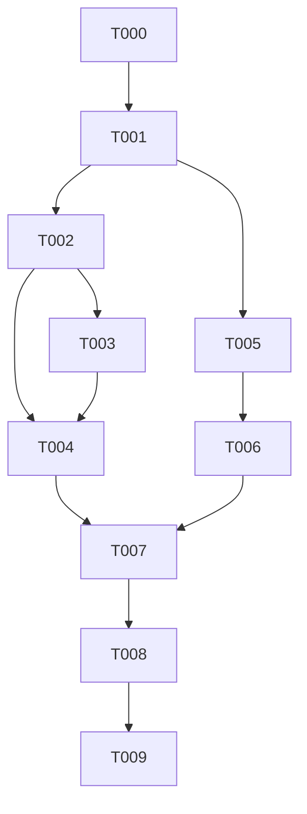

---
aliases:
  - deps-cli tower-lsp-server Isolation Tasks
tags:
  - sdd
  - tasks
  - deps-core
  - deps-cli
created: 2026-09-15
status: draft
related:
  - "[[spec]]"
  - "[[plan]]"
---

# Implementation Tasks: deps-cli tower-lsp-server Isolation

> [!info] References
> **Spec**: [[spec]]
> **Plan**: [[plan]]
> **Total tasks**: 10

## Progress

- [ ] T000: `deps_core::diagnostic` module (`Diagnostic`, `Severity`, `RelatedInformation`, `CodeDescription`)
- [ ] T001: Retype `lsp_helpers/diagnostics.rs` + `DiagnosticSeverities` to the domain type
- [ ] T002: Retype `Ecosystem::generate_diagnostics` trait default method
- [ ] T003: Retype the 3 ecosystem overrides (`deps-npm`, `deps-github-actions`, `deps-gitlab-ci`)
- [ ] T004: `deps-lsp/src/lsp_types_interop.rs` conversion functions + `handlers/diagnostics.rs`
- [ ] T005: `tower-lsp-server` optional in `deps-core` (`lsp-responses` feature)
- [ ] T006: `deps-engine`/`deps-lsp` Cargo.toml feature forwarding
- [ ] T007: Retype `deps-cli`'s `report.rs`/`config.rs`/`exit.rs`/`format/*.rs`; drop its direct `tower-lsp-server` dependency
- [ ] T008: CI dependency-tree guard (FR-007)
- [ ] T009: Full check suite, live verification, `lib.rs` doc fix (FR-009), `CHANGELOG.md`

---

## Dependency Graph

---

### T000: `deps_core::diagnostic` module

**Context**: Foundation for everything else — the protocol-agnostic domain
type that replaces `tower_lsp_server::ls_types::{Diagnostic,
DiagnosticSeverity, DiagnosticRelatedInformation, CodeDescription}`
wherever `deps-cli` needs one. Mirrors `deps_core::position`'s existing
`#[non_exhaustive]` + constructor pattern (spec 063) exactly, including doc
comments with runnable `# Examples` per this project's rustdoc convention.
**Spec reference**: [[spec#5. Data Model]], [[plan#3. Data Model]]
**Acceptance criteria**:
- [ ] `crates/deps-core/src/diagnostic.rs` created with `Diagnostic`,
      `Severity`, `RelatedInformation`, `CodeDescription` — each
      `#[non_exhaustive]`, with `new()`/`with_*` builder methods
      (`#[must_use]`), field-for-field matching their `ls_types` equivalents
      (`code` as `Option<String>`, not a `NumberOrString`-equivalent — see
      plan's Key Design Decisions)
- [ ] Every `pub` item has a `///` doc comment with a runnable `# Examples`
      doctest (per this project's rustdoc convention and `position.rs`'s
      existing example)
- [ ] Module re-exported from `crates/deps-core/src/lib.rs` (`pub mod
      diagnostic;`)
- [ ] `cargo test --workspace --doc --all-features` passes for the new
      doctests; `cargo clippy -p deps-core --all-targets --all-features -- -D
      warnings` clean
**Dependencies**: none
**Files**: `crates/deps-core/src/diagnostic.rs` (new), `crates/deps-core/src/lib.rs`
**Complexity**: low

---

### T001: Retype `lsp_helpers/diagnostics.rs` + `DiagnosticSeverities`

**Context**: The actual diagnostic-construction logic — `generate_diagnostics_from_cache`
and its ~17 `Diagnostic { .. }` / `DiagnosticRelatedInformation { .. }` /
`CodeDescription { .. }` construction sites — switches from building
`ls_types` types to building T000's domain types. `DiagnosticSeverities`'s 6
fields switch from `ls_types::DiagnosticSeverity` to `diagnostic::Severity`.
This is the largest mechanical task; `cargo check` catches any missed site
as a compile error (plan's Risks §11).
**Spec reference**: [[spec#FR-002]], [[spec#US-003]]
**Acceptance criteria**:
- [ ] `generate_diagnostics_from_cache`'s return type is `Vec<crate::diagnostic::Diagnostic>`
- [ ] Every construction site in `diagnostics.rs` builds the domain type;
      zero remaining `tower_lsp_server::ls_types` imports in this file
- [ ] `DiagnosticSeverities`'s 6 fields retyped to `diagnostic::Severity`;
      its doctests updated to reference the new type
- [ ] `cargo check -p deps-core --all-features` compiles (downstream call
      sites will still be broken until T002/T003 — that's expected and
      fixed by those tasks, not this one)
- [ ] Existing unit tests inside `diagnostics.rs`'s own `#[cfg(test)]`
      module updated to construct/assert against the domain type, and pass
**Dependencies**: T000
**Files**: `crates/deps-core/src/lsp_helpers/diagnostics.rs`
**Complexity**: high

---

### T002: Retype `Ecosystem::generate_diagnostics` trait default method

**Context**: The trait-level signature both `deps-lsp` and `deps-cli` call.
No feature gate on this method (plan's Key Design Decisions — it's the
shared surface both consumers need).
**Spec reference**: [[spec#FR-002]], [[plan#4. API Design]]
**Acceptance criteria**:
- [ ] `Ecosystem::generate_diagnostics`'s signature in `ecosystem.rs`
      returns `BoxFuture<'a, Vec<diagnostic::Diagnostic>>`
- [ ] The default method body (which just forwards to
      `generate_diagnostics_from_cache`) compiles unchanged in shape, only
      the type flows through
- [ ] `cargo check -p deps-core --all-features` compiles for this trait
      definition (implementors fixed in T003)
**Dependencies**: T001
**Files**: `crates/deps-core/src/ecosystem.rs`
**Complexity**: low

---

### T003: Retype the 3 ecosystem `generate_diagnostics` overrides

**Context**: `deps-npm`, `deps-github-actions`, `deps-gitlab-ci` each call
`generate_diagnostics_from_cache` then append their own ecosystem-specific
`Diagnostic { .. }` literals (deprecated-package / mutable-ref findings).
Those literals must also become `diagnostic::Diagnostic { .. }` — this is
US-003's acceptance criterion directly (constitution principle 1: one
representation, not two).
**Spec reference**: [[spec#US-003]], [[plan#5. Integration Points]]
**Acceptance criteria**:
- [ ] `deps-npm/src/ecosystem.rs`'s override returns `Vec<diagnostic::Diagnostic>`,
      its appended deprecated-package diagnostic(s) built as the domain type
- [ ] `deps-github-actions/src/ecosystem.rs`'s override — same, for its
      mutable-ref-pin diagnostic(s)
- [ ] `deps-gitlab-ci/src/ecosystem.rs`'s override — same
- [ ] `cargo check --workspace --all-features` compiles across all 3 crates
      plus `deps-core` (still broken for `deps-lsp`/`deps-cli` call sites
      until T004/T007 — expected)
- [ ] Each crate's own existing unit/insta tests for these overrides pass
      unchanged (content-wise) after being updated to construct the domain
      type
**Dependencies**: T002
**Files**: `crates/deps-npm/src/ecosystem.rs`, `crates/deps-github-actions/src/ecosystem.rs`, `crates/deps-gitlab-ci/src/ecosystem.rs`
**Complexity**: medium

---

### T004: `deps-lsp` boundary — `lsp_types_interop.rs` + `handlers/diagnostics.rs`

**Context**: Restores `deps-lsp`'s real behavior: convert the domain
`Vec<diagnostic::Diagnostic>` back into `Vec<ls_types::Diagnostic>` at the
one place `deps-lsp` builds its LSP response. Reuses the existing
`lsp_types_interop.rs` file spec 063 designated for exactly this kind of
orphan-rule-constrained conversion.
**Spec reference**: [[spec#US-002]], [[plan#1. Architecture]] (Part A)
**Acceptance criteria**:
- [ ] `lsp_types_interop.rs` gains conversion functions (or `From` impls,
      whichever matches the file's existing style) for `diagnostic::Diagnostic
      -> ls_types::Diagnostic`, `diagnostic::Severity -> ls_types::DiagnosticSeverity`,
      `diagnostic::RelatedInformation -> ls_types::DiagnosticRelatedInformation`,
      `diagnostic::CodeDescription -> ls_types::CodeDescription`
- [ ] `handlers/diagnostics.rs` calls `Ecosystem::generate_diagnostics`, then
      converts each result via the new functions before constructing its
      response — no other control-flow change
- [ ] `cargo check -p deps-lsp --all-features` compiles
- [ ] **Every existing `deps-lsp`/ecosystem-crate insta snapshot for
      diagnostics passes unchanged** — run `cargo insta test --workspace
      --all-features` and confirm zero diff before marking this task done
      (spec SC-002; do not `cargo insta accept` a change here — see plan's
      Risks §11)
**Dependencies**: T002, T003
**Files**: `crates/deps-lsp/src/lsp_types_interop.rs`, `crates/deps-lsp/src/handlers/diagnostics.rs`
**Complexity**: medium

---

### T005: `tower-lsp-server` optional in `deps-core` (`lsp-responses` feature)

**Context**: Part B of the plan. `hover.rs`/`code_actions.rs`/`code_lenses.rs`/
`inlay_hints.rs`/`generate_document_links` are `deps-cli`-unused and stay
`ls_types`-typed, but must compile conditionally so `tower-lsp-server` can
become optional for a `deps-cli`-shaped build.
**Spec reference**: [[spec#FR-001]], [[plan#1. Architecture]] (Part B)
**Acceptance criteria**:
- [ ] `deps-core/Cargo.toml`: `tower-lsp-server = { workspace = true,
      optional = true }`; new feature `lsp-responses = ["dep:tower-lsp-server"]`;
      new `default = ["lsp-responses"]` list (today `deps-core` has none)
- [ ] `lsp_helpers/mod.rs`'s `hover`/`code_actions`/`code_lenses`/`inlay_hints`
      module declarations gated `#[cfg(feature = "lsp-responses")]`
- [ ] `Ecosystem`'s `generate_hover`/`generate_code_actions`/
      `generate_code_lenses`/`generate_inlay_hints`/`generate_document_links`
      default methods gated the same way in `ecosystem.rs`
- [ ] `cargo build -p deps-core --no-default-features` compiles (only
      `diagnostic.rs`/`diagnostics.rs`/`generate_diagnostics` remain active)
- [ ] `cargo build -p deps-core --all-features` (i.e. with `lsp-responses`)
      compiles identically to before this task
- [ ] `cargo tree -p deps-core --no-default-features -e features,no-dev`
      does not contain `tower-lsp-server`
**Dependencies**: T001
**Files**: `crates/deps-core/Cargo.toml`, `crates/deps-core/src/lsp_helpers/mod.rs`, `crates/deps-core/src/ecosystem.rs`
**Complexity**: medium

---

### T006: `deps-engine`/`deps-lsp` Cargo.toml feature forwarding

**Context**: `deps-engine` already forwards every per-ecosystem feature
explicitly with no `default` list (issue #1058's documented pattern) —
`lsp-responses` follows the same shape. `deps-lsp` must explicitly opt back
in since it still needs hover/code-actions/code-lenses/inlay-hints.
**Spec reference**: [[spec#FR-001]], [[plan#1. Architecture]] (Part B)
**Acceptance criteria**:
- [ ] `deps-engine/Cargo.toml`: new `lsp-responses = ["deps-core/lsp-responses"]`
      feature; its `deps-core` dependency switched to `default-features =
      false` (forwarding everything explicitly, matching its existing
      ecosystem-feature philosophy)
- [ ] `deps-lsp/Cargo.toml`: `deps-core`/`deps-engine` dependency lines
      updated to add `features = ["lsp-responses"]`
- [ ] `deps-cli/Cargo.toml`: no change yet (still has its own direct
      `ls_types` usage — fixed in T007)
- [ ] `cargo build -p deps-lsp --all-features` compiles unchanged
- [ ] `cargo build -p deps-engine --no-default-features --features
      cargo,npm,pypi,go,bundler,dart,maven,gradle,swift,composer,nuget,deno,github-actions,gitlab-ci`
      (i.e. `deps-cli`'s exact feature set, no `lsp-responses`) compiles
**Dependencies**: T005
**Files**: `crates/deps-engine/Cargo.toml`, `crates/deps-lsp/Cargo.toml`
**Complexity**: low

---

### T007: Retype `deps-cli`; drop its direct `tower-lsp-server` dependency

**Context**: The step that actually removes `deps-cli`'s own `ls_types`
usage (spec's Problem Statement point 2) — `report.rs`'s `CheckFinding`,
`config.rs`'s severity config, `exit.rs`, and `format/{mod,table,json,sarif}.rs`
all currently import `ls_types` types directly, independent of whatever
`deps-core`/`deps-engine` require. Output must stay byte-identical (FR-006)
— this is a type-only retype, not a formatting-logic rewrite.
**Spec reference**: [[spec#FR-005]], [[spec#FR-006]], [[spec#SC-001]], [[spec#SC-003]]
**Acceptance criteria**:
- [ ] `report.rs`'s `CheckFinding.severity`/`.range` retyped to
      `deps_core::diagnostic::Severity`/`deps_core::position::Range`;
      `.code`/`.advisory_url` already `Option<String>`, unaffected
- [ ] `config.rs`'s severity-configuration construction (`DiagnosticSeverities`
      builder calls) uses `deps_core::diagnostic::Severity` instead of
      `ls_types::DiagnosticSeverity`
- [ ] `exit.rs`, `format/mod.rs`, `format/table.rs`, `format/json.rs`,
      `format/sarif.rs` retyped the same way; `severity_str` and any
      `Display`/formatting logic preserved verbatim (only the input type
      changes)
- [ ] `deps-cli/Cargo.toml`: `deps-core` dependency switched to
      `default-features = false`; direct `tower-lsp-server` dependency line
      removed once no source file under `crates/deps-cli/src/` references
      `tower_lsp_server`/`ls_types` (grep confirms zero matches)
- [ ] `cargo tree -p deps-cli -e features,no-dev` does not contain
      `tower-lsp-server` (spec SC-001)
- [ ] **Every existing `deps-cli` table/JSON/SARIF fixture test (insta +
      jsonschema) passes unchanged** — spec SC-003, do not accept a fixture
      diff here; a changed fixture means the retype introduced a real
      behavior difference and must be fixed, not accepted
**Dependencies**: T004, T006
**Files**: `crates/deps-cli/Cargo.toml`, `crates/deps-cli/src/{lib.rs,report.rs,config.rs,exit.rs,format/{mod,table,json,sarif}.rs}`
**Complexity**: high

---

### T008: CI dependency-tree guard

**Context**: Automated enforcement so this isolation can't silently regress
(mirrors the existing `test-util` leak-guard step already in
`.github/workflows/ci.yml`).
**Spec reference**: [[spec#FR-007]], [[spec#SC-005]]
**Acceptance criteria**:
- [ ] New CI step (or extension of the existing guard job) runs `cargo tree
      -p deps-cli -e features,no-dev` and fails the job if `tower-lsp-server`
      appears in the output
- [ ] Step passes on the current state of the branch (i.e. runs *after*
      T007)
- [ ] Guard step documented with a one-line comment explaining what it
      protects, mirroring the existing `test-util` guard's comment style
**Dependencies**: T007
**Files**: `.github/workflows/ci.yml`
**Complexity**: low

---

### T009: Full check suite, live verification, doc fix, CHANGELOG

**Context**: Closing task — the project's standard pre-PR gate (per
`.claude/rules/branching.md`) plus this spec's own FR-009 (doc-comment
accuracy) and constitution principle 5 (verify live).
**Spec reference**: [[spec#FR-009]], [[plan#7. Testing Strategy]] (Live row), [[plan#10. Constitution Compliance]]
**Acceptance criteria**:
- [ ] `cargo +nightly fmt --all -- --check`,
      `cargo clippy --workspace --all-targets --all-features -- -D warnings`,
      `cargo nextest run --workspace --all-features --no-fail-fast`,
      `cargo test --workspace --doc --all-features`, and the rustdoc gate
      (`RUSTFLAGS="-D warnings" RUSTDOCFLAGS="-D warnings" cargo doc
      --workspace --no-deps --all-features`) all pass
- [ ] `crates/deps-core/src/lib.rs`'s "LSP type stability" doc section
      updated: `generate_diagnostics` no longer described as `deps-lsp`-only
      (it now also correctly describes `diagnostic::Diagnostic` as the
      feature-independent return type; the other 4 `generate_*` methods'
      "deps-lsp is the only crate expected to call them" claim stays
      accurate for them)
- [ ] Live-tested: `RUST_LOG=debug cargo run -p deps-lsp -- --stdio` against
      a manifest covering outdated/unknown/yanked/unsatisfiable/deprecated/
      vulnerability diagnostics, confirmed visually unchanged in an editor;
      `deps-cli check` on the same manifest confirmed unchanged
      table/JSON/SARIF output
- [ ] `CHANGELOG.md`'s `[Unreleased]` section gets a `Breaking` entry (one
      line, per this project's changelog conciseness convention) describing
      the `Ecosystem::generate_diagnostics` signature change
- [ ] `.local/testing/coverage.md` / relevant playbook updated per
      `branching.md`'s continuous-improvement knowledge-base obligation, if
      this PR's scope counts as materially changing tested behavior
**Dependencies**: T008
**Files**: `CHANGELOG.md`, `crates/deps-core/src/lib.rs`, `.local/testing/coverage.md` (as applicable)
**Complexity**: medium

---

## Implementation Notes

### Order of execution

T000-T004 (Part A) must land before T005-T006 (Part B) can be verified
end-to-end, since Part B's `--no-default-features` build only compiles
cleanly once `diagnostics.rs`/`ecosystem.rs`/the 3 overrides no longer
reference `ls_types` unconditionally (T001-T003). T007 depends on both T004
(the `deps-lsp` boundary existing, proving the domain type round-trips
correctly) and T006 (the Cargo feature plumbing being in place). T008-T009
are strictly sequential closing tasks.

### Common patterns

- Mirror `deps_core::position::{Position, Range}` for every new type's
  shape: `#[non_exhaustive]`, `new()` + `with_*` builders, `#[must_use]`,
  doctested.
- Mirror the existing `test-util` feature's Cargo.toml comment style when
  documenting `lsp-responses`'s purpose and security-relevant scope (there
  is no security concern here, but the *documentation convention* — a
  multi-line comment above the feature explaining exactly what it gates and
  why — is worth matching for consistency).

### Gotchas

- `DiagnosticSeverities`'s doctests (in `diagnostics.rs`) reference
  `ls_types::DiagnosticSeverity` directly today — these must be updated in
  T001, not left stale (a stale doctest referencing the old type would fail
  `cargo test --doc` immediately, so this is self-catching, but don't defer
  it).
- `deps-npm`/`deps-github-actions`/`deps-gitlab-ci`'s overrides construct
  `DiagnosticRelatedInformation`/`CodeDescription` in a couple of places
  too, not just bare `Diagnostic` — grep each file for all four
  `ls_types` type names, not just `Diagnostic`, before considering T003
  done.
- `deps-cli/src/config.rs` has two `ls_types::DiagnosticSeverity` references
  (lines 353, 472 as of this spec's investigation) that are easy to miss
  since they're deep inside severity-parsing logic, not adjacent to the
  `DiagnosticSeverities` struct construction itself.

## See Also

- [[spec]] — feature specification
- [[plan]] — technical plan
- [[MOC-specs]] — all specifications
