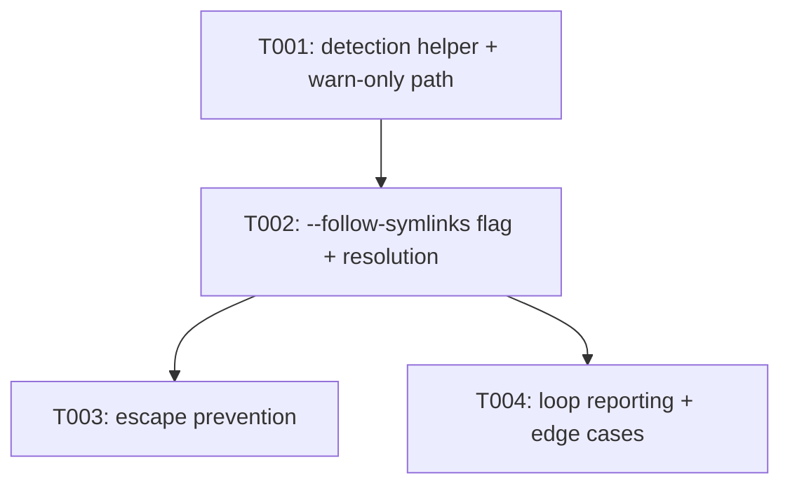

---
aliases:
  - deps-cli Symlink Manifest Walk Tasks
tags:
  - sdd
  - tasks
  - deps-cli
  - security
created: 2026-09-16
status: draft
related:
  - "[[spec]]"
  - "[[plan]]"
---

# Implementation Tasks: deps-cli Symlink Manifest Walk

> [!info] References
> **Spec**: [[spec]]
> **Plan**: [[plan]]
> **Total tasks**: 4

## Progress

- [ ] T001: Add `symlink_is_manifest_shaped` helper and warn-only detection (FR-001, FR-002)
- [ ] T002: Add `--follow-symlinks` flag and thread it through the walk pipeline (FR-003, FR-006, FR-007)
- [ ] T003: Add FR-004 escape-prevention check for resolved symlink targets
- [ ] T004: Confirm and test FR-005 (symlink-loop reporting) plus the remaining edge-case tests

---

## Dependency Graph

No T000 scaffolding task — every change lands inside existing files
(`walk.rs`, `cli.rs`, `main.rs`); no new module, dependency, or config is
introduced.

---

### T001: Add `symlink_is_manifest_shaped` helper and warn-only detection

**Context**: This is the always-on half of the fix (spec US-001): today,
`walk_directory`'s entry match loop silently drops any entry that fails
`entry.file_type().is_some_and(|t| t.is_file())` via the `Ok(_) => {}` arm —
including a symlink to a manifest-shaped file. This task adds the shared
detection helper and wires it into that arm (plus reuses it from
`warn_on_pruned_directory_manifest`), reporting a detected symlinked
manifest via the existing `WalkOutcome::ignored_manifests` sink — no new
`WalkOutcome` field, no CLI flag yet. This alone closes issue #1112's
`exit 0` silent-bypass bug (`main.rs`'s existing `ignored_manifests` handling
already drives a non-zero exit code); T002/T003 add the opt-in resolution
path on top.

**Spec reference**: [[spec#FR-001]], [[spec#FR-002]], [[spec#US-001]]

**Acceptance criteria**:
- [ ] New private helper `symlink_is_manifest_shaped(path: &Path, registry: &EcosystemRegistry) -> bool` added to `walk.rs`, matching plan.md §3's signature/doc comment (uses `std::fs::metadata`, never reads file content, returns `false` for a broken symlink, a symlink to a directory, or a target no ecosystem claims)
- [ ] `walk_directory`'s entry match loop: when an entry's `file_type()` is not a regular file AND `entry.path_is_symlink()` is `true` AND `symlink_is_manifest_shaped` returns `true` for its path, push the entry's display path onto `ctx.outcome.ignored_manifests` (same `display` derivation already used by the `is_file()` arm — `path.strip_prefix(display_root)`)
- [ ] `warn_on_pruned_directory_manifest` (the one-level-deep pruned-directory check) is updated to also match a symlink whose target is manifest-shaped, by calling the same new helper — not a second implementation (constitution principle 1)
- [ ] `test_walk_default_detects_symlinked_manifest_without_following`: a symlinked manifest under the default (no new flag yet — call `walk`/`walk_with_limit` with the pre-existing signature) is reported via `WalkOutcome::ignored_manifests` and absent from `WalkOutcome::manifests`
- [ ] `test_walk_broken_symlink_is_not_reported_as_manifest`: a symlink to a nonexistent target produces no `ignored_manifests` entry
- [ ] `test_walk_symlink_to_directory_is_not_reported_as_manifest`: a symlink to a directory produces no `ignored_manifests` entry
- [ ] `test_walk_pruned_directory_symlinked_manifest_is_still_warned`: a symlink to a manifest-shaped file sitting directly at a `PRUNED_DIRECTORIES`-excluded directory's own root is reported via `ignored_manifests`, mirroring the existing `test_walk_default_warns_on_manifest_directly_inside_pruned_directory` regular-file case
- [ ] All new tests gated `#[cfg(unix)]` (use `std::os::unix::fs::symlink` for fixture construction)
- [ ] `cargo +nightly fmt --all -- --check`, `cargo clippy --workspace --all-targets --all-features -- -D warnings`, `cargo nextest run -p deps-cli` all pass
- [ ] No existing test or fixture changed

**Dependencies**: none

**Files**: `crates/deps-cli/src/walk.rs`

**Complexity**: medium

---

### T002: Add `--follow-symlinks` flag and thread it through the walk pipeline

**Context**: Adds the opt-in resolution path (spec US-002): a new CLI flag
that, when passed, makes the walk actually follow and scan a symlinked
manifest instead of only warning about it. This task wires the flag through
`CheckArgs` → `main.rs` → `walk`/`walk_with_limit`/`walk_directory`'s
signatures and enables `ignore::WalkBuilder::follow_links`, without yet
adding the FR-004 escape check (T003) — a symlink resolving inside the
walked root is fully covered by this task; escaping the root is still
correctly *rejected* by this task too, just via T003's more precise
mechanism, so land T003 before merging if escape prevention must ship in
the same PR (see Implementation Notes).

**Spec reference**: [[spec#FR-003]], [[spec#FR-006]], [[spec#FR-007]], [[spec#US-002]]

**Acceptance criteria**:
- [ ] `CheckArgs` (`cli.rs`) gains `pub follow_symlinks: bool` with `#[arg(long)]`, doc comment matching plan.md §3's wording and mirroring `respect_gitignore`'s existing doc-comment style/placement
- [ ] `walk::walk`, `walk::walk_with_limit`, and the internal `walk_directory` all gain a `follow_symlinks: bool` parameter (signature change exactly as plan.md §3 shows); every existing call site (including all pre-existing tests) updated to pass `false` unless a test specifically exercises the new flag
- [ ] `main.rs`'s `run_check` threads `cli_config`/`CheckArgs::follow_symlinks` (or an added `run_check` parameter, matching how `respect_gitignore` is already threaded) into `walk::walk`
- [ ] `walk_directory`'s `WalkBuilder` gets `.follow_links(follow_symlinks)`
- [ ] When `follow_symlinks` is `true`, a symlink entry resolving to a manifest-shaped regular file *inside* the walk root is routed through the existing `route_file` and appears in `WalkOutcome::manifests`, with `display_path` set to the symlink's own encountered path (not the resolved target's path) and `path` set to the resolved real path used for reading content (FR-007)
- [ ] `test_walk_follow_symlinks_resolves_and_routes_manifest`: with `follow_symlinks: true`, a symlinked manifest is found in `WalkOutcome::manifests` (not just `ignored_manifests`)
- [ ] `test_walk_follow_symlinks_does_not_read_target_when_flag_disabled`: with `follow_symlinks: false` (T001's existing behavior), `manifests` stays empty for the symlinked file while `ignored_manifests` contains it — proves the default truly never reads target content
- [ ] `test_walk_follow_symlinks_display_path_is_symlink_path_not_target`: asserts `DiscoveredManifest::display_path` is the symlink's path, matching FR-007
- [ ] `test_walk_follow_symlinks_still_prunes_node_modules`: `follow_symlinks: true` does not defeat `PRUNED_DIRECTORIES` (FR-006)
- [ ] `test_walk_follow_symlinks_still_enforces_max_walked_files`: `follow_symlinks: true` still respects `walk_with_limit`'s cap and sets `WalkOutcome::truncated` (FR-006), reusing the existing small-limit test pattern
- [ ] `cargo +nightly fmt --all -- --check`, `cargo clippy --workspace --all-targets --all-features -- -D warnings`, `cargo nextest run -p deps-cli` all pass
- [ ] No existing test assertion changed (only call-site signature updates to pass the new parameter)

**Dependencies**: T001

**Files**: `crates/deps-cli/src/walk.rs`, `crates/deps-cli/src/cli.rs`, `crates/deps-cli/src/main.rs`

**Complexity**: medium

---

### T003: Add FR-004 escape-prevention check for resolved symlink targets

**Context**: `ignore::WalkBuilder::follow_links(true)` (enabled by T002) does
not by itself bound a resolved symlink target to the walked root — a
symlink could point anywhere on the filesystem the process can read. This
task adds the canonicalize-and-prefix-check guard (spec US-003, first half)
so a target outside the walked root is never read or routed, falling back
to the same `ignored_manifests` sink T001 already uses.

**Spec reference**: [[spec#FR-004]], [[spec#US-003]]

**Acceptance criteria**:
- [ ] For an entry where `follow_symlinks` is `true` and `entry.path_is_symlink()` is `true`, the entry's canonicalized path (`std::fs::canonicalize`) is compared against the walk root's own canonicalized absolute path (computed once per root, not per entry, per plan.md §1) before routing
- [ ] When the canonicalized target does not start with the canonicalized root, the entry is not routed to `route_file`/`WalkOutcome::manifests`; its display path is pushed onto `WalkOutcome::ignored_manifests` instead (same sink as an unresolved symlink under the default mode)
- [ ] `test_walk_follow_symlinks_rejects_target_outside_root`: a symlink inside the walked root pointing to a manifest-shaped file *outside* the walked root (e.g. a sibling temp directory) is absent from `manifests` and present in `ignored_manifests`, with `follow_symlinks: true`
- [ ] A symlink resolving *inside* the walked root (T002's existing case) is unaffected — re-run `test_walk_follow_symlinks_resolves_and_routes_manifest` and confirm it still passes after this task's change
- [ ] `cargo +nightly fmt --all -- --check`, `cargo clippy --workspace --all-targets --all-features -- -D warnings`, `cargo nextest run -p deps-cli` all pass
- [ ] No existing test assertion changed

**Dependencies**: T002

**Files**: `crates/deps-cli/src/walk.rs`

**Complexity**: low

---

### T004: Confirm and test FR-005 (symlink-loop reporting) plus remaining edge-case tests

**Context**: Plan.md's research into the pinned `ignore` crate version found
that `WalkBuilder::follow_links(true)` already performs symlink-loop
detection internally (`check_symlink_loop`, yielding `Err(ignore::Error::Loop)`)
and that this already flows into the existing
`Err(error) => ctx.outcome.walk_errors.push(error.to_string())` arm with no
code change required beyond T002's `.follow_links(follow_symlinks)` call.
This task is the empirical confirmation step (constitution principle 5 —
verify live, not just from reading the dependency's source) plus the
handful of remaining spec §6 edge-case tests not yet covered by T001-T003.

**Spec reference**: [[spec#FR-005]], [[spec#US-003]], [[spec#6]] (edge cases table)

**Acceptance criteria**:
- [ ] `test_walk_follow_symlinks_reports_symlink_loop_via_walk_errors`: construct a symlink loop (`a -> b`, `b -> a`) inside a walked directory with `follow_symlinks: true`; assert the walk terminates within the test's normal timeout (no hang), `WalkOutcome::walk_errors` is non-empty, and the walk otherwise completes normally (other manifests in the same tree are still found)
- [ ] If the empirical test in the previous line does **not** confirm loop detection as plan.md's risk table anticipated (i.e. the walk hangs or panics instead of yielding an `Err`), stop and flag this to the user rather than silently adding a custom visited-set workaround — this would invalidate plan.md's FR-005 design decision and needs a plan update first
- [ ] Full `crates/deps-cli` test suite (`cargo nextest run -p deps-cli`) passes, including every test added in T001-T003
- [ ] `cargo +nightly fmt --all -- --check`, `cargo clippy --workspace --all-targets --all-features -- -D warnings` pass for the whole workspace
- [ ] `cargo test --workspace --doc --all-features` passes (new doc comments, if any, have no broken doctest)
- [ ] Manual live verification (constitution principle 5): reproduce issue #1112's exact repro from the issue body (`mkdir`/`ln -s`/`deps-cli check --fail-on vulnerable`) against a debug build, confirming SC-001 (non-flag run: non-zero exit) and SC-002 (`--follow-symlinks` run: exit matches the non-symlinked positive control)
- [ ] `CHANGELOG.md`'s `[Unreleased]` section gets one line for this fix (per global CLAUDE.md convention), left without a PR link until the PR is opened

**Dependencies**: T002, T003

**Files**: `crates/deps-cli/src/walk.rs`, `CHANGELOG.md`

**Complexity**: low

---

## Implementation Notes

### Order of execution

T001 → T002 → T003 → T004, strictly sequential — each task's tests depend
on the previous task's code existing. T002 and T003 could in principle be
combined into one task/commit (they touch the same functions), but are kept
separate here because T002 alone can regress security if merged without
T003 (a `--follow-symlinks` flag with no escape check would resolve a
symlink to anywhere on disk) — reviewers should not approve T002 as a
standalone PR without T003 following immediately in the same PR.

### Common patterns

- Every new test follows the file's existing `tempfile::tempdir()` +
  `fs::write`/`fs::create_dir` fixture style; no new test infrastructure.
- `CwdGuard`/`CWD_LOCK` (already in the file) are unrelated to this
  feature's tests — no `set_current_dir` use is needed for any new test.
- Keep `display_path` vs `path` semantics exactly as `route_file` already
  defines them (FR-007) — do not introduce a third path representation.

### Gotchas

- `std::fs::canonicalize` on a symlink loop will itself error (not hang) —
  make sure T003's canonicalize-and-prefix-check code path and T004's
  loop-detection path don't fight over which one "wins" for a looped
  symlink; a canonicalize failure should fall through to the existing
  `Err`/`walk_errors` handling, not silently succeed as "outside root".
- `entry.path_is_symlink()` reflects the *leaf* entry only — an
  intermediate symlinked directory earlier in the path is not separately
  checked by this plan (matches plan.md's explicit scope: only leaf-entry
  symlinks to manifest files are in scope, not symlinked directories).
- Windows: no new test targets `#[cfg(windows)]` per plan.md's Testing
  Strategy section — do not attempt to add Windows symlink fixtures as a
  "nice to have" mid-task; this was a deliberate, documented scope
  boundary, not an oversight.

## See Also

- [[spec]] — feature specification
- [[plan]] — technical plan
- [[MOC-specs]] — all specifications
