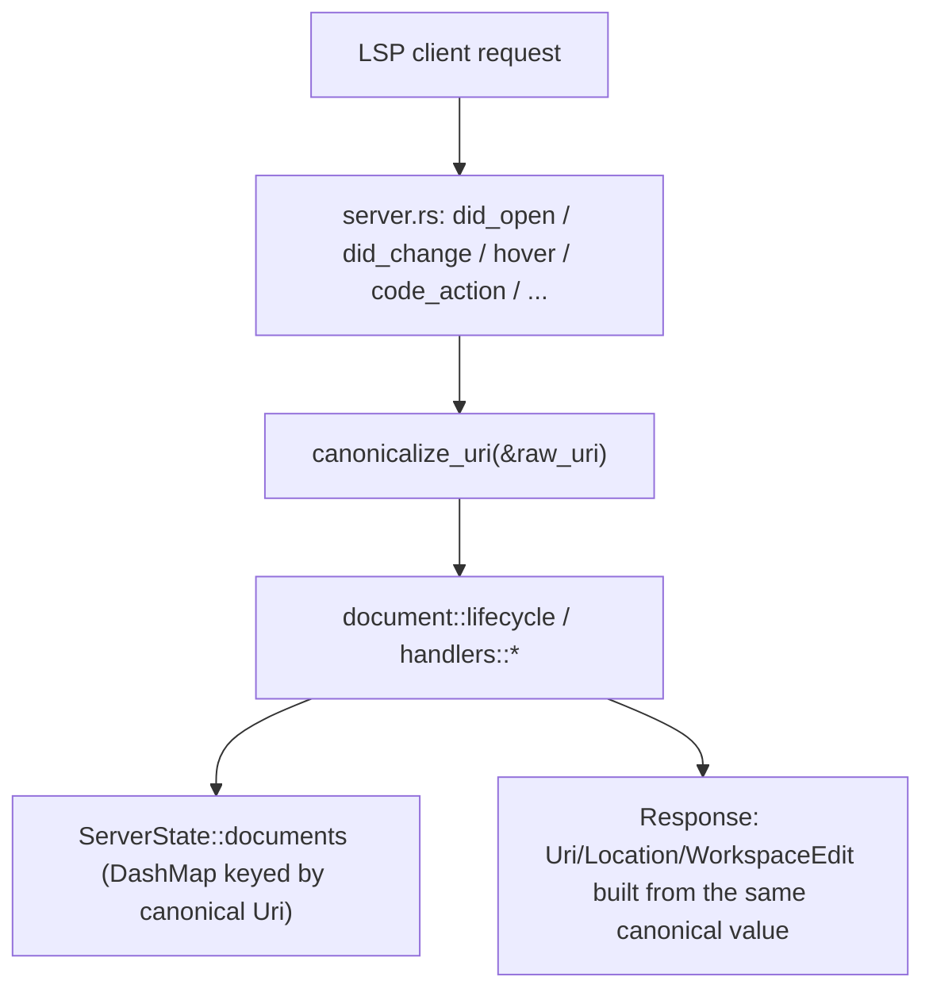

---
aliases:
  - Canonical Document Identity Plan
tags:
  - sdd
  - plan
  - deps-lsp
created: 2026-09-20
status: shipped
related:
  - "[[spec]]"
  - "[[constitution]]"
---

# Technical Plan: Canonical Document Identity

> [!info] References
> **Spec**: [[spec]]

## 1. Architecture

### Approach

Add one chokepoint function, `canonicalize_uri(&Uri) -> Uri`, in
`crates/deps-lsp/src/lsp_types_interop.rs` (alongside `from_lsp_uri`/
`to_lsp_uri`, which it composes):

```rust
pub fn canonicalize_uri(uri: &ls_types::Uri) -> ls_types::Uri {
    from_lsp_uri(uri)
        .map(|url| to_lsp_uri(&url))
        .unwrap_or_else(|| uri.clone())
}
```

- If `from_lsp_uri` accepts the URI, the round trip through `url::Url` yields
  the canonical spelling.
- If `from_lsp_uri` rejects it (malformed, or the #1090 Windows-drive-with-host
  guard), the original `Uri` is returned unchanged — downstream code already
  treats such URIs as unhandled (`EcosystemRegistry::for_uri` returns `None`),
  so no new document ever gets created under a non-canonical key for these;
  FR-005 is satisfied by construction, not by a separate check.

Call `canonicalize_uri` **once**, at the top of every `LanguageServer` trait
method in `crates/deps-lsp/src/server.rs` that extracts a `textDocument.uri`
(or `text_document_position*.text_document.uri`) from its params — before
that `uri` is passed to any `document::*` or `handlers::*` function. This
makes every downstream consumer (the `DashMap<Uri, DocumentState>` key,
lookup calls, and any response built by copying the request `uri` back) use
the canonical form automatically, with no changes required to the ~60
internal call sites already reading `uri`/`documents` — they keep their
existing signatures (`uri: Uri` / `uri: &Uri`), they just always receive an
already-canonical value now.

This is a *server-boundary* normalization, not a `deps-core` concept:
`url::Url`/`ls_types::Uri` conversion is `deps-lsp`-binary-crate-local
(`lsp_types_interop.rs`'s existing module doc explains why `to_lsp_uri` wraps
`deps_core::to_ls_uri` rather than living fully in `deps-core` — ecosystem
crates never construct `ls_types::Uri`). No `deps-core` changes needed.

### Component Diagram



### Key Design Decisions

| Decision | Choice | Rationale | Alternatives Considered |
|----------|--------|-----------|--------------------------|
| Where to canonicalize | Once, at each `server.rs` trait method entry | Single chokepoint per request path; avoids touching ~60 internal call sites | Canonicalize inside `document/lifecycle.rs`'s open/change task (rejected: doesn't cover `hover`/`completion`/`code_action`/etc. read paths that also do map lookups) |
| Canonical form | Round-trip through `url::Url` via existing `from_lsp_uri`/`to_lsp_uri` | Reuses existing, already-audited conversion (including the #1090 guard) instead of a new parser | Hand-rolled string normalization (rejected: constitution principle 4 analog — don't reimplement what a maintained/existing path already does correctly) |
| Rejected-URI fallback | Return the original `Uri` unchanged | Downstream already no-ops for `from_lsp_uri`-rejected URIs; no behavior change for that path | Returning `Option<Uri>` and threading `None` through every call site (rejected: much larger blast radius for no behavioral gain) |
| Response URI form | Always canonical (per spec's resolved open question) | LSP-conformant; removes the three existing rekey-to-original fixups entirely | Keep tracking "original vs. canonical" in parallel (rejected: this is exactly the fragility issue #1086 asks to remove) |

## 2. Project Structure

No new files/modules. Changes concentrated in:

```
crates/deps-lsp/src/
├── lsp_types_interop.rs        # add canonicalize_uri()
├── server.rs                   # call canonicalize_uri() at each trait-method entry
├── document/
│   ├── state.rs                # doc comment update only (documents map key is now "canonical Uri")
│   ├── lifecycle.rs            # no signature changes; remove now-redundant #1071 comments referencing per-call rekeying if any
│   ├── diff.rs / fetch.rs / osv_scan.rs / reparse.rs   # no changes expected (they receive already-canonical uri)
├── handlers/
│   ├── code_actions.rs         # delete rekey_edits_to_original_uri + its call site + its tests; replace with canonicalization-invariant tests
│   ├── code_lens.rs            # delete the equivalent command-argument fixup; same test treatment
│   ├── diagnostics.rs          # no local rekey (lives in deps-core); verify no direct raw-uri response construction remains
│   ├── completion.rs / inlay_hints.rs   # no changes expected

crates/deps-core/src/
└── lsp_helpers/diagnostics.rs  # delete related_information original-Uri rekey helper + its call site; replace test
```

## 3. Data Model

No schema/type changes. `ServerState::documents: DashMap<Uri, DocumentState>`
keeps its existing type signature — only the *value* used as the key changes
(canonical `Uri` instead of raw per-request `Uri`).

### Migrations

None (in-memory state only, no persisted format).

## 4. API Design

Not applicable (internal refactor, no public LSP-facing contract change other
than the URI spelling in response payloads, covered by FR-003/US-001).

## 5. Integration Points

| System | Direction | Protocol | Notes |
|--------|-----------|----------|-------|
| LSP client (editor) | inbound/outbound | LSP over stdio | Response URIs now always canonical form; NFR-002 requires live verification against a real client |

## 6. Security

- No new attack surface: `canonicalize_uri` composes two already-audited
  functions (`from_lsp_uri`'s #1090 guard, `to_lsp_uri`'s existing panics
  contract) without modifying either.
- Verify `to_lsp_uri`'s panic contract ("panics if `url` does not round-trip
  into an `ls_types::Uri`") cannot be triggered by any URL `from_lsp_uri`
  itself accepts — existing call sites already perform this exact round trip
  successfully (e.g. `code_lens.rs`'s command-argument construction), so this
  is confirmed safe, not a new risk, but worth a targeted property/fuzz-style
  test given canonicalize_uri now runs on every request instead of only a
  handler subset.

## 7. Testing Strategy

| Level | Framework | What to Test | Coverage Target |
|-------|-----------|---------------|------------------|
| Unit | `cargo nextest` | `canonicalize_uri`: identity for already-canonical input, normalization for each of the four documented spelling variants (`file://localhost/x`, `FILE:///x`, `.`/`..` segments, UNC `file:////server/share/x`), unchanged passthrough for a `from_lsp_uri`-rejected URI (including the #1090 shape) | All four normalization variants + the rejection passthrough |
| Integration | `cargo nextest` (existing `document::lifecycle` / `handlers::*` test modules) | Replace `test_rekey_edits_to_original_uri_*` (code_actions.rs) and its code_lens/diagnostics counterparts with tests asserting: open with spelling A, request with spelling B, same `DocumentState` resolved, response URI equals the canonical form | Every removed rekey test has a direct replacement, not a net test-count decrease |
| Cross-handler | `cargo nextest` | A `didOpen` with a non-canonical URI followed by `hover`/`codeAction`/`codeLens`/`diagnostic` requests using a *different* non-canonical spelling of the same file, asserting all four resolve the same document | New regression coverage for US-001, matching the project's `.local/testing/regressions.md` convention |
| Live | `RUST_LOG=debug cargo run -p deps-lsp` + real editor | NFR-002: confirm at least one real client (VS Code/Zed/Neovim) accepts a canonical-form response URI after sending a non-canonical request URI | Manual, documented per `.claude/rules/continuous-improvement.md` |

## 8. Performance Considerations

- `canonicalize_uri` is a pure string parse + reformat (no I/O), called once
  per request at the trait-method boundary — negligible relative to existing
  per-request work, and does not change the non-blocking-handler guarantee
  (constitution principle 3).

## 9. Rollout Plan

Single PR, no feature flag: this is a pre-1.0.0 internal behavior correction
(constitution principle 7 — pre-1.0 means clean breaks), not a
backward-compatibility-sensitive public API change.

## 10. Constitution Compliance

| Principle | Status | Notes |
|-----------|--------|-------|
| 3. Non-blocking LSP surface | Compliant | `canonicalize_uri` is synchronous, no I/O |
| 4. No hand-rolled version comparison | N/A | Not a version-comparison change |
| 5. Verify live, not just in CI | Compliant | NFR-002 / live testing step in section 7 |
| 7. Pre-1.0 means clean breaks | Compliant | Rekey helpers deleted outright, no deprecation shim |

## 11. Risks and Mitigations

| Risk | Impact | Probability | Mitigation |
|------|--------|-------------|------------|
| A real client rejects/mismatches a canonical-form response URI it didn't send verbatim | High (regression for that client) | Low (LSP clients are expected to normalize for comparison) | NFR-002 live-verification step before calling this done; if a client is found that breaks, document it and revisit the "always canonical" decision as a follow-up spec, not silently patch around it |
| A missed `server.rs` entry point still passes a raw, non-canonical `uri` deeper into the system | Medium (reintroduces the exact bug class this feature removes) | Medium (10 call sites, easy to miss one) | Enumerate every `LanguageServer` trait method touching `textDocument.uri` (list in Task T002) and add a single grep-based check (or a code-review checklist item) confirming each calls `canonicalize_uri` before first use |
| `to_lsp_uri`'s round-trip panic contract triggers on an edge-case canonical `url::Url` under production load | Low (panics on live server) | Very low (existing call sites already perform this round trip without issue) | Targeted unit test in section 7; if a failing case is found, fix `to_lsp_uri`/`deps_core::to_ls_uri` itself as a prerequisite, don't work around it in `canonicalize_uri` |

## See Also

- [[spec]] — feature specification
- [[tasks]] — implementation tasks
- [[MOC-specs]] — all specifications
