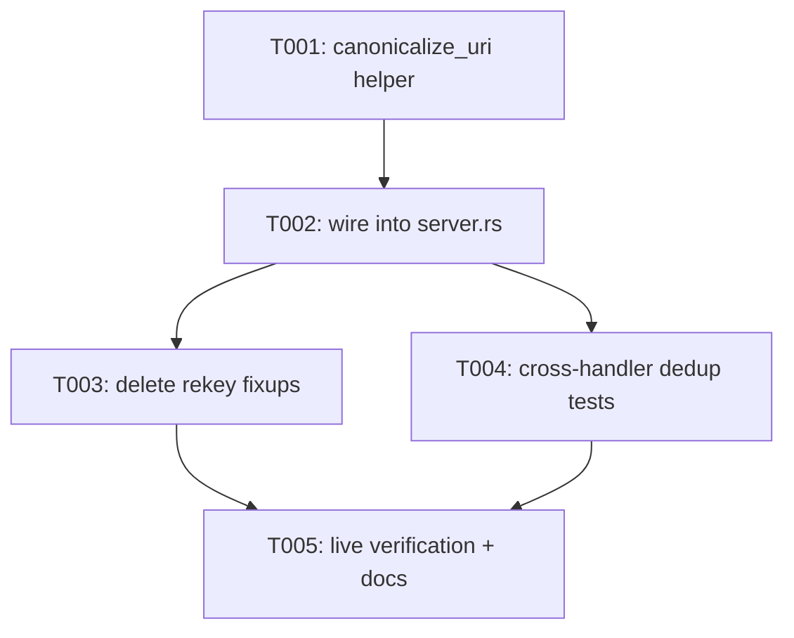

---
aliases:
  - Canonical Document Identity Tasks
tags:
  - sdd
  - tasks
  - deps-lsp
created: 2026-09-20
status: draft
related:
  - "[[spec]]"
  - "[[plan]]"
---

# Implementation Tasks: Canonical Document Identity

> [!info] References
> **Spec**: [[spec]]
> **Plan**: [[plan]]
> **Total tasks**: 5

## Progress

- [ ] T001: Add `canonicalize_uri` helper
- [ ] T002: Wire canonicalization into every `server.rs` LSP entry point
- [ ] T003: Delete the three #1071 per-handler rekey fixups and their tests
- [ ] T004: Cross-handler dedup regression tests (US-001)
- [ ] T005: Live-client verification (NFR-002) + docs/regression catalog update

---

## Dependency Graph

---

### T001: Add `canonicalize_uri` helper

**Context**: The single chokepoint function every entry point will call.
Must be added before anything can depend on it.
**Spec reference**: [[spec#FR-005]], [[spec#FR-007]]
**Acceptance criteria**:
- [ ] `canonicalize_uri(&ls_types::Uri) -> ls_types::Uri` added to
      `crates/deps-lsp/src/lsp_types_interop.rs`, composing `from_lsp_uri` +
      `to_lsp_uri` per [[plan#1-architecture]]
- [ ] Doc comment explains the round-trip and the rejected-URI passthrough
      (why `unwrap_or_else(|| uri.clone())` is correct, referencing FR-005)
- [ ] Unit tests: identity for already-canonical `file:///x.toml`;
      normalization for `file://localhost/x`, `FILE:///x`, a `.`/`..`-bearing
      path, and a UNC `file:////server/share/x` form; unchanged passthrough
      for a `from_lsp_uri`-rejected input (reuse the #1090 Windows-drive-host
      fixture already used in `lsp_types_interop.rs`'s existing tests)
**Dependencies**: none
**Files**: `crates/deps-lsp/src/lsp_types_interop.rs`
**Complexity**: low

---

### T002: Wire canonicalization into every `server.rs` LSP entry point

**Context**: Makes every downstream `ServerState::documents` key and
lookup use the canonical form without touching the ~60 internal call sites
in `document/*` and `handlers/*`.
**Spec reference**: [[spec#FR-001]], [[spec#FR-002]], [[spec#FR-007]]
**Acceptance criteria**:
- [ ] Every `LanguageServer` trait method in `crates/deps-lsp/src/server.rs`
      that extracts a `textDocument.uri` (or
      `text_document_position*.text_document.uri`) calls `canonicalize_uri`
      immediately after extraction, before passing it to any
      `document::*`/`handlers::*` function. Enumerate explicitly: `did_open`,
      `did_change`, `did_close`, `hover`, `completion`, `code_action`,
      `code_lens`, `diagnostic`, plus any other trait method reading a
      document URI found by grepping `params.text_document` /
      `text_document_position` in `server.rs`
- [ ] `did_change_watched_files` reviewed separately (it iterates multiple
      file events, not a single `textDocument.uri` — confirm whether it also
      needs canonicalization for consistency with `ServerState::documents`
      keys, or document why not)
- [ ] No internal call site signature changes required in `document/*` or
      `handlers/*` — they keep receiving `uri: Uri`/`&Uri`, now already
      canonical
- [ ] `cargo clippy --workspace --all-targets --all-features -- -D warnings`
      clean
**Dependencies**: T001
**Files**: `crates/deps-lsp/src/server.rs`
**Complexity**: medium

---

### T003: Delete the three #1071 per-handler rekey fixups and their tests

**Context**: With canonical-in/canonical-out guaranteed at the boundary,
these per-call-site fixups are now redundant — the exact fragility issue
#1086 was filed to remove.
**Spec reference**: [[spec#FR-006]], [[spec#US-002]]
**Acceptance criteria**:
- [ ] Delete `rekey_edits_to_original_uri` and its call site in
      `crates/deps-lsp/src/handlers/code_actions.rs`; delete or rewrite its
      existing unit tests (`test_rekey_edits_to_original_uri_*`) to instead
      assert the code action's `WorkspaceEdit.changes` key equals the
      canonical `Uri` already produced by T002
- [ ] Delete the equivalent code-lens command-argument fixup in
      `crates/deps-lsp/src/handlers/code_lens.rs`; same test treatment
- [ ] Delete the `related_information` original-`Uri` rekey helper in
      `crates/deps-core/src/lsp_helpers/diagnostics.rs`; same test treatment
- [ ] `test_handle_code_actions_rekeys_edit_to_original_non_canonical_uri`
      (or its replacement) still exercises a non-canonical input URI, but now
      asserts the *canonical* output, not the original spelling
- [ ] Full `cargo nextest run --workspace --all-features --no-fail-fast`
      green
**Dependencies**: T002
**Files**: `crates/deps-lsp/src/handlers/code_actions.rs`,
`crates/deps-lsp/src/handlers/code_lens.rs`,
`crates/deps-core/src/lsp_helpers/diagnostics.rs`
**Complexity**: medium

---

### T004: Cross-handler dedup regression tests (US-001)

**Context**: The spec's core user-facing guarantee — differently-spelled
requests for the same file resolve to the same document — needs direct
coverage beyond the per-helper unit tests in T001/T003.
**Spec reference**: [[spec#US-001]], [[spec#FR-004]]
**Acceptance criteria**:
- [ ] New integration test (in `document/lifecycle.rs`'s or `server.rs`'s
      existing test module, following existing patterns) that: opens a
      document via `didOpen` with a non-canonical URI spelling, then issues
      a `hover` (or `codeAction`/`codeLens`/`diagnostic`) request for the
      same physical file using a *different* non-canonical spelling, and
      asserts both resolve to the same `DocumentState` (e.g. via a marker
      set on first load, observed on the second request)
- [ ] Test covers at least two of the four documented spelling-variant
      classes (e.g. `file://localhost/x` vs `FILE:///x`)
- [ ] Add the minimal repro manifest/URI pair to
      `.local/testing/regressions.md` per
      `.claude/rules/branching.md`'s PR checklist
**Dependencies**: T002
**Files**: `crates/deps-lsp/src/document/lifecycle.rs` or
`crates/deps-lsp/src/server.rs` (test module), `.local/testing/regressions.md`
**Complexity**: medium

---

### T005: Live-client verification (NFR-002) + docs/regression catalog update

**Context**: Constitution principle 5 — passing tests are necessary but not
sufficient; this specific change trades "respond with the client's original
spelling" for "always respond canonical," which is a live-client-behavior
assumption that must be checked against a real editor, not just asserted in
tests.
**Spec reference**: [[spec#NFR-002]], [[spec#SC-002]]
**Acceptance criteria**:
- [ ] Run `RUST_LOG=debug cargo run -p deps-lsp` and connect at least one
      real editor client (VS Code, Zed, or Neovim); open a manifest file,
      trigger a code action/hover, confirm no client-side "unknown document"
      or duplicate-diagnostic behavior
- [ ] If feasible, trigger the non-canonical-spelling scenario directly
      (e.g. via a client extension/test harness sending a raw
      `file://localhost/...` URI) — document if the specific client under
      test normalizes URIs before sending, making this untestable from that
      client alone, and note which client(s) were actually exercised
- [ ] Document the session per `.claude/rules/continuous-improvement.md`
      (playbook update if this becomes a reusable check, or a note in the
      PR description if one-off)
- [ ] Update `CHANGELOG.md`'s `[Unreleased]` section with a one-line entry
      once the PR number is known
**Dependencies**: T003, T004
**Files**: `.local/testing/` (session notes), `CHANGELOG.md`
**Complexity**: low

---

## Implementation Notes

### Order of execution

T001 -> T002 must be strictly sequential (T002 depends on the helper
existing). T003 and T004 can run in parallel once T002 lands, since they
touch disjoint files. T005 is the final verification/documentation pass.

### Common patterns

- Follow the existing doc-comment density convention in
  `lsp_types_interop.rs` (explains *why*, not *what*) — see `from_lsp_uri`'s
  own doc comment for the target style.
- Existing #1071 tests in `code_actions.rs` (`test_rekey_edits_to_original_uri_replaces_single_entry_key`,
  `test_rekey_edits_to_original_uri_leaves_non_single_entry_edits_untouched`,
  `test_handle_code_actions_rekeys_edit_to_original_non_canonical_uri`) are
  the direct template for what T003's replacement tests should look like,
  just asserting canonical instead of original.

### Gotchas

- Don't forget `did_change_watched_files` (T002) — it's shaped differently
  (multiple file events) from the single-`textDocument.uri` methods and is
  easy to overlook in a grep for `params.text_document.uri`.
- `to_lsp_uri` panics if the round trip fails (see its `# Panics` doc) —
  T001's tests should confirm this never triggers for any input
  `from_lsp_uri` itself accepts, since `canonicalize_uri` now runs
  unconditionally on every request rather than only in a handler subset.

## See Also

- [[spec]] — feature specification
- [[plan]] — technical plan
- [[MOC-specs]] — all specifications
