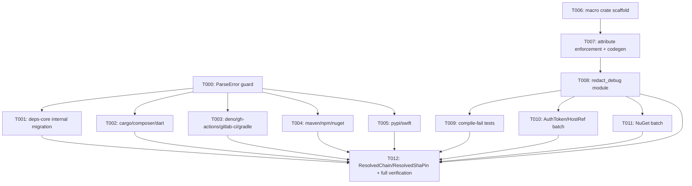

---
aliases:
  - Redaction Enforcement Guardrails Tasks
tags:
  - sdd
  - tasks
  - security
  - testing-infra
  - deps-core
created: 2026-09-23
status: draft
related:
  - "[[spec]]"
  - "[[plan]]"
---

# Implementation Tasks: Redaction Enforcement Guardrails

> [!info] References
> **Spec**: [[spec]]
> **Plan**: [[plan]]
> **Total tasks**: 13

## Progress

- [ ] T000: `ParseError` guard — variant `#[non_exhaustive]` + constructor
- [ ] T001: Migrate `deps-core`'s own internal `ParseError` construction sites
- [ ] T002: Migrate `deps-cargo`, `deps-composer`, `deps-dart` call sites
- [ ] T003: Migrate `deps-deno`, `deps-github-actions`, `deps-gitlab-ci`, `deps-gradle` call sites
- [ ] T004: Migrate `deps-maven`, `deps-npm`, `deps-nuget` call sites
- [ ] T005: Migrate `deps-pypi`, `deps-swift` call sites
- [ ] T006: `deps-core-macros` crate scaffold + `RedactingDebug` derive skeleton
- [ ] T007: `RedactingDebug` field-attribute enforcement + Debug-impl generation
- [ ] T008: `deps-core::redact_debug` module + re-export wiring
- [ ] T009: `trybuild` compile-fail fixtures + `ParseError` compile-fail doctest
- [ ] T010: Migrate `AuthToken`/`HostRef` batch to `RedactingDebug`
- [ ] T011: Migrate `NuGetAuth`/`RedactedSecret`/`PackageSourceEntry` batch
- [ ] T012: Migrate `ResolvedChain`/`ResolvedShaPin` batch + full workspace verification

---

## Dependency Graph

---

### T000: `ParseError` guard — variant `#[non_exhaustive]` + constructor

**Context**: The forcing mechanism for #1250 — everything else in this feature's `ParseError`
half depends on this compiling first (it will *break* every external construction site until
T001-T005 migrate them, which is the point).
**Spec reference**: [[spec#FR-001]], [[spec#FR-002]], [[spec#US-002]]
**Acceptance criteria**:
- [ ] `DepsError::ParseError` carries `#[non_exhaustive]` (mirrors `RateLimited`, `error.rs`)
- [ ] `DepsError::parse_error(file_type: impl Into<String>, source: &dyn std::fmt::Display) -> Self` added, calling `net_policy::parse_error_source` (or `redact::` if #1316 has merged to `main` by the time this task starts — check `main` first)
- [ ] `# Examples` doctest added to `parse_error`, mirroring `rate_limited`'s existing doctest
- [ ] `cargo check -p deps-core` passes; every other crate now fails to compile (expected — resolved by T001-T005)
**Dependencies**: none
**Files**: `crates/deps-core/src/error.rs`
**Complexity**: low

---

### T001: Migrate `deps-core`'s own internal `ParseError` construction sites

**Context**: `deps-core`'s own `lockfile.rs`/`ecosystem.rs`/`parser.rs` construct `ParseError`
directly today. Same-crate construction isn't blocked by `#[non_exhaustive]`, but the plan
calls for using the new constructor here too for consistency, not because it's forced.
**Spec reference**: [[spec#FR-002]]
**Acceptance criteria**:
- [ ] Every `ParseError { .. }` literal in `crates/deps-core/src/{lockfile.rs,ecosystem.rs,parser.rs}` replaced with `DepsError::parse_error(..)`
- [ ] `cargo check -p deps-core --all-features` passes
- [ ] `cargo nextest run -p deps-core --all-features` passes unchanged
**Dependencies**: T000
**Files**: `crates/deps-core/src/lockfile.rs`, `crates/deps-core/src/ecosystem.rs`, `crates/deps-core/src/parser.rs`
**Complexity**: low

---

### T002: Migrate `deps-cargo`, `deps-composer`, `deps-dart` call sites

**Context**: First external-crate migration batch — proves the constructor works from outside
`deps-core` and unblocks these three crates' compilation.
**Spec reference**: [[spec#FR-003]], [[spec#US-002]]
**Acceptance criteria**:
- [ ] Every `ParseError { .. }` literal in the listed files replaced with `DepsError::parse_error(file_type, &e)` (or the crate's existing error variable), preserving the exact `file_type` string previously used
- [ ] `cargo check -p deps-cargo -p deps-composer -p deps-dart --all-features` passes
- [ ] `cargo nextest run -p deps-cargo -p deps-composer -p deps-dart --all-features` passes unchanged (parse-error test cases still assert the same `Display` text)
**Dependencies**: T000
**Files**: `crates/deps-cargo/src/parser.rs`, `crates/deps-cargo/src/lockfile.rs`, `crates/deps-composer/src/lockfile.rs`, `crates/deps-dart/src/lockfile.rs`, `crates/deps-dart/src/parser.rs`
**Complexity**: low

---

### T003: Migrate `deps-deno`, `deps-github-actions`, `deps-gitlab-ci`, `deps-gradle` call sites

**Context**: Second external-crate migration batch.
**Spec reference**: [[spec#FR-003]], [[spec#US-002]]
**Acceptance criteria**:
- [ ] Every `ParseError { .. }` literal in the listed files replaced with `DepsError::parse_error(..)`
- [ ] `cargo check -p deps-deno -p deps-github-actions -p deps-gitlab-ci -p deps-gradle --all-features` passes
- [ ] `cargo nextest run -p deps-deno -p deps-github-actions -p deps-gitlab-ci -p deps-gradle --all-features` passes unchanged
**Dependencies**: T000
**Files**: `crates/deps-deno/src/parser.rs`, `crates/deps-github-actions/src/parser.rs`, `crates/deps-gitlab-ci/src/parser.rs`, `crates/deps-gradle/src/parser/catalog.rs`
**Complexity**: low

---

### T004: Migrate `deps-maven`, `deps-npm`, `deps-nuget` call sites

**Context**: Third external-crate migration batch — includes `deps-nuget/src/registry.rs`, the
only non-`parser.rs`/`lockfile.rs` call site found, worth double-checking manually.
**Spec reference**: [[spec#FR-003]], [[spec#US-002]]
**Acceptance criteria**:
- [ ] Every `ParseError { .. }` literal in the listed files replaced with `DepsError::parse_error(..)`
- [ ] `cargo check -p deps-maven -p deps-npm -p deps-nuget --all-features` passes
- [ ] `cargo nextest run -p deps-maven -p deps-npm -p deps-nuget --all-features` passes unchanged
**Dependencies**: T000
**Files**: `crates/deps-maven/src/parser.rs`, `crates/deps-npm/src/lockfile.rs`, `crates/deps-nuget/src/registry.rs`, `crates/deps-nuget/src/lockfile.rs`, `crates/deps-nuget/src/parser.rs`
**Complexity**: low

---

### T005: Migrate `deps-pypi`, `deps-swift` call sites

**Context**: Final external-crate migration batch — after this, the full workspace compiles
again with the guard active everywhere.
**Spec reference**: [[spec#FR-003]], [[spec#US-002]], [[spec#SC-001]]
**Acceptance criteria**:
- [ ] Every `ParseError { .. }` literal in the listed files replaced with `DepsError::parse_error(..)`
- [ ] `cargo check --workspace --all-features` passes (first point at which the *entire* workspace compiles again)
- [ ] `cargo nextest run -p deps-pypi -p deps-swift --all-features` passes unchanged
- [ ] A `compile_fail` doctest added near `DepsError::ParseError`'s own doc comment in `error.rs`, demonstrating an external-crate-style `ParseError { .. }` literal fails to compile (SC-001) — written as a doctest here since it's the natural place once every real call site is migrated and the guard is proven live
**Dependencies**: T000, T002, T003, T004
**Files**: `crates/deps-pypi/src/ecosystem.rs`, `crates/deps-pypi/src/error.rs`, `crates/deps-pypi/src/lockfile.rs`, `crates/deps-pypi/src/parser/pyproject.rs`, `crates/deps-swift/src/lockfile.rs`, `crates/deps-core/src/error.rs` (doctest only)
**Complexity**: medium (the compile_fail doctest needs care to fail for the *right* reason — E0639, not an unrelated type error)

---

### T006: `deps-core-macros` crate scaffold + `RedactingDebug` derive skeleton

**Context**: First piece of the #1238 half — establishes the new proc-macro crate before any
real logic is written.
**Spec reference**: [[spec#FR-004]]
**Acceptance criteria**:
- [ ] `crates/deps-core-macros/Cargo.toml` created: `name = "deps-core-macros"`, `[lib] proc-macro = true`, workspace-inherited `version`/`edition`/`rust-version`/`authors`/`license`/`repository`, `publish = true`, `[lints] workspace = true`
- [ ] Root `Cargo.toml`'s `[workspace.dependencies]` gains `deps-core-macros = { version = "1.2.0", path = "crates/deps-core-macros" }` (alphabetically sorted) and `syn = "3.0.6"`, `quote = "1.0.47"`, `proc-macro2 = "1.0.107"` (versions confirmed live via `cargo add --dry-run` at plan time — re-verify at implementation time in case newer patch/minor versions shipped since)
- [ ] `deps-core-macros/src/lib.rs` exports `#[proc_macro_derive(RedactingDebug, attributes(redact, raw))] pub fn derive_redacting_debug(...)` that currently just parses input and re-emits an empty `impl Debug` stub (logic lands in T007)
- [ ] `cargo build -p deps-core-macros` succeeds
- [ ] Crate-level `//!` doc comment explaining the macro's purpose and pointing to issue #1238
**Dependencies**: none (can run in parallel with T000-T005)
**Files**: `crates/deps-core-macros/Cargo.toml`, `crates/deps-core-macros/src/lib.rs`, root `Cargo.toml`
**Complexity**: low

---

### T007: `RedactingDebug` field-attribute enforcement + Debug-impl generation

**Context**: The actual compile-time guarantee — this is where FR-005/FR-006 get implemented.
**Spec reference**: [[spec#FR-005]], [[spec#FR-006]], [[spec#US-001]]
**Acceptance criteria**:
- [ ] Only `Data::Struct` with `Fields::Named` accepted; anything else (`enum`, tuple struct, unit struct) produces a `syn::Error::new_spanned(...).to_compile_error()` naming the type and why (per spec's Edge Cases table)
- [ ] Every named field must carry exactly one of `#[redact(url)]`, `#[redact(key)]`, `#[raw]`; zero or 2+ matching attributes on one field is a compile error naming the field and the struct (FR-005)
- [ ] Generated `impl std::fmt::Debug` calls `f.debug_struct(...)`.`field(name, &...)` per field, dispatching to the field-attribute's runtime helper (T008) for `#[redact(*)]` fields and the field's own `Debug` for `#[raw]`
- [ ] `# Examples` doctest on the derive itself (in `deps-core-macros/src/lib.rs` or re-exported doc in `deps-core`), following the same `mod example { ... }` wrapping pattern `debug_redaction_conformance!`'s own doc uses (see `conformance.rs`'s doc comment for why)
**Dependencies**: T006
**Files**: `crates/deps-core-macros/src/lib.rs`
**Complexity**: high

---

### T008: `deps-core::redact_debug` module + re-export wiring

**Context**: Consumers must depend on `deps-core` alone, never `deps-core-macros` directly
(plan's Key Design Decisions). This module is that seam, and holds the runtime helper
functions the derive's generated code calls into.
**Spec reference**: [[spec#FR-006]]
**Acceptance criteria**:
- [ ] `deps-core/Cargo.toml` gains `deps-core-macros = { workspace = true }` as a normal dependency
- [ ] New `crates/deps-core/src/redact_debug.rs`: `pub use deps_core_macros::RedactingDebug;` plus `#[doc(hidden)]` helper fns wrapping the URL/key redactors (check `main` at implementation time for whether these live at `net_policy::{RedactedUrl, redact_declaration_key}` or the post-#1316 `redact::` path — plan's risk table)
- [ ] Module registered in `deps-core/src/lib.rs`
- [ ] `cargo doc -p deps-core --no-deps` builds clean (rustdoc gate)
**Dependencies**: T007
**Files**: `crates/deps-core/Cargo.toml`, `crates/deps-core/src/redact_debug.rs`, `crates/deps-core/src/lib.rs`
**Complexity**: low

---

### T009: `trybuild` compile-fail fixtures for `RedactingDebug`

**Context**: Proves FR-005's compile errors actually fire, per the plan's Testing Strategy —
without this, a future regression in T007's macro logic could silently start accepting
unannotated fields again.
**Spec reference**: [[spec#SC-002]]
**Acceptance criteria**:
- [ ] `trybuild = "1.0.121"` added to `deps-core-macros`'s (or `deps-core`'s, whichever crate hosts the harness — `deps-core` is the natural home since that's where real usages live) `[dev-dependencies]`
- [ ] `tests/redacting_debug_compile_fail.rs` harness + `tests/redacting_debug_compile_fail/fixtures/missing_attribute.rs` (+ matching `.stderr`) proving an unannotated field fails to compile
- [ ] A second fixture proving a field with two conflicting attributes (`#[redact(url)] #[raw]`) fails to compile
- [ ] A third fixture proving a tuple struct / enum input fails to compile with a clear message
- [ ] `cargo nextest run -p deps-core --all-features -E 'test(redacting_debug_compile_fail)'` passes
**Dependencies**: T008
**Files**: `crates/deps-core/Cargo.toml`, `crates/deps-core/tests/redacting_debug_compile_fail.rs`, `crates/deps-core/tests/redacting_debug_compile_fail/fixtures/*.rs`, `.stderr`
**Complexity**: medium

---

### T010: Migrate `AuthToken`/`HostRef` batch to `RedactingDebug`

**Context**: First real-world proof the derive works end-to-end, replacing hand-written impls
for the simplest, most duplicated type in the migration batch (`AuthToken` appears three
times independently).
**Spec reference**: [[spec#FR-007]], [[spec#FR-008]], [[spec#US-001]]
**Acceptance criteria**:
- [ ] `deps-cargo::config::AuthToken`, `deps-core::github::AuthToken`, `deps-gitlab-ci::client::AuthToken`, `deps-gitlab-ci::types::HostRef` each get `#[derive(deps_core::redact_debug::RedactingDebug)]` with per-field `#[redact(url)]`/`#[redact(key)]`/`#[raw]` attributes matching their current hand-written impl's behavior exactly
- [ ] The 4 hand-written `impl std::fmt::Debug for ...` blocks are deleted
- [ ] Each type's existing `debug_redaction_conformance!` invocation is unchanged and still passes (byte-identical probe assertions — FR-008)
- [ ] `cargo check -p deps-cargo -p deps-core -p deps-gitlab-ci --all-features` passes
**Dependencies**: T008
**Files**: `crates/deps-cargo/src/config.rs`, `crates/deps-core/src/github.rs`, `crates/deps-gitlab-ci/src/client.rs`, `crates/deps-gitlab-ci/src/types.rs`
**Complexity**: medium

---

### T011: Migrate `NuGetAuth`/`RedactedSecret`/`PackageSourceEntry` batch

**Context**: Second migration batch — all three types live in the same file
(`deps-nuget/src/config.rs`), so this is naturally one task.
**Spec reference**: [[spec#FR-007]], [[spec#FR-008]]
**Acceptance criteria**:
- [ ] All three types get `#[derive(RedactingDebug)]` with field attributes matching current behavior
- [ ] The 3 hand-written `impl Debug` blocks deleted
- [ ] Existing `debug_redaction_conformance!` invocations for all three pass unchanged
- [ ] `cargo check -p deps-nuget --all-features` passes
**Dependencies**: T008
**Files**: `crates/deps-nuget/src/config.rs`
**Complexity**: medium

---

### T012: Migrate `ResolvedChain`/`ResolvedShaPin` batch + full workspace verification

**Context**: Final migration-batch task, plus the point where every other task's work is
verified together as a whole (this is the "does everything actually compile and pass as one
PR" checkpoint).
**Spec reference**: [[spec#FR-007]], [[spec#FR-008]], [[spec#SC-003]], [[spec#SC-004]], [[spec#SC-005]]
**Acceptance criteria**:
- [ ] `deps-pypi::config::ResolvedChain` and `deps-core::lsp_helpers::git_ref::ResolvedShaPin` get `#[derive(RedactingDebug)]`; hand-written impls deleted
- [ ] All 9 migration-batch types' `debug_redaction_conformance!` tests pass (SC-003)
- [ ] `cargo +nightly fmt --all -- --check` passes
- [ ] `cargo clippy --workspace --all-targets --all-features -- -D warnings` passes
- [ ] `cargo nextest run --workspace --all-features --no-fail-fast` passes
- [ ] `cargo test --workspace --doc --all-features` passes (including the T005 `compile_fail` doctest and T007's derive doctest)
- [ ] `RUSTFLAGS="-D warnings" RUSTDOCFLAGS="-D warnings" cargo doc --workspace --no-deps --all-features` passes
- [ ] `cargo tree -p deps-lsp -e features,no-dev` and `cargo tree -p deps-cli -e features,no-dev` do not list `deps-core-macros` (SC-005) unless one of them ends up using the derive directly (not expected per this spec's migration batch)
- [ ] `CHANGELOG.md`'s `[Unreleased]` section gets one line for this feature
- [ ] Follow-up issue filed (P4, `testing-infra` + `type/refactor` labels) for the remaining ~26 unmigrated struct `Debug` impls, per spec's resolved Open Question
**Dependencies**: T001, T002, T003, T004, T005, T009, T010, T011
**Files**: `crates/deps-pypi/src/config.rs`, `crates/deps-core/src/lsp_helpers/git_ref.rs`, `CHANGELOG.md`
**Complexity**: medium

---

## Implementation Notes

### Order of execution

The `ParseError` half (T000-T005) and the `RedactingDebug` half (T006-T011) have no code
dependency on each other and can run in parallel work-streams if split across two
implementers; T012 is the join point that verifies both halves together. Within the
`ParseError` half, T002-T005 are independent of each other once T000 lands and can run in any
order or in parallel.

### Common patterns

- Mirror `DepsError::rate_limited`'s existing doc-comment and doctest shape exactly for
  `DepsError::parse_error` (T000) — reviewers will expect the same shape for the same pattern.
- Mirror `debug_redaction_conformance!`'s own doc comment's `mod example { ... }` wrapping
  pattern for the new derive's doctest (T007) — see that macro's doc for why a bare `#[test]`
  fn body would be silently elided in a doctest otherwise.
- Every `ParseError { .. }` -> `DepsError::parse_error(..)` substitution (T001-T005) should be
  a pure syntactic swap — same `file_type` string, same underlying error value passed as
  `&e`/`&err` (whatever the local binding is named) instead of pre-wrapped in `Box::new(...)`.

### Gotchas

- T005's `compile_fail` doctest must fail for the *right* reason (E0639, not-visible-outside-crate
  construction) — a doctest that merely fails to compile for an unrelated reason (e.g. a typo)
  would still "pass" trybuild/doctest tooling's compile-fail check without proving anything.
  Include the expected error text in the doctest's surrounding prose if the doctest harness
  supports asserting on it, or add a plain-English comment stating the intended failure mode
  for a human reviewer to verify.
- T007/T009: `syn` 3.0's API differs from widely-copied `syn` 2.x tutorial code online — consult
  `syn = "3.0.6"`'s own docs.rs page during implementation rather than assuming an older API
  shape (plan's Risks table).
- T010/T011/T012: if a field's redaction turns out not to cleanly fit `#[redact(url)]`/
  `#[redact(key)]`/`#[raw]` once actually attempted, drop that type from the batch and add it
  to the follow-up-issue list (T012's last acceptance criterion) rather than forcing an
  ill-fitting attribute choice — this was anticipated in the plan's Risks table.

## See Also

- [[spec]] — feature specification
- [[plan]] — technical plan
- [[MOC-specs]] — all specifications
