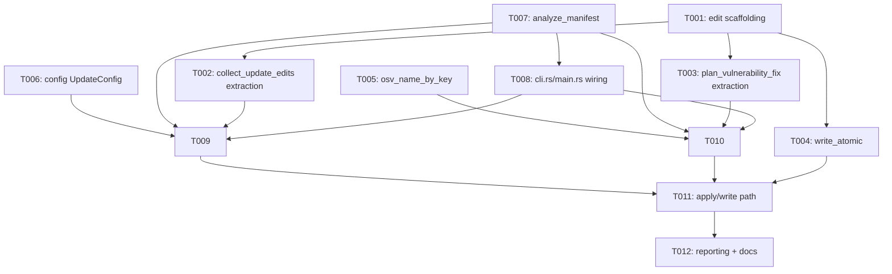

---
aliases:
  - deps-cli update subcommand Tasks
tags:
  - sdd
  - tasks
  - deps-cli
  - deps-core
  - security
created: 2026-09-23
status: draft
related:
  - "[[spec]]"
  - "[[plan]]"
---

# Implementation Tasks: deps-cli update subcommand

> [!info] References
> **Spec**: [[spec]]
> **Plan**: [[plan]]
> **Total tasks**: 12

## Progress

- [ ] T001: `deps_core::edit` scaffolding — `ManifestEdit`, `PlannedUpdate`, `EditSpan`, generic `dedup_overlapping_edits<E>`, `apply_edits`, `UpdateKind`/`classify_update`
- [ ] T002: Extract `collect_update_edits` from `code_lenses.rs`; reduce `collect_update_all_edits` to a thin adapter
- [ ] T003: Extract `plan_vulnerability_fix` from `code_actions.rs`; reduce `build_vulnerability_fix_action` to a thin adapter
- [ ] T004: `deps_core::fs_probe::write_atomic` — symlink refusal, platform permission split, sync + rename
- [ ] T005: `deps_engine::classify::osv::osv_name_by_key` helper
- [ ] T006: `deps-cli` config: `UpdateConfig`/`IgnoreRule`/`UpdateTypeToken` on `CliConfig`; lift allowlist to `safe_auto_discovered_config`
- [ ] T007: `deps-cli analyze.rs` — extract `ManifestAnalysis`/`analyze_manifest` from `report.rs`
- [ ] T008: `deps-cli cli.rs`/`main.rs` — `Command::Update(UpdateArgs)` wiring, no `CommonArgs` flatten
- [ ] T009: `deps-cli update/mod.rs` + `update/ignore.rs` — default-mode planner, `--package`/ignore-rule filtering, fail-closed `Unknown` handling
- [ ] T010: `deps-cli update/security.rs` — `--security-only` planner: phase-B OSV re-verification, three-outcome classification, yank filter
- [ ] T011: `deps-cli` apply/write path — dedup, `apply_edits`, TOCTOU re-check, `write_atomic` call, `--dry-run`
- [ ] T012: `deps-cli` reporting — `render_update` (table/json), `update_exit_code`, docs + CHANGELOG

---

## Dependency Graph

No T000 scaffolding task — `deps_core::edit` (T001) is the module-creation
task itself; every other new file is created by the task that first needs it.

---

### T001: `deps_core::edit` scaffolding

**Context**: Foundation for every other task. Creates the new, ungated
`deps-core` module hosting the domain types both `deps-lsp` (via thin
adapters, T002/T003) and `deps-cli` (T009/T010) will consume — the
extraction shape spec 064 already established for `Diagnostic`. This task
does not yet move any planner body; it defines the shared vocabulary
(`ManifestEdit`, `PlannedUpdate`, `EditSpan`, generic dedup, `apply_edits`,
`UpdateKind`) that T002/T003 will populate.

**Spec reference**: [[spec#FR-001]], [[spec#FR-004]], [[spec#FR-023]]

**Acceptance criteria**:
- [ ] New `crates/deps-core/src/edit.rs`, **not** feature-gated, exported from `lib.rs`
- [ ] `ManifestEdit { range: crate::position::Range, new_text: String }`
- [ ] `PlannedUpdate { name, normalized_name, name_range, current, target, edit }` per plan.md §3
- [ ] `EditSpan` trait (`start()`/`end()` returning `(u32, u32)`), implemented for `ManifestEdit`
- [ ] `dedup_overlapping_edits<E: EditSpan>(edits: Vec<E>, caller: &str) -> Vec<E>` — generic version of the existing `code_lenses.rs::dedup_overlapping_edits`, moved here with identical overlap-comparison semantics (verify against the existing function's current test cases before generalizing)
- [ ] `apply_edits(content: &str, edits: &[ManifestEdit]) -> String` — converts each range via the existing `LineOffsetTable::position_to_byte_offset` and splices in **reverse** range order (new logic — no prior crate had a non-LSP-client apply path)
- [ ] `UpdateKind { Major, Minor, Patch, Unknown }` and `classify_update(from: &str, to: &str) -> UpdateKind` — leading-dotted-numeric-segment comparison; explicitly **not** built on `is_same_major_minor` (its `_ => true` fallback is wrong for this purpose)
- [ ] `classify_update` unit tests cover every FR-004 counterexample: GitHub Actions SHA pins, Go pseudo-versions (`v0.0.0-2021...`), Maven/NuGet range syntax, `*`/`latest`/`workspace:*`, Gradle `{strictly}!!{preferred}` — all classify `Unknown`
- [ ] `dedup_overlapping_edits`'s new generic signature is documented as a breaking `pub` API change in the function's own doc comment (`# Breaking` note or equivalent), and a `### Breaking` line is added to `CHANGELOG.md`'s `[Unreleased]` section (FR-023)
- [ ] `cargo +nightly fmt --all -- --check`, `cargo clippy --workspace --all-targets --all-features -- -D warnings`, `cargo nextest run -p deps-core` all pass
- [ ] `cargo test --workspace --doc --all-features` passes (every new `pub` item has a `///` doc comment with a runnable example per this crate's convention)

**Dependencies**: none

**Files**: `crates/deps-core/src/edit.rs` (new), `crates/deps-core/src/lib.rs`, `CHANGELOG.md`

**Complexity**: medium

---

### T002: Extract `collect_update_edits` from `code_lenses.rs`

**Context**: Moves `collect_update_all_edits`'s body (`code_lenses.rs:143-222`)
into `deps_core::edit::collect_update_edits`, adding the attribution fields
`PlannedUpdate` needs that the LSP variant currently discards. The existing
`lsp-responses`-gated function becomes a one-line adapter mapping
`Vec<PlannedUpdate>` to `Vec<ls_types::TextEdit>`, so `deps-lsp`'s
update-all code lens stays byte-identical (FR-001).

**Spec reference**: [[spec#FR-001]], [[spec#FR-003]]

**Acceptance criteria**:
- [ ] `deps_core::edit::collect_update_edits(parse_result, content, versions, formatter) -> Vec<PlannedUpdate>` — verbatim move of the existing literal-span guard, `is_safe_version_string` check, `requirement_status_for == Outdated` filter, no-op guard, and overlap dedup (now via T001's generic `dedup_overlapping_edits`), plus `name`/`normalized_name`/`name_range`/`current`/`target` attribution
- [ ] `from` (the "current" side of the classification, used by later tasks) is derived via `resolve_in_use_version` per occurrence — never the collapsed per-name map — falling back to `UpdateKind::Unknown` when it returns `None` (FR-003; no separate "resolved literal" fallback branch — that path is dead code, since `resolve_in_use_version` already performs that check as its own first action)
- [ ] `lsp_helpers::code_lenses::collect_update_all_edits` becomes `collect_update_edits(..).into_iter().map(|p| p.edit.into()).collect()`, with `From<ManifestEdit> for ls_types::TextEdit` defined in the gated module
- [ ] `pub use` retained at `lsp_helpers/mod.rs` for the dedup re-export so `deps_github_actions::collect_pin_all_to_sha_edits` (`ecosystem.rs:624`) compiles unchanged with `E = TextEdit` inferred
- [ ] Every existing `code_lenses.rs` unit test and `generate_code_lenses` insta snapshot passes with **zero changes** (FR-001, SC-001)
- [ ] New `deps-core` unit test: `collect_update_edits` on a fixture with a renamed/aliased Cargo dependency (spec 050 case) classifies each occurrence against its own resolved pin
- [ ] `cargo +nightly fmt --all -- --check`, `cargo clippy --workspace --all-targets --all-features -- -D warnings`, `cargo nextest run -p deps-core -p deps-lsp` all pass

**Dependencies**: T001

**Files**: `crates/deps-core/src/edit.rs`, `crates/deps-core/src/lsp_helpers/code_lenses.rs`

**Complexity**: high

---

### T003: Extract `plan_vulnerability_fix` from `code_actions.rs`

**Context**: Moves `build_vulnerability_fix_action`'s planning core
(`code_actions.rs:98-220`) into `deps_core::edit::plan_vulnerability_fix`.
Yank/timeout filtering stays with callers (both `deps-lsp` and `deps-cli`
apply their own source and policy for that, per the existing
`generate_code_actions` split at `code_actions.rs:595-604`). The extracted
core must take the prebuilt vulnerability-keys map as a parameter rather
than rebuilding it — `build_vulnerability_fix_action` currently rebuilds it
per dependency (`code_actions.rs:110-120`), tolerable for one
position-driven LSP request but O(n²) for a planner iterating every
dependency in a manifest.

**Spec reference**: [[spec#FR-001]], [[spec#FR-009]], [[spec#FR-012]]

**Acceptance criteria**:
- [ ] `deps_core::edit::plan_vulnerability_fix(dep, fix, formatter) -> Result<PlannedUpdate, VulnFixSkip>` (#1350: typed `VulnFixSkip` replaces the original `Option<PlannedUpdate>`) — the no-op guard, `is_safe_version_string`, `osv_version_to_native`, and the internal (`pub(crate)`) fix-target verification gate, moved verbatim; yank/`fetch_timed_out` filtering explicitly left to the caller (not moved)
- [ ] The function signature takes the prebuilt vulnerability-key (or the already-resolved key for the occurrence) rather than calling `osv::vulnerability_keys` internally
- [ ] `build_vulnerability_fix_action` becomes a thin adapter: hoists the `vulnerability_keys` call to its own single call site, then delegates to `plan_vulnerability_fix`, keeping its current yank-filtering/`fetch_timed_out` behavior at `code_actions.rs:595-604` unchanged
- [ ] Every existing `code_actions.rs` unit test and any related insta snapshot passes with **zero changes** (FR-001, SC-001)
- [ ] `cargo +nightly fmt --all -- --check`, `cargo clippy --workspace --all-targets --all-features -- -D warnings`, `cargo nextest run -p deps-core -p deps-lsp` all pass

**Dependencies**: T001

**Files**: `crates/deps-core/src/edit.rs`, `crates/deps-core/src/lsp_helpers/code_actions.rs`

**Complexity**: high

---

### T004: `deps_core::fs_probe::write_atomic`

**Context**: The atomic-write primitive both the default and `--security-only`
paths use (T011). Deliberately does not promote `tempfile` (it is
`optional = true` behind `deps-core`'s `test-util` feature; promoting it
would land on a `publish = true` crate and link into `deps-lsp`'s release
binary). Uses `OpenOptions::create_new(true)` instead, which closes the
symlink-pre-creation race by open-mode.

**Spec reference**: [[spec#FR-016]], [[spec#FR-017]], [[spec#FR-018]]

**Acceptance criteria**:
- [ ] `write_atomic(path: &Path, content: &str) -> io::Result<()>` in `deps-core/src/fs_probe.rs`, beside `read_to_string_capped`
- [ ] Refuses (returns an `io::Error`, no temp file created) when `path`'s final path component is a symlink — checked via a symlink-metadata lstat before any file is opened
- [ ] Creates the temp file in the manifest's own directory via `OpenOptions::new().write(true).create_new(true).open(tmp_path)`, with a name pattern `<manifest>.deps-cli-<pid>-<nanos>.tmp`
- [ ] On Unix (`#[cfg(unix)]`): reads the original file's permissions via `metadata()` and calls `set_permissions` on the **open temp handle**, before any content is written
- [ ] On non-Unix (`#[cfg(not(unix))]`): skips the permission-copy step entirely — no fallback write of a hardcoded mode, per the corrected platform-split design (critic finding N3)
- [ ] After writing content: `sync_all()` on the file, then `fs::rename(tmp_path, path)`
- [ ] The temp file is removed on every error path before returning (no orphaned temp file on a handled error — an RAII guard or explicit cleanup)
- [ ] Doc comment states the accepted TOCTOU limitation (re-read-compare narrows but does not close the race) and that `sync_all` covers the file's own durability only, not the rename's directory-entry durability
- [ ] Unit tests (`tempfile::TempDir` fixtures): symlink-final-component refusal (`#[cfg(unix)]`, using `std::os::unix::fs::symlink`); Unix permission-copy-before-write ordering (assert the temp file's mode matches the original's before content is written, not only after rename); successful write replaces content atomically (assert `fs::rename` target ends up with new content and old file handle, if held open during rename, still sees pre-rename content on Unix)
- [ ] `cargo +nightly fmt --all -- --check`, `cargo clippy --workspace --all-targets --all-features -- -D warnings`, `cargo nextest run -p deps-core` all pass

**Dependencies**: T001 (module conventions only; no direct code dependency)

**Files**: `crates/deps-core/src/fs_probe.rs`

**Complexity**: medium

---

### T005: `deps_engine::classify::osv::osv_name_by_key`

**Context**: A two-line projection over `build_scan_targets`'s own
`Vec<ScanTarget>` (`t.key` → `t.osv_name`), needed by the `--security-only`
planner's phase-B re-verification (T010). `deps-lsp` builds the identical
map inline today (`document/osv_scan.rs:116`) — this task centralizes it in
`deps-engine` so `deps-cli` does not duplicate it.

**Spec reference**: [[spec#FR-009]]

**Acceptance criteria**:
- [ ] `pub fn osv_name_by_key(targets: &[ScanTarget]) -> HashMap<String, String>` added to `crates/deps-engine/src/classify/osv.rs`, ungated
- [ ] `deps-lsp`'s `document/osv_scan.rs:116` inline construction is replaced with a call to this function (no behavior change — verify with existing `deps-lsp` OSV-scan tests)
- [ ] Unit test: given a small `Vec<ScanTarget>` fixture, returns the expected `key -> osv_name` map
- [ ] `cargo +nightly fmt --all -- --check`, `cargo clippy --workspace --all-targets --all-features -- -D warnings`, `cargo nextest run -p deps-engine -p deps-lsp` all pass

**Dependencies**: none

**Files**: `crates/deps-engine/src/classify/osv.rs`, `crates/deps-lsp/src/document/osv_scan.rs`

**Complexity**: low

---

### T006: `deps-cli` config: `UpdateConfig` + allowlist lift

**Context**: Adds the `[update]` config section (#1119) to `CliConfig`
(already `#[non_exhaustive]`), and widens the existing
`safe_auto_discovered_policy(PolicyConfig) -> PolicyConfig` allowlist one
level to `safe_auto_discovered_config(CliConfig) -> CliConfig`, so a new
`CliConfig` field is safe-by-default under auto-discovery rather than
attacker-controlled by default — without touching `PolicyConfig`'s
deliberately exhaustive, CI-guarded shape.

**Spec reference**: [[spec#FR-007]], data model §5 (config schema)

**Acceptance criteria**:
- [ ] `UpdateConfig { ignore: Vec<IgnoreRule> }`, `IgnoreRule { name: String, update_types: Option<Vec<UpdateTypeToken>> }`, `UpdateTypeToken { Major, Minor, Patch }` added to `crates/deps-cli/src/config.rs`, `#[serde(deny_unknown_fields)]` on the section (an unrecognized `update_types` token is a hard config error)
- [ ] `CliConfig` gains `#[serde(default)] pub update: UpdateConfig`
- [ ] `safe_auto_discovered_policy` renamed to `safe_auto_discovered_config`, takes/returns `CliConfig`, builds `CliConfig { policy: <existing six-field policy allowlist>, ..CliConfig::default() }` — `update` is dropped by omission, not by an explicit strip step
- [ ] Every existing caller of `safe_auto_discovered_policy` (used by `check`'s auto-discovery path) updated to the new name/signature; `check`'s existing auto-discovery tests pass unchanged
- [ ] No `ignored_sections` arm added for `update` (auto-discovery drop is a provable no-op since `check` never renders `UpdateConfig` — do not add unnecessary warning plumbing)
- [ ] Unit test: an auto-discovered `deps.toml` containing `[update].ignore` entries has them silently dropped from the `CliConfig` `check` actually uses, while the six `*_severity` values survive
- [ ] Unit test: `--config <path>` (the `required = true` path) loads `[update].ignore` verbatim, unfiltered by the allowlist
- [ ] Unit test: `[update].ignore` entry with an unrecognized `update_types` token fails config load with a clear error
- [ ] `cargo +nightly fmt --all -- --check`, `cargo clippy --workspace --all-targets --all-features -- -D warnings`, `cargo nextest run -p deps-cli` all pass

**Dependencies**: none

**Files**: `crates/deps-cli/src/config.rs`

**Complexity**: medium

---

### T007: `deps-cli analyze.rs` extraction

**Context**: `update` needs the same parse → lockfile → fetch → OSV
pipeline `check` already runs, without duplicating it. This task extracts
that shared prefix out of `check_manifest` (`report.rs:408-580`) into a new
`analyze_manifest` function returning a reusable `ManifestAnalysis`, with no
behavior change to `check`.

**Spec reference**: plan.md §2 (Project Structure)

**Acceptance criteria**:
- [ ] New `crates/deps-cli/src/analyze.rs`: `ManifestAnalysis` (owns `Box<dyn ParseResult>` plus every map `VersionData<'a>` borrows) and `analyze_manifest(...) -> Result<ManifestAnalysis, CheckError>`, containing the parse, `load_resolved_versions`, `dedup_dependencies_by_source`, `collect_in_use_versions`, `fetch_latest_versions_parallel`, `apply_fetch_outcomes`, and tier-3 licenses + OSV `tokio::join!` logic moved verbatim from `report.rs:408-580`
- [ ] `ManifestAnalysis::version_data(&self) -> VersionData<'_>` accessor
- [ ] `report.rs::check_manifest` becomes `analyze_manifest(..)` + `generate_diagnostics(..)` + `to_finding(..)`, with **no behavior change** — every existing `check` test/snapshot passes unchanged
- [ ] `cargo +nightly fmt --all -- --check`, `cargo clippy --workspace --all-targets --all-features -- -D warnings`, `cargo nextest run -p deps-cli` all pass

**Dependencies**: none

**Files**: `crates/deps-cli/src/analyze.rs` (new), `crates/deps-cli/src/report.rs`

**Complexity**: medium

---

### T008: `Command::Update` CLI wiring

**Context**: Adds the `update` subcommand's clap surface and dispatch,
without touching `CheckArgs`. Also fixes the irrefutable
`let Command::Check(args) = cli.command;` pattern (in `main.rs` and several
`cli.rs` tests/doctests) that a second `Command` variant turns into a
compile error.

**Spec reference**: [[spec#FR-002]], [[spec#FR-005]], plan.md §4 (API Design)

**Acceptance criteria**:
- [ ] `Command::Update(UpdateArgs)` added to `cli.rs`'s `Command` enum
- [ ] `UpdateArgs { manifest: PathBuf, package: Vec<String>, security_only: bool, dry_run: bool, format: OutputFormat, config: Option<PathBuf>, offline: bool, cooldown: Option<...> }` — `--config`/`--offline`/`--cooldown` clap attributes **duplicated** from `CheckArgs`, not shared via a `CommonArgs` flatten (NFR-005); no `--respect-gitignore`, no `--follow-symlinks`
- [ ] `--package` is `#[arg(long)]` with `action = ArgAction::Append` (repeatable)
- [ ] Every irrefutable `let Command::Check(args) = cli.command;` in `main.rs` and `cli.rs` tests/doctests converted to `match`/`let ... else`
- [ ] `main.rs` gains a `run_update` function stub (full logic lands in T009-T012) reachable via `match cli.command { Command::Check(args) => run_check(args), Command::Update(args) => run_update(args) }`
- [ ] `deps-cli update <MANIFEST>` (no other flags) parses successfully and reaches `run_update` (may still be a stub at this point)
- [ ] `cargo +nightly fmt --all -- --check`, `cargo clippy --workspace --all-targets --all-features -- -D warnings`, `cargo nextest run -p deps-cli` all pass

**Dependencies**: T007

**Files**: `crates/deps-cli/src/cli.rs`, `crates/deps-cli/src/main.rs`

**Complexity**: medium

---

### T009: Default-mode planner (`update/mod.rs`, `update/ignore.rs`)

**Context**: Wires `analyze_manifest` + `deps_core::edit::collect_update_edits`
into the default (non-`--security-only`) `update` flow, applying
`--package` and `[update].ignore` filtering with the fail-closed `Unknown`
rule.

**Spec reference**: [[spec#FR-003]], [[spec#FR-005]], [[spec#FR-006]], [[spec#FR-007]], [[spec#FR-020]]

**Acceptance criteria**:
- [ ] `crates/deps-cli/src/update/mod.rs`: `UpdatePlan`, `PlannedUpdateItem`, `Outcome`, `SkipReason` per plan.md §3
- [ ] `plan_updates(&ManifestAnalysis, content, ecosystem, &UpdateSelection) -> UpdatePlan` for the default mode: calls `collect_update_edits`, then `--package` filter (matched after `formatter.normalize_package_name` on both sides), then `[update].ignore` filter
- [ ] `crates/deps-cli/src/update/ignore.rs`: `IgnoreRules::skip_reason(normalized_name, kind: UpdateKind) -> Option<SkipReason>` — a rule with no `update_types` matches every kind (including `Unknown`); a rule with `update_types` matches its listed kinds **and** `Unknown` (fail-closed, FR-006)
- [ ] `update`'s own config loading path never calls `safe_auto_discovered_config`/auto-discovery — `[update].ignore` rules are populated only when `--config <path>` is passed, and the `config::load` call's `required` parameter is always `true` on this path (FR-007)
- [ ] `--dry-run` produces the identical `UpdatePlan` as a normal run (verified by asserting `plan_updates`'s output is independent of the flag; only the later apply step (T011) branches on it)
- [ ] Unit/integration tests: US-001 (multiple Outdated deps, one already latest), US-002 (`--package` narrows to one), US-004's default-mode half (an `update_types`-scoped ignore rule skips a major bump), the FR-006 fail-closed edge case (an `update_types`-scoped rule skips an `Unknown`-classified dependency even though `unknown` isn't a literal token), and the FR-007 edge case (no `--config` passed → no ignore rules loaded at all, `Unknown`-kind updates still applied)
- [ ] `cargo +nightly fmt --all -- --check`, `cargo clippy --workspace --all-targets --all-features -- -D warnings`, `cargo nextest run -p deps-cli` all pass

**Dependencies**: T002, T006, T008

**Files**: `crates/deps-cli/src/update/mod.rs` (new), `crates/deps-cli/src/update/ignore.rs` (new)

**Complexity**: high

---

### T010: `--security-only` planner (`update/security.rs`)

**Context**: The security-driven planner (#1120): phase-B OSV
re-verification run inside the CLI, `plan_vulnerability_fix` per
`Vulnerable` dependency, the native-form yank filter, and the three-outcome
classification. This is the highest-risk task — it implements every
security-sensitive decision from the architect/critic review rounds.

**Spec reference**: [[spec#FR-008]] through [[spec#FR-015]]

**Acceptance criteria**:
- [ ] `crates/deps-cli/src/update/security.rs`: builds `osv_name_by_key(build_scan_targets(..))`, calls `collect_fix_target_resolutions` with an **empty** `latest_native_by_key`, runs `OsvClient::check_candidates`, then `apply_live_fix_target_statuses` — a code comment states explicitly *why* the map is empty (the CLI runs no phase B.1 shortcut; a populated map would resolve every fix target to `NotChecked` and suppress every fix) so a future reader does not "fix" it by populating the map
- [ ] For every dependency OSV classifies `Vulnerable`: call `plan_vulnerability_fix` with `recommended_fix()` as the target (never `latest`)
- [ ] Yank filter: compare `formatter.osv_version_to_native(&fix.version)` against each entry's `ConcreteVersion::as_str()` in the cached `PackageVersions::yanked` list (using the normalized-then-raw name fallback for the lookup), gated on `RemovalStatus::blocks_resolution()` — matching `code_actions.rs:595-601`'s comparison form exactly (FR-012)
- [ ] Two-signal `Unfixable` rule (FR-011): a dependency is `Unfixable` when it appears in `FetchResult::fetch_failed` **or** has no `PackageVersions` entry — both signals checked explicitly, with a code comment citing `fetch_and_classify_package` (`crates/deps-engine/src/classify/fetch.rs:605-825`) as the reason both are checked (load-bearing, not redundant). The same code comment (or an adjacent one) must note the resulting divergence from `deps-lsp` (critic finding N2): `deps-lsp` fails closed only on a *timed-out* fetch and leaves a plain fetch *failure* unfiltered (`code_actions.rs:590-604`, explicit that the two cases differ), whereas this two-signal rule fails closed on both. This is intentional (the CLI is strictly stricter, the safe direction) and must not be "aligned" with `deps-lsp`'s narrower behavior by a future refactor
- [ ] Unit/integration test: a plain (non-timeout) fetch failure for a `Vulnerable` dependency under `--security-only` is classified `Unfixable`, demonstrating the N2 divergence from `deps-lsp`'s narrower (timeout-only) fail-closed behavior is deliberate and covered
- [ ] `reports_yanked() == false` ecosystems: yank filter is inert for those dependencies (fail-open accepted, not converted to `Unfixable`) — a code comment states this is a documented, deliberate limitation (FR-013), citing `fetch.rs:617-629`
- [ ] Three-outcome classification: `Applied` (edit exists and will be written), `RequiresLockfileUpdate` (declared requirement already admits `recommended_fix()`, so `collect_update_edits`'/`plan_vulnerability_fix`'s no-op guard suppresses the edit — detect this case explicitly and report it distinctly from `Unfixable`), `Unfixable` (no verified fix target, per FR-011/target-still-vulnerable — #1350: `classify_vulnerable_dependency` now matches on `deps_core::edit::VulnFixSkip` directly instead of holding its own copy of the verification chain)
- [ ] `--security-only` ignores `[update].ignore` entirely (FR-008) — a matching rule is still evaluated as a candidate, and the plan records that the rule was overridden (for reporting, not for suppression)
- [ ] `--cooldown` with `--security-only`: prints a warning, has no effect on the fix target (FR-014); no special-cased rejection of a `[freshness]` config value either
- [ ] `--security-only` with `network.offline = true` or `diagnostics.vulnerabilities_enabled = false`: hard error, exit 2, before any OSV call (FR-015)
- [ ] Integration tests: US-003's both scenarios (`RequiresLockfileUpdate` and `Applied`), the yank-filtered-target case (`Unfixable`), the fetch-timeout/absent-entry case (`Unfixable`, FR-011), the `reports_yanked() == false` fail-open case (yank filter inert, target still `Applied` if otherwise verified), the ignore-rule-override case (US-004's second half), the `--cooldown` warning case, and the offline/vulnerabilities-disabled hard-error case
- [ ] SC-005: at least one test uses a fixture ecosystem with a confirmed OSV/native version-spelling divergence (PyPI, Maven, or NuGet) to prove the yank filter is not a silent no-op
- [ ] `cargo +nightly fmt --all -- --check`, `cargo clippy --workspace --all-targets --all-features -- -D warnings`, `cargo nextest run -p deps-cli` all pass

**Dependencies**: T003, T005, T007, T008

**Files**: `crates/deps-cli/src/update/security.rs` (new)

**Complexity**: high

---

### T011: Apply/write path

**Context**: Wires `dedup_overlapping_edits`, `apply_edits`, the TOCTOU
re-check, and `write_atomic` into both planners' output, including
`--dry-run`'s skip.

**Spec reference**: [[spec#FR-016]] through [[spec#FR-020]]

**Acceptance criteria**:
- [ ] `apply_plan(&UpdatePlan, path: &Path, dry_run: bool) -> Result<(), UpdateError>`: collects every `Applied`-bound item's `ManifestEdit`, runs `dedup_overlapping_edits`, then `apply_edits(original_content, &edits)`
- [ ] Before writing: re-reads `path` via `fs_probe::read_to_string_capped` and byte-compares against the `original_content` snapshot the plan's ranges were computed against; a mismatch aborts with an execution error (exit 2), no write attempted (FR-019)
- [ ] `dry_run = true` skips the `write_atomic` call entirely but still performs the re-read/compare step (so a `--dry-run` run surfaces the same TOCTOU error a real run would, rather than reporting false success)
- [ ] `dry_run = false` calls `write_atomic(path, new_content)`; a symlink-refusal or write error from T004 propagates as an execution error (exit 2)
- [ ] Integration tests: US-006 (symlink refusal end-to-end via `deps-cli update` on a symlinked path — exit 2, nothing written), a TOCTOU test (mutate the file between planning and apply, assert exit 2 and original content preserved), a `--dry-run` test (assert no file mutation occurs and the reported plan matches what a real run would have applied)
- [ ] `cargo +nightly fmt --all -- --check`, `cargo clippy --workspace --all-targets --all-features -- -D warnings`, `cargo nextest run -p deps-cli` all pass

**Dependencies**: T004, T009, T010

**Files**: `crates/deps-cli/src/update/mod.rs`

**Complexity**: medium

---

### T012: Reporting, exit codes, docs, CHANGELOG

**Context**: Final integration task — renders the plan in both formats,
computes the exit code per spec §5's table, and updates every
project-required surface (mdBook, CHANGELOG, continuous-improvement
knowledge base) per `.claude/rules/branching.md`.

**Spec reference**: [[spec#FR-021]], [[spec#FR-022]], data model §5 (exit codes)

**Acceptance criteria**:
- [ ] `format/table.rs::render_update(&UpdatePlan)`: one line per item (name, current, target, outcome), following the existing `check` table-rendering style
- [ ] `format/json.rs::render_update(&UpdatePlan)`: versioned JSON document, one object per item with `name`, `current`, `target`, `outcome` (`applied` / `skipped` / `requires-lockfile-update` / `unfixable`), a `reason` string, and (in `--security-only` mode) an `advisory_ids` array
- [ ] `exit.rs::update_exit_code(&UpdatePlan) -> i32` implementing the exit-code table exactly: `0` only if every item is `Applied` or the plan was empty; `1` if at least one item is `Skipped`/`RequiresLockfileUpdate`/`Unfixable`; `2` is set by the caller for execution errors (parse/write/TOCTOU/symlink/offline-gate), not by this function
- [ ] `run_update` in `main.rs` wires `analyze_manifest` → planner selection → `apply_plan` → `render_update` → `update_exit_code`, matching plan.md §5's data flow end to end
- [ ] `CHANGELOG.md`'s `[Unreleased]` section: one line for the new `update` subcommand (plus T001's `### Breaking` entry for `dedup_overlapping_edits`, if not already added)
- [ ] mdBook `book/src/cli.md` updated per `.claude/rules/branching.md` (this is the CLI reference — `book/src/ecosystems/` is the unrelated per-ecosystem support-table reference and is not touched by this task): replace the existing "`check` is currently the only subcommand" line (`book/src/cli.md:84`) with wording covering both subcommands, and add an `## Usage` section for `update` mirroring `check`'s existing one (`book/src/cli.md:56-85`), documenting `deps-cli update --config deps.toml <MANIFEST>` as the normal invocation for ignore rules (FR-007's no-auto-discovery behavior), the `RequiresLockfileUpdate` outcome's meaning and #1116 pointer, the `reports_yanked() == false` fail-open limitation (FR-013), the `--cooldown`-is-a-no-op-under-`--security-only` note (FR-014), and the exit-code contract stating a non-zero exit never implies an unmodified working tree (FR-022, for future #1117 consumers)
- [ ] `.local/testing/coverage.md`: new row for the `update` subcommand; `.local/testing/playbooks/`: new playbook with manifest positions exercising default-mode, `--security-only`, `--dry-run`, and `--format json` (per `.claude/rules/branching.md`'s PR checklist)
- [ ] Full end-to-end integration test: US-001 through US-006 all pass against `deps-cli update` invoked as a subprocess (or in-process equivalent), not just against internal planner functions
- [ ] `cargo +nightly fmt --all -- --check`, `cargo clippy --workspace --all-targets --all-features -- -D warnings`, `cargo nextest run --workspace --all-features --no-fail-fast`, `cargo test --workspace --doc --all-features`, and the rustdoc gate (`RUSTFLAGS="-D warnings" RUSTDOCFLAGS="-D warnings" cargo doc --workspace --no-deps --all-features`) all pass
- [ ] Manual live verification (constitution principle 5): a real `deps-cli update` and `deps-cli update --security-only` run against a real manifest and live registry/OSV data, per `.claude/rules/continuous-improvement.md`

**Dependencies**: T011

**Files**: `crates/deps-cli/src/format/table.rs`, `crates/deps-cli/src/format/json.rs`, `crates/deps-cli/src/exit.rs`, `crates/deps-cli/src/main.rs`, `CHANGELOG.md`, `book/src/cli.md`, `.local/testing/coverage.md`, `.local/testing/playbooks/*`

**Complexity**: medium

---

## Implementation Notes

### Order of execution

T001 unblocks T002/T003/T004 (all three can run in parallel once T001
lands). T005/T006/T007 are independent of T001-T004 and of each other, so
they can also run in parallel. T008 depends only on T007. T009 needs
T002+T006+T008; T010 needs T003+T005+T007+T008 — these two planners can be
implemented in parallel once their prerequisites land, since they touch
disjoint files (`update/mod.rs`+`update/ignore.rs` vs `update/security.rs`).
T011 is the integration point and must wait for both. T012 is strictly
last.

### Common patterns

- Every extraction task (T002, T003, T007) is a **verbatim move plus thin
  adapter**, not a rewrite — the acceptance criterion "every existing test
  passes with zero changes" is the load-bearing check, not a nice-to-have.
- Follow this crate's existing `#[cfg(test)] mod tests` + `tempfile`
  fixture conventions throughout; no new test infrastructure is needed.
- Every new `pub` item needs a `///` doc comment; non-trivial ones need a
  runnable `# Examples` doctest, per the global `CLAUDE.md` and
  `.claude/rules/rust-code.md` conventions.

### Gotchas

- T002/T003: do not let the extraction silently change `dedup_overlapping_edits`'s
  ordering or the `tracing::warn!` log fields it currently emits for
  `ls_types::TextEdit` — a generic `E: EditSpan` has no `range` field to log
  by name; log the `start()`/`end()` tuple instead.
- T006: `safe_auto_discovered_config`'s rename touches every call site of
  `safe_auto_discovered_policy` — grep for all callers before renaming, not
  just the one in `check`'s auto-discovery path.
- T008: the irrefutable `let Command::Check(args) = cli.command;` pattern
  appears in more than one place (`main.rs` plus `cli.rs` tests/doctests,
  per the original architecture handoff's "Implementation gotcha") — a
  `cargo build --workspace` after adding the `Update` variant is the fastest
  way to find every occurrence via compile errors.
- T010: do not populate `latest_native_by_key` "to be safe" — an empty map
  is the correct, deliberate choice (see acceptance criteria); populating
  it silently suppresses every fix.
- T011: `--dry-run` must still perform the TOCTOU re-read/compare (do not
  skip it "because nothing will be written anyway") — otherwise a
  `--dry-run` report can describe a plan that a following real run would
  actually reject.

## See Also

- [[spec]] — feature specification
- [[plan]] — technical plan
- [[MOC-specs]] — all specifications
