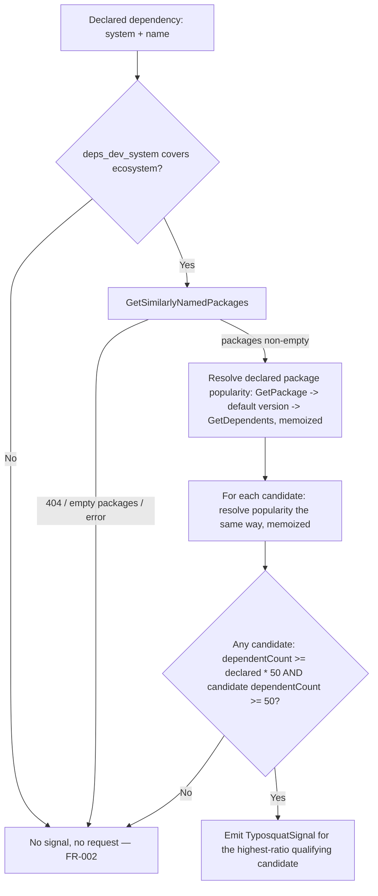

---
aliases:
  - Typosquat Similarity Diagnostic Plan
tags:
  - sdd
  - plan
  - deps-dev
  - security
created: 2026-09-25
status: draft
related:
  - "[[spec]]"
  - "[[constitution]]"
---

# Technical Plan: Typosquat detection via deps.dev's `GetSimilarlyNamedPackages` endpoint

> [!info] References
> **Spec**: [[spec]]
> **Issue**: #1437

## 1. Architecture

### Approach

`GetSimilarlyNamedPackages` itself carries **no popularity field** — verified live against the real
v3alpha API on 2026-09-25 (its response is `{packageKey, packages: [{packageKey}, ...]}`, identity only).
Popularity has to come from a second deps.dev endpoint, `GetDependents`
(`GET /v3alpha/systems/{system}/packages/{name}/versions/{version}:dependents` — version-scoped, so it
requires the package's default version, itself resolved via `GetPackage`).

Live-verified evidence for the chosen approach (all queried directly against `https://api.deps.dev`,
2026-09-25):

| Declared (queried) package | `GetSimilarlyNamedPackages` candidate | Declared `dependentCount` | Candidate `dependentCount` | Ratio |
|---|---|---|---|---|
| `crossenv` (npm, historical real-world typosquat of `cross-env`) | `cross-env` | 3 | 900 | **300x** |
| `expres` (npm) | `express` | 67 | 99,860 | **~1490x** |
| `loadash` (npm, itself marked `deprecated: "use lodash"`) | `lodash` | 565 | 697,481 | **~1235x** |
| `requests` (npm) | `request` | 62 | 185,868 | **~3000x** |
| `coffeescript` (npm, legitimate, actively maintained) | `coffee-script` (npm, legitimate, older name) | 1,213 | 8,377 | **~6.9x** (closest known false-positive-risk pair found) |

`serde`/`serde_json` (cargo) and `react`/`react-dom` (npm) — the two family-package pairs named in the
spec's NFR-003 hard constraint — return an **empty** `packages[]` from `GetSimilarlyNamedPackages` itself;
deps.dev's own similarity algorithm does not consider them "similar" at all, so they never reach the ratio
gate in the first place. `coffeescript`/`coffee-script` is the only legitimate near-miss pair found during
this spike and is the binding constraint on the threshold.

**Decision**: a `dependentCount` ratio of **300x at the smallest true positive** vs **~6.9x at the largest
known false positive** leaves roughly two orders of magnitude of margin. Threshold set at **50x**
(`TYPOSQUAT_RATIO_THRESHOLD: u64 = 50`) — more than 7x above the highest observed benign ratio, more than
6x below the lowest observed true-positive ratio. A second floor, **minimum 50 candidate dependents**
(`TYPOSQUAT_MIN_CANDIDATE_DEPENDENTS: u64 = 50`), guards against two obscure/near-zero-dependent packages
producing a large but meaningless ratio (e.g. 1 vs 60 is 60x but neither package is popular enough for the
signal to be actionable). Both constants are tunable in code, not user-configurable — matching
`DEPS_DEV_SUCCESS_TTL`'s precedent of being an internal tuning knob, not a config surface.

### Request flow (per declared dependency, when the feature is enabled)



Every arrow into a failure/empty branch reaches `Z` — no partial state, no error propagation, consistent
with `DepsDevClient::trust_signal`'s existing infallible-by-construction contract (spec NFR-001).

### Key Design Decisions

| Decision | Choice | Rationale | Alternatives Considered |
|----------|--------|-----------|--------------------------|
| Popularity source | `GetDependents` `dependentCount`, via a `GetPackage` lookup for the default version | Only popularity-shaped metric deps.dev v3alpha exposes for an arbitrary package (live-verified, no download/star count anywhere) | A generic "any similarity hit fires" rule — rejected, fails NFR-003's hard constraint empirically (would false-positive on nothing here, since serde/react never appear as candidates, but offers no protection against a future benign pair `GetSimilarlyNamedPackages` does flag) |
| Ratio threshold | 50x, plus a 50-dependent floor on the candidate | Empirical spike: true positives at 300x-3000x, closest known benign pair at 6.9x — 50x sits with wide margin on both sides | A fixed absolute dependent-count gap — rejected: doesn't scale across ecosystems with very different dependent-count magnitudes (npm's `express` at ~100k vs a mid-size cargo crate at ~1k) |
| v3alpha stability posture | Opt-in only at launch, default disabled; default-on deferred to a separate future issue | User decision: alpha-endpoint risk kept isolated from the noise-threshold question — a stable threshold doesn't retire the "endpoint could disappear" risk | Ship on-by-default now — rejected per explicit user direction |
| Diagnostic channel | LSP diagnostic at `Severity::Hint` only (no hover-only variant in v1) | Reuses the existing typed `Severity` enum (`crates/deps-core/src/diagnostic.rs`); visible in Problems panel, clearly weaker-confidence than `Warning`/`Error` | Hover-only — rejected, less discoverable for a security-adjacent signal; "both" — deferred, adds surface without validated need |
| Config surface | New field beside `license_policy` in `crates/deps-core/src/policy_config.rs` | Same `initializationOptions` parsing/validation path already covered by existing config tests (`server.rs` `parse_config` tests) | New dedicated top-level config section — rejected, unnecessary surface duplication |
| Caching | Reuse `DEPS_DEV_SUCCESS_TTL`/`DEPS_DEV_ERROR_TTL` verbatim, new key shape | NFR-005 explicitly asks to reuse TTL semantics; key shape must differ because similarity/popularity are not version-pinned the way the existing trust-signal memo is | A brand-new TTL tuned independently — rejected, no evidence the existing 1h/90s split is wrong for this data |

## 2. Project Structure

```
crates/deps-core/src/deps_dev/
├── mod.rs                  # + typosquat_signal(), new memo maps, new fetch helpers
├── typosquat.rs             # new: SimilarPackageCandidate, TyposquatSignal, ratio-gate logic (pure fn, unit-testable without HTTP)
└── types.rs                 # + wire types for GetSimilarlyNamedPackages / GetDependents responses

crates/deps-core/src/policy_config.rs   # + TyposquatPolicyConfig { enabled: bool } (default false)
crates/deps-core/src/lsp_helpers/       # existing diagnostic-generation path gains one more signal source
crates/deps-lsp/src/server.rs           # config.policy.typosquat wiring, mirroring license_policy
```

## 3. Data Model

```rust
/// One `packages[]` entry from a `GetSimilarlyNamedPackages` response.
struct SimilarPackageCandidate {
    system: &'static str,
    name: String,
}

/// Resolved, ratio-gated outcome for one declared dependency.
pub struct TyposquatSignal {
    pub declared_name: String,
    pub suspected_name: String,
    pub declared_dependent_count: u64,
    pub suspected_dependent_count: u64,
}

/// Package-level (not version-level) memo key — similarity and popularity are
/// properties of the package/its default version, not of the version the
/// user happens to have declared, mirroring `ProjectKeyMemo`'s precedent for
/// scope narrower than the full `(system, name, version)` `MemoKey`.
struct PopularityMemoKey {
    base: String,
    system: &'static str,
    name: String,
}

struct PopularityMemoEntry {
    fetched_at: Instant,
    ttl: Duration,
    /// `None` on any resolution failure (GetPackage or GetDependents) — memoized
    /// the same way `MemoEntry::signal` memoizes negative outcomes.
    dependent_count: Option<u64>,
}

struct SimilarityMemoKey {
    base: String,
    system: &'static str,
    name: String,
}

struct SimilarityMemoEntry {
    fetched_at: Instant,
    ttl: Duration,
    candidates: Vec<SimilarPackageCandidate>,
}

const TYPOSQUAT_RATIO_THRESHOLD: u64 = 50;
const TYPOSQUAT_MIN_CANDIDATE_DEPENDENTS: u64 = 50;
```

No changes to `DepsDevProject`, `DepsDevVersionInfo`, `ScorecardSummary`, `SupplyChainTrustSignal`,
`MemoKey`/`MemoEntry`, or `ProjectKeyMemo`/`ProjectMemoEntry` — this is an additive sibling on
`DepsDevClient`, two new `DashMap`s alongside the existing `memo`/`projects` fields.

## 4. API Design

```rust
impl DepsDevClient {
    /// Infallible by construction: any failure at any stage (unsupported
    /// ecosystem, network error, timeout, 404, malformed JSON, below-threshold
    /// ratio) resolves to `None`. Never blocks — callers spawn this the same
    /// way `trust_signal` is spawned today.
    pub async fn typosquat_signal(
        &self,
        system: &'static str,
        name: &str,
    ) -> Option<TyposquatSignal> { ... }
}
```

Consumed from `deps-core::lsp_helpers` the same way `trust_signal` feeds Scorecard/SLSA content into
`generate_hover`/`generate_diagnostics` today — gated on `deps_dev_system(ecosystem_id).is_some()` (FR-002)
and on `config.policy.typosquat.enabled` (opt-in, FR-009).

## 5. Integration Points

| System | Direction | Protocol | Notes |
|--------|-----------|----------|-------|
| deps.dev v3alpha | outbound | HTTPS, via existing `HttpCache` transport | `GetSimilarlyNamedPackages`, `GetPackage`, `GetDependents` — all through the same DNS-guard/body-cap/origin-pinned-redirect path as the existing `trust_signal`/`project` calls (FR-008) |

## 6. Security

- Authentication: none — deps.dev v3alpha is a public, unauthenticated read API (same as the existing
  Scorecard/SLSA integration).
- Input validation: package names reach these endpoints only after existing manifest-parsing validation;
  no new untrusted-input surface.
- Sensitive data: none produced or transmitted.

## 7. Testing Strategy

| Level | Framework | What to Test | Coverage Target |
|-------|-----------|---------------|------------------|
| Unit | `cargo nextest` | Ratio-gate pure function (`typosquat.rs`): threshold boundary (49x/50x/51x), the 50-dependent floor, exact-`packageKey`-match exclusion (FR-006), empty candidates | All FR-003/FR-006 branches |
| Unit (mockito) | `cargo nextest` + `mockito` | `typosquat_signal()` against mocked `GetSimilarlyNamedPackages`/`GetPackage`/`GetDependents` responses: 404, timeout, malformed JSON, unsupported ecosystem (no request sent), config disabled (no request sent) | All FR-002/FR-005/FR-007/FR-009 edge cases from spec §6 |
| Live (pre-merge gate, per this project's Registry Integration Gate) | manual, `RUST_LOG=debug cargo run -p deps-lsp` | Re-run the exact pairs from this plan's evidence table against live deps.dev: `crossenv`, `expres`, `loadash`, `requests` (must fire) vs `coffeescript`, `serde_json`, `react-dom` (must not fire) | SC-001, SC-002, SC-003 |

## 8. Performance Considerations

- Worst case per declared dependency: `1 (similarity) + 2 (declared package/version + dependents) + 2N
  (candidates)` deps.dev requests, where `N` is typically 1-3 based on this plan's live sampling.
- All of it is spawned off the request path and memoized per `(base, system, name)` — a repeat hover/
  diagnostic call for the same package within the TTL window issues zero new requests, identical to the
  existing Scorecard/SLSA behavior.
- Opt-in default (disabled) means this cost is zero for users who don't enable the feature — addresses the
  fan-out concern directly rather than trying to shrink it further in v1.

## 9. Rollout Plan

- Ships disabled by default (`policy.typosquat.enabled: false`), consistent with the v3alpha-caution
  decision in §1.
- No migration/backfill — first opt-in on a workspace starts cold, populates the memo like any other
  deps.dev-backed signal.
- A future issue (not part of this feature) tracks flipping the default once the endpoint has shown
  stability across multiple deps-lsp releases.

## 10. Constitution Compliance

| Principle | Status | Notes |
|-----------|--------|-------|
| Type safety (no stringly-typed data) | Compliant | `SimilarPackageCandidate`/`TyposquatSignal` are concrete structs; `system` stays the existing `&'static str` convention already used by `deps_dev_system()`, not a new string boundary |
| `unsafe_code = "forbid"` | Compliant | No unsafe needed |
| Errors: typed `thiserror` enums | Compliant | Reuses the existing `DepsDevFetchError` enum for both new HTTP calls |
| Non-blocking handlers | Compliant | §8 |

## 11. Risks and Mitigations

| Risk | Impact | Probability | Mitigation |
|------|--------|-------------|------------|
| deps.dev changes/removes `GetSimilarlyNamedPackages` or `GetDependents` shape (v3alpha, no stability guarantee) | Feature silently stops firing | Medium (alpha status) | FR-005 graceful degradation; opt-in keeps blast radius to users who explicitly enabled it |
| Ratio threshold doesn't generalize beyond the sampled pairs (npm-heavy evidence; cargo/PyPI/Go/Bundler/Maven/NuGet less sampled) | False negatives (missed real typosquats) or false positives in an under-sampled ecosystem | Medium | Live-testing gate (§7) requires exercising Cargo and PyPI specifically before wider rollout (spec SC-003); threshold is a named constant, trivially tunable without a schema change if live data disagrees |
| Extra request fan-out costs deps.dev-side rate limits or user-visible latency if enabled broadly | Degraded experience for opted-in users | Low | Opt-in default; full memoization; NFR-002 fan-out bound is documented and testable |

## See Also

- [[spec]] — feature specification
- [[tasks]] — implementation tasks (next phase)
- [[MOC-specs]] — all specifications
