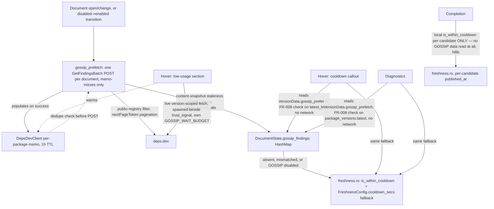

---
aliases:
  - deps.dev GOSSIP Signals Plan
tags:
  - sdd
  - plan
  - deps-dev
  - security
created: 2026-09-25
status: draft
related:
  - "[[spec]]"
  - "[[constitution]]"
  - "[[037-supply-chain-trust-signal/plan]]"
  - "[[071-typosquat-similarity-diagnostic/plan]]"
---

# Technical Plan: Adopt deps.dev GOSSIP signals

> [!info] References
> **Spec**: [[spec]]
> **Adopted scope (revised 2026-09-26, round 4)**: Dynamic Cooldown at hover + diagnostics (existing call
> sites) plus completion, shipped as **local heuristic only** — GOSSIP enrichment of completion candidates
> is dropped (round 4, N6b: no viable low-risk plumbing exists today) — + Low-Usage Packages (gated on live
> schema confirmation). One `GetFindingsBatch` POST per document for cache-misses, backed by **both** a
> per-package `DepsDevClient` memo (network dedupe) **and** `DocumentState` storage (durability across idle
> documents) — round 4, N5: storage alone without a memo reintroduced an uncached-POST-per-edit problem.
> `deps-cli` parity (FR-010) is **dropped from this issue** — deferred to a follow-up issue. All GOSSIP
> calls opt-in. `FreshnessConfig.cooldown_secs` is kept. Malicious Packages / Critical Vulnerabilities /
> Archived Packages are **not** in scope.

## 0. Revision History

**2026-09-25**: initial plan (no architect agent — direct `/sdd plan` session). Assumed 5
`is_within_cooldown` call sites, a shared 6-way `DEPS_DEV_WAIT_BUDGET`, planned to remove
`freshness.cooldown_secs` entirely.

**2026-09-26, round 2**: `rust-critic` adversarial pass — verdict **critical**, 4 false premises (C1-C4:
wrong call-site count, unmodeled CLI/LSP disagreement, `FreshnessConfig` blast radius, `deny_unknown_fields`
scope) plus S1-S6/M1-M4. Revised: real call sites (hover+diagnostics), completion as new scope,
`cooldown_secs` kept, added `deps-cli` parity (FR-010) and an opt-in gate.

**2026-09-26, round 3**: second `rust-critic` pass on the round-2 revision (commit `db68e6f89`) — verdict
**significant**. Round-2 fixes for C1-C4/S1-S3/S5-S6/M1-M4 confirmed correct. New findings:

- **N1**: FR-010 (`deps-cli` GOSSIP parity) delivers almost no value — cooldown only changes a diagnostic's
  message suffix in `deps-cli` (no `--fail-on`/exit-code effect), `update` doesn't use cooldown at all, and
  `deps-cli`/`deps-engine` have no `DepsDevClient` today (verified: zero `cooldown` hits in `report.rs`/
  `analyze.rs`, zero in `update/`, zero `DepsDevClient` references in either crate). **Maintainer decision
  2026-09-26: drop FR-010 from this issue, file a separate follow-up issue.**
- **N2**: reading GOSSIP data from the shared `DepsDevClient` memo (1h TTL, 512-entry cap) means an idle
  open document's data silently expires/gets evicted, and nothing refetches until the next open/change —
  a diagnostics regeneration in between silently reverts to the local-fallback text with no signal that
  anything changed. **Fix**: store GOSSIP findings in `DocumentState` (mirroring `merge_typosquats`,
  `osv_scan.rs:441`, with the same content-snapshot staleness guard), not just the transient client memo.
- **N3**: completion's originally-planned "no badge on cache-miss" behavior is inconsistent with
  hover/diagnostics falling back to the local heuristic — and since GOSSIP only ever covers a package's
  `defaultVersion`, at most one completion candidate could ever be GOSSIP-badged anyway, while
  `completion.rs` already has `published_at` per candidate locally (`completion.rs:1253`). **Fix**: local
  `is_within_cooldown` per candidate becomes completion's default-on baseline (zero cost, no prefetch
  needed, works for all 14 ecosystems); GOSSIP only overrides/enriches the one candidate matching
  `defaultVersion`, read from the same `DocumentState` map diagnostics uses. This also means completion
  needs no dedicated prefetch layer of its own — a full simplification relative to round 2's FR-006.
- **N4**: round 2's FR-005 (concurrent hover awaits) doesn't actually fix M1: hover's cooldown callout
  renders at `push_latest_hover_section` (`hover.rs`, before the `trust_signal` await point) — GOSSIP data
  for that callout would need to be ready *before* the point where round 2 proposed joining it with
  `trust_signal`. **Fix**: don't fetch cooldown live in hover at all — source it from the same
  `DocumentState`-cached per-document prefetch N2/N3 use (synchronous, no wait, correct fallback if not yet
  warmed). Hover's only remaining *live* GOSSIP need is low-usage-for-the-specific-pinned-version (not
  necessarily the default version, so the document-level prefetch can't cover it) — and that already
  renders at the same later point `trust_signal` does, so it reuses the exact spawn-and-await pattern with
  its own independent budget, no shared-deadline machinery needed.
- **M5-M13**: `resolve_in_use_version` needed for hover's version-scoped low-usage call (no lockfile → no
  call, cooldown still available from the document-level cache); the "warmed by a prior hover" claim in the
  old §8 was false (different endpoints/keys) — dropped; prefer `GetFindingsBatch` (one POST per document)
  over a per-package fan-out, confirmed live-workable with `nextPageToken` pagination; `GossipConfig` needs
  `#[serde(default)]` + `#[non_exhaustive]` (else `{"gossip":{}}` fails to parse and the *entire* config
  reload is silently discarded) and a `PolicyConfigDiff` destructure entry; `low_usage_context` dropped as
  an untyped placeholder until a live finding is observed; FR-008's comparand named per call site.

**2026-09-26, round 4**: third `rust-critic` pass on the round-3 revision (commit `faeaa4e8e`) — verdict
**significant** again, but confirmed N1-N4/M5-M13 all actually addressed, not just claimed. Two new gaps,
both introduced by round 3's own fixes:

- **N5**: round 3 dropped the `DepsDevClient` memo/in-flight pair entirely ("results go straight into
  DocumentState, not a DepsDevClient-owned cache"), which removed all network-request dedupe. The document
  prefetch fires on every debounced `did_change` (`DID_CHANGE_DEBOUNCE = 100ms`, `lifecycle.rs:920`) — the
  typosquat prefetch this mirrors is only cheap *because* `similar_packages` is memoized; a GOSSIP twin with
  no memo would fire a full, uncached `GetFindingsBatch` POST on every edit, and the content-snapshot guard
  would then discard most of those in-flight results anyway since a ~300ms call routinely outlives a 100ms
  debounce window. Hover's low-usage GET has the same problem: with no memo, "spawn-and-warm" warms nothing,
  so a response arriving just past `GOSSIP_WAIT_BUDGET` is simply lost instead of being available for the
  next hover. **Fix**: restore a per-package `DepsDevClient` memo (1h TTL, as round 2) *alongside*
  `DocumentState` (round 3) — the memo handles network dedupe, `DocumentState` gives durability across idle
  documents; the batch prefetch requests only memo-misses; a version-keyed memo entry covers hover's
  low-usage fetch too.
- **N6**: the plumbing round 3 sketched doesn't match how this codebase actually threads prefetched data
  through: (a) `VersionData` already has the exact precedent field for this —
  `typosquat_prefetch: Option<&'a HashMap<PackageName, TyposquatSignal>>` (`lsp_helpers/mod.rs:645`) — so
  "pass alongside `VersionData`" would mean changing the sealed `Ecosystem::generate_hover`/
  `generate_diagnostics` signatures and every override (npm, nuget, github-actions, gitlab-ci); the correct
  fix is a `gossip_prefetch` field on `VersionData` itself, mirroring `typosquat_prefetch` exactly.
  (b) Completion never receives `VersionData` at all — `generate_completions`'s actual signature
  (`ecosystem.rs:1380`) is `(parse_result, position, content, freshness)`, and `handlers/completion.rs`
  must not hold a `DashMap` shard reference across an await point (issue #319, a real liveness constraint
  with its own regression test). Enriching one completion candidate with GOSSIP data would need either a
  sealed-trait signature change or a new `CompletionRequest` field carrying an owned/`Arc` snapshot — neither
  is free, and the payoff is one candidate's cooldown-window precision. **Fix**: add `VersionData.gossip_prefetch`
  for hover/diagnostics (N6a); **drop GOSSIP enrichment from completion entirely** for this PR — ship only
  the local per-candidate baseline (N6b) — this is an engineering-cost/benefit call on an already-approved
  capability (completion cooldown as new scope), not a reversal of that scope: completion still gets a real,
  new, default-on cooldown signal, just without the one-candidate GOSSIP-sourced refinement.
- **M14**: `deps-cli`'s config loader has an existing `ignored_sections`/"no effect" warning mechanism
  (`config.rs:267-316`) that a new `[gossip]` section must be added to, now that FR-010 is dropped and
  `deps-cli` has no GOSSIP behavior at all — otherwise the section is silently accepted with no warning.
- **M15**: completion's local baseline is a default-on UX change (not gated by `GossipConfig.enabled` at
  all, since it's pure `freshness.rs` reuse) — must still honor the existing `FreshnessSettings.enabled`/
  `cooldown_secs` knobs already threaded into `CompletionRequest`, not bypass them.

**2026-09-26, round 5**: answers from the same critic to two follow-up questions posed alongside round 4
(about `DocumentState` staleness policy and dropping the per-package concurrency cap), both real gaps not
yet covered by N1-N6:

- **N7 (staleness/refresh)**: a content-snapshot guard alone doesn't handle a package that goes stale
  simply by *time passing* while a document sits open and unedited — FR-008's version-mismatch check
  already correctly falls back to the local heuristic when a new release appears, but nothing then
  triggers a refetch, so an idle document stays on the 3-day local fallback for that new release
  indefinitely. A TTL that *drops* the data would just reintroduce N2. **Fix**: (a) store `GossipCooldown`'s
  `end` as `PublishTime` and evaluate `end > now()` at read time — never a precomputed "is active" bool —
  so an ended cooldown clears itself with no refetch needed at all; (b) treat an FR-008 version mismatch as
  a background-refetch trigger, throttled to at most once every 15 minutes per package (deps.dev's own
  ingestion lag means retrying more often just wastes calls without fresher data); (c) optionally, a soft
  ~1h staleness age on otherwise-matching data schedules the same background refresh without blocking the
  current read — this is the backstop for GOSSIP's own indexing lag on a genuinely-new default version that
  already matches the registry's latest.
- **N8 (cross-document concurrency)**: dropping the within-document concurrency cap (N3's simplification —
  one batch call, not a fan-out) is fine, but a burst across *documents* remains real: the
  `disabled->enabled` config transition fires one batch call per already-open document simultaneously, and
  so does a cold-start multi-manifest workspace load. **Fix**: a small global `tokio::sync::Semaphore`
  bounding concurrent `GetFindingsBatch` calls across all documents, mirroring the existing
  `max_concurrent_fetches` pattern (`document/fetch.rs`) rather than "revisit if it becomes a problem".
  Additionally: `DEPS_DEV_BODY_LIMIT` (the existing 1MB guard on the GET path, `deps_dev/mod.rs:96`) must
  apply to **every** paginated page of a `GetFindingsBatch` response, not just the first (page size isn't
  bounded by the API); and the per-document dependency count is already capped at
  `MAX_DEPENDENCIES_PER_DOCUMENT = 5000` (`dependency_cap.rs:51`), which composes correctly with
  `GetFindingsBatch`'s own 5000-item batch limit — no separate cap needed there, just a note that the two
  numbers happen to already agree.

**2026-09-26, round 6**: the critic's actual verdict on round 4 (commit `961034a6e`, delayed in delivery
and only now fully received) was **minor** — N5, N6a, N6b, and M15 confirmed correctly addressed, ready for
implementation modulo one must-fix and three optional polish items:

- **M16 (must-fix, addressed here)**: round 4's plan said hover/diagnostics read "from the document-level
  cache", but the actual reader is `VersionData.gossip_prefetch`, sourced *only* from
  `DocumentState.gossip_findings` — never the memo directly. The prefetch task's own wording ("memo-misses
  via batch; hits come from the memo directly") never specified that memo *hits* (and names another
  document's in-flight batch is currently fetching) also get merged into *this* document's
  `DocumentState`. Without that, a package already warmed elsewhere would sit in the memo forever but never
  reach a document that didn't itself trigger the original fetch — reintroducing N2 for the single most
  common case. Fixed above: the merge always assembles memo hits + batch results + joined in-flight results
  together, not just this fetch's own POST results.
- **M17 (deferred, deps-cli follow-up)**: `ignored_sections` (M14's fix) only fires for an
  auto-discovered `deps.toml` (`config.rs:234/298`) — an explicit `--config` still accepts `[gossip]`
  silently. `typosquat` has the same pre-existing gap. Fix both together in the `deps-cli` GOSSIP-parity
  follow-up issue (§0), not here.
- **M18 (addressed here)**: stale mentions of a "completion candidate" FR-008 comparand in plan §7 and
  spec FR-008, left over from before N6b dropped completion enrichment. Corrected.
- **M19/M20 (addressed by round 5 + noted here)**: N7/N8 (round 5) already adopted the critic's
  `end > now()`-at-read-time and refresh-on-mismatch suggestions as hard requirements (FR-011/FR-012), not
  just a deferred brief note — round 5 was written before this round-4 verdict fully arrived, so the two
  independently converged on the same fix. `HttpCache::post_json` hardening (body cap per page, fixed
  origin) is confirmed as the first standalone implementation task with its own test (§6/§7, M20).

## 1. Architecture

### Approach

**Real call-site scope**: `is_within_cooldown` exists today at exactly 2 places — `hover.rs` (Latest
callout) and `diagnostics.rs:2262` (outdated-dependency message). `completion.rs`, `code_actions.rs`
(`enabled: false`), and `code_lenses.rs` (test-only reference) do not call it. This plan:

1. Sources cooldown for hover + diagnostics from a per-document GOSSIP cache (below), falling back to
   `freshness.rs`'s existing local check when unavailable.
2. Adds a **local, default-on, zero-cost** cooldown check to completion (genuinely new — it never had one),
   using the same per-candidate `published_at` completion already collects. **No GOSSIP enrichment of
   completion candidates** (round 4, N6b — `generate_completions` has no channel to carry prefetched data
   without a sealed-trait signature change or a new field interacting with the `#319` DashMap-across-await
   constraint; not worth it for one candidate's cooldown-window precision).
3. Does **not** touch `deps-cli` (FR-010 dropped, N1) beyond adding `gossip` to its existing
   `ignored_sections` "no effect" warning list (M14) — filed as a separate follow-up issue for real parity.

**Data flow, corrected through round 6 (N2/N3/N4/N5/N6a/M16)**: a per-package `DepsDevClient` memo (1h TTL,
same shape as `trust_signal`'s) provides network dedupe; a document-lifecycle prefetch task, for every
declared dependency whose source passes `SourcePolicy::source_is_public_registry_content`, checks the memo
first. **Critical (M16 — every reader uses only `DocumentState.gossip_findings`, never the memo directly,
so this document's single merge must assemble the full picture, not just this fetch's own results):** the
prefetch task's `DocumentState.merge_gossip_findings` call for this document combines **three** sources in
one guarded merge — (1) names already present in the memo (a hit from this document's own prior prefetch,
another document's prefetch, or a hover fetch), copied in directly with no network call; (2) names missing
from the memo, fetched via one `GetFindingsBatch` POST; (3) names currently being fetched by *another*
document's in-flight batch for the same package — awaited (joined onto that in-flight future, mirroring
the existing `InFlightGuard`-style dedup other `deps_dev` methods already use) rather than issuing a
redundant second POST. Omitting (1) or (3) would silently reintroduce N2 for the single most common case:
a package already warmed by another open document or a prior hover. Successful results populate both the
memo (dedupe for the *next* prefetch or hover on the same package) and `DocumentState.gossip_findings`
(durability for *this* document across idle periods — TTL expiry/eviction from the memo must not silently
regress an already-rendered document back to the local fallback). `DocumentState` merging follows
`merge_typosquats`'s exact content-snapshot-staleness pattern: fetch under a snapshot, drop the result on
merge if `content` changed since. Diagnostics, completion's local baseline (not enriched, N6b), and hover's
cooldown callout all read `DocumentState.gossip_findings` — synchronously, no network wait, at generation
time.

- **Hover's cooldown callout**: reads `VersionData.gossip_prefetch` (a new field mirroring
  `typosquat_prefetch`, populated by the handler layer from `DocumentState.gossip_findings` before
  `VersionData` is constructed — N6a) for the hovered package, checked against FR-008's version-equality
  gate (comparand: the `latest_line` version already computed for the callout). If absent or mismatched,
  falls back to `freshness.rs`'s local check — the existing, unmodified behavior. No live network call in
  the hover request path for cooldown at all (this is what actually fixes N4 — not a shared deadline, but
  removing the live wait from this render point entirely).
- **Hover's low-usage section**: the *only* remaining live, per-request GOSSIP fetch — version-scoped,
  because the pinned/resolved version (via `resolve_in_use_version`, M5) may not be the package's default
  version and so isn't necessarily in the document-level cache. Spawned alongside `spawn_trust_signal_fetch`
  and awaited at the same later point `trust_signal` already is (near the vulnerability/deprecation
  sections), under its own `GOSSIP_WAIT_BUDGET` — independent of `DEPS_DEV_WAIT_BUDGET`. Now backed by a
  version-keyed memo entry (N5 fix) so a response landing past the budget still warms something usable by
  the next hover, instead of being lost. If the dependency has no lockfile-resolved version (range-only,
  `resolve_in_use_version` returns `None`), this fetch is skipped entirely — low-usage is simply omitted,
  cooldown still works via `VersionData.gossip_prefetch`.
- **Diagnostics**: same `VersionData.gossip_prefetch` read, FR-008 comparand is `package_versions.latest`.
  Falls back to the existing `is_within_cooldown` call unchanged.
- **Completion**: local `is_within_cooldown` per candidate only (default-on baseline, all 14 ecosystems,
  zero cost — N3's fix), honoring the existing `FreshnessSettings.enabled`/`cooldown_secs` knobs already
  threaded into `CompletionRequest` (M15) — no GOSSIP data reaches completion at all (N6b, this PR).

**Opt-in gate (FR-009, unchanged from round 2)**: `GossipConfig { enabled: bool }` (default `false`) in
`policy_config.rs`, a structural twin of `TyposquatConfig` (`policy_config.rs:1244`) — including the
details round 2's snippet missed (M12): `#[serde(default)]` on `enabled` and `#[non_exhaustive]` on the
struct, so a partial `{"gossip":{}}` config parses correctly instead of failing the *entire* config reload.
Wired into `PolicyConfigDiff`'s exhaustive destructure (M8) and given the same runtime-toggle mechanics
`typosquat`'s opt-in flag has (`server.rs:866-927`): a `ServerState` atomic (`is_gossip_enabled`/
`set_gossip_enabled`), read-before-overwrite in `did_change_configuration`, and
`trigger_gossip_prefetch_for_open_documents` fired on the disabled→enabled transition specifically (so an
already-open document doesn't wait for its next edit to pick up newly-enabled GOSSIP data).

The document-level prefetch is filtered through `SourcePolicy::source_is_public_registry_content` (same
gate typosquat prefetch uses) so git/path dependencies never reach deps.dev.

**Staleness and refresh (N7).** `GossipFindings`/`GossipCooldown` never stores a precomputed "is cooldown
active" boolean — only `end: PublishTime`, compared against `now()` at every read. This makes an ended
cooldown self-clear with zero refetch cost. What *does* need an explicit trigger is a genuinely new
release: when FR-008's version-equality check finds a mismatch (the registry's own latest version differs
from the cached `defaultVersion`), that mismatch schedules a background refetch for that package — throttled
to at most once every 15 minutes per package, since deps.dev's own ingestion lag makes more frequent
retries pointless. A soft ~1h staleness age on otherwise-matching data schedules the same background
refresh (without blocking the current read, which keeps serving the stored data) as a backstop for GOSSIP's
own indexing lag on a default version that already matches. None of this is a TTL that *drops* data —
dropping data on a timer is exactly N2's bug; refetching in the background while continuing to serve what's
already stored is the actual fix.

**Refetch mechanics (M21 — the above is necessary but not sufficient on its own):**

1. **The refetch must bypass or invalidate the 1h memo entry for that package**, not just call
   `gossip_findings_batch` again — calling it again unconditionally would just return the same
   memo-cached (stale) `defaultVersion` and never reach the network. The trigger must force a fresh
   fetch (evict-then-fetch, or a `force: bool` parameter on the internal fetch path), not a normal
   memo-respecting call.
2. **The version-mismatch check itself cannot live in `hover.rs`/`diagnostics.rs`** — those are pure,
   synchronous `deps-core` render functions with no ability to spawn background work. Detection and the
   refetch trigger both belong in `deps-lsp`, specifically after a registry-version fetch lands (compare
   the newly-fetched latest against what `DocumentState.gossip_findings` currently holds for that
   package) — mirroring where `deps-core`'s other render-time checks report an outcome for `deps-lsp` to
   act on, not where `deps-core` itself reaches out to the network.
3. **The refetch's result must be merged into `DocumentState` and republish diagnostics for *every* open
   document that declares the mismatched package**, not just refresh the memo and hope the one document
   that happened to notice re-renders on its own — other open documents with the same dependency are
   equally stale and won't get an unrelated edit to trigger their own re-check.
4. **The per-package last-refresh-attempt map (backing the 15-minute backoff) needs the same bounded
   size/eviction discipline as the other `deps_dev` memos** (`MAX_MEMO_ENTRIES`-style cap) — an unbounded
   map would grow for the lifetime of the server in a workspace touching many distinct packages over time.

**Cross-document concurrency (N8).** Dropping the *within-document* concurrency cap (batch, not fan-out,
per N3) is fine, but a burst *across* documents is real — the `disabled->enabled` config transition fires
one batch call per already-open document simultaneously, as does a cold-start multi-manifest workspace
load. A small global `tokio::sync::Semaphore` bounds concurrent `GetFindingsBatch` calls across all
documents, mirroring the existing `max_concurrent_fetches` pattern (`document/fetch.rs`) rather than being
left unbounded. `DEPS_DEV_BODY_LIMIT` (the existing 1MB guard already applied to the GET path,
`deps_dev/mod.rs:96`) must apply to every paginated page of a batch response, not just the first. A
document's own dependency count is already capped at `MAX_DEPENDENCIES_PER_DOCUMENT = 5000`
(`dependency_cap.rs:51`), which happens to already match `GetFindingsBatch`'s own 5000-item limit — no new
cap needed there.

### Component Diagram



### Key Design Decisions

| Decision | Choice | Rationale | Alternatives Considered |
|----------|--------|-----------|--------------------------|
| Storage | **Both** a per-package `DepsDevClient` memo (1h TTL) **and** `DocumentState.gossip_findings` | N2 (memo-only loses idle-document data) + N5 (`DocumentState`-only has no request dedupe — an uncached POST per 100ms-debounced edit) — round 3's "drop the memo" over-corrected round 2 | Round 2: memo only (N2's bug). Round 3: `DocumentState` only (N5's bug). Round 4: both, each doing the job it's suited for |
| Fetch shape | One `GetFindingsBatch` POST per document, for memo-misses only | M7: live-verified to work with mixed systems + `nextPageToken`; the memo (above) prevents this from firing on every debounced edit for packages already known | Fetching unconditionally on every prefetch trigger — rejected, this was N5's exact bug |
| Completion | **Local `is_within_cooldown` per candidate only — no GOSSIP enrichment** | N6b: `generate_completions` has no `VersionData`/prefetch channel; adding one needs either a sealed-trait signature change (ripples through every ecosystem override) or a new `CompletionRequest` field interacting with the `#319` DashMap-across-await liveness constraint — not justified for one candidate's cooldown-window precision | Round 3's plan to enrich the `defaultVersion`-matching candidate — dropped once the actual plumbing cost was found; still ships completion's core new capability (a cooldown signal it never had) via the local baseline alone |
| Hover cooldown source | `VersionData.gossip_prefetch` (new field mirroring `typosquat_prefetch`), no live network wait | N4 (removing the live wait, not adding a shared deadline, is the actual fix) + N6a (`VersionData` already has this exact field shape — `typosquat_prefetch` — so this is "add a sibling field", not "invent new plumbing") | round 3's "passed alongside `VersionData`" — corrected: it's a field ON `VersionData`, matching the existing `typosquat_prefetch`/`license_prefetch` pattern, not a separate parameter that would ripple through the sealed trait |
| Hover low-usage source | Live, version-scoped fetch, spawned beside `trust_signal`, own budget, backed by a version-keyed memo entry | The pinned version may not be `defaultVersion`; low-usage renders at the same point `trust_signal` already does (no ordering conflict); the memo (N5 fix) means a late response still warms something for the next hover instead of being silently lost | Sourcing low-usage from the document-level cache too — rejected, would silently miss any non-default pinned version |
| `resolve_in_use_version` | Used to determine the pinned version for hover's low-usage fetch (M5) | A range-only dependency with no lockfile has no concrete version to check | Fetching for the range itself — not meaningful, GOSSIP findings are per-version |
| `GossipConfig` shape | `#[serde(default)]` on `enabled`, `#[non_exhaustive]` on the struct, `PolicyConfigDiff` entry, `ServerState` atomic + trigger-on-enable | M8/M12: `TyposquatConfig`'s exact shape; missing `#[serde(default)]` breaks parsing of a partial section and discards the whole config reload | Copying round 2's snippet as-is — it was missing exactly these details |
| `low_usage_context` field | Dropped from the wire type until a live finding is observed | M9: an untyped `serde_json::Value` placeholder violates this project's type-safety rule for no benefit — serde already ignores unknown keys safely | Keeping the untyped placeholder "just in case" — rejected |
| `deps-cli` parity (FR-010) | **Dropped from this issue.** `[gossip]` added to `ignored_sections` (M14) so it's at least a visible warning, not silent. Filed as a separate follow-up issue (P4) | N1 + maintainer decision 2026-09-26: near-zero practical effect, requires new `DepsDevClient` wiring in `deps-engine` that doesn't exist today | Keeping FR-010, limited to `check` only — maintainer chose to drop entirely |
| Cooldown-active check | `end: PublishTime`, compared to `now()` at read time — never a stored bool | N7: self-clears an ended cooldown with zero refetch; a stored bool would need its own invalidation logic for no benefit | Storing a resolved `is_active: bool` alongside `end` — rejected, redundant and one more thing to keep in sync |
| Staleness handling | A version-mismatch (FR-008) or ~1h soft age triggers a background refetch (>=15min backoff per package); data is never dropped on a timer | N7: a memo/`DocumentState` TTL that drops data reintroduces N2; refetch-in-background-while-still-serving is the actual fix for "idle document, new release appeared" | A hard TTL eviction (round 2's original design) — this was N2's bug; not repeating it under a different name |
| Cross-document concurrency | A global `Semaphore` around `GetFindingsBatch`, mirroring `max_concurrent_fetches` | N8: the `disabled->enabled` transition and cold-start multi-manifest loads can fire many simultaneous batch calls across documents even with no within-document fan-out | Leaving it unbounded "to revisit if it becomes a problem" — critic's explicit pushback: cheap to add now, so add it now |
| Per-page body limit | `DEPS_DEV_BODY_LIMIT` applied to every `nextPageToken` page, not just the first | A paginated batch response's page size isn't bounded by the API itself | Assuming the existing GET-path guard automatically covers a new POST/pagination path — it doesn't (M7) |
| Prefetch merge scope | One `merge_gossip_findings` call combining memo hits + this batch's results + joined in-flight results from other documents | M16: every reader (`VersionData.gossip_prefetch`) sources *only* from `DocumentState`, never the memo directly — merging only this fetch's own POST results would silently miss already-warmed packages | Merging only batch-miss results (round 5's wording) — this was M16's exact bug: correct for a never-before-seen package, wrong for one another document/hover already warmed |

## 2. Project Structure

```
crates/deps-core/src/
├── deps_dev/
│   ├── mod.rs            # + gossip_findings_batch() (one POST per document, memo-misses only,
│   │                     #   nextPageToken pagination, DEPS_DEV_BODY_LIMIT enforced per page — N8),
│   │                     #   gossip_findings_for_version() (hover's live low-usage fetch),
│   │                     #   GOSSIP_WAIT_BUDGET const, a per-package findings memo + in-flight
│   │                     #   DashMap/DashSet pair (1h TTL, restores round 2's shape — N5) plus a
│   │                     #   version-keyed memo entry for the low-usage fetch, a
│   │                     #   GOSSIP_PREFETCH_SEMAPHORE (tokio::sync::Semaphore, global, mirrors
│   │                     #   max_concurrent_fetches — N8) bounding concurrent batch calls across
│   │                     #   documents, and a per-package last-refresh-attempt map with a >=15min
│   │                     #   backoff for the FR-008-mismatch-triggered background refetch (N7)
│   └── types.rs          # + GossipFindingsWire (batch response envelope), GossipFindingWire,
│                         #   GossipFindingType (Cooldown/LowUsage typed, #[serde(other)] catch-all),
│                         #   GossipCooldownContextWire { end: String }. NO low_usage_context field (M9)
│                         #   until a live finding confirms its shape.
├── policy_config.rs       # + GossipConfig { enabled: bool }, #[serde(default)] on the field,
│                         #   #[non_exhaustive] on the struct (twin of TyposquatConfig, policy_config.rs:
│                         #   1244-1271) + PolicyConfigDiff destructure entry (M8)
├── freshness.rs           # UNCHANGED — is_within_cooldown/PublishTime/FreshnessConfig.cooldown_secs
│                         # untouched; this feature layers GOSSIP in front, at read time, never modifies
│                         # freshness.rs itself
├── lsp_helpers/
│   ├── mod.rs             # VersionData gains `gossip_prefetch: Option<&'a HashMap<PackageName,
│   │                     #   GossipFindings>>` — a new field mirroring the existing `typosquat_prefetch`
│   │                     #   field exactly (N6a), populated by the deps-lsp handler layer from
│   │                     #   DocumentState.gossip_findings before VersionData is constructed; no sealed
│   │                     #   trait signature change needed
│   ├── hover.rs           # cooldown callout (push_latest_hover_section) reads VersionData.gossip_prefetch,
│   │                     #   falls back to is_within_cooldown unchanged; + spawn_gossip_low_usage_fetch
│   │                     #   beside spawn_trust_signal_fetch, awaited at the existing trust_signal join
│   │                     #   point under GOSSIP_WAIT_BUDGET, backed by the version-keyed memo
│   └── diagnostics.rs     # cooldown check at line 2262 tries VersionData.gossip_prefetch first (FR-008
│                         #   check against package_versions.latest), falls back unchanged
└── completion.rs          # + local is_within_cooldown per candidate ONLY (new baseline, N3) — honors
                          #   the existing FreshnessSettings.enabled/cooldown_secs already threaded into
                          #   CompletionRequest (M15). NO GOSSIP data read here at all (N6b) —
                          #   generate_completions has no VersionData/prefetch channel, and adding one
                          #   isn't justified for one candidate's cooldown-window precision

crates/deps-lsp/src/
├── document/
│   ├── state.rs          # DocumentState gains `gossip_findings: HashMap<PackageName, GossipFindings>`
│   │                     #   (mirrors the existing typosquat-findings field) + `merge_gossip_findings`
│   │                     #   (mirrors `merge_typosquats`, same content-snapshot staleness guard)
│   └── gossip_prefetch.rs # NEW — checks the DepsDevClient memo first (N5); for hits, joins any
│                         #   in-flight fetch from another document rather than re-issuing a POST; for
│                         #   misses, POSTs GetFindingsBatch; filtered by source_is_public_registry_content;
│                         #   on open/change and on the disabled->enabled config transition. Merges memo
│                         #   hits + batch results + joined in-flight results TOGETHER into one
│                         #   doc.merge_gossip_findings() call (M16 — omitting memo hits/in-flight joins
│                         #   here would silently reintroduce N2 for the most common case) and republishes
│                         #   diagnostics (mirrors spawn_typosquat_prefetch_and_republish, lifecycle.rs:1344).
│                         #   ALSO hosts the M21 mismatch-triggered refetch: after a registry-version fetch
│                         #   lands (fetch.rs's existing flow, not a hover/diagnostics render path — deps-core's
│                         #   pure render functions cannot spawn work), compares the new latest against
│                         #   DocumentState.gossip_findings' cached version; on mismatch, calls a
│                         #   force-bypass-memo variant of gossip_findings_batch/gossip_findings_for_package
│                         #   and, on success, merges + republishes for EVERY open document declaring that
│                         #   package (not just the document that detected the mismatch)
└── server.rs              # + is_gossip_enabled/set_gossip_enabled ServerState atomic,
                          #   trigger_gossip_prefetch_for_open_documents, wired into
                          #   did_change_configuration exactly like typosquat's (server.rs:866-927)

crates/deps-cli/src/
└── config.rs              # + "gossip" added to ignored_sections()'s section list (M14) — a `[gossip]`
                          #   entry in deps.toml now surfaces the existing "section has no effect in
                          #   deps-cli" warning instead of being silently accepted
```

## 3. Data Model

```rust
// crates/deps-core/src/deps_dev/types.rs

/// One `GetFindingsBatch` response entry (one document's worth of dependencies, batched).
#[derive(Debug, Clone, serde::Deserialize)]
pub(crate) struct GossipFindingsWire {
    pub package_key: GossipPackageKeyWire,
    #[serde(default)]
    pub recommended_versions: Vec<GossipVersionFindingsWire>, // often EMPTY during active cooldown (S1)
    pub default_version: Option<GossipVersionFindingsWire>,   // the reliable field — see FR-008
    pub requested_version: Option<GossipVersionFindingsWire>, // present on version-scoped hover low-usage calls only
    #[serde(default)]
    pub package_findings: Vec<GossipFindingWire>,
}

#[derive(Debug, Clone, serde::Deserialize)]
pub(crate) struct GossipVersionFindingsWire {
    pub version_key: GossipVersionKeyWire,
    #[serde(default)]
    pub findings: Vec<GossipFindingWire>,
    pub cooldown_end: Option<String>, // historical field, NOT the active-cooldown signal (see below)
}

#[derive(Debug, Clone, serde::Deserialize)]
pub(crate) struct GossipFindingWire {
    #[serde(rename = "type")]
    pub finding_type: GossipFindingType,
    pub risk: GossipRisk,
    /// Populated for `Cooldown` findings only. Live-verified shape (2026-09-26, `vite` npm package):
    /// `{"type": "COOLDOWN", "risk": "RISK_HIGH", "cooldownContext": {"end": "<RFC3339>"}}`.
    pub cooldown_context: Option<GossipCooldownContextWire>,
    // NO low_usage_context field (M9) — no live LOW_USAGE finding has been observed across ~20 combined
    // probes. Adding a typed field now would be a guess; serde silently ignores the unknown key until
    // an implementation task re-probes and confirms the real shape.
}

#[derive(Debug, Clone, serde::Deserialize)]
pub(crate) struct GossipCooldownContextWire {
    pub end: String, // RFC3339
}

#[derive(Debug, Clone, Copy, PartialEq, Eq, serde::Deserialize)]
#[serde(rename_all = "SCREAMING_SNAKE_CASE")]
pub(crate) enum GossipFindingType {
    Cooldown,
    LowUsage,
    #[serde(other)]
    Other, // NOT_FOUND, MALICIOUS, DEPRECATED, VULNERABLE, REMEDIATION — never surfaced.
           // NOT_FOUND must never be surfaced standalone (NFR-002/M4): ambiguous between
           // malicious/removed and not-yet-indexed-by-deps.dev.
}
```

Public-facing type (stored in `DocumentState`, no `as_any()` downcasting per this project's typing rules):

```rust
pub struct GossipCooldown {
    /// Compared against `now()` at every read (`end > now()` means still active) — never
    /// precompute or store an "is active" bool (N7): this makes an ended cooldown clear itself
    /// with zero refetch cost.
    pub end: PublishTime,
    pub risk: GossipRiskLevel,
}

pub struct GossipLowUsage {
    pub risk: GossipRiskLevel,
    // Further fields pending live schema confirmation (S3) — implementation task, not finalized here.
}

pub struct GossipFindings {
    pub cooldown: Option<GossipCooldown>,
    pub low_usage: Option<GossipLowUsage>,
    /// The exact version this data applies to. Callers MUST compare against the version they're actually
    /// displaying (FR-008) before trusting `cooldown`/`low_usage` — see per-call-site comparands in §1.
    pub version: String,
}
```

```rust
// crates/deps-core/src/policy_config.rs — twin of TyposquatConfig (line 1244), with the details
// round 2's snippet was missing (M12)

/// Configuration for GOSSIP-sourced signals (issue #1456, spec 072). Ships **disabled by default**: the
/// document-level prefetch discloses every declared dependency's name to deps.dev, the same concern that
/// made [`TyposquatConfig`] opt-in.
#[non_exhaustive]
#[derive(Debug, Clone, Deserialize, Default)]
pub struct GossipConfig {
    /// Whether GOSSIP-sourced cooldown/low-usage signals are fetched at all.
    #[serde(default)]
    pub enabled: bool,
}
```

```rust
// crates/deps-core/src/policy_config.rs — PolicyConfigDiff destructure (M8), added alongside the
// existing TyposquatConfig line:
let GossipConfig { enabled: _ } = new_gossip;
```

`DocumentState` (`crates/deps-lsp/src/document/state.rs`) gains:

```rust
pub struct DocumentState {
    // ...existing fields...
    /// GOSSIP findings for this document's declared dependencies, keyed by package name. Populated by
    /// `gossip_prefetch`'s single guarded merge, which combines memo hits, this batch's own
    /// `GetFindingsBatch` results (for memo-misses), and results joined from another document's
    /// in-flight batch for the same package (M16 — every reader uses only this field, never the memo
    /// directly, so omitting any of the three would silently reintroduce stale data for an
    /// already-warmed package). Merged under a content-snapshot staleness guard — structural twin of
    /// the existing typosquat-findings field / `merge_typosquats`.
    gossip_findings: HashMap<PackageName, GossipFindings>,
}

impl DocumentState {
    /// Mirrors `merge_typosquats`: drops the result if `self.content` changed since the fetch started.
    pub(crate) fn merge_gossip_findings(&mut self, findings: HashMap<PackageName, GossipFindings>) { .. }
}
```

`VersionData` (`crates/deps-core/src/lsp_helpers/mod.rs`) gains, mirroring `typosquat_prefetch` exactly
(N6a — not a separate parameter, per the critique's correction of round 3's "passed alongside" framing):

```rust
#[non_exhaustive]
#[derive(Debug, Clone, Copy)]
pub struct VersionData<'a> {
    // ...existing fields (cached, resolved, typosquat_prefetch, license_prefetch, vulnerabilities)...
    /// GOSSIP-sourced cooldown/low-usage findings for this document's declared dependencies, read from
    /// `DocumentState.gossip_findings` by the handler layer before this `VersionData` is constructed.
    /// `None` when GOSSIP is disabled, offline, or the document's prefetch hasn't landed yet — callers
    /// fall back to `is_within_cooldown` unchanged.
    pub gossip_prefetch: Option<&'a HashMap<PackageName, GossipFindings>>,
}
```

### Migrations

None — no persisted schema. `FreshnessConfig.cooldown_secs` is unchanged (kept, not removed).
`GossipConfig.enabled` defaults to `false`; no config change is required to keep current behavior.

## 4. API Design

Internal methods (not an LSP-facing API):

| Method | Scope | Callers | Notes |
|--------|-------|---------|-------|
| `gossip_findings_batch(system, [name], force: bool)` | `GetFindingsBatch` | `gossip_prefetch` (document-lifecycle task) | Normal calls (`force: false`) go **only for names missing from the per-package memo and not already in-flight elsewhere** (N5); `source_is_public_registry_content`-filtered input; paginates via `nextPageToken` with `DEPS_DEV_BODY_LIMIT` enforced per page (N8); bounded by a global `Semaphore` across documents (N8). A version mismatch (FR-008), detected in `deps-lsp` after a registry fetch lands (M21b), calls this with `force: true` — bypassing/evicting the memo entry rather than trusting it — throttled to >=15min per package via the bounded backoff map (N7/M21a/M21d); its result merges into and republishes for every open document declaring the package (M21c). The caller's single `DocumentState` merge always combines this call's results with memo hits and joined in-flight results — never just this call's own output (M16) |
| `gossip_findings_for_version(system, name, version)` | version-scoped `GetFindings` | hover's low-usage section only | Spawned beside `spawn_trust_signal_fetch`, awaited at the same join point under `GOSSIP_WAIT_BUDGET`; skipped entirely when `resolve_in_use_version` returns `None` (M5); backed by a version-keyed memo entry so a late response still warms something (N5) |

## 5. Integration Points

| System | Direction | Protocol | Notes |
|--------|-----------|----------|-------|
| deps.dev v3alpha `GetFindingsBatch`/`GetFindings` | outbound | HTTPS/JSON POST (batch) / GET (version-scoped), via `HttpCache` | Still `v3alpha`, no GA — same provisional posture as spec 071. `HttpCache::post_json` (M7) currently lacks the body-limit/trusted-origin guarantees the existing GET path has — this must be closed as part of adding batch support, not assumed already covered. Gated behind `GossipConfig.enabled` |

## 6. Security

- No new secrets or auth — both endpoints are public and unauthenticated (confirmed live).
- No new input-validation surface beyond `deps_dev_system()`'s exhaustive match (fixed origin, not
  user-configurable).
- **`HttpCache::post_json` gap (M7/M20)**: the existing GET path has body-limit and trusted-origin
  guarantees this POST path does not yet have — this is the **first standalone implementation task**, with
  its own test, not a detail folded into the batch-fetch task (M20: the security property should be
  verifiable independently of the feature logic built on top of it). `DEPS_DEV_BODY_LIMIT` must be enforced
  on **every** `nextPageToken` page of a batch response, not just the first (N8) — page size is not itself
  bounded by the API.
- **Privacy (S5/FR-009/NFR-005, unchanged)**: the document-level prefetch discloses every declared
  dependency's name to deps.dev — opt-in (`GossipConfig.enabled`, default `false`), filtered through
  `SourcePolicy::source_is_public_registry_content`.
- **Availability (N8, new)**: a global `Semaphore` bounds concurrent `GetFindingsBatch` calls across all
  open documents, so enabling GOSSIP in a large workspace (or a cold-start multi-manifest load) cannot fire
  an unbounded burst of simultaneous outbound requests.

## 7. Testing Strategy

| Level | What to test |
|-------|--------------|
| Unit (`deps_dev::tests`) | `GossipFindingsWire` batch-response deserialization against real captured shapes (`vite` active-`COOLDOWN`, `request`/`left-pad` `DEPRECATED`); `nextPageToken` pagination handling |
| Unit (`state.rs`) | `merge_gossip_findings` drops a stale result when `content` changed mid-fetch (direct port of the existing `merge_typosquats` test) |
| Unit (`deps_dev::mod`) | FR-008's version-equality check at each of its 2 comparands (hover `latest_line`, diagnostics `package_versions.latest` — completion reads no GOSSIP data at all per N6b, so it has no comparand here) — a mismatch must be treated as a cache-miss |
| Unit (`hover.rs`) | Cooldown callout reads from the passed-in cache snapshot with no network call in the test (regression guard against reintroducing a live wait — this is what actually fixes N4); low-usage fetch still exercises the existing spawn-and-timeout pattern; `resolve_in_use_version() == None` skips the low-usage fetch entirely (M5) |
| Unit (`freshness.rs`) | **No changes required** — untouched |
| Unit (`completion.rs`) | Local `is_within_cooldown` baseline fires for every candidate, honors `FreshnessSettings.enabled`/`cooldown_secs` (M15); zero HTTP requests during candidate rendering in all cases; **no** GOSSIP-sourced field is read anywhere in this module (N6b — a regression test that completion never touches `VersionData`/the memo/`DocumentState.gossip_findings`) |
| Unit (`policy_config.rs`) | `GossipConfig::default().enabled == false`; a partial `{"gossip":{}}` config parses successfully (regression test for M12's `#[serde(default)]` requirement) |
| Unit (`deps_dev::mod`, new) | The per-package memo actually dedupes: two `gossip_prefetch` calls for the same package within the TTL window issue exactly one network request (regression test for N5); a hover low-usage response arriving after `GOSSIP_WAIT_BUDGET` still lands in the version-keyed memo (companion to the existing `trust_signal_survives_dropped_join_handle_and_warms_memo` test) |
| Unit (`gossip_prefetch.rs`, new) | **M16 regression**: a package already present in the memo (warmed by a prior hover, or by another document's earlier prefetch) is merged into *this* document's `DocumentState.gossip_findings` even though this document's own prefetch issues zero network calls for it; a package currently being fetched by another document's in-flight batch is joined onto that fetch rather than triggering a second POST, and its result also lands in this document's `DocumentState` |
| Unit (`gossip_prefetch.rs`/`deps_dev::mod`, new) | **M21 regression**: a `force: true` call actually reaches the network even when the memo has a fresh (non-expired) entry for that package (regression against a literal "refetch" that would just re-read the stale memo); a version mismatch detected for a package declared in 2 open documents results in *both* documents' `DocumentState` being updated and *both* republishing diagnostics, not just the document that detected the mismatch; the last-refresh-attempt backoff map evicts under the same bound as other memos rather than growing unboundedly |
| Unit (`deps-cli::config`) | `ignored_sections` includes `"gossip"` when a `[gossip]` section differs from default (M14) |
| Unit (`deps_dev::mod`, new) | A `GossipCooldown` with `end` in the past is treated as inactive purely from the comparison at read time, with no separate stored flag (N7); an FR-008 mismatch schedules exactly one refetch, and a second mismatch within 15 minutes for the same package does not schedule another (N7 backoff); the global `Semaphore` actually caps in-flight `GetFindingsBatch` calls when many documents trigger simultaneously (N8); a paginated response whose second page exceeds `DEPS_DEV_BODY_LIMIT` is rejected the same way an oversized first-page GET response already is (N8) |
| Integration | `crates/deps-lsp` — `gossip_prefetch` checks the memo before POSTing, fires on document open/change and on the disabled→enabled config transition, republishes diagnostics on new data; a document idle longer than the memo's TTL still shows correct GOSSIP-sourced diagnostics on the next unrelated regeneration (regression test for N2, now correctly backed by both storage layers); a document left open across a real new release (simulated) eventually shows the new release's cooldown status without requiring an edit (N7 end-to-end) |
| Live/manual (continuous-improvement cycle) | **Must** re-verify against a package flagged `LOW_USAGE` before adding any typed field for it (S3/M9) — hard gate, not optional polish |
| CI regression | None expected for `FreshnessConfig`/`did_change_configuration` tests (unchanged) |

## 8. Performance Considerations

- The per-package memo (N5) means `gossip_prefetch`'s repeated firing on every 100ms-debounced edit does
  **not** mean repeated network calls — only the first trigger for a given package (or one past its 1h TTL)
  actually reaches deps.dev; subsequent debounced fires for an unchanged dependency set hit the memo and
  skip the POST entirely.
- One `GetFindingsBatch` POST per document per memo-miss set (not per package) — simpler and cheaper than
  round 2's per-package fan-out; no concurrency cap needed for within-document fan-out since there isn't
  one. Multiple simultaneously-open documents in a large workspace still each check the shared memo before
  firing their own batch call, so cross-document duplication for shared packages is also avoided — and the
  new global `Semaphore` (N8) bounds how many of those batch calls can be in flight at once regardless.
- Idle documents never regress silently: an ended cooldown clears itself at read time (`end > now()`), and
  a genuinely new release (FR-008 mismatch) schedules its own backoff-throttled refetch (N7) rather than
  leaving the document stuck on stale data until its next edit.
- Hover: no live network wait for cooldown (N4 fix) — only the low-usage fetch is live, under its own
  `GOSSIP_WAIT_BUDGET`, at the same point `trust_signal` already awaits, backed by the version-keyed memo
  so a late response isn't wasted (N5).
- Completion: zero added latency, zero GOSSIP involvement at all (N6b) — the local per-candidate check is
  already free.
- Diagnostics: zero added latency — synchronous `VersionData.gossip_prefetch` read, falls back unchanged on
  miss.

## 9. Rollout Plan

Single PR, gated by `GossipConfig.enabled` (opt-in, default off — this *is* the rollout gate, per FR-009).
Ship behind the existing `v3alpha` provisional posture (same as spec 071). Output attributes the signal to
deps.dev/GOSSIP (NFR-004) and is distinguishable from the local-heuristic fallback (FR-002). No
`CHANGELOG.md` breaking-change entry needed (`FreshnessConfig.cooldown_secs` is unchanged) — a regular
feature entry documents the new opt-in flag. `deps-cli` GOSSIP parity (FR-010) is explicitly **not** part
of this PR — tracked in a separate follow-up issue (P4, per the maintainer decision recorded in §0).

## 10. Constitution Compliance

| Principle | Status | Notes |
|-----------|--------|-------|
| Type safety | Compliant | `GossipFindingType`/`GossipRisk` typed enums with `#[serde(other)]`; `low_usage_context` deliberately omitted rather than typed as an untyped placeholder (M9 fix) |
| Cross-ecosystem consistency | Compliant | All logic in `deps-core::deps_dev`/`policy_config`/`DocumentState`; reuses `deps_dev_system()` as-is |
| `unsafe_code = "forbid"` | Compliant | No unsafe needed |
| Non-blocking handlers | Compliant | Completion and diagnostics are synchronous cache reads by construction; hover's only live wait (low-usage) reuses the existing bounded-timeout pattern |

## 11. Risks and Mitigations

| Risk | Impact | Probability | Mitigation |
|------|--------|-------------|------------|
| GOSSIP `v3alpha` schema changes before GA | Medium | Medium | `#[serde(other)]` catch-all; tests pinned to captured real responses |
| `LOW_USAGE` finding schema still unconfirmed | Medium | Medium-high | Hard-gated in Testing Strategy; no typed field added until observed (M9) |
| `HttpCache::post_json` lacks the GET path's body-limit/trusted-origin guarantees | Medium — a security gap if shipped as-is | Low (caught here, before implementation) | Explicit task to close this gap (§6), not an assumption of parity |
| Opt-in flag goes undiscovered | Low | Medium | Document alongside spec 071's typosquat flag |
| A large workspace with many simultaneously-open documents each firing a batch call | Low-medium | Low | The shared per-package memo (N5) absorbs most cross-document duplication for shared packages; the global `Semaphore` (N8) bounds simultaneous in-flight calls regardless — no longer left to "revisit later" |
| Dropping completion GOSSIP enrichment (N6b) under-delivers relative to earlier plan.md's stated scope | Low — completion still gets a genuine new capability (local cooldown baseline) | N/A (already decided) | Documented as a deliberate engineering-cost/benefit call in §0/§1, not an oversight; revisit only if `#319`'s constraint is relaxed or a signature change becomes acceptable for other reasons |
| An idle document stays on stale GOSSIP data indefinitely after a new release | Low — N7's refetch trigger closes this | Low (mitigated) | FR-008 mismatch schedules a >=15min-backoff background refetch; a soft ~1h staleness age catches GOSSIP's own indexing-lag edge case too |
| The N7 refetch as first specified would be a no-op (re-reads the same stale memo entry, detected from code that can't spawn work, updates only one document) (M21) | Medium if unfixed — the whole staleness fix would silently do nothing | Low (fixed here) | Four mechanics now specified explicitly: force-bypass the memo, detect in `deps-lsp` post-registry-fetch, merge+republish for every affected open document, bound the backoff map; regression tests in §7 |
| Merging only this fetch's own results into `DocumentState`, missing memo hits/in-flight joins (M16) | Medium if unfixed — silently reintroduces N2 for the most common case | Low (fixed here) | §1/§2/§4 now specify the merge explicitly combines memo hits + batch results + joined in-flight results; regression test in §7 |
| A `[gossip]` section is silently accepted under an explicit `--config` in `deps-cli` (M17) | Low — `deps-cli` has no GOSSIP behavior to silently misconfigure either way (FR-010 dropped) | Low | Pre-existing gap shared with `typosquat`'s same mechanism; fix both together in the `deps-cli` follow-up issue, not this PR |

## See Also

- [[spec]] — feature specification; see §9's critique-round tables for the full finding-to-decision mapping
- [[037-supply-chain-trust-signal/plan]] — `trust_signal`/`DEPS_DEV_WAIT_BUDGET` precedent this plan extends
- [[071-typosquat-similarity-diagnostic/plan]] — `TyposquatConfig`/`merge_typosquats`/prefetch-and-republish precedent this plan mirrors
- [[MOC-specs]] — all specifications
