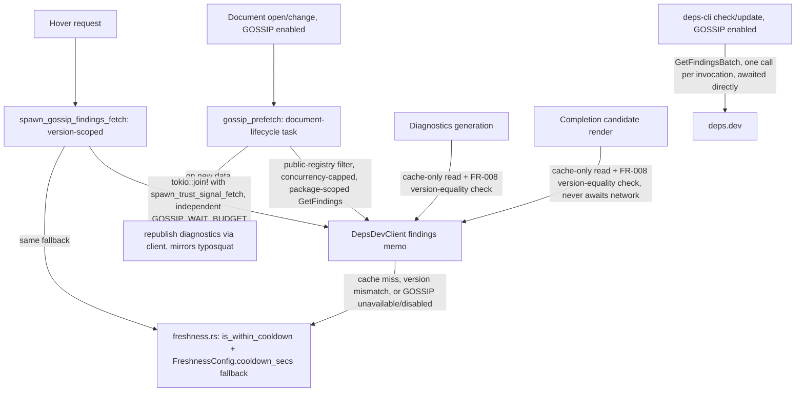

---
aliases:
  - deps.dev GOSSIP Signals Plan
tags:
  - sdd
  - plan
  - deps-dev
  - security
created: 2026-09-25
status: draft
related:
  - "[[spec]]"
  - "[[constitution]]"
  - "[[037-supply-chain-trust-signal/plan]]"
  - "[[071-typosquat-similarity-diagnostic/plan]]"
---

# Technical Plan: Adopt deps.dev GOSSIP signals

> [!info] References
> **Spec**: [[spec]]
> **Adopted scope (revised 2026-09-26)**: Dynamic Cooldown at hover + diagnostics (the 2 real existing
> call sites) plus completion (net-new capability, not a replacement) + Low-Usage Packages (net-new, gated
> on live schema confirmation). `deps-cli` gains a batched GOSSIP call for parity. All GOSSIP calls are
> opt-in. Malicious Packages / Critical Vulnerabilities / Archived Packages are **not** in scope (spec §7,
> §9). `FreshnessConfig.cooldown_secs` is **kept**, not removed.

## 0. Revision History

**2026-09-25**: initial plan, written directly by the team-lead during `/sdd plan` (no architect agent —
research/plan-phase session). Assumed 5 `is_within_cooldown` call sites, a shared 6-way `DEPS_DEV_WAIT_BUDGET`,
and planned to remove `freshness.cooldown_secs` entirely as a breaking change.

**2026-09-26**: a `rust-critic` adversarial pass (mandatory gate before `team-develop`'s `implement` phase)
returned verdict **critical** — 4 false premises (C1-C4), verified both against the live GOSSIP API and
direct code inspection (`grep -rn is_within_cooldown crates/deps-core/src/`), plus 6 significant/minor
findings. Full mapping lives in `spec.md` §9's "2026-09-26 critique round" table. This revision:

- Drops the false "replace 5 call sites" framing — only hover (`hover.rs:596`) and diagnostics
  (`diagnostics.rs:2262`) exist today.
- Keeps completion in scope, but as **net-new** capability (maintainer decision), with a corrected
  prefetch design.
- Reverses the `freshness.cooldown_secs` removal — it stays, scope narrowed to a `deps-lsp`-only
  precedence change.
- Adds a `deps-cli` batched GOSSIP call (new, was entirely absent from the first plan) for CLI/LSP parity.
- Adds an opt-in gate (mirroring `TyposquatConfig`), a public-registry source filter, and a prefetch
  concurrency cap — all absent from the first plan.
- Corrects the wire schema (`COOLDOWN` finding + `cooldownContext.end`, not a bare `cooldownEnd` field) and
  adds the exact-version-equality check `recommendedVersions[]`-emptiness requires.

## 1. Architecture

### Approach

One new `DepsDevClient` method family backed by GOSSIP's `GetFindings`/`GetFindingsBatch` v3alpha endpoints,
following the structural precedent of `similar_packages()` (spec 071, `deps_dev/mod.rs:691`) — new
memo/in-flight `DashMap`/`DashSet` pair, same TTL tiers (`DEPS_DEV_SUCCESS_TTL = 1h`, `DEPS_DEV_ERROR_TTL =
90s`, reused as-is), same `DepsDevFetchError` classification, same `get()`/`parse_json_checked::<Wire>`
plumbing.

**Real call-site scope (corrected).** `is_within_cooldown` is called from exactly 2 places today:
`hover.rs:596` (the "Latest" callout) and `diagnostics.rs:2262` (the outdated-dependency message). Neither
`completion.rs` (renders relative age only, via a `freshness_enabled: bool` flag — never gates on cooldown),
`code_actions.rs:531` (constructs `FreshnessSettings { enabled: false, .. }` — explicitly disabled), nor
`code_lenses.rs` (an unused `_freshness` test parameter) call it. This plan therefore:

1. Adds GOSSIP-backed cooldown to the 2 real call sites (hover, diagnostics), with `freshness.rs`'s
   existing local check as the fallback when GOSSIP is unavailable.
2. Adds cooldown to completion as **new** capability (maintainer decision 2026-09-26) — this is additive
   scope, not a fix for a per-item-network-call regression that (per C1) never actually existed.
3. Adds a `deps-cli check`/`update` GOSSIP call (FR-010) so the CLI's cooldown verdict does not permanently
   diverge from the LSP's (critique C2 — live GOSSIP windows are materially longer than the local default).

**Call-scope decision, corrected for S1/S2.** GOSSIP's package-scoped `GetFindings`
(`.../packages/{name}:findings`, no version segment) returns `recommendedVersions[]` and `defaultVersion`.
Live testing (2026-09-26) found `recommendedVersions[]` is **empty precisely when the default version is in
active cooldown** (`vite`, `boto3`, `next`, `@types/node` all confirmed) — so `defaultVersion` is the only
field that reliably carries cooldown data, and it must be checked for exact version equality against the
ecosystem registry's own reported latest version before being trusted (FR-008): a cached `defaultVersion`
from before a new release must never have its cooldown status applied to the new latest.

A version-scoped call (`.../versions/{version}:findings`) additionally returns `requestedVersion` for the
exact version asked about — **and it also includes `defaultVersion` and `packageFindings` in the same
response** (confirmed live on a `vite@8.3.0` probe). This means hover's one version-scoped call serves two
purposes at once: `defaultVersion` for the Latest-version cooldown callout, `requestedVersion` for the
pinned version's low-usage finding. No second call is needed.

- **Hover**: one version-scoped `GetFindings` call per hovered dependency, spawn-and-warm (mirrors
  `trust_signal`), read `defaultVersion` for cooldown + `requestedVersion` for low-usage.
- **Diagnostics/completion**: one package-scoped `GetFindings` call per distinct package, prefetched via a
  document-lifecycle background task and **republished** when it lands (mirroring
  `spawn_typosquat_prefetch_and_republish` — S4's fix; the first plan had cache-only reads with no
  republish, so data would only ever appear after the next unrelated edit). Cache-only reads at
  render/diagnostic-generation time; a version not covered by `defaultVersion` (per FR-008's equality
  check) falls back to `freshness.rs`'s local heuristic — a correct fallback, not a degraded one, since an
  old/non-latest version can never be in cooldown regardless of data source.
- **`deps-cli`**: a single `GetFindingsBatch` call per `check`/`update` invocation, awaited directly (the
  CLI is non-interactive and can afford to wait on a batch call — no prefetch/cache layer needed there).

**Opt-in gate (new, FR-009/S5).** The diagnostics/completion prefetch discloses every declared dependency's
name to deps.dev on document open — not just ones the user hovers. This is the same name-disclosure concern
that made spec 071's typosquat prefetch opt-in. GOSSIP integration therefore ships behind a new
`GossipConfig { enabled: bool }` (default `false`), structurally mirroring `TyposquatConfig`
(`policy_config.rs:1244`) — **not** `SupplyChainConfig`'s on-by-default pattern, which is the wrong
precedent since that config's calls are per-hover, not per-document-open-fan-out. The prefetch additionally
filters through `SourcePolicy::source_is_public_registry_content` (same gate typosquat prefetch uses,
`diagnostics.rs:1783`) so git/path dependencies never leak to deps.dev, and is bounded by a concurrency cap
mirroring `TYPOSQUAT_FETCH_CONCURRENCY = 8` (`diagnostics.rs:1733`).

### Component Diagram



### Key Design Decisions

| Decision | Choice | Rationale | Alternatives Considered |
|----------|--------|-----------|--------------------------|
| Real call-site scope | Hover + diagnostics (existing), completion (new) | C1: only 2 real `is_within_cooldown` sites exist; completion never had one | Treating completion as an existing site to "fix" — rejected, factually wrong per direct code inspection |
| Call scope | Version-scoped for hover; package-scoped (prefetched) for diagnostics/completion; batch for `deps-cli` | S1/S2: package-scoped `recommendedVersions` is unreliable (empty during active cooldown), `defaultVersion` is the field to trust; version-scoped hover call already includes `defaultVersion`+`packageFindings` for free | Per-candidate version-scoped calls for completion — rejected, O(N) network calls per session |
| Version-equality gate | FR-008: only trust `defaultVersion` when its version exactly matches the registry's own reported latest | Prevents applying a stale cached default's cooldown to a newly-released version | Trusting `defaultVersion` unconditionally — rejected, S1 showed this fails silently after a new release |
| Hover concurrency | `trust_signal` and GOSSIP fetches run concurrently (independent budgets) | M1: sequential awaits double hover's worst case to ~1.4s | Sequential await — rejected, this was the first plan's unstated default |
| Diagnostics/completion data source | Cache-only reads from the prefetch-warmed memo + republish on new data | FR-006 (no per-candidate network call); S4 fix (first plan had no republish path, so data was inert until the next edit) | Cache-only with no republish — rejected, matches the first plan's actual (unstated) gap |
| Fallback when GOSSIP unavailable/disabled/mismatched | `freshness.rs`'s `is_within_cooldown` + `FreshnessConfig.cooldown_secs` (kept, not removed) | NFR-002 graceful degradation "for free"; C3/C4 showed removal breaks `deps-cli`/GitHub Action and silently no-ops in the LSP rather than erroring | Removing `cooldown_secs` (first plan) — reversed, blast radius extends beyond `deps-lsp` |
| `FreshnessConfig.cooldown_secs` | **Kept.** Role changes from primary to `deps-lsp`-only fallback for GOSSIP-covered ecosystems; remains primary, unchanged, for `deps-cli`, the GitHub Action, and the 7 non-GOSSIP ecosystems | C3: shared config, removal breaks users' CI (`--cooldown`, Action input); C4: `deny_unknown_fields` is top-level-only so removal would silently no-op, not error, contradicting the first plan's assumption | Full removal as a breaking change (first plan) — reversed |
| Opt-in gate | New `GossipConfig.enabled` (default `false`), mirrors `TyposquatConfig` | S5: prefetch discloses all declared dependency names to deps.dev, same concern that made spec 071 opt-in | On-by-default like `trust_signal`/`SupplyChainConfig` — rejected, wrong precedent (that's per-hover, not a document-open fan-out) |
| `deps-cli` parity | New: batched `GetFindingsBatch` call per `check`/`update` invocation | C2: live GOSSIP cooldown windows (npm 15d/PyPI 5d/Cargo 10d) differ materially from local 3d default; without this, CLI and LSP permanently disagree | Leaving `deps-cli` GOSSIP-unaware (first plan, by omission) — rejected once C2's magnitude was measured live |
| Low-Usage Packages fetch | Same `GetFindings`/`GetFindingsBatch` call as cooldown (no separate fetch) | GOSSIP returns all finding types in one response | Separate dedicated low-usage call — rejected, wasteful |
| Low-Usage Packages schema | **Gated**: do not finalize `GossipFindingsWire`'s low-usage fields until one real `LOW_USAGE` finding is observed live | S3: ~20 combined probes (spec-phase + critique-phase) never observed one | Shipping an unverified schema guess — rejected, too risky for a field never seen in the wild |

## 2. Project Structure

```
crates/deps-core/src/
├── deps_dev/
│   ├── mod.rs           # + gossip_findings_for_package(), gossip_findings_for_version(),
│   │                    #   gossip_findings_batch() (deps-cli path), findings/findings_in_flight
│   │                    #   DashMap/DashSet pair, GOSSIP_WAIT_BUDGET const, GOSSIP_PREFETCH_CONCURRENCY
│   │                    #   const (mirrors TYPOSQUAT_FETCH_CONCURRENCY = 8)
│   └── types.rs         # + GossipFindingsWire, GossipFindingWire, GossipFindingType (Cooldown/LowUsage
│                        #   typed, #[serde(other)] catch-all for NOT_FOUND/MALICIOUS/DEPRECATED/
│                        #   VULNERABLE/REMEDIATION — never surfaced), cooldownContext/lowUsageContext
├── policy_config.rs      # + GossipConfig { enabled: bool } (default false), structural twin of
│                        #   TyposquatConfig (line 1244) — NOT touching FreshnessConfig's shape
├── freshness.rs          # UNCHANGED — is_within_cooldown/PublishTime/FreshnessConfig.cooldown_secs
│                        # all kept as-is; this feature adds a GOSSIP layer in front, does not modify
│                        # freshness.rs itself
├── lsp_helpers/
│   ├── hover.rs          # + spawn_gossip_findings_fetch (mirrors spawn_trust_signal_fetch); hover.rs:290's
│   │                    #   await changes from a lone timeout to a concurrent join of both spawned tasks
│   ├── diagnostics.rs    # cooldown check at line 2262 tries GOSSIP cache first (with FR-008 version-equality
│   │                    #   check), falls back to existing is_within_cooldown call unchanged
│   └── code_actions.rs   # UNCHANGED — already passes enabled: false, out of scope (C1)
├── completion.rs         # + NEW cooldown check (was entirely absent) — cache-only GOSSIP read +
│                        #   FR-008 check; silently omitted (no badge) on cache-miss, never a network call
└── cache_policy.rs       # reused as-is for findings-memo eviction

crates/deps-lsp/src/
└── document/
    └── gossip_prefetch.rs    # NEW — document-lifecycle prefetch + republish task, structural twin of
                              #        osv_scan::run_typosquat_prefetch / lifecycle::spawn_typosquat_
                              #        prefetch_and_republish; walks declared dependencies filtered by
                              #        source_is_public_registry_content, calls gossip_findings_for_package()
                              #        with GOSSIP_PREFETCH_CONCURRENCY-capped fan-out, republishes
                              #        diagnostics on new data. No-op when GossipConfig.enabled is false,
                              #        offline, or no public-registry dependencies exist.

crates/deps-cli/src/
├── cli.rs                    # UNCHANGED — --cooldown stays exactly as-is (FreshnessConfig.cooldown_secs
                              #   is not touched)
└── check.rs / update.rs       # + optional GossipConfig.enabled path: one gossip_findings_batch() call,
                              #   awaited directly, cross-referenced against each dependency's cooldown
                              #   verdict before it's reported (FR-010)
```

### Migrations

None — no persisted schema. `FreshnessConfig.cooldown_secs` is unchanged in shape and default (reversing
the first plan's removal), so there is no config migration for existing users. `GossipConfig.enabled`
defaults to `false`; no config change is required to keep current behavior.

## 3. Data Model

```rust
// crates/deps-core/src/deps_dev/types.rs

#[derive(Debug, Clone, serde::Deserialize)]
pub(crate) struct GossipFindingsWire {
    #[serde(default)]
    pub recommended_versions: Vec<GossipVersionFindingsWire>, // often EMPTY during active cooldown (S1)
    pub default_version: Option<GossipVersionFindingsWire>,   // the reliable field — see FR-008
    /// Only present on version-scoped calls (hover path). Also carries `default_version`/
    /// `package_findings` in the same response (S2) — one call covers both.
    pub requested_version: Option<GossipVersionFindingsWire>,
    #[serde(default)]
    pub package_findings: Vec<GossipFindingWire>,
}

#[derive(Debug, Clone, serde::Deserialize)]
pub(crate) struct GossipVersionFindingsWire {
    pub version_key: GossipVersionKeyWire,
    #[serde(default)]
    pub findings: Vec<GossipFindingWire>,
    /// Historical timestamp, present even for long-past cooldowns. NOT the "is this active" signal —
    /// that's a `COOLDOWN`-type entry in `findings` below (see `GossipFindingWire`).
    pub cooldown_end: Option<String>,
}

#[derive(Debug, Clone, serde::Deserialize)]
pub(crate) struct GossipFindingWire {
    #[serde(rename = "type")]
    pub finding_type: GossipFindingType,
    pub risk: GossipRisk,
    /// Populated for `Cooldown` findings: `{"end": "<RFC3339>"}`. Live-verified shape (2026-09-26, `vite`
    /// npm package): `{"type": "COOLDOWN", "risk": "RISK_HIGH", "cooldownContext": {"end": "..."}}`.
    pub cooldown_context: Option<GossipCooldownContextWire>,
    /// NOT finalized — no live `LOW_USAGE` finding observed across ~20 probes (S3). Implementation task
    /// must re-probe before shipping this field; may need to change shape entirely.
    pub low_usage_context: Option<serde_json::Value>,
}

#[derive(Debug, Clone, serde::Deserialize)]
pub(crate) struct GossipCooldownContextWire {
    pub end: String, // RFC3339
}

#[derive(Debug, Clone, Copy, PartialEq, Eq, serde::Deserialize)]
#[serde(rename_all = "SCREAMING_SNAKE_CASE")]
pub(crate) enum GossipFindingType {
    Cooldown,
    LowUsage,
    #[serde(other)]
    Other, // NOT_FOUND, MALICIOUS, DEPRECATED, VULNERABLE, REMEDIATION — not adopted, never surfaced.
           // NOT_FOUND specifically must never be surfaced standalone (NFR-002/M4): it fires for both
           // malicious/removed AND not-yet-indexed legitimate new packages, and this API gives no way
           // to distinguish the two.
}
```

Public-facing type (`deps-core` API surface, no `as_any()` downcasting per this project's typing rules):

```rust
pub struct GossipCooldown {
    pub end: PublishTime, // reuse freshness::PublishTime, not a second timestamp newtype
    pub risk: GossipRiskLevel,
}

pub struct GossipLowUsage {
    pub risk: GossipRiskLevel,
    // Additional fields pending live schema confirmation (S3) — implementation task, not finalized here.
}

pub struct GossipFindings {
    pub cooldown: Option<GossipCooldown>,
    pub low_usage: Option<GossipLowUsage>,
    /// The exact version this data was computed for — callers MUST compare this against the version
    /// they're actually displaying (FR-008) before trusting `cooldown`/`low_usage`.
    pub version: String,
}
```

```rust
// crates/deps-core/src/policy_config.rs — new section struct, twin of TyposquatConfig (line 1244)

/// Configuration for GOSSIP-sourced signals (issue #1456, spec 072). Ships **disabled by default**: the
/// diagnostics/completion prefetch path discloses every declared dependency's name to deps.dev, the same
/// concern that made [`TyposquatConfig`] opt-in.
#[derive(Debug, Clone, Copy, PartialEq, Eq, serde::Deserialize)]
pub struct GossipConfig {
    pub enabled: bool,
}

impl Default for GossipConfig {
    fn default() -> Self {
        Self { enabled: false }
    }
}
```

## 4. API Design

Internal `DepsDevClient` methods (not an LSP-facing API):

| Method | Scope | Callers | Timeout |
|--------|-------|---------|---------|
| `gossip_findings_for_version(system, name, version)` | version-scoped `GetFindings` | hover (`spawn_gossip_findings_fetch`) | `GOSSIP_WAIT_BUDGET` (new const, 700ms, independent of `DEPS_DEV_WAIT_BUDGET`); spawn-and-warm, awaited **concurrently** with `spawn_trust_signal_fetch` (FR-005/M1 fix), not sequentially |
| `gossip_findings_for_package(system, name)` | package-scoped `GetFindings` | `gossip_prefetch` background task; cache-only reads by diagnostics/completion | Concurrency-capped fan-out (`GOSSIP_PREFETCH_CONCURRENCY = 8`, mirrors `TYPOSQUAT_FETCH_CONCURRENCY`); readers never await — cache-only |
| `gossip_findings_batch(system, [name])` | `GetFindingsBatch` | `deps-cli check`/`update` (FR-010) | Awaited directly — CLI is non-interactive, no timeout budget needed beyond the HTTP client's own |

## 5. Integration Points

| System | Direction | Protocol | Notes |
|--------|-----------|----------|-------|
| deps.dev v3alpha `GetFindings`/`GetFindingsBatch` | outbound | HTTPS/JSON, via existing `HttpCache::get_transport_only_with_headers_limited_trusted_origin` | Same transport as `trust_signal`/`similar_packages`; still `v3alpha`, no GA — same provisional posture as spec 071. Gated behind `GossipConfig.enabled` (opt-in) |

## 6. Security

- No new secrets or auth — `GetFindings`/`GetFindingsBatch` are public, unauthenticated deps.dev endpoints
  (confirmed live, same as spec 037/071's calls).
- No new input validation surface beyond `deps_dev_system()`'s exhaustive `EcosystemId` match (fixed
  `api.deps.dev` origin, not user-configurable — same SSRF-safe pattern as existing calls).
- **Privacy (new, S5/FR-009/NFR-005)**: the diagnostics/completion prefetch sends every declared
  dependency's package name to deps.dev on document open — this is opt-in (`GossipConfig.enabled`, default
  `false`) and additionally filtered through `SourcePolicy::source_is_public_registry_content` so git/path
  dependencies (which may encode private/internal names) are never sent. Hover's per-dependency call is
  lower-risk (the user is already looking at that specific dependency) but is also gated behind the same
  flag for consistency and simplicity — one flag, not two different disclosure postures depending on which
  LSP feature triggered the call.

## 7. Testing Strategy

| Level | What to test |
|-------|--------------|
| Unit (`deps_dev::tests`) | `GossipFindingsWire` deserialization against real captured response shapes (the `vite` active-`COOLDOWN` fixture from 2026-09-26, plus the `request`/`left-pad` `DEPRECATED` fixtures from 2026-09-25); memo/in-flight/TTL behavior mirrors existing `similarity`/`popularity` tests; `gossip_findings_batch` deserialization for the CLI path |
| Unit (`hover.rs`) | New test proving `spawn_gossip_findings_fetch` and `spawn_trust_signal_fetch` are awaited concurrently, not sequentially (regression test for M1 — assert worst-case latency stays near `max(GOSSIP_WAIT_BUDGET, DEPS_DEV_WAIT_BUDGET)`, not their sum) |
| Unit (`deps_dev::mod`) | FR-008's version-equality check: `defaultVersion.version != registry_latest` must be treated as a cache-miss, not trusted data — test with a deliberately stale cached `defaultVersion` |
| Unit (`freshness.rs`) | **No changes required** — `FreshnessConfig.cooldown_secs` and its existing tests are untouched (reversing the first plan's removal) |
| Unit (`completion.rs`) | New cooldown-badge rendering path, cache-only — assert zero HTTP requests occur during candidate rendering regardless of cache state (FR-006 is a hard correctness requirement) |
| Unit (`policy_config.rs`) | `GossipConfig::default().enabled == false`; `deny_unknown_fields`/forward-compat behavior consistent with `TyposquatConfig`'s existing tests |
| Integration | `crates/deps-lsp` — `gossip_prefetch` fires on document open/change only when `GossipConfig.enabled`, filters non-public-registry dependencies, respects the concurrency cap, and republishes diagnostics on new data (structural twin of the existing typosquat prefetch-and-republish integration test) |
| Integration (`deps-cli`) | `check`/`update` with `GossipConfig.enabled`: one `GetFindingsBatch` call per invocation, cooldown verdict matches what the LSP would report for the same dependency (closes the C2 CLI/LSP-parity gap) |
| Live/manual (continuous-improvement cycle) | **Must** re-verify against a package flagged `LOW_USAGE` before finalizing `GossipFindingWire`'s low-usage fields — not observed across ~20 combined probes (S3); this is a hard gate on FR-001, not optional polish |
| CI regression | None expected for `FreshnessConfig`/`did_change_configuration` tests — they are unchanged by this revision (contrast with the first plan, which would have broken several) |

## 8. Performance Considerations

- Hover: GOSSIP and `trust_signal` fetches run concurrently under independent timeout budgets
  (`GOSSIP_WAIT_BUDGET` vs. `DEPS_DEV_WAIT_BUDGET`) — fixing M1's sequential-await latency doubling.
- Diagnostics/completion: zero added per-request latency — cache-only reads, network cost fully absorbed
  by the background `gossip_prefetch` task, bounded by `GOSSIP_PREFETCH_CONCURRENCY = 8` so a large monorepo
  doesn't fire an unbounded fan-out (S5).
- `deps-cli`: one batch call per invocation (not per-dependency) — `GetFindingsBatch`'s 5000-item cap covers
  any realistic single-project dependency count.
- Prefetch keying: one package-scoped call per **distinct package** (memo keyed by package, shared across
  hover/diagnostics/completion), so a package appearing multiple times in a manifest, or already warmed by
  a prior hover, is not re-fetched.

## 9. Rollout Plan

Single PR, no separate feature-flag mechanism beyond `GossipConfig.enabled` itself (which *is* the rollout
gate — opt-in, default off, per FR-009). Ship behind the existing `v3alpha` provisional posture (same as
spec 071). Hover/diagnostic/completion output attributes the signal to deps.dev/GOSSIP (NFR-004), and
explicitly distinguishes it from the `freshness.rs` local-heuristic fallback when both could apply (FR-002)
— following the `**Supply chain**`-style section-header attribution pattern from
`push_trust_signal_hover_section` (`hover.rs:1063-1101`). No `CHANGELOG.md` breaking-change entry is needed
(reversing the first plan) since `FreshnessConfig.cooldown_secs` is unchanged; a regular feature entry
documents the new opt-in `GossipConfig.enabled` flag instead.

## 10. Constitution Compliance

| Principle | Status | Notes |
|-----------|--------|-------|
| Type safety (no stringly-typed data) | Compliant | `GossipFindingType`/`GossipRisk` are typed enums with an explicit `#[serde(other)]` catch-all for forward-compatibility; `GossipConfig`/`GossipFindings` are concrete structs, not flattened maps |
| Cross-ecosystem consistency (`deps-core` centralization) | Compliant | All logic lives in `deps-core::deps_dev`/`policy_config`; no ecosystem crate needs its own GOSSIP client; reuses `deps_dev_system()` as-is; `deps-cli` reuses the same `deps-core` types rather than a parallel implementation |
| `unsafe_code = "forbid"` | Compliant | No unsafe needed |
| Non-blocking handlers | Compliant | FR-006 applies the principle to completion (genuinely new code, not a claimed fix); diagnostics follows the same cache-only rule; hover's concurrent-await fix (FR-005) is itself a non-blocking-handler correction |

## 11. Risks and Mitigations

| Risk | Impact | Probability | Mitigation |
|------|--------|-------------|------------|
| GOSSIP `v3alpha` schema changes before GA | Medium — deserialization breaks | Medium | `#[serde(other)]` catch-all on enums; unit tests pinned to captured real responses; same posture already accepted for spec 071 |
| `LOW_USAGE` finding schema is wrong once actually observed (never seen live across ~20 probes) | Medium — `GossipFindingWire`'s low-usage field is a placeholder | Medium-high (no live data yet) | Hard-gated in Testing Strategy: implementation must re-probe and confirm the shape before FR-001 ships; `low_usage_context` typed as `serde_json::Value` until then, not a guessed struct |
| Opt-in flag (`GossipConfig.enabled`) goes undiscovered, feature never actually used | Low — feature simply provides no value to users who don't enable it | Medium | Document in README/mdBook alongside spec 071's typosquat flag documentation pattern; not a correctness risk |
| `deps-cli`/LSP still disagree in edge cases (e.g. `deps-cli` run offline, GOSSIP disabled there but enabled in the editor) | Low — same graceful-degradation posture as any config divergence | Low | FR-002/NFR-004 require source attribution in output either way, so a disagreement is explainable, not silent |
| Package-scoped prefetch's `defaultVersion` becomes stale between prefetch and a new release | Low — FR-008's exact-version-equality check catches this by construction, falling back correctly | Low | Covered by FR-008; unit-tested explicitly (§7) |

## See Also

- [[spec]] — feature specification; see §9's "2026-09-26 critique round" for the full finding-to-decision mapping
- [[037-supply-chain-trust-signal/plan]] — `trust_signal`/`DEPS_DEV_WAIT_BUDGET` precedent this plan extends
- [[071-typosquat-similarity-diagnostic/plan]] — `similar_packages()`/opt-in `TyposquatConfig`/prefetch-and-republish precedent this plan mirrors
- [[MOC-specs]] — all specifications
