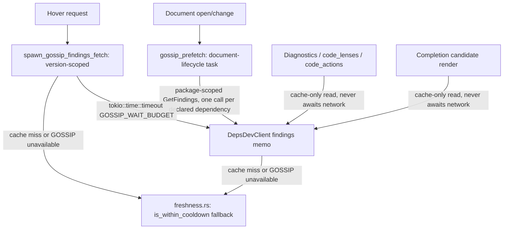

---
aliases:
  - deps.dev GOSSIP Signals Plan
tags:
  - sdd
  - plan
  - deps-dev
  - security
created: 2026-09-25
status: draft
related:
  - "[[spec]]"
  - "[[constitution]]"
  - "[[037-supply-chain-trust-signal/plan]]"
  - "[[071-typosquat-similarity-diagnostic/plan]]"
---

# Technical Plan: Adopt deps.dev GOSSIP signals

> [!info] References
> **Spec**: [[spec]]
> **Adopted scope**: Dynamic Cooldown (replaces `freshness.rs` as the primary source at all 5 call sites)
> + Low-Usage Packages (net-new). Malicious Packages / Critical Vulnerabilities / Archived Packages are
> **not** in scope (spec §7, §9).

## 1. Architecture

### Approach

One new `DepsDevClient` method family backed by GOSSIP's `GetFindings` v3alpha endpoint, following the
exact structural precedent of `similar_packages()` (spec 071, `deps_dev/mod.rs:691`) — new memo/in-flight
`DashMap`/`DashSet` pair, same TTL tiers (`DEPS_DEV_SUCCESS_TTL = 1h`, `DEPS_DEV_ERROR_TTL = 90s`, reused
as-is, not new constants), same `DepsDevFetchError { NotFound, Failed, TimedOut }` classification, same
`get()`/`parse_json_checked::<Wire>` plumbing.

**Key design decision — package-scoped, not version-scoped, calls.** GOSSIP's `GetFindings` at
`.../packages/{name}:findings` (no version segment) returns `recommendedVersions[]` and `defaultVersion`,
each carrying its own `cooldownEnd` and `findings[]` — confirmed live (spec.md §5). A version-scoped call
(`.../versions/{version}:findings`) additionally returns `requestedVersion` for one specific version, but
costs one network round-trip per version. Cooldown is only ever relevant for a package's most-recently-published
version(s) — an old, already-cooled-down version can never re-enter cooldown, so `freshness.rs`'s existing
`is_within_cooldown` already returns `false` for it regardless of data source. This means **one package-scoped
call per package gives full practical coverage**: it always includes the newest version(s) (as
`recommendedVersions`/`defaultVersion`), which are the only candidates a cooldown or low-usage finding could
ever apply to. This collapses what could have been an O(N-versions) fetch problem (the completion blocker
identified in spec §9) into O(1) per package.

- `requestedVersion` (i.e. version-scoped calls) is used **only** on the hover path, where exactly one
  specific pinned dependency+version is already the subject of the request — one call, not N.
- Everywhere else (diagnostics, code_lenses, code_actions, completion), the package-scoped call is prefetched
  once per package and read from cache; if a specific version being displayed isn't covered by
  `recommendedVersions`/`defaultVersion` in the cached response, it falls back to `freshness.rs`'s local
  heuristic (this is a correct fallback, not a degraded one, per the paragraph above).

### Component Diagram



### Key Design Decisions

| Decision | Choice | Rationale | Alternatives Considered |
|----------|--------|-----------|--------------------------|
| Call scope | Package-scoped `GetFindings` (no version segment) everywhere except hover | O(1) per package; cooldown/low-usage only ever meaningfully apply to the newest version(s), which package-scoped responses always include | Version-scoped per candidate — rejected: O(N) network calls per completion session, the exact problem spec §9 flagged |
| Hover call scope | Version-scoped `GetFindings` (`requestedVersion`) for the exact pinned dependency | Hover has exactly one subject dependency+version; version-scoped gives the most precise data for it | Reuse the package-scoped prefetch cache only — rejected: the pinned version may be old/unusual and absent from `recommendedVersions`, and hover already tolerates one dedicated spawn-and-warm fetch (precedent: `trust_signal`) |
| Completion/diagnostics/code_lenses/code_actions data source | Cache-only reads from the prefetch-warmed memo; never a synchronous network call | Satisfies FR-006 (no per-candidate network call); mirrors the existing `trust_signal` warm-cache pattern | Synchronous fetch per item — rejected, is exactly what spec §9 identified as non-viable for completion |
| Fallback when GOSSIP data isn't cached/available | `freshness.rs`'s `is_within_cooldown`/`PublishTime` (kept in the codebase, not deleted) | These are free, already-correct-when-recent, and give NFR-002 graceful degradation "for free" instead of inventing new fallback logic | Show no signal at all until GOSSIP responds — rejected: worse UX, and `freshness.rs` already does this job correctly |
| `freshness.cooldown_secs` user config option | Removed (FR-007, maintainer decision 2026-09-25) | GOSSIP is now the authoritative primary source; a user-adjustable window on top of an authoritative upstream recommendation is no longer meaningful | Keep as a floor layered on GOSSIP's value — considered, maintainer explicitly rejected in favor of a clean breaking change |
| Low-Usage Packages fetch | Same `GetFindings` call as cooldown (no separate fetch) | GOSSIP returns all finding types (`LOW_USAGE`, `COOLDOWN`, etc.) in one response; no reason to fetch twice | Separate dedicated low-usage call — rejected, wasteful |

## 2. Project Structure

```
crates/deps-core/src/
├── deps_dev/
│   ├── mod.rs          # + gossip_findings_for_package(), gossip_findings_for_version(),
│   │                   #   findings/findings_in_flight DashMap/DashSet pair, GOSSIP_WAIT_BUDGET const
│   └── types.rs        # + GossipFindingsWire, Finding, FindingType (NOT_FOUND/MALICIOUS/DEPRECATED/
│                       #   COOLDOWN/LOW_USAGE/VULNERABLE/REMEDIATION — parse only COOLDOWN/LOW_USAGE
│                       #   into typed fields; others via #[serde(other)] catch-all, never surfaced)
├── freshness.rs         # is_within_cooldown/PublishTime retained as the fallback layer (§1);
│                        # FreshnessSettings.cooldown_secs field removed (FR-007)
├── lsp_helpers/
│   └── hover.rs         # + spawn_gossip_findings_fetch (mirrors spawn_trust_signal_fetch),
│                        #   GOSSIP_WAIT_BUDGET timeout wrap; cooldown/low-usage sections updated to
│                        #   read GOSSIP first, freshness.rs fallback second
│   └── diagnostics.rs   # cooldown check switched to cache-only GOSSIP read + fallback
│   └── code_lens.rs     # same
│   └── code_actions.rs  # same
├── completion.rs         # cooldown check switched to cache-only GOSSIP read + fallback (FR-006)
└── cache_policy.rs       # reused as-is for findings-memo eviction

crates/deps-lsp/src/
└── document/
    └── gossip_prefetch.rs   # NEW — document-lifecycle prefetch task, structural twin of
                              #        osv_scan::run_typosquat_prefetch; walks declared dependencies,
                              #        calls gossip_findings_for_package() per package (fire-and-forget,
                              #        background timeout budget, not hover-latency-sensitive)
└── server.rs               # freshness.cooldown_secs config field removed; deny_unknown_fields config
                              #        parsing already rejects it going forward — document in CHANGELOG.md
```

## 3. Data Model

```rust
// crates/deps-core/src/deps_dev/types.rs

#[derive(Debug, Clone, serde::Deserialize)]
pub(crate) struct GossipFindingsWire {
    #[serde(default)]
    pub recommended_versions: Vec<GossipVersionFindingsWire>,
    pub default_version: Option<GossipVersionFindingsWire>,
    /// Only present on version-scoped hover calls.
    pub requested_version: Option<GossipVersionFindingsWire>,
    #[serde(default)]
    pub package_findings: Vec<GossipFindingWire>,
}

#[derive(Debug, Clone, serde::Deserialize)]
pub(crate) struct GossipVersionFindingsWire {
    pub version_key: GossipVersionKeyWire,
    #[serde(default)]
    pub findings: Vec<GossipFindingWire>,
    pub cooldown_end: Option<String>, // RFC3339; parsed the same way freshness::PublishTime parses timestamps
}

#[derive(Debug, Clone, serde::Deserialize)]
pub(crate) struct GossipFindingWire {
    #[serde(rename = "type")]
    pub finding_type: GossipFindingType,
    pub risk: GossipRisk,
}

#[derive(Debug, Clone, Copy, PartialEq, Eq, serde::Deserialize)]
#[serde(rename_all = "SCREAMING_SNAKE_CASE")]
pub(crate) enum GossipFindingType {
    Cooldown,
    LowUsage,
    #[serde(other)]
    Other, // NOT_FOUND, MALICIOUS, DEPRECATED, VULNERABLE, REMEDIATION — not adopted, never surfaced
}
```

Public-facing type (`deps-core` API surface, downcastable-free per this project's typing rules — plain
enum, no `as_any()`):

```rust
pub struct GossipCooldown {
    pub cooldown_end: PublishTime, // reuse freshness::PublishTime, not a second timestamp newtype
}

pub struct GossipLowUsage {
    pub risk: GossipRiskLevel, // RISK_CRITICAL..RISK_INFORMATIONAL, mapped from the wire enum
}

pub struct GossipFindings {
    pub cooldown: Option<GossipCooldown>,
    pub low_usage: Option<GossipLowUsage>,
}
```

### Migrations

None — no persisted schema, only an in-memory cache and a removed LSP config field (handled by existing
`deny_unknown_fields` config parsing rejecting the removed field, not a migration).

## 4. API Design

Internal `DepsDevClient` methods (not an LSP-facing API):

| Method | Scope | Callers | Timeout |
|--------|-------|---------|---------|
| `gossip_findings_for_version(system, name, version)` | version-scoped `GetFindings` | hover (`spawn_gossip_findings_fetch`) | `GOSSIP_WAIT_BUDGET` (new const, 700ms, mirrors `DEPS_DEV_WAIT_BUDGET`) on the wait; spawn-and-warm semantics identical to `trust_signal` — task keeps running past timeout and still warms the memo |
| `gossip_findings_for_package(system, name)` | package-scoped `GetFindings` | `gossip_prefetch` background task; cache-only reads by diagnostics/code_lenses/code_actions/completion | `TYPOSQUAT_CALL_TIMEOUT` (reused, 3s) on the background fetch itself; readers never await — cache-only |

## 5. Integration Points

| System | Direction | Protocol | Notes |
|--------|-----------|----------|-------|
| deps.dev v3alpha `GetFindings` | outbound | HTTPS/JSON, via existing `HttpCache::get_transport_only_with_headers_limited_trusted_origin` | Same transport as `trust_signal`/`similar_packages`; still `v3alpha`, no GA — same provisional posture as spec 071 |

## 6. Security

- No new secrets or auth — `GetFindings` is a public, unauthenticated deps.dev endpoint (confirmed live,
  same as spec 037/071's calls).
- No new input validation surface beyond what `deps_dev_system()`'s exhaustive `EcosystemId` match already
  guarantees (no free-text system values reach the URL — same SSRF-safe pattern as existing calls, fixed
  `api.deps.dev` origin, not user-configurable).

## 7. Testing Strategy

| Level | What to test |
|-------|--------------|
| Unit (`deps_dev::tests`) | `GossipFindingsWire` deserialization against the real response shapes captured in spec.md §5's live-testing notes (lodash/request/left-pad fixtures); memo/in-flight/TTL behavior mirrors existing `similarity`/`popularity` tests |
| Unit (`hover.rs`) | New test mirroring `test_generate_hover_trust_signal_over_real_wait_budget_omits_section` (line 6262) for `spawn_gossip_findings_fetch` — GOSSIP call exceeding `GOSSIP_WAIT_BUDGET` omits the section but still warms the memo (companion pattern to `trust_signal_survives_dropped_join_handle_and_warms_memo`) |
| Unit (`freshness.rs`) | Remove `FreshnessSettings.cooldown_secs`-specific tests; add/keep fallback-path tests proving `is_within_cooldown` still works correctly as the GOSSIP-unavailable degrade path |
| Unit (`completion.rs`) | Cache-only read never issues a network call — assert via a test double / call-counting mock that zero HTTP requests occur during candidate rendering regardless of cache state (FR-006 is a hard correctness requirement, not just a performance goal) |
| Integration | `crates/deps-lsp` — `gossip_prefetch` document-lifecycle task fires on document open/change (structural twin of the existing `run_typosquat_prefetch` integration test) |
| Live/manual (continuous-improvement cycle) | Re-run this plan's empirical schema/latency verification once implemented, against a package actually flagged `LOW_USAGE` — this session did not observe a live `LOW_USAGE` finding, so the `lowUsageContext` sub-schema (spec.md §5) is unconfirmed; verify during implementation and adjust `GossipFindingWire` if the observed shape differs |
| CI regression | `did_change_configuration` tests referencing `freshness.cooldown_secs` (server.rs lines 3388/3413/3547/3576/3848 per plan-phase research) must be updated/removed, not left silently broken |

## 8. Performance Considerations

- Hover: one additional concurrent spawn-and-warm task (GOSSIP, version-scoped), same shape as the existing
  `trust_signal` task — does not share `DEPS_DEV_WAIT_BUDGET` (spec §9 correction: that budget bounds only
  `trust_signal`), gets its own `GOSSIP_WAIT_BUDGET` constant so a slow GOSSIP response cannot regress
  `trust_signal`'s existing latency profile or vice versa.
- Diagnostics/code_lenses/code_actions/completion: zero added latency — cache-only reads, network cost is
  fully absorbed by the background `gossip_prefetch` task (fire-and-forget, 3s budget, does not block any
  LSP response).
- Prefetch fan-out: one package-scoped call per **distinct package** in a document (not per dependency
  occurrence — reuse the existing `DepsDevClient` memo keyed by package, so a monorepo manifest listing the
  same package twice, or completion re-querying a package already hovered, does not double-fetch).

## 9. Rollout Plan

Single PR, no feature flag — this is a P3 research-derived enhancement with a documented breaking change
(`freshness.cooldown_secs` removal). Ship behind the existing `v3alpha` provisional posture (same as spec
071): no special opt-in, but hover/diagnostic output attributes the signal to deps.dev/GOSSIP (NFR-004,
following the `**Supply chain**`-style section-header attribution pattern from `push_trust_signal_hover_section`,
`hover.rs:1063-1101`) so users can tell it's an upstream-sourced, still-alpha signal if it ever needs to be
walked back.

## 10. Constitution Compliance

| Principle | Status | Notes |
|-----------|--------|-------|
| Type safety (no stringly-typed data) | Compliant | `GossipFindingType`/`GossipRisk` are exhaustive-enough typed enums with an explicit `#[serde(other)]` catch-all for forward-compatibility with new upstream variants — not a raw string field |
| Cross-ecosystem consistency (`deps-core` centralization) | Compliant | All logic lives in `deps-core::deps_dev`/`freshness`; no ecosystem crate needs its own GOSSIP client — reuses `deps_dev_system()` as-is |
| `unsafe_code = "forbid"` | Compliant | No unsafe needed |
| Non-blocking handlers | Compliant | FR-006 is exactly this principle applied to completion; diagnostics/code_lenses/code_actions follow the same cache-only rule |

## 11. Risks and Mitigations

| Risk | Impact | Probability | Mitigation |
|------|--------|-------------|------------|
| GOSSIP `v3alpha` schema changes before GA | Medium — deserialization breaks | Medium | `#[serde(other)]` catch-all on enums; unit tests pinned to captured real responses; same posture already accepted for spec 071 |
| `lowUsageContext`/`cooldownContext` sub-schema differs from assumption (never observed live) | Low-medium — a field parses as absent instead of populated | Medium | Flagged explicitly in Testing Strategy; first implementation task should re-verify against a real flagged package before finalizing `GossipFindingsWire` |
| Removing `freshness.cooldown_secs` breaks a user's existing config | Low — config parse error surfaces clearly via `deny_unknown_fields`, not silent misbehavior | Low | `CHANGELOG.md` breaking-change entry + migration note (FR-007); existing `deny_unknown_fields` config gate means users get an explicit error, not silent ignoring |
| Package-scoped prefetch misses cooldown for a version outside `recommendedVersions`/`defaultVersion` | Low — only matters for versions old enough that cooldown is moot anyway (see §1 rationale) | Low | `freshness.rs` fallback covers this case correctly by construction |

## See Also

- [[spec]] — feature specification, all `[NEEDS CLARIFICATION]` items resolved 2026-09-25
- [[037-supply-chain-trust-signal/plan]] — `trust_signal`/`DEPS_DEV_WAIT_BUDGET` precedent this plan extends
- [[071-typosquat-similarity-diagnostic/plan]] — `similar_packages()`/background-prefetch precedent this plan mirrors
- [[MOC-specs]] — all specifications
