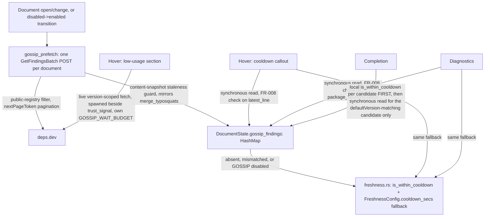

---
aliases:
  - deps.dev GOSSIP Signals Plan
tags:
  - sdd
  - plan
  - deps-dev
  - security
created: 2026-09-25
status: draft
related:
  - "[[spec]]"
  - "[[constitution]]"
  - "[[037-supply-chain-trust-signal/plan]]"
  - "[[071-typosquat-similarity-diagnostic/plan]]"
---

# Technical Plan: Adopt deps.dev GOSSIP signals

> [!info] References
> **Spec**: [[spec]]
> **Adopted scope (revised 2026-09-26, round 3)**: Dynamic Cooldown at hover + diagnostics (existing call
> sites) plus completion (net-new, but via the existing local heuristic as baseline — no dedicated
> completion prefetch layer) + Low-Usage Packages (gated on live schema confirmation). One
> `GetFindingsBatch` prefetch per open document, stored in `DocumentState` (not just the shared client
> memo). `deps-cli` parity (FR-010) is **dropped from this issue** — deferred to a follow-up issue (round-3
> finding N1: near-zero practical value, `deps-cli` has no `DepsDevClient` today). All GOSSIP calls opt-in.
> `FreshnessConfig.cooldown_secs` is kept. Malicious Packages / Critical Vulnerabilities / Archived
> Packages are **not** in scope.

## 0. Revision History

**2026-09-25**: initial plan (no architect agent — direct `/sdd plan` session). Assumed 5
`is_within_cooldown` call sites, a shared 6-way `DEPS_DEV_WAIT_BUDGET`, planned to remove
`freshness.cooldown_secs` entirely.

**2026-09-26, round 2**: `rust-critic` adversarial pass — verdict **critical**, 4 false premises (C1-C4:
wrong call-site count, unmodeled CLI/LSP disagreement, `FreshnessConfig` blast radius, `deny_unknown_fields`
scope) plus S1-S6/M1-M4. Revised: real call sites (hover+diagnostics), completion as new scope,
`cooldown_secs` kept, added `deps-cli` parity (FR-010) and an opt-in gate.

**2026-09-26, round 3**: second `rust-critic` pass on the round-2 revision (commit `db68e6f89`) — verdict
**significant**. Round-2 fixes for C1-C4/S1-S3/S5-S6/M1-M4 confirmed correct. New findings:

- **N1**: FR-010 (`deps-cli` GOSSIP parity) delivers almost no value — cooldown only changes a diagnostic's
  message suffix in `deps-cli` (no `--fail-on`/exit-code effect), `update` doesn't use cooldown at all, and
  `deps-cli`/`deps-engine` have no `DepsDevClient` today (verified: zero `cooldown` hits in `report.rs`/
  `analyze.rs`, zero in `update/`, zero `DepsDevClient` references in either crate). **Maintainer decision
  2026-09-26: drop FR-010 from this issue, file a separate follow-up issue.**
- **N2**: reading GOSSIP data from the shared `DepsDevClient` memo (1h TTL, 512-entry cap) means an idle
  open document's data silently expires/gets evicted, and nothing refetches until the next open/change —
  a diagnostics regeneration in between silently reverts to the local-fallback text with no signal that
  anything changed. **Fix**: store GOSSIP findings in `DocumentState` (mirroring `merge_typosquats`,
  `osv_scan.rs:441`, with the same content-snapshot staleness guard), not just the transient client memo.
- **N3**: completion's originally-planned "no badge on cache-miss" behavior is inconsistent with
  hover/diagnostics falling back to the local heuristic — and since GOSSIP only ever covers a package's
  `defaultVersion`, at most one completion candidate could ever be GOSSIP-badged anyway, while
  `completion.rs` already has `published_at` per candidate locally (`completion.rs:1253`). **Fix**: local
  `is_within_cooldown` per candidate becomes completion's default-on baseline (zero cost, no prefetch
  needed, works for all 14 ecosystems); GOSSIP only overrides/enriches the one candidate matching
  `defaultVersion`, read from the same `DocumentState` map diagnostics uses. This also means completion
  needs no dedicated prefetch layer of its own — a full simplification relative to round 2's FR-006.
- **N4**: round 2's FR-005 (concurrent hover awaits) doesn't actually fix M1: hover's cooldown callout
  renders at `push_latest_hover_section` (`hover.rs`, before the `trust_signal` await point) — GOSSIP data
  for that callout would need to be ready *before* the point where round 2 proposed joining it with
  `trust_signal`. **Fix**: don't fetch cooldown live in hover at all — source it from the same
  `DocumentState`-cached per-document prefetch N2/N3 use (synchronous, no wait, correct fallback if not yet
  warmed). Hover's only remaining *live* GOSSIP need is low-usage-for-the-specific-pinned-version (not
  necessarily the default version, so the document-level prefetch can't cover it) — and that already
  renders at the same later point `trust_signal` does, so it reuses the exact spawn-and-await pattern with
  its own independent budget, no shared-deadline machinery needed.
- **M5-M13**: `resolve_in_use_version` needed for hover's version-scoped low-usage call (no lockfile → no
  call, cooldown still available from the document-level cache); the "warmed by a prior hover" claim in the
  old §8 was false (different endpoints/keys) — dropped; prefer `GetFindingsBatch` (one POST per document)
  over a per-package fan-out, confirmed live-workable with `nextPageToken` pagination; `GossipConfig` needs
  `#[serde(default)]` + `#[non_exhaustive]` (else `{"gossip":{}}` fails to parse and the *entire* config
  reload is silently discarded) and a `PolicyConfigDiff` destructure entry; `low_usage_context` dropped as
  an untyped placeholder until a live finding is observed; FR-008's comparand named per call site.

## 1. Architecture

### Approach

**Real call-site scope**: `is_within_cooldown` exists today at exactly 2 places — `hover.rs` (Latest
callout) and `diagnostics.rs:2262` (outdated-dependency message). `completion.rs`, `code_actions.rs`
(`enabled: false`), and `code_lenses.rs` (test-only reference) do not call it. This plan:

1. Sources cooldown for hover + diagnostics from a per-document GOSSIP cache (below), falling back to
   `freshness.rs`'s existing local check when unavailable.
2. Adds a **local, default-on, zero-cost** cooldown check to completion (genuinely new — it never had one),
   using the same per-candidate `published_at` completion already collects. GOSSIP enriches only the
   candidate matching `defaultVersion` when available — never gates the completion response on network.
3. Does **not** touch `deps-cli` (FR-010 dropped, N1) — filed as a separate follow-up issue.

**Data flow, corrected for N2/N3/N4**: one `GetFindingsBatch` POST per open document (not a per-package
fan-out, not a per-hover live call for cooldown), covering every declared dependency whose source passes
`SourcePolicy::source_is_public_registry_content`. Results are stored **in `DocumentState`** — a new
field holding a `HashMap<PackageName, GossipFindings>` — via the same pattern `merge_typosquats` already
establishes: fetch under a content snapshot, then on completion check `doc.content == content_snapshot`
before merging (if the document changed mid-fetch, drop the stale result rather than merge it). This
survives idle documents correctly (no TTL/eviction to silently lose data) and is exactly what diagnostics,
completion, and hover's cooldown callout all read from — synchronously, no network wait, at generation
time.

- **Hover's cooldown callout**: reads the document-level cache for the hovered package, checked against
  FR-008's version-equality gate (comparand: the `latest_line` version already computed for the callout).
  If absent or mismatched, falls back to `freshness.rs`'s local check — the existing, unmodified behavior.
  No live network call in the hover request path for cooldown at all (this is what actually fixes N4 — not
  a shared deadline, but removing the live wait from this render point entirely).
- **Hover's low-usage section**: the *only* remaining live, per-request GOSSIP fetch — version-scoped,
  because the pinned/resolved version (via `resolve_in_use_version`, M5) may not be the package's default
  version and so isn't necessarily in the document-level cache. Spawned alongside `spawn_trust_signal_fetch`
  and awaited at the same later point `trust_signal` already is (near the vulnerability/deprecation
  sections), under its own `GOSSIP_WAIT_BUDGET` — independent of `DEPS_DEV_WAIT_BUDGET`, and with no shared
  budget needed with the cooldown callout since cooldown no longer waits on anything live. If the
  dependency has no lockfile-resolved version (range-only, `resolve_in_use_version` returns `None`), this
  fetch is skipped — low-usage is simply omitted, cooldown still works via the document-level cache.
- **Diagnostics**: same document-level cache read, FR-008 comparand is `package_versions.latest`. Falls
  back to the existing `is_within_cooldown` call unchanged.
- **Completion**: local `is_within_cooldown` per candidate (default-on baseline, all 14 ecosystems, zero
  cost — N3's fix). The one candidate matching `defaultVersion` (FR-008 comparand: that candidate's own
  version) is additionally enriched from the document-level cache with GOSSIP's cooldown-end precision and
  low-usage flag, when the cache has data and `GossipConfig.enabled`. Never a network call from completion
  itself.

**Opt-in gate (FR-009, unchanged from round 2)**: `GossipConfig { enabled: bool }` (default `false`) in
`policy_config.rs`, a structural twin of `TyposquatConfig` (`policy_config.rs:1244`) — including the
details round 2's snippet missed (M12): `#[serde(default)]` on `enabled` and `#[non_exhaustive]` on the
struct, so a partial `{"gossip":{}}` config parses correctly instead of failing the *entire* config reload.
Wired into `PolicyConfigDiff`'s exhaustive destructure (M8) and given the same runtime-toggle mechanics
`typosquat`'s opt-in flag has (`server.rs:866-927`): a `ServerState` atomic (`is_gossip_enabled`/
`set_gossip_enabled`), read-before-overwrite in `did_change_configuration`, and
`trigger_gossip_prefetch_for_open_documents` fired on the disabled→enabled transition specifically (so an
already-open document doesn't wait for its next edit to pick up newly-enabled GOSSIP data).

The document-level prefetch is filtered through `SourcePolicy::source_is_public_registry_content` (same
gate typosquat prefetch uses) so git/path dependencies never reach deps.dev.

### Component Diagram



### Key Design Decisions

| Decision | Choice | Rationale | Alternatives Considered |
|----------|--------|-----------|--------------------------|
| Storage | `DocumentState.gossip_findings: HashMap<PackageName, GossipFindings>`, not the shared `DepsDevClient` memo | N2: memo TTL/eviction silently loses data for idle documents; `DocumentState` storage (mirroring `merge_typosquats`) survives correctly | Reading the shared memo directly at render time (round 2) — reverted, this was N2's exact finding |
| Fetch shape | One `GetFindingsBatch` POST per document | M7: live-verified to work with mixed systems + `nextPageToken`; avoids an 8-way-fan-out concurrency cap entirely (simpler than round 2's per-package prefetch) | Per-package `GetFindings` fan-out (round 2) — dropped, batch is strictly simpler once storage moved to `DocumentState` |
| Completion baseline | Local `is_within_cooldown` per candidate, default-on, GOSSIP only enriches the `defaultVersion`-matching candidate | N3: GOSSIP can only ever cover one candidate; the local check is already free and covers all candidates/ecosystems; dropping the local baseline (round 2) meant GOSSIP-disabled users and 7 uncovered ecosystems got *nothing new* in completion | A dedicated completion prefetch/cache layer with no local baseline (round 2's FR-006) — dropped as unnecessarily complex once the local check is the baseline |
| Hover cooldown source | Document-level cache, no live network wait | N4: the callout renders before round 2's proposed join point; removing the live wait for cooldown (not adding a shared deadline) is the actual fix | `timeout_at(shared_deadline)` across two separate render points (critic's literal N4 suggestion) — a simpler fix exists once cooldown stops needing a live fetch at all |
| Hover low-usage source | Live, version-scoped fetch, spawned beside `trust_signal`, own budget | The pinned version may not be `defaultVersion`, so the document-level cache can't cover it; low-usage renders at the same point `trust_signal` already does, so no ordering conflict exists here (unlike cooldown) | Sourcing low-usage from the document-level cache too — rejected, would silently miss any non-default pinned version |
| `resolve_in_use_version` | Used to determine the pinned version for hover's low-usage fetch (M5) | A range-only dependency with no lockfile has no concrete version to check | Fetching for the range itself — not meaningful, GOSSIP findings are per-version |
| `GossipConfig` shape | `#[serde(default)]` on `enabled`, `#[non_exhaustive]` on the struct, `PolicyConfigDiff` entry, `ServerState` atomic + trigger-on-enable | M8/M12: `TyposquatConfig`'s exact shape; missing `#[serde(default)]` breaks parsing of a partial section and discards the whole config reload | Copying round 2's snippet as-is — it was missing exactly these details |
| `low_usage_context` field | Dropped from the wire type until a live finding is observed | M9: an untyped `serde_json::Value` placeholder violates this project's type-safety rule for no benefit — serde already ignores unknown keys safely | Keeping the untyped placeholder "just in case" — rejected |
| `deps-cli` parity (FR-010) | **Dropped from this issue.** Filed as a separate follow-up issue (P4) | N1 + maintainer decision 2026-09-26: near-zero practical effect (message-text-only, `update` doesn't use cooldown at all), requires new `DepsDevClient` wiring in `deps-engine` that doesn't exist today | Keeping FR-010, limited to `check` only (critic's fallback suggestion) — maintainer chose to drop entirely rather than ship a low-value partial integration |

## 2. Project Structure

```
crates/deps-core/src/
├── deps_dev/
│   ├── mod.rs            # + gossip_findings_batch() (one POST per document, nextPageToken pagination),
│   │                     #   gossip_findings_for_version() (hover's live low-usage fetch),
│   │                     #   GOSSIP_WAIT_BUDGET const. No per-package prefetch method needed (batch
│   │                     #   replaces it) — no new memo/in-flight pair either; results go straight into
│   │                     #   DocumentState, not a DepsDevClient-owned cache.
│   └── types.rs          # + GossipFindingsWire (batch response envelope), GossipFindingWire,
│                         #   GossipFindingType (Cooldown/LowUsage typed, #[serde(other)] catch-all),
│                         #   GossipCooldownContextWire { end: String }. NO low_usage_context field (M9)
│                         #   until a live finding confirms its shape.
├── policy_config.rs       # + GossipConfig { enabled: bool }, #[serde(default)] on the field,
│                         #   #[non_exhaustive] on the struct (twin of TyposquatConfig, policy_config.rs:
│                         #   1244-1271) + PolicyConfigDiff destructure entry (M8)
├── freshness.rs           # UNCHANGED — is_within_cooldown/PublishTime/FreshnessConfig.cooldown_secs
│                         # untouched; this feature layers GOSSIP in front, at read time, never modifies
│                         # freshness.rs itself
├── lsp_helpers/
│   ├── mod.rs             # + VersionData gains no new field (it's a borrowed, Copy, per-call snapshot);
│   │                     #   GOSSIP data is read from DocumentState by the deps-lsp handler layer before
│   │                     #   VersionData is constructed, then passed alongside it (S4's plumbing gap)
│   ├── hover.rs           # cooldown callout (push_latest_hover_section) reads the passed-in GOSSIP cache
│   │                     #   snapshot, falls back to is_within_cooldown unchanged; + spawn_gossip_
│   │                     #   low_usage_fetch beside spawn_trust_signal_fetch, awaited at the existing
│   │                     #   trust_signal join point under GOSSIP_WAIT_BUDGET
│   └── diagnostics.rs     # cooldown check at line 2262 tries the passed-in GOSSIP cache snapshot first
│                         #   (FR-008 check against package_versions.latest), falls back unchanged
└── completion.rs          # + local is_within_cooldown per candidate (new baseline, N3); the
                          #   defaultVersion-matching candidate additionally reads the passed-in GOSSIP
                          #   cache snapshot for enrichment (cooldown precision + low-usage), never network

crates/deps-lsp/src/
├── document/
│   ├── state.rs          # DocumentState gains `gossip_findings: HashMap<PackageName, GossipFindings>`
│   │                     #   (mirrors the existing typosquat-findings field) + `merge_gossip_findings`
│   │                     #   (mirrors `merge_typosquats`, same content-snapshot staleness guard)
│   └── gossip_prefetch.rs # NEW — one GetFindingsBatch POST per document, filtered by
│                         #   source_is_public_registry_content, on open/change and on the
│                         #   disabled->enabled config transition; on success calls
│                         #   doc.merge_gossip_findings() and republishes diagnostics (mirrors
│                         #   spawn_typosquat_prefetch_and_republish, lifecycle.rs:1344)
└── server.rs              # + is_gossip_enabled/set_gossip_enabled ServerState atomic,
                          #   trigger_gossip_prefetch_for_open_documents, wired into
                          #   did_change_configuration exactly like typosquat's (server.rs:866-927)
```

## 3. Data Model

```rust
// crates/deps-core/src/deps_dev/types.rs

/// One `GetFindingsBatch` response entry (one document's worth of dependencies, batched).
#[derive(Debug, Clone, serde::Deserialize)]
pub(crate) struct GossipFindingsWire {
    pub package_key: GossipPackageKeyWire,
    #[serde(default)]
    pub recommended_versions: Vec<GossipVersionFindingsWire>, // often EMPTY during active cooldown (S1)
    pub default_version: Option<GossipVersionFindingsWire>,   // the reliable field — see FR-008
    pub requested_version: Option<GossipVersionFindingsWire>, // present on version-scoped hover low-usage calls only
    #[serde(default)]
    pub package_findings: Vec<GossipFindingWire>,
}

#[derive(Debug, Clone, serde::Deserialize)]
pub(crate) struct GossipVersionFindingsWire {
    pub version_key: GossipVersionKeyWire,
    #[serde(default)]
    pub findings: Vec<GossipFindingWire>,
    pub cooldown_end: Option<String>, // historical field, NOT the active-cooldown signal (see below)
}

#[derive(Debug, Clone, serde::Deserialize)]
pub(crate) struct GossipFindingWire {
    #[serde(rename = "type")]
    pub finding_type: GossipFindingType,
    pub risk: GossipRisk,
    /// Populated for `Cooldown` findings only. Live-verified shape (2026-09-26, `vite` npm package):
    /// `{"type": "COOLDOWN", "risk": "RISK_HIGH", "cooldownContext": {"end": "<RFC3339>"}}`.
    pub cooldown_context: Option<GossipCooldownContextWire>,
    // NO low_usage_context field (M9) — no live LOW_USAGE finding has been observed across ~20 combined
    // probes. Adding a typed field now would be a guess; serde silently ignores the unknown key until
    // an implementation task re-probes and confirms the real shape.
}

#[derive(Debug, Clone, serde::Deserialize)]
pub(crate) struct GossipCooldownContextWire {
    pub end: String, // RFC3339
}

#[derive(Debug, Clone, Copy, PartialEq, Eq, serde::Deserialize)]
#[serde(rename_all = "SCREAMING_SNAKE_CASE")]
pub(crate) enum GossipFindingType {
    Cooldown,
    LowUsage,
    #[serde(other)]
    Other, // NOT_FOUND, MALICIOUS, DEPRECATED, VULNERABLE, REMEDIATION — never surfaced.
           // NOT_FOUND must never be surfaced standalone (NFR-002/M4): ambiguous between
           // malicious/removed and not-yet-indexed-by-deps.dev.
}
```

Public-facing type (stored in `DocumentState`, no `as_any()` downcasting per this project's typing rules):

```rust
pub struct GossipCooldown {
    pub end: PublishTime, // reuse freshness::PublishTime
    pub risk: GossipRiskLevel,
}

pub struct GossipLowUsage {
    pub risk: GossipRiskLevel,
    // Further fields pending live schema confirmation (S3) — implementation task, not finalized here.
}

pub struct GossipFindings {
    pub cooldown: Option<GossipCooldown>,
    pub low_usage: Option<GossipLowUsage>,
    /// The exact version this data applies to. Callers MUST compare against the version they're actually
    /// displaying (FR-008) before trusting `cooldown`/`low_usage` — see per-call-site comparands in §1.
    pub version: String,
}
```

```rust
// crates/deps-core/src/policy_config.rs — twin of TyposquatConfig (line 1244), with the details
// round 2's snippet was missing (M12)

/// Configuration for GOSSIP-sourced signals (issue #1456, spec 072). Ships **disabled by default**: the
/// document-level prefetch discloses every declared dependency's name to deps.dev, the same concern that
/// made [`TyposquatConfig`] opt-in.
#[non_exhaustive]
#[derive(Debug, Clone, Deserialize, Default)]
pub struct GossipConfig {
    /// Whether GOSSIP-sourced cooldown/low-usage signals are fetched at all.
    #[serde(default)]
    pub enabled: bool,
}
```

```rust
// crates/deps-core/src/policy_config.rs — PolicyConfigDiff destructure (M8), added alongside the
// existing TyposquatConfig line:
let GossipConfig { enabled: _ } = new_gossip;
```

`DocumentState` (`crates/deps-lsp/src/document/state.rs`) gains:

```rust
pub struct DocumentState {
    // ...existing fields...
    /// GOSSIP findings for this document's declared dependencies, keyed by package name. Populated by
    /// `gossip_prefetch`'s `GetFindingsBatch` call, merged under a content-snapshot staleness guard —
    /// structural twin of the existing typosquat-findings field / `merge_typosquats`.
    gossip_findings: HashMap<PackageName, GossipFindings>,
}

impl DocumentState {
    /// Mirrors `merge_typosquats`: drops the result if `self.content` changed since the fetch started.
    pub(crate) fn merge_gossip_findings(&mut self, findings: HashMap<PackageName, GossipFindings>) { .. }
}
```

### Migrations

None — no persisted schema. `FreshnessConfig.cooldown_secs` is unchanged (kept, not removed).
`GossipConfig.enabled` defaults to `false`; no config change is required to keep current behavior.

## 4. API Design

Internal methods (not an LSP-facing API):

| Method | Scope | Callers | Notes |
|--------|-------|---------|-------|
| `gossip_findings_batch(system, [name])` | `GetFindingsBatch` | `gossip_prefetch` (document-lifecycle task) | One call per document, not per package; `source_is_public_registry_content`-filtered input; paginates via `nextPageToken` if the response is split |
| `gossip_findings_for_version(system, name, version)` | version-scoped `GetFindings` | hover's low-usage section only | Spawned beside `spawn_trust_signal_fetch`, awaited at the same join point under `GOSSIP_WAIT_BUDGET`; skipped entirely when `resolve_in_use_version` returns `None` (M5) |

## 5. Integration Points

| System | Direction | Protocol | Notes |
|--------|-----------|----------|-------|
| deps.dev v3alpha `GetFindingsBatch`/`GetFindings` | outbound | HTTPS/JSON POST (batch) / GET (version-scoped), via `HttpCache` | Still `v3alpha`, no GA — same provisional posture as spec 071. `HttpCache::post_json` (M7) currently lacks the body-limit/trusted-origin guarantees the existing GET path has — this must be closed as part of adding batch support, not assumed already covered. Gated behind `GossipConfig.enabled` |

## 6. Security

- No new secrets or auth — both endpoints are public and unauthenticated (confirmed live).
- No new input-validation surface beyond `deps_dev_system()`'s exhaustive match (fixed origin, not
  user-configurable).
- **`HttpCache::post_json` gap (M7, new)**: the existing GET path has body-limit and trusted-origin
  guarantees this POST path does not yet have — implementation must close this gap before shipping the
  batch call, not assume parity with the GET path.
- **Privacy (S5/FR-009/NFR-005, unchanged)**: the document-level prefetch discloses every declared
  dependency's name to deps.dev — opt-in (`GossipConfig.enabled`, default `false`), filtered through
  `SourcePolicy::source_is_public_registry_content`.

## 7. Testing Strategy

| Level | What to test |
|-------|--------------|
| Unit (`deps_dev::tests`) | `GossipFindingsWire` batch-response deserialization against real captured shapes (`vite` active-`COOLDOWN`, `request`/`left-pad` `DEPRECATED`); `nextPageToken` pagination handling |
| Unit (`state.rs`) | `merge_gossip_findings` drops a stale result when `content` changed mid-fetch (direct port of the existing `merge_typosquats` test) |
| Unit (`deps_dev::mod`) | FR-008's version-equality check at each of its 3 comparands (hover `latest_line`, diagnostics `package_versions.latest`, completion's default-matching candidate) — a mismatch must be treated as a cache-miss |
| Unit (`hover.rs`) | Cooldown callout reads from the passed-in cache snapshot with no network call in the test (regression guard against reintroducing a live wait — this is what actually fixes N4); low-usage fetch still exercises the existing spawn-and-timeout pattern; `resolve_in_use_version() == None` skips the low-usage fetch entirely (M5) |
| Unit (`freshness.rs`) | **No changes required** — untouched |
| Unit (`completion.rs`) | Local `is_within_cooldown` baseline fires for every candidate regardless of `GossipConfig.enabled`; the `defaultVersion`-matching candidate is enriched only when the document-level cache has data; zero HTTP requests during candidate rendering in all cases |
| Unit (`policy_config.rs`) | `GossipConfig::default().enabled == false`; a partial `{"gossip":{}}` config parses successfully (regression test for M12's `#[serde(default)]` requirement) |
| Integration | `crates/deps-lsp` — `gossip_prefetch` fires on document open/change and on the disabled→enabled config transition (mirrors typosquat's `trigger_*_for_open_documents` test); republishes diagnostics on new data; a document that goes idle for longer than any TTL still shows correct GOSSIP-sourced diagnostics on the next unrelated regeneration (regression test for N2 — this is the scenario the round-2 design would have silently gotten wrong) |
| Live/manual (continuous-improvement cycle) | **Must** re-verify against a package flagged `LOW_USAGE` before adding any typed field for it (S3/M9) — hard gate, not optional polish |
| CI regression | None expected for `FreshnessConfig`/`did_change_configuration` tests (unchanged) |

## 8. Performance Considerations

- One `GetFindingsBatch` POST per document (not per package) — simpler and cheaper than round 2's
  per-package fan-out; no concurrency cap needed for within-document fan-out since there isn't one.
  Multiple simultaneously-open documents in a large workspace still each fire their own batch call; if this
  proves to be a real load concern in practice, a light cross-document concurrency bound can be added later
  — not speculatively designed here.
- Hover: no live network wait for cooldown (N4 fix) — only the low-usage fetch is live, under its own
  `GOSSIP_WAIT_BUDGET`, at the same point `trust_signal` already awaits.
- Completion: zero added latency in all cases — the local per-candidate check is already free, and the
  document-level cache read for the one enriched candidate is synchronous.
- Diagnostics: zero added latency — synchronous cache read, falls back unchanged on miss.

## 9. Rollout Plan

Single PR, gated by `GossipConfig.enabled` (opt-in, default off — this *is* the rollout gate, per FR-009).
Ship behind the existing `v3alpha` provisional posture (same as spec 071). Output attributes the signal to
deps.dev/GOSSIP (NFR-004) and is distinguishable from the local-heuristic fallback (FR-002). No
`CHANGELOG.md` breaking-change entry needed (`FreshnessConfig.cooldown_secs` is unchanged) — a regular
feature entry documents the new opt-in flag. `deps-cli` GOSSIP parity (FR-010) is explicitly **not** part
of this PR — tracked in a separate follow-up issue (P4, per the maintainer decision recorded in §0).

## 10. Constitution Compliance

| Principle | Status | Notes |
|-----------|--------|-------|
| Type safety | Compliant | `GossipFindingType`/`GossipRisk` typed enums with `#[serde(other)]`; `low_usage_context` deliberately omitted rather than typed as an untyped placeholder (M9 fix) |
| Cross-ecosystem consistency | Compliant | All logic in `deps-core::deps_dev`/`policy_config`/`DocumentState`; reuses `deps_dev_system()` as-is |
| `unsafe_code = "forbid"` | Compliant | No unsafe needed |
| Non-blocking handlers | Compliant | Completion and diagnostics are synchronous cache reads by construction; hover's only live wait (low-usage) reuses the existing bounded-timeout pattern |

## 11. Risks and Mitigations

| Risk | Impact | Probability | Mitigation |
|------|--------|-------------|------------|
| GOSSIP `v3alpha` schema changes before GA | Medium | Medium | `#[serde(other)]` catch-all; tests pinned to captured real responses |
| `LOW_USAGE` finding schema still unconfirmed | Medium | Medium-high | Hard-gated in Testing Strategy; no typed field added until observed (M9) |
| `HttpCache::post_json` lacks the GET path's body-limit/trusted-origin guarantees | Medium — a security gap if shipped as-is | Low (caught here, before implementation) | Explicit task to close this gap (§6), not an assumption of parity |
| Opt-in flag goes undiscovered | Low | Medium | Document alongside spec 071's typosquat flag |
| A large workspace with many simultaneously-open documents each firing a batch call | Low-medium | Low | Not speculatively designed against; revisit if a real load concern emerges (§8) |

## See Also

- [[spec]] — feature specification; see §9's critique-round tables for the full finding-to-decision mapping
- [[037-supply-chain-trust-signal/plan]] — `trust_signal`/`DEPS_DEV_WAIT_BUDGET` precedent this plan extends
- [[071-typosquat-similarity-diagnostic/plan]] — `TyposquatConfig`/`merge_typosquats`/prefetch-and-republish precedent this plan mirrors
- [[MOC-specs]] — all specifications
