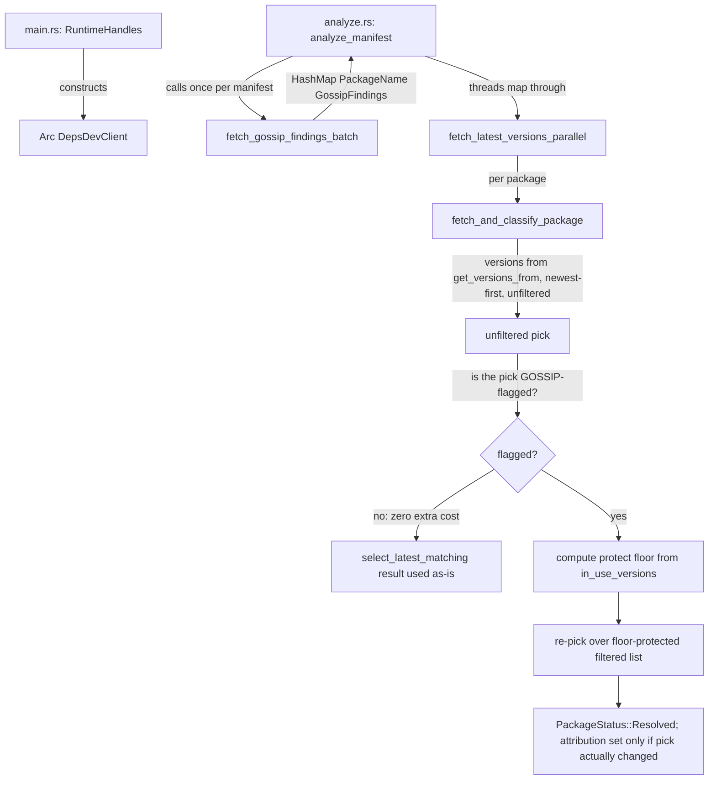

---
aliases:
  - deps-cli GOSSIP Parity Plan
tags:
  - sdd
  - plan
  - deps-cli
  - deps-dev
created: 2026-09-26
status: draft
related:
  - "[[spec]]"
  - "[[constitution]]"
---

# Technical Plan: deps-cli GOSSIP Parity

> [!info] References
> **Spec**: [[spec]]

## 1. Architecture

### Approach

Reuse spec 072's shipped `deps-core` GOSSIP plumbing unmodified. Add three pieces of wiring:

1. **Composition root** (`deps-cli`'s `RuntimeHandles`, `main.rs:88-121`): construct an
   `Arc<DepsDevClient>` next to the existing `Arc<OsvClient>`.
2. **Per-manifest prefetch** (`deps-cli::analyze::analyze_manifest`): one
   `fetch_gossip_findings_batch` call per manifest/ecosystem, before the per-package fetch stream
   starts — mirrors the existing `prefetch_tier3_licenses` call shape in the same file.
3. **Per-package filter** (`deps-engine::classify::fetch::fetch_and_classify_package`): consult
   the prefetched map to additionally exclude a version GOSSIP flags as in active cooldown,
   before `select_latest_matching` runs.

Plus the independent `ignored_sections`/`--config` fix in `deps-cli::config`.

### Component Diagram



### Key Design Decisions

**Revised round 1** (critique found the original "union with local exclusion" premise false —
`freshness.cooldown_secs` never excludes a version, only annotates a message; see spec.md's round-1
correction). The filter and precedence rows below replace the original design.

| Decision | Choice | Rationale | Alternatives Considered |
|----------|--------|-----------|------------------------|
| Where to filter | Post-filter `versions` in `fetch_and_classify_package`, before `select_latest_matching` (fetch.rs:819) | Zero changes to the `Registry` trait or any of the 14 ecosystem crates — `versions` is already fully in scope at this point | Threading GOSSIP into `Registry::get_versions_from`'s signature — rejected: touches 14 crates for no added benefit, since the exclusion set is a pure list-filter operation independent of how each registry fetches |
| Prefetch granularity | One `GetFindingsBatch` call per manifest per covered ecosystem (via existing `fetch_gossip_findings_batch`) | Matches deps-lsp's own per-document batching; avoids N per-package calls | Per-package `gossip_findings_for_version` calls — rejected: no batching, defeats the point of `GetFindingsBatch` existing |
| Filter safety (round 1) | **Floor-protected exclusion**: GOSSIP may only exclude a version strictly newer than the newest version in `in_use_versions`; a version at/older than that floor is never excluded, and the second (filtered) selection pass only runs at all when the first (unfiltered) pick is itself flagged | The naive "always exclude any flagged version" design (round 0) could regress `latest` below an already-declared dependency — proven by critique's C1 (a pinned `foo = "2.0.0"` with an active cooldown on 2.0.0 would resolve `latest` to 1.0.0, and `deps-cli update` would then rewrite the manifest to 1.0.0, a silent downgrade). The floor makes that impossible by construction: the protected version always satisfies the wildcard selection requirement, so it is always available to be picked | Excluding unconditionally (round 0) — rejected, proven unsafe. GOSSIP-overrides-local message-only annotation (never touching `latest`) — considered as the maximally-safe fallback if the floor design proved too complex; not needed once the floor closes the regression, and it would have reproduced the "near-zero practical value" the issue was originally deferred for |
| Fallback-path (`get_latest_matching_from`) safety | Not filtered directly (would need a `Registry` trait change across 14 crates); instead made **unreachable for GOSSIP reasons whenever an in-use version is known**, since the floor-protected list-based pick can never come up empty in that case | Closes S1 (critique: the fallback could silently return the same flagged version) for the actual regression scenario (an existing dependency) at zero extra engineering cost | Filtering the fallback too — rejected as out of proportion for a P4 issue; the residual gap (no in-use version at all, e.g. a fresh dependency add) is narrow and explicitly documented (spec.md §6) rather than silently left as a surprise |
| Attribution | Additive field on `PackageVersions` (`gossip_excluded_version`), set **only when the filtered pick's version differs from the unfiltered pick's** | Lets `table`/`json`/`sarif` renderers explain *why* a version changed, without a schema/wire format change to any GOSSIP type. Comparing final picks (not list membership) also means the floor-neutralized case (C1) correctly sets no attribution — nothing was actually held back | Setting the field whenever the unfiltered pick was merely flagged (round 0) — rejected: produces a misleading "GOSSIP excluded version X" message even when X is still the version actually used (floor-neutralized case) |

## 2. Project Structure

```
crates/deps-cli/src/
├── main.rs           # RuntimeHandles: + Arc<DepsDevClient> construction
├── analyze.rs         # analyze_manifest: + one fetch_gossip_findings_batch call per manifest
└── config.rs          # ignored_sections: + typosquat check; load(): unconditional warning loop

crates/deps-engine/src/classify/
└── fetch.rs            # fetch_and_classify_package / fetch_latest_versions_parallel:
                         # + gossip: &HashMap<PackageName, GossipFindings> parameter,
                         #   filter applied before select_latest_matching
```

No new files. No `crates/deps-core` changes.

## 3. Data Model

No wire/schema changes. One new in-process field, additive:

```rust
// crates/deps-engine/src/classify/fetch.rs — PackageVersions (exact current shape to be
// confirmed by the implementer; sketch only)
pub struct PackageVersions {
    // ...existing fields unchanged...

    /// Set when a version was excluded from being "latest" solely because of an active
    /// GOSSIP cooldown finding — never set when the local `cooldown_secs` heuristic would
    /// have excluded it anyway. `None` in the common case (GOSSIP disabled, no divergence).
    pub gossip_excluded_version: Option<ConcreteVersion>,
}
```

Threading change (mechanical, mirrors the existing `freshness: FreshnessSettings` parameter):

```rust
// fetch_latest_versions_parallel and fetch_and_classify_package both gain:
gossip: &HashMap<PackageName, deps_core::GossipFindings>,
```

Populated once per manifest in `analyze_manifest`:

```rust
let gossip_findings = deps_core::lsp_helpers::fetch_gossip_findings_batch(
    ecosystem_id,
    parse_result.as_ref(),
    formatter,
    policy.network.offline,
    gossip_client.as_ref(), // Option<&Arc<DepsDevClient>>, None when !policy.gossip.enabled
)
.await;
```

`gossip_client` is `None` whenever `!policy.gossip.enabled` (constructed once in `RuntimeHandles`,
passed down as `Option<&Arc<DepsDevClient>>`) — `fetch_gossip_findings_batch` already short-circuits
on `client: None` (`diagnostics.rs:1947-1949`), so this is a one-line gate at the call site, not new
logic.

### Filter logic (fetch.rs, replacing round 0's unconditional exclusion)

**Revised round 1** — floor-protected, and only pays any cost at all when the unfiltered pick is
itself flagged (common case: zero extra `select_latest_matching` calls, zero allocation):

```rust
// `versions: Vec<Box<dyn Version>>` — newest-first, exactly as returned by
// `get_versions_from` today (unchanged, no local pre-filter exists to build on — round 1
// correction). `in_use_versions: &[String]` is already a parameter of this function.

let is_gossip_cooldown = |v: &Box<dyn Version>, finding: &deps_core::GossipFindings, now: PublishTime| {
    finding.version.as_str() == v.version_string().as_str()
        && finding.cooldown.as_ref().is_some_and(|c| c.is_active(now))
};

let (selectable_versions, gossip_excluded_version): (Vec<Box<dyn Version>>, Option<ConcreteVersion>) =
    match gossip.get(&name) {
        // No GOSSIP data for this package at all: zero cost, identical to pre-074 behavior.
        None => (versions, None),
        Some(finding) => {
            let now = PublishTime::now();
            let unfiltered_pick = registry
                .select_latest_matching(&versions, wildcard_req, selection_context)
                .and_then(|idx| versions.get(idx));

            let Some(unfiltered_pick) = unfiltered_pick else {
                // No pick at all yet (genuinely empty/no-match list) — GOSSIP is irrelevant,
                // the existing `get_latest_matching_from` fallback handles this unchanged.
                (versions, None)
            };
            if !is_gossip_cooldown(unfiltered_pick, finding, now) {
                // The pick isn't the flagged version at all — nothing to do, zero extra cost
                // beyond the one `select_latest_matching` call above.
                (versions, None)
            } else {
                // The pick IS flagged. Compute the protect floor: the position of the newest
                // `in_use_versions` entry found in `versions` (newest-first list, so lowest
                // index = newest). `None` if no in-use version is present in this fetch's
                // list at all (S1's documented residual case).
                let protect_floor = in_use_versions
                    .iter()
                    .filter_map(|iv| versions.iter().position(|v| v.version_string().as_str() == iv.as_str()))
                    .min();

                let filtered: Vec<Box<dyn Version>> = versions
                    .into_iter()
                    .enumerate()
                    .filter(|(idx, v)| {
                        protect_floor.is_some_and(|floor| *idx >= floor)
                            || !is_gossip_cooldown(v, finding, now)
                    })
                    .map(|(_, v)| v)
                    .collect();

                let filtered_pick_version = registry
                    .select_latest_matching(&filtered, wildcard_req, selection_context)
                    .and_then(|idx| filtered.get(idx))
                    .map(|v| v.version_string().clone());

                let excluded = if filtered_pick_version.as_deref() == Some(unfiltered_pick.version_string().as_str()) {
                    None // floor fully neutralized the exclusion — nothing was actually held back
                } else {
                    Some(unfiltered_pick.version_string().clone())
                };
                (filtered, excluded)
            }
        }
    };
```

Notes for the implementer (this sketch is illustrative — resolve borrow-checker/ownership details
against the real code, e.g. `unfiltered_pick` borrows from `versions` which is later moved by
`.into_iter()`; a version-string clone before the move, or restructuring into a helper function
returning owned data, will be needed):

- The existing pick logic below this block (currently operating on the round-0 `selectable_versions`)
  is unchanged — it still calls `select_latest_matching(&selectable_versions, ...)` once more to get
  the actual `Pick`. This is a deliberate small redundancy (the filtered case re-picks a third time)
  rather than threading the already-computed index through, to keep this diff's control flow close
  to the existing code shape; an implementer may optimize this away if it's cleaner.
- `gossip_excluded_version`'s doc comment (in `PackageVersions`, deps-core) must be updated to say
  "solely because of an active GOSSIP cooldown finding whose version was strictly newer than the
  dependency's already-in-use version" — not "would have been excluded anyway by local
  `cooldown_secs`", which round 1 established doesn't exist.

## 4. API Design

Not applicable — no HTTP-facing API changes. Internal function signatures only (§3).

## 5. Integration Points

| System | Direction | Protocol | Notes |
|--------|-----------|----------|-------|
| deps.dev GOSSIP `GetFindingsBatch` | outbound | HTTPS (via existing `DepsDevClient`) | Reused as-is; no new endpoint, no new client code |

## 6. Security

- No new attack surface: reuses spec 072's opt-in gate (`GossipConfig.enabled`, default `false`),
  offline gate, and `source_is_public_registry_content` per-dependency privacy filter verbatim.
- `ignored_sections`/`--config` fix (spec FR-007/FR-008) does not weaken `safe_auto_discovered_config`'s
  existing spec-062 F1/F1-follow-up protections — those remain scoped to the auto-discovered path only.

## 7. Testing Strategy

| Level | Framework | What to Test | Coverage Target |
|-------|-----------|-------------|-----------------|
| Unit | `cargo nextest` | **Revised round 1**: `fetch_and_classify_package`'s floor-protected filter — (a) no GOSSIP data (no-op, zero extra `select_latest_matching` calls), (b) pick not flagged (no-op), (c) pick flagged + safe intermediate version above the floor exists (exclusion applies, attribution set to the flagged version), (d) pick flagged AND is itself the in-use version — **C1 regression test**: floor neutralizes the exclusion, final pick unchanged, no attribution, no downgrade, (e) pick flagged, no in-use version found at all — **S1 residual test**: asserts the existing (unfixed) fallback-bypass behavior explicitly, so a future change can't silently alter it without the test flagging it | All 5 branches, especially (d)/(e) |
| Unit | `cargo nextest` | `ignored_sections` now includes `typosquat`; `load()` warns for both `required=true` and `required=false` while `safe_auto_discovered_config` reset stays `required=false`-only | Existing `test_ignored_sections_*` pattern (config.rs:413-427) extended |
| Integration | `cargo nextest` (mockito) | `deps-cli check`/`update` end-to-end against a mocked GOSSIP `GetFindingsBatch` response with an active `COOLDOWN` finding on the registry-latest version | At least one covered ecosystem (npm) |
| Live | manual (`.local/testing/`) | Real `deps-cli check` against a package with a live GOSSIP-flagged cooldown (e.g. a recently-published npm package), `[gossip].enabled = true` | Per `.claude/rules/continuous-improvement.md`'s live-testing gate before PR |

## 8. Performance Considerations

- One additional network round trip per manifest per covered ecosystem when GOSSIP is enabled
  (opt-in, default off) — bounded by the existing `gossip_semaphore`/`DEPS_DEV_BODY_LIMIT`, no new
  limits needed.
- Zero added cost when `[gossip].enabled = false` (the default) — `fetch_gossip_findings_batch`
  short-circuits before any HTTP call.

## 9. Rollout Plan

No feature flag beyond the existing `GossipConfig.enabled` (already shipped, default off). Ships
as a normal PR; no phased rollout needed given the opt-in gate.

## 10. Constitution Compliance

| Principle | Status | Notes |
|-----------|--------|-------|
| Type safety / no stringly-typed data | Compliant | Reuses existing typed `GossipFindings`/`GossipCooldown`; no new `String`/`bool` flags |
| DRY / centralize cross-crate logic | Compliant | Reuses `deps_core::lsp_helpers::fetch_gossip_findings_batch` verbatim rather than reimplementing the `EcosystemId`→`DepsDevSystem` mapping or the privacy/offline gates in `deps-engine` |
| Exhaustive enums stay exhaustive | Compliant | `Category` untouched (spec FR-004); no new variant added |
| MVP / no premature abstraction | Compliant | No new `deps-core` code; minimal additive field on `PackageVersions` |

## 11. Risks and Mitigations

| Risk | Impact | Probability | Mitigation |
|------|--------|-------------|------------|
| `PackageVersions`'s actual current shape doesn't cleanly fit an additive `Option<ConcreteVersion>` field (e.g. it's already large/complex) | low | low | Implementer reads the current struct definition first; §3's sketch is illustrative, not a literal diff |
| Attribution field (FR-005) scope creep into full report-rendering changes across `table`/`json`/`sarif` | medium | medium | Scope the first PR to `table` output only if `json`/`sarif` rendering proves nontrivial; file a fast-follow issue for the others rather than blocking this PR (documented precedent: spec 072 itself split scope across multiple PRs when cost/benefit didn't justify one big PR) |
| `PublishTime::now()` or equivalent doesn't exist yet in `freshness.rs` | low | low | Check `crates/deps-core/src/freshness.rs` first; if absent, add a minimal `now()` constructor there (small, in-scope addition, not a new subsystem) |

## See Also

- [[spec]] — feature specification
- [[072-deps-dev-gossip-signals/spec]] — source of all reused `deps-core` GOSSIP plumbing
- [[MOC-specs]] — all specifications
