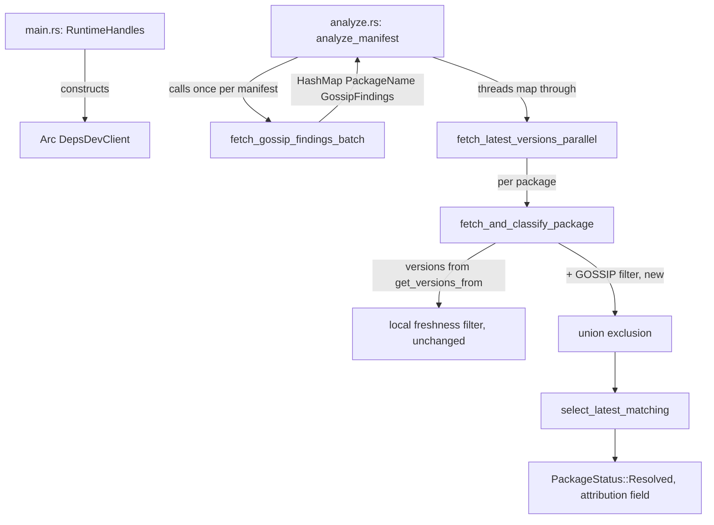

---
aliases:
  - deps-cli GOSSIP Parity Plan
tags:
  - sdd
  - plan
  - deps-cli
  - deps-dev
created: 2026-09-26
status: draft
related:
  - "[[spec]]"
  - "[[constitution]]"
---

# Technical Plan: deps-cli GOSSIP Parity

> [!info] References
> **Spec**: [[spec]]

## 1. Architecture

### Approach

Reuse spec 072's shipped `deps-core` GOSSIP plumbing unmodified. Add three pieces of wiring:

1. **Composition root** (`deps-cli`'s `RuntimeHandles`, `main.rs:88-121`): construct an
   `Arc<DepsDevClient>` next to the existing `Arc<OsvClient>`.
2. **Per-manifest prefetch** (`deps-cli::analyze::analyze_manifest`): one
   `fetch_gossip_findings_batch` call per manifest/ecosystem, before the per-package fetch stream
   starts — mirrors the existing `prefetch_tier3_licenses` call shape in the same file.
3. **Per-package filter** (`deps-engine::classify::fetch::fetch_and_classify_package`): consult
   the prefetched map to additionally exclude a version GOSSIP flags as in active cooldown,
   before `select_latest_matching` runs.

Plus the independent `ignored_sections`/`--config` fix in `deps-cli::config`.

### Component Diagram



### Key Design Decisions

| Decision | Choice | Rationale | Alternatives Considered |
|----------|--------|-----------|------------------------|
| Where to filter | Post-filter `versions` in `fetch_and_classify_package`, before `select_latest_matching` (fetch.rs:819) | Zero changes to the `Registry` trait or any of the 14 ecosystem crates — `versions` is already fully in scope at this point | Threading GOSSIP into `Registry::get_versions_from`'s signature — rejected: touches 14 crates for no added benefit, since the exclusion set is a pure list-filter operation independent of how each registry fetches |
| Prefetch granularity | One `GetFindingsBatch` call per manifest per covered ecosystem (via existing `fetch_gossip_findings_batch`) | Matches deps-lsp's own per-document batching; avoids N per-package calls | Per-package `gossip_findings_for_version` calls — rejected: no batching, defeats the point of `GetFindingsBatch` existing |
| Precedence vs. local `cooldown_secs` | Union (both exclude) | Simpler than an override model; `deps-cli`'s output feeds CI parsers where an unexplained override is worse than a wider, explained exclusion | GOSSIP-overrides-local (mirrors deps-lsp) — rejected: deps-lsp's override model exists because hover renders one line of prose that can name "the current authoritative source"; deps-cli's table/json/sarif rows are structured data consumed by tooling, where changing which source is authoritative per-row is a bigger surprise than widening the exclusion set |
| Attribution | New field on `PackageVersions` (or equivalent per-package outcome), populated only when GOSSIP is the sole excluding source | Lets `table`/`json`/`sarif` renderers explain *why* a version changed, without a schema/wire format change to any GOSSIP type | No attribution — rejected: silently changing what counts as "latest" without any surfaced reason is exactly the "silently disagree" failure mode spec 072's NFR-004 was written to prevent |

## 2. Project Structure

```
crates/deps-cli/src/
├── main.rs           # RuntimeHandles: + Arc<DepsDevClient> construction
├── analyze.rs         # analyze_manifest: + one fetch_gossip_findings_batch call per manifest
└── config.rs          # ignored_sections: + typosquat check; load(): unconditional warning loop

crates/deps-engine/src/classify/
└── fetch.rs            # fetch_and_classify_package / fetch_latest_versions_parallel:
                         # + gossip: &HashMap<PackageName, GossipFindings> parameter,
                         #   filter applied before select_latest_matching
```

No new files. No `crates/deps-core` changes.

## 3. Data Model

No wire/schema changes. One new in-process field, additive:

```rust
// crates/deps-engine/src/classify/fetch.rs — PackageVersions (exact current shape to be
// confirmed by the implementer; sketch only)
pub struct PackageVersions {
    // ...existing fields unchanged...

    /// Set when a version was excluded from being "latest" solely because of an active
    /// GOSSIP cooldown finding — never set when the local `cooldown_secs` heuristic would
    /// have excluded it anyway. `None` in the common case (GOSSIP disabled, no divergence).
    pub gossip_excluded_version: Option<ConcreteVersion>,
}
```

Threading change (mechanical, mirrors the existing `freshness: FreshnessSettings` parameter):

```rust
// fetch_latest_versions_parallel and fetch_and_classify_package both gain:
gossip: &HashMap<PackageName, deps_core::GossipFindings>,
```

Populated once per manifest in `analyze_manifest`:

```rust
let gossip_findings = deps_core::lsp_helpers::fetch_gossip_findings_batch(
    ecosystem_id,
    parse_result.as_ref(),
    formatter,
    policy.network.offline,
    gossip_client.as_ref(), // Option<&Arc<DepsDevClient>>, None when !policy.gossip.enabled
)
.await;
```

`gossip_client` is `None` whenever `!policy.gossip.enabled` (constructed once in `RuntimeHandles`,
passed down as `Option<&Arc<DepsDevClient>>`) — `fetch_gossip_findings_batch` already short-circuits
on `client: None` (`diagnostics.rs:1947-1949`), so this is a one-line gate at the call site, not new
logic.

### Filter logic (fetch.rs, before `select_latest_matching`)

```rust
let now = deps_core::freshness::PublishTime::now();
let versions: Vec<_> = versions
    .into_iter()
    .filter(|v| {
        gossip
            .get(&name)
            .filter(|g| g.version == v.version_string().as_str())
            .and_then(|g| g.cooldown.as_ref())
            .is_none_or(|c| !c.is_active(now))
    })
    .collect();
```

(Illustrative — exact iterator/type names to match `fetch.rs`'s actual `versions` element type at
implementation time; `PublishTime::now()`'s exact constructor name to be confirmed against
`crates/deps-core/src/freshness.rs`.)

## 4. API Design

Not applicable — no HTTP-facing API changes. Internal function signatures only (§3).

## 5. Integration Points

| System | Direction | Protocol | Notes |
|--------|-----------|----------|-------|
| deps.dev GOSSIP `GetFindingsBatch` | outbound | HTTPS (via existing `DepsDevClient`) | Reused as-is; no new endpoint, no new client code |

## 6. Security

- No new attack surface: reuses spec 072's opt-in gate (`GossipConfig.enabled`, default `false`),
  offline gate, and `source_is_public_registry_content` per-dependency privacy filter verbatim.
- `ignored_sections`/`--config` fix (spec FR-007/FR-008) does not weaken `safe_auto_discovered_config`'s
  existing spec-062 F1/F1-follow-up protections — those remain scoped to the auto-discovered path only.

## 7. Testing Strategy

| Level | Framework | What to Test | Coverage Target |
|-------|-----------|-------------|-----------------|
| Unit | `cargo nextest` | `fetch_and_classify_package`'s GOSSIP-union filter: local-only exclusion, GOSSIP-only exclusion, both, neither, version-string mismatch (no-op) | All 5 branches |
| Unit | `cargo nextest` | `ignored_sections` now includes `typosquat`; `load()` warns for both `required=true` and `required=false` while `safe_auto_discovered_config` reset stays `required=false`-only | Existing `test_ignored_sections_*` pattern (config.rs:413-427) extended |
| Integration | `cargo nextest` (mockito) | `deps-cli check`/`update` end-to-end against a mocked GOSSIP `GetFindingsBatch` response with an active `COOLDOWN` finding on the registry-latest version | At least one covered ecosystem (npm) |
| Live | manual (`.local/testing/`) | Real `deps-cli check` against a package with a live GOSSIP-flagged cooldown (e.g. a recently-published npm package), `[gossip].enabled = true` | Per `.claude/rules/continuous-improvement.md`'s live-testing gate before PR |

## 8. Performance Considerations

- One additional network round trip per manifest per covered ecosystem when GOSSIP is enabled
  (opt-in, default off) — bounded by the existing `gossip_semaphore`/`DEPS_DEV_BODY_LIMIT`, no new
  limits needed.
- Zero added cost when `[gossip].enabled = false` (the default) — `fetch_gossip_findings_batch`
  short-circuits before any HTTP call.

## 9. Rollout Plan

No feature flag beyond the existing `GossipConfig.enabled` (already shipped, default off). Ships
as a normal PR; no phased rollout needed given the opt-in gate.

## 10. Constitution Compliance

| Principle | Status | Notes |
|-----------|--------|-------|
| Type safety / no stringly-typed data | Compliant | Reuses existing typed `GossipFindings`/`GossipCooldown`; no new `String`/`bool` flags |
| DRY / centralize cross-crate logic | Compliant | Reuses `deps_core::lsp_helpers::fetch_gossip_findings_batch` verbatim rather than reimplementing the `EcosystemId`→`DepsDevSystem` mapping or the privacy/offline gates in `deps-engine` |
| Exhaustive enums stay exhaustive | Compliant | `Category` untouched (spec FR-004); no new variant added |
| MVP / no premature abstraction | Compliant | No new `deps-core` code; minimal additive field on `PackageVersions` |

## 11. Risks and Mitigations

| Risk | Impact | Probability | Mitigation |
|------|--------|-------------|------------|
| `PackageVersions`'s actual current shape doesn't cleanly fit an additive `Option<ConcreteVersion>` field (e.g. it's already large/complex) | low | low | Implementer reads the current struct definition first; §3's sketch is illustrative, not a literal diff |
| Attribution field (FR-005) scope creep into full report-rendering changes across `table`/`json`/`sarif` | medium | medium | Scope the first PR to `table` output only if `json`/`sarif` rendering proves nontrivial; file a fast-follow issue for the others rather than blocking this PR (documented precedent: spec 072 itself split scope across multiple PRs when cost/benefit didn't justify one big PR) |
| `PublishTime::now()` or equivalent doesn't exist yet in `freshness.rs` | low | low | Check `crates/deps-core/src/freshness.rs` first; if absent, add a minimal `now()` constructor there (small, in-scope addition, not a new subsystem) |

## See Also

- [[spec]] — feature specification
- [[072-deps-dev-gossip-signals/spec]] — source of all reused `deps-core` GOSSIP plumbing
- [[MOC-specs]] — all specifications
