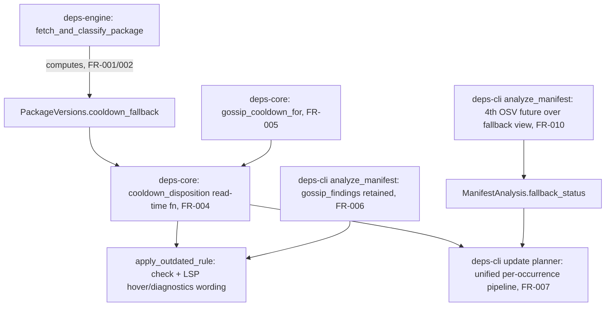

---
aliases:
  - cli update Cooldown Fallback Plan
tags:
  - sdd
  - plan
  - deps-cli
  - deps-core
  - deps-engine
created: 2026-09-27
status: ready
related:
  - "[[spec]]"
  - "[[constitution]]"
---

# Technical Plan: `deps-cli update`'s freshness-cooldown fallback and check/update precedence unification

> [!info] References
> **Spec**: [[spec]]
> **Source**: debugger → architect → critic → architect (revised) → critic (re-critique, verdict
> minor, conditionally approved on A1/A2) investigation chain, 2026-09-27, HEAD `120e31a42`.

## 1. Architecture

### Approach

The fallback candidate is computed once, in the one layer that already holds the full
`Vec<Box<dyn Version>>` list and the ecosystem's `Registry::select_latest_matching` /
`SelectionContext`: `deps-engine::classify::fetch::fetch_and_classify_package`. It stores a single
guarded candidate (`PackageVersions::cooldown_fallback: Option<CooldownFallback>`), never a
disposition or a per-version timestamp array. Whether `latest` is currently blocked, and whether
the stored fallback currently clears cooldown, is decided at READ time by one new
`deps_core::lsp_helpers::cooldown_disposition()` function, shared by `apply_outdated_rule` (check
wording, LSP hover/diagnostics) and `deps-cli update`'s planner. This keeps `PackageVersions::latest`
and every existing `deps-lsp` code path byte-for-byte unchanged; only consumers that explicitly
call the new function see the new behavior.

Rejected alternatives (full detail in the critic/architect handoffs,
`.local/handoff/2026-09-27T1{1,2}-*`):
- **A0** won't-fix: leaves a real starvation bug and a documented check/update contradiction.
- **A1** narrow fix, no OSV gate: reopens the exact vulnerability class PR #1530 closed.
- **A2** (first debugger sketch) `select_freshness_target` over an index-aligned
  `Arc<[Option<PublishTime>]>` in `deps-core`: blind to ecosystem selection rules (yanked/prerelease
  leak), no downgrade floor, a new parallel-array desync hazard the existing
  `PackageVersions::published_at` doc was written specifically to avoid.
- **A3** change `latest` itself in the engine: correct fix for the wrong problem — changes
  check/hover/LSP `latest` everywhere, which is exactly the NFR-004/NFR-001 divergence this spec
  must NOT introduce.
- **A4** fallback via the existing `CandidateStatusMap`/`build_candidate_check_targets`: capped at
  `MAX_CANDIDATE_CHECK_VERSIONS` (6), and a frequent publisher — this spec's own target case — can
  push the real fallback past rank 6, permanently `Unverified`, reopening starvation via a different
  door. Superseded by R-M2/FR-010: a dedicated, uncapped OSV round over just the fallback view.
- **Stored disposition enum with a non-pass default** (critic's own S5 fallback option): still a
  fetch-time snapshot (violates spec 072 FR-011's read-time requirement), and check/update would
  remain two separate code paths instead of one shared function. Rejected in the second architect
  round in favor of R-S5 (§1 above).

### Component Diagram



### Key Design Decisions

| Decision | Choice | Rationale | Alternatives Considered |
|----------|--------|-----------|--------------------------|
| Where the fallback is computed | `deps-engine::classify::fetch` | Only layer with per-version `published_at`/`removal_status` and the ecosystem's real selection rules | `deps-core` planner-side scan (A2, blind to selection rules) |
| What is stored vs. computed at read time | Store only the candidate (`CooldownFallback`); compute the disposition (`CooldownDisposition`) at read time | Satisfies spec 072 FR-011 (read-time evaluation); avoids a fetch-time-snapshot hazard and a pass-by-default construction bug (S5) | Store a full disposition enum with a "safe" default (still a snapshot; rejected) |
| Requirement-floor check | `compile_requirement` (precise per-ecosystem matcher), not `version_satisfies_requirement` (default heuristic) | The heuristic returns `false` (fails closed in the wrong direction — permits a downgrade) for `>=3.0`/`>=3,<4`/`3.x`/`||` on Cargo/npm/etc.; A1 repro | `version_satisfies_requirement` only (A1's stale-lock downgrade repro) |
| OSV verification scope | Separate `fallback_status: LatestStatusMap`, 4th future in existing `tokio::join!`, no rank cap | `CandidateStatusMap`'s 6-version cap reopens starvation for exactly this spec's target case (frequent publisher) | `CandidateStatusMap`/`build_candidate_check_targets` (A4, rejected) |
| Planner structure | One unified per-occurrence pipeline producing `OccurrenceCandidate` for each of (up to) two views, disposition picks the view | Preserves ignore-rule/ `--package` ordering against the ACTUAL write target (S4); required for OQ3 (fallback can override an OSV-flagged latest) | Keep two separate loops (`planned` closure + `unplannable` loop) with a late substitution (S4's original bug) |
| Exit code for a blocked fallback | Exit 1 for both Flagged and Unverified (OQ5', user decision) | Parity: an existing Flagged/Unverified `latest` already maps to exit 1 despite also being neither installed nor written | Exit 0 for both (architect's original proposal); Flagged=1/Unverified=0 split (critic's compromise) — both rejected by the user for consistency |

## 2. Project Structure

No new crates or modules. Changes land in existing files:

```
crates/deps-core/src/lsp_helpers/mod.rs      # CooldownFallback, CooldownDisposition, CooldownBlocker,
                                               # cooldown_disposition(); gossip_cooldown_for's FR-005
                                               # NotActive redefinition; GossipCooldownLookup pub + doctest
crates/deps-core/src/lsp_helpers/diagnostics.rs  # apply_outdated_rule switched to cooldown_disposition();
                                               # 1 test inversion (SC-002)
crates/deps-engine/src/classify/fetch.rs      # fallback candidate computation (FR-001/002), shared
                                               # gossip gate replacing the ad-hoc is_gossip_cooldown closure
crates/deps-cli/src/analyze.rs                # ManifestAnalysis.gossip_findings retained (FR-006),
                                               # .fallback_status + 4th OSV future (FR-010), new
                                               # AnalysisScope.cooldown_fallback bool
crates/deps-cli/src/update/mod.rs             # unified per-occurrence planner (FR-007), within_freshness_cooldown
                                               # deleted, PlannedUpdateItem.cooldown_fallback (FR-013),
                                               # SkipReason doc update (FR-014), dedup ordering (FR-015)
crates/deps-cli/src/update/security.rs        # 3 struct-literal updates for the new ManifestAnalysis fields
crates/deps-cli/src/report.rs                 # 1 new test pinning combined GOSSIP+FR-005-suffix wording
specs/074-deps-cli-gossip-parity/spec.md      # 2 amendment notes (NFR-004, FR-003b) — cross-reference only
specs/072-deps-dev-gossip-signals/spec.md     # 1 amendment note (FR-002 / NotActive) — cross-reference only
CHANGELOG.md                                  # ### Changed entry — added when code ships, not by this spec session
```

## 3. Data Model

```rust
// crates/deps-core/src/lsp_helpers/mod.rs

/// A single cooldown-cleared, ecosystem-safe, floor-protected candidate found for a
/// dependency whose registry-`latest` is currently blocked by the freshness cooldown.
#[non_exhaustive]
#[derive(Debug, Clone, PartialEq, Eq)]
pub struct CooldownFallback {
    pub version: ConcreteVersion,
    pub published_at: PublishTime,
}

/// What blocked `latest` from being usable as-is (drives check/hover wording).
#[derive(Debug, Clone, Copy, PartialEq, Eq)]
pub enum CooldownBlocker {
    Gossip,
    Local { published_at: PublishTime },
}

/// Read-time-only outcome of [`cooldown_disposition`]. Never stored on `PackageVersions`.
#[derive(Debug, Clone, PartialEq, Eq)]
pub enum CooldownDisposition<'a> {
    NotEvaluated,
    Cleared,
    Blocked {
        by: CooldownBlocker,
        fallback: Option<&'a CooldownFallback>,
    },
}

pub fn cooldown_disposition<'a>(
    versions: &'a PackageVersions,
    name: &PackageName,
    freshness: FreshnessSettings,
    gossip_prefetch: Option<&HashMap<PackageName, GossipFindings>>,
    now: PublishTime,
) -> CooldownDisposition<'a> { /* NFR-001 steps 0-4 */ }
```

```rust
// crates/deps-cli/src/update/mod.rs

enum CooldownFallbackNote {
    AppliedInsteadOf(ConcreteVersion),
    Blocked { version: ConcreteVersion },
}

enum OccurrenceCandidate {
    Planned(PlannedUpdate),
    Unplannable(UnplannableReason),
}
```

### Migrations

None — no persisted schema, no lockfile format change.

## 4. API Design

Not applicable (no HTTP/gRPC surface). The only public API surface change is the new
`deps_core::lsp_helpers::cooldown_disposition` function plus the promotion of
`GossipCooldownLookup`/`gossip_cooldown_for` from `pub(crate)` to `pub` (both require `///` doc
comments with a runnable `# Examples` doctest per this project's Rust API doc rule).

## 5. Integration Points

| System | Direction | Protocol | Notes |
|--------|-----------|----------|-------|
| OSV.dev (via `OsvClient`) | outbound | HTTPS (existing `OsvClient`) | FR-010's fallback verification round reuses the existing client and its cache; no new endpoint |
| deps.dev (via `DepsDevClient`) | outbound | HTTPS (existing `DepsDevClient`, unchanged) | FR-006 only threads an already-fetched result through; no new call site |

## 6. Security

- FR-010/FR-011 are the security-critical part of this plan: a fallback candidate is NEVER written
  without an independent OSV verification pass, closing the reopened-vulnerability-class risk the
  debugger flagged before any design work started.
- FR-001's ecosystem-safety guard (no yanked, no unintended prerelease) prevents a resolution-blocking
  or unstable version from ever becoming a `deps-cli update` write target via this new path.
- No new secrets, credentials, or network trust boundaries are introduced.

## 7. Testing Strategy

| Level | Framework | What to Test | Coverage Target |
|-------|-----------|---------------|------------------|
| Unit | `cargo nextest` | `cooldown_disposition` precedence (NFR-001 steps 0-4) in isolation, `gossip_cooldown_for`'s FR-005 redefinition, FR-001's ecosystem-safety guard, FR-003's `compile_requirement` floor | Every §6 decision-table row reachable (spec NFR-006) |
| Integration | `cargo nextest`, existing `deps-cli` fixture harness | `deps-cli update`'s unified planner (FR-007) end to end: starvation repro (US-001), flagged-latest-with-fallback (FR-012), fallback-itself-blocked (FR-011), `check`/`update` wording parity (US-002) | 5 kept + 2 inverted + 6 new named tests in spec §7 all pass |
| Doctest | `cargo test --doc` | New `# Examples` on `cooldown_disposition`, `gossip_cooldown_for`, `GossipCooldownLookup` (now `pub`) | Required by this project's Rust API doc rule, not optional |

## 8. Performance Considerations

- Expected load: unchanged for `check` and for `update` runs with no cooldown-blocked dependency.
- FR-010's extra OSV round only fires for occurrences where a first, OSV-status-free pass already
  found `Blocked { fallback: Some(_) }` — typically a small subset of a manifest's dependencies.
- No new per-request allocation pattern beyond one extra `LatestStatusMap` sized to that subset.

## 9. Rollout Plan

Single PR (or a small stacked series if the diff proves large in review) against
`fix/1528-1529-cooldown-fallback-precedence`, following this project's standard branch/PR workflow
(`.claude/rules/branching.md`). No feature flag — this is a bug fix with a documented, narrower
scope (spec §1 Out of Scope, §11 follow-up) rather than a new opt-in capability. The PR text must
say "partially addresses #1528" (or the maintainer must explicitly accept full closure) per the
scope boundary in spec §1.

## 10. Constitution Compliance

| Principle | Status | Notes |
|-----------|--------|-------|
| Type safety (exhaustive enums, no stringly-typed data) | Compliant | `CooldownDisposition`/`CooldownBlocker`/`OccurrenceCandidate`/`CooldownFallbackNote` are all exhaustive enums encoding what was previously a bool (`within_freshness_cooldown`) plus ad-hoc attribution fields |
| `unsafe_code = "forbid"` | Compliant | No `unsafe` needed |
| `thiserror` typed errors | N/A | No new fallible operations beyond existing OSV/deps.dev client calls, already typed |
| Rust API docs (`///`, `# Examples`) | Required, tracked | `cooldown_disposition`, `gossip_cooldown_for`, `GossipCooldownLookup` all need doctests once made/kept `pub` |
| DRY / cross-ecosystem consistency | Compliant | `cooldown_disposition` is the single shared gate for check/update/LSP hover/LSP diagnostics — this spec exists specifically to remove the check-vs-update duplication (#1529) |

## 11. Risks and Mitigations

| Risk | Impact | Probability | Mitigation |
|------|--------|-------------|------------|
| §6 decision table has a row implementers discover is wrong once the unified pipeline is actually coded | medium | medium | NFR-006 + spec's explicit "existing test wins" instruction (§6 warning callout); 5 named regression tests are the oracle, not the table |
| FR-005's `NotActive` redefinition surprises an LSP consumer relying on the old fail-open behavior | low | low | Change is fail-closed only (wording becomes more conservative, never less); 2 inverted tests are named explicitly so the change is deliberate, not accidental |
| Scope creep into fixing OQ1 (no-floor case) during implementation | medium | medium | §11 follow-up issue filed alongside this spec; agent boundaries (§8 Never) explicitly forbid it |
| `ManifestAnalysis` struct-literal churn (11 call sites) missed in one crate | low | low | `cargo check --workspace --all-features` surfaces every missed literal at compile time (this is exactly why FR-006/FR-010's new fields are worth the churn — compile-time enforcement) |

## See Also

- [[spec]] — feature specification
- [[tasks]] — implementation tasks
- [[MOC-specs]] — all specifications
