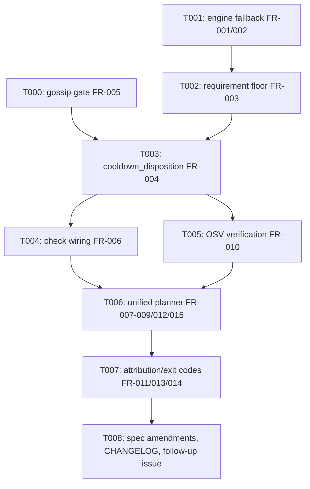

---
aliases:
  - cli update Cooldown Fallback Tasks
tags:
  - sdd
  - tasks
  - deps-cli
  - deps-core
  - deps-engine
created: 2026-09-27
status: shipped
related:
  - "[[spec]]"
  - "[[plan]]"
---

# Implementation Tasks: `deps-cli update`'s freshness-cooldown fallback and check/update precedence unification

> [!info] References
> **Spec**: [[spec]]
> **Plan**: [[plan]]
> **Total tasks**: 9 (T000-T008)

## Progress

- [x] T000: Promote and redefine the GOSSIP precedence gate (FR-005)
- [x] T001: Engine-side fallback candidate computation (FR-001, FR-002)
- [x] T002: Requirement-floor guard via `compile_requirement` (FR-003)
- [x] T003: Read-time `cooldown_disposition` function (FR-004)
- [x] T004: `deps-cli` GOSSIP-prefetch wiring for `check` (FR-006)
- [x] T005: Fallback OSV verification round (FR-010)
- [x] T006: Unified per-occurrence planner pipeline (FR-007, FR-008, FR-009, FR-012, FR-015)
- [x] T007: Attribution, exit codes, and doc updates (FR-011, FR-013, FR-014)
- [x] T008: Spec cross-reference amendments, CHANGELOG, follow-up issue

---

## Dependency Graph

Parallelizable: T000 and T001 have no dependency on each other and can be implemented in either
order (or by two developers) before T002/T003 need both.

---

### T000: Promote and redefine the GOSSIP precedence gate

**Context**: R-S3/FR-005 — `gossip_cooldown_for`'s `findings.cooldown == None` case currently maps
to `NotActive` (an authoritative "not in cooldown" answer), which is fail-open for a write path.
This must become `Unavailable` before `cooldown_disposition` (T003) can safely depend on it.
**Spec reference**: [[spec#FR-005]]
**Acceptance criteria**:
- [x] `GossipCooldownLookup::NotActive`'s doc comment is updated: it now means only "a parsed,
      past `end` was found", not "no COOLDOWN finding at all"
- [x] `gossip_cooldown_for` returns `Unavailable` when `findings.cooldown` is `None`
- [x] `GossipCooldownLookup` and `gossip_cooldown_for` are promoted from `pub(crate)` to `pub`,
      with a `# Examples` doctest each (this project's Rust API doc rule — these had none before,
      since they were internal; that exemption no longer applies once `pub`)
- [x] `gossip_cooldown_for_present_but_no_cooldown_data_is_not_active` (`lsp_helpers/mod.rs:~3478`)
      and its fixture `gossip_findings_fixture_not_in_cooldown` are updated to assert `Unavailable`
      — rename the test if its name no longer describes the assertion
- [x] `test_generate_diagnostics_from_cache_outdated_gossip_not_active_suppresses_local_fallback`
      (`diagnostics.rs:~6475`) is updated to assert the local-heuristic fallback now fires instead
      of suppression
- [x] `apply_outdated_rule`'s existing ad-hoc `is_gossip_cooldown` closure in
      `crates/deps-engine/src/classify/fetch.rs` is replaced by a call to this shared gate (DRY —
      it already required `Some` + active, so behavior is unchanged there)
**Dependencies**: none
**Files**: `crates/deps-core/src/lsp_helpers/mod.rs`, `crates/deps-core/src/lsp_helpers/diagnostics.rs`, `crates/deps-engine/src/classify/fetch.rs`
**Complexity**: low

---

### T001: Engine-side fallback candidate computation

**Context**: R-S1/FR-001 and D2/FR-002 — the fallback must be computed where the full
`Vec<Box<dyn Version>>` and `Registry::select_latest_matching`/`SelectionContext` already live
(`fetch_and_classify_package`), with an ecosystem-safety guard (no yanked, no unintended
prerelease, no retry past the first rejection) and a hard floor at the newest lockfile-resolved
in-use version.
**Spec reference**: [[spec#FR-001]], [[spec#FR-002]]
**Acceptance criteria**:
- [x] `PackageVersions` gains `cooldown_fallback: Option<CooldownFallback>` (additive, builder
      method, default `None` per NFR-003)
- [x] Computed only when `freshness.enabled`; `None` otherwise
- [x] Candidate must satisfy `!removal_status().blocks_resolution()` and `!is_prerelease()` (unless
      `latest` is itself a prerelease); on failure, `cooldown_fallback = None`, no retry down the list
- [x] Candidate must sit strictly newer (lower `available` index) than the newest lockfile-resolved
      in-use version; with no in-use version resolved, `cooldown_fallback = None` (OQ1 boundary —
      do not attempt to derive a synthetic floor, see plan.md's rejected-alternatives note)
- [x] New unit test: the S1 repro from spec §6 (yanked 1.0.0/1.1.0, fresh 1.2.0) resolves to `None`
- [x] `get_latest_matching_from`'s fallback-pick branch explicitly sets `cooldown_fallback = None`
      (NFR-003 — no implicit/derived default)
**Dependencies**: none
**Files**: `crates/deps-core/src/lsp_helpers/mod.rs` (type), `crates/deps-engine/src/classify/fetch.rs` (computation, ~line 763-990)
**Complexity**: high

---

### T002: Requirement-floor guard via `compile_requirement`

**Context**: A1 (must-encode critic amendment) — R-S2's "no entry satisfies the requirement then
engine floor alone" fallthrough still permits a downgrade for ranges the default
`version_satisfies_requirement` heuristic cannot model (`>=3.0`, `>=3,<4`, `3.x`, `||`). Must use
the precise per-ecosystem `compile_requirement` matcher instead, with an exact-pin-ecosystem
exception.
**Spec reference**: [[spec#FR-003]]
**Acceptance criteria**:
- [x] The per-occurrence requirement-floor check uses `compile_requirement`, not
      `version_satisfies_requirement`
- [x] `compile_requirement` returning `None`, or no `available` entry matching it, resolves the
      occurrence to `NoneUsable`
- [x] Exception: when `formatter.manifest_requirement_is_resolved_version(dep)` is `true`
      (currently only a Go `require`-directive dependency), T001's D2 engine floor alone is
      treated as sufficient — the declared requirement IS the in-use version there
- [x] New unit test: the A1 repro from spec §6 (`>=3.0`, lockfile 2.5.0, 3.x fresh, 2.9.0 cooled)
      resolves to `NoneUsable`, not a fallback to 2.9.0
- [x] New unit test: an unmodellable requirement form (e.g. `||`) also resolves to `NoneUsable`
**Dependencies**: T001
**Files**: `crates/deps-cli/src/update/mod.rs` (planner-side check) or `crates/deps-engine/src/classify/fetch.rs` if the compiled matcher is more naturally available there — implementer's call, document which in the PR
**Complexity**: medium

---

### T003: Read-time `cooldown_disposition` function

**Context**: R-S5 — the single function both `apply_outdated_rule` and the `deps-cli update`
planner call to decide, at read time, whether `latest` is usable, whether a stored
`cooldown_fallback` currently clears cooldown, and what blocked `latest` in the first place.
Deleting `within_freshness_cooldown` happens here.
**Spec reference**: [[spec#FR-004]], [[spec#NFR-001]], [[spec#NFR-002]]
**Acceptance criteria**:
- [x] `cooldown_disposition(versions, name, freshness, gossip_prefetch, now) -> CooldownDisposition<'_>`
      implements NFR-001 steps 0-4 in order (freshness gate → OSV is NOT this function's job, see
      T005/T006 — this function only covers cooldown/GOSSIP/local-heuristic, not OSV verdicts)
- [x] `apply_outdated_rule` (`crates/deps-core/src/lsp_helpers/diagnostics.rs`) is switched to call
      this function instead of its inline GOSSIP/local-heuristic branching
- [x] `within_freshness_cooldown` (`crates/deps-cli/src/update/mod.rs`) is deleted, not deprecated
- [x] `# Examples` doctest covering at least the `Cleared`/`Blocked{fallback: None}`/
      `Blocked{fallback: Some}` cases
- [x] `cargo doc --workspace --no-deps --all-features` with `RUSTFLAGS="-D warnings"
      RUSTDOCFLAGS="-D warnings"` passes (this project's stricter branching.md rustdoc gate, not
      just the weaker global CLAUDE.md one)
**Dependencies**: T000, T001, T002
**Files**: `crates/deps-core/src/lsp_helpers/mod.rs`, `crates/deps-core/src/lsp_helpers/diagnostics.rs`, `crates/deps-cli/src/update/mod.rs`
**Complexity**: medium

---

### T004: `deps-cli` GOSSIP-prefetch wiring for `check`

**Context**: debug finding 1 / FR-006 — `ManifestAnalysis::version_data()` never calls
`with_gossip_prefetch`, even though `analyze_manifest` already computes the exact map needed. This
must be fixed for `check` and `update` to actually share T003's precedence, not just in theory.
**Spec reference**: [[spec#FR-006]]
**Acceptance criteria**:
- [x] `ManifestAnalysis` gains a `gossip_findings: HashMap<PackageName, GossipFindings>` field,
      populated from the value `analyze_manifest` already computes and previously discarded
- [x] `version_data()` calls `.with_gossip_prefetch(&self.gossip_findings)`
- [x] New `report.rs` test pins the combined GOSSIP-cooldown wording + spec 074 FR-005's
      OSV-suffix message for `check` — no prior test exercised this combination since `check`
      never had live GOSSIP data before
- [x] All existing `ManifestAnalysis` struct literals across the workspace compile against the new
      field (`cargo check --workspace --all-features` is the actual gate — do not hand-count call
      sites)
**Dependencies**: T003
**Files**: `crates/deps-cli/src/analyze.rs`, `crates/deps-cli/src/report.rs`
**Complexity**: medium

---

### T005: Fallback OSV verification round

**Context**: R-M2/FR-010 — every fallback candidate must be independently OSV-verified before it
can ever be written, with no rank cap (unlike the existing `CandidateStatusMap`, which would
reopen starvation for exactly the frequent-publisher case this spec targets).
**Spec reference**: [[spec#FR-010]], [[spec#NFR-004]]
**Acceptance criteria**:
- [x] `AnalysisScope` gains a boolean field (e.g. `cooldown_fallback`), set for `update`'s default
      mode, not derived from an equality check against `update_default()`
- [x] `ManifestAnalysis` gains `fallback_status: LatestStatusMap`, populated by
      `build_latest_check_targets` run over the fallback view, as a 4th future in
      `analyze_manifest`'s existing `tokio::join!`
- [x] `fallback_status` is NEVER merged into `latest_status` — verify with a test that a
      fallback-candidate OSV verdict does not alter `latest`'s own verdict
- [x] `vuln_keys` is computed once and shared between the latest-status and fallback-status futures
      (no duplicate computation)
- [x] The round only runs for occurrences where a first, OSV-status-free pass already found
      `Blocked { fallback: Some(_) }` — assert via a test that zero extra OSV calls happen when no
      dependency is cooldown-blocked (NFR-004)
**Dependencies**: T003
**Files**: `crates/deps-cli/src/analyze.rs`
**Complexity**: high

---

### T006: Unified per-occurrence planner pipeline

**Context**: R-S4/A2 (must-encode critic amendment) — the two existing loops (`planned` closure and
`unplannable` loop) in `deps-cli update`'s planner must collapse into one pipeline that builds an
`OccurrenceCandidate` per view (latest, and — only for occurrences `Outdated` in the latest view,
FR-008 — fallback), lets `cooldown_disposition`/OSV verdicts pick the view, and only then runs
`is_requested`/ignore-rule/outcome mapping against the SELECTED target. This is the task most
likely to surface a discrepancy against spec §6's decision table — the 5 named regression tests are
the actual oracle, not the table.
**Spec reference**: [[spec#FR-007]], [[spec#FR-008]], [[spec#FR-009]], [[spec#FR-012]], [[spec#FR-015]], [[spec#6-edge-cases-and-error-handling]]
**Acceptance criteria**:
- [x] Per-occurrence (keyed by `name_range`) pipeline replaces the two separate loops
- [x] Fallback view is built ONLY for occurrences `Outdated` in the latest view (FR-008)
- [x] An occurrence whose fallback candidate already satisfies the declared requirement (absent
      from the fallback view) resolves to `NoneUsable` (FR-009)
- [x] `is_requested`, `ignore_rules.skip_reason(classify_update(current, target))`, and outcome
      mapping run exactly once, against the selected target (never `latest` when fallback was
      chosen)
- [x] `dedup_overlapping_edits` (or equivalent) runs AFTER view selection, over chosen
      `PlannedUpdate`s only (FR-015)
- [x] FR-012/OQ3: a flagged/unverified `latest` with an independently Verified/NotApplicable
      fallback resolves to `Applied(fallback)` with the flagged-latest attribution retained
- [x] All 5 named regression tests pass unchanged: `test_plan_updates_within_freshness_cooldown_is_skipped`,
      `test_plan_updates_freshness_cooldown_takes_precedence_but_keeps_gossip_attribution`,
      `test_plan_updates_flagged_latest_is_never_masked_by_cooldown`,
      `test_plan_updates_unverified_latest_is_never_masked_by_cooldown`,
      `test_plan_updates_unplannable_candidate_within_cooldown_is_cooldown_skip_not_unsafe`
- [x] New tests for at least the following §6 decision-table rows not already covered above:
      fallback OSV-blocked (Flagged and Unverified separately, feeds T007), fallback blocked by a
      non-OSV reason (resolves to `WithinFreshnessCooldown`, not `NotSafelyEditable`)
**Dependencies**: T004, T005
**Files**: `crates/deps-cli/src/update/mod.rs`
**Complexity**: high

---

### T007: Attribution, exit codes, and doc updates

**Context**: FR-011 (OQ5', user-decided exit code parity), FR-013 (attribution field), FR-014
(stale doc comment). This task wires T006's pipeline output into user-visible text/JSON/exit code.
**Spec reference**: [[spec#FR-011]], [[spec#FR-013]], [[spec#FR-014]]
**Acceptance criteria**:
- [x] `PlannedUpdateItem.cooldown_fallback: Option<CooldownFallbackNote>` added
      (`AppliedInsteadOf(ConcreteVersion)` | `Blocked { version: ConcreteVersion }`) — one field,
      so the two cases cannot both be set
- [x] `reason()` text and `--format json` surface the field; JSON omits it when `None` (additive,
      not breaking, per NFR-005)
- [x] A fallback candidate that is OSV Flagged OR Unverified maps to the existing
      `NotSafelyEditable`-equivalent outcome — exit code 1 for BOTH cases (not a Flagged/Unverified
      split) — naming the fallback version and its `advisory_ids`/verdict reason
- [x] `SkipReason::WithinFreshnessCooldown`'s doc comment (`update/mod.rs:129-139`) is rewritten to
      describe the new meaning ("nothing available clears cooldown, or the only candidate that
      would is OSV-blocked" is now wrong wording — see FR-011 for where an OSV-blocked fallback
      instead exits 1, not `WithinFreshnessCooldown`; the doc must precisely distinguish the two)
**Dependencies**: T006
**Files**: `crates/deps-cli/src/update/mod.rs`
**Complexity**: low

---

### T008: Spec cross-reference amendments, CHANGELOG, follow-up issue

**Context**: Bookkeeping required by this spec's own §10/§11 and the critique's must-encode
amendments — done once implementation has actually shipped (this task is the last one in the PR
that closes #1528/#1529, not part of the spec-writing session itself).
**Spec reference**: [[spec#10-amendments-to-other-specs]], [[spec#11-required-follow-up]]
**Acceptance criteria**:
- [x] `CHANGELOG.md` gets a `### Changed` entry (not `### Breaking`) covering: the new
      `deps-cli update` cooldown-fallback behavior, the FR-005 GOSSIP-wording change, and the
      spec-074-FR-003b no-lockfile-GOSSIP-Active behavior change — linked to the PR once its number
      is known
- [x] A GitHub issue is filed for the OQ1 no-floor follow-up (§11), referencing this spec, with a
      `bug` or `enhancement` label plus a P2-P4 priority label per this project's issue convention
- [x] The implementation PR's description says "partially addresses #1528" (or the maintainer has
      explicitly signed off on full closure) — never a bare `Closes #1528` unless that sign-off
      happened
- [x] `specs/MOC-specs.md`'s row for 075 is updated to `tasks` phase, `shipped` status, with the PR
      and both issue numbers once merged
**Dependencies**: T007
**Files**: `CHANGELOG.md`, `specs/MOC-specs.md` (already has amendment notes from the spec-writing session — this task only updates status/PR links)
**Complexity**: low

---

## Implementation Notes

### Order of execution

T000 and T001 can run in parallel (no shared files, no shared types beyond `PackageVersions` which
T001 alone touches). Everything else is a straight dependency chain: T002/T003 need both T000 and
T001's outputs; T004/T005 both need T003 but not each other (parallelizable); T006 needs both T004
and T005; T007 and T008 are strictly sequential after T006.

### Common patterns

- Follow `deps-core`'s existing exhaustive-enum-over-bool convention (`EcosystemId`,
  `LatestVerdict`) for every new type in this spec — do not add a `bool`/`Option<bool>` where an
  enum already exists in the plan (`CooldownDisposition`, `CooldownBlocker`, `OccurrenceCandidate`,
  `CooldownFallbackNote`).
- Mirror `gossip_excluded_version`'s existing shape when adding `PlannedUpdateItem.cooldown_fallback`
  (T007) — same file, same attribution-field pattern, already reviewed and shipped.
- Reuse `build_latest_check_targets` (T005) rather than writing a new OSV-request builder —
  `build_candidate_check_targets`/`CandidateStatusMap` exist for a different purpose (rank-capped
  candidate scanning) and are explicitly NOT the right tool here (see plan.md's Alternative A4).

### Gotchas

- The 2 test inversions in T000 are NOT regressions — do not "fix" them back to the old behavior
  if they fail; the spec explicitly requires this behavior change (R-S3/FR-005).
- `LatestStatusMap` has no version key — merging `fallback_status` into `latest_status` (explicitly
  forbidden in T005) will silently corrupt `latest`'s own OSV verdict via the version-equality
  check in `upgrade_status_to_verdict`. This is easy to get wrong by "simplifying" T005's two-map
  design during review; do not.
- §6's decision table (spec.md) is a design aid, not gospel — if T006's 5 named regression tests
  disagree with a table row once real code is written, the tests win and the table gets corrected
  in the same PR (spec §6's explicit implementer-note callout).
- Do not implement the OQ1 no-floor case "while you're in there" — it is explicitly out of scope
  (spec §1, §8 Never) and has its own follow-up issue (T008).

## See Also

- [[spec]] — feature specification
- [[plan]] — technical plan
- [[MOC-specs]] — all specifications
