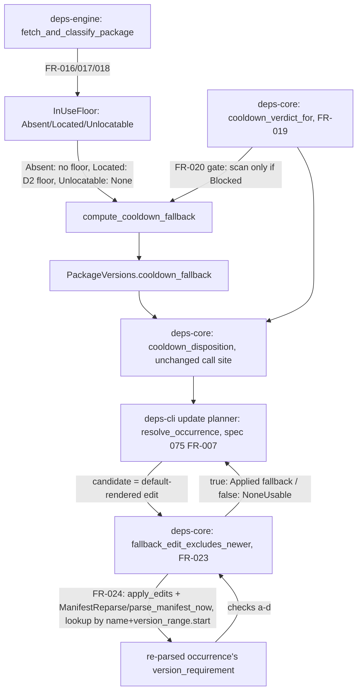

---
aliases:
  - cli update Cooldown Fallback No-Lockfile Extension Plan
tags:
  - sdd
  - plan
  - deps-cli
  - deps-core
  - deps-engine
created: 2026-09-27
status: ready
related:
  - "[[spec]]"
  - "[[constitution]]"
---

# Technical Plan: `deps-cli update`'s cooldown fallback for dependencies with no lockfile-resolved in-use version

> [!info] References
> **Spec**: [[spec]]
> **Source**: architect (round 1) → critic (round 1) → architect (round 2) → critic (round 2,
> `needs_discussion`) → architect (round 3) → architect (round 4, FINAL) → critic (round 4, final
> verdict: minor, approved to proceed) design chain, 2026-09-27, against shipped HEAD `73c9d52b9`
> (spec 075's PR #1550).

## 1. Architecture

### Approach (final, round-4 design only)

This is a refactor inside spec 075's existing pipeline, not a parallel one. Two independent
changes compose:

1. **The engine's D2 floor gains a third state.** `InUseFloor::Absent` (no in-use version at all)
   is no longer "no fallback" — it computes the same FR-001-guarded, `select_latest_matching`
   -ranked pick over the cooled subset that `Located` already computes, just with no positional
   floor. This alone would be unsafe for the auto-following ecosystems (Cargo/Dart/PyPI), which
   is why change 2 exists.
2. **The per-occurrence requirement-floor guard becomes a re-parse-based post-condition applied
   uniformly to BOTH the `Located` and `Absent` paths.** `fallback_edit_excludes_newer` answers
   one question — "once the DEFAULT edit is applied and the manifest re-parsed, does the effective
   requirement still exclude every known newer version?" — and if not, the occurrence is
   `NoneUsable` regardless of which path supplied the candidate. This single question is why the
   guard had to move from compiling the replacement span's own text (spec 075's shipped
   `fallback_satisfies_requirement`) to re-parsing: the span's text and the manifest's effective
   requirement are the same string only by accident for most grammars, and provably different for
   Swift's `from:`/`.exact`/`.upToNextMinor` labels.

No new pipeline, no new `UpdateKind`/`ManifestEdit` variant, no new per-ecosystem trait method.

### Rejected alternatives (full detail in the four-round handoff chain, `.local/handoff/2026-09-27T16-*`)

- **Round 1**: floor = lowest version the requirement admits (wrong semantics — a
  `^1 || ~2.9` requirement's lowest admitted version, 1.0.0, is far below what a fresh resolve
  actually gives, 2.9.0); a new per-ecosystem `requirement_floor` trait method (14-way drift
  risk, the #118 class); computing the requirement floor in the engine's fetch step (occurrences
  carry different per-occurrence requirements, not available at the dedup-by-name fetch layer);
  synthesizing an in-use version before `available` is known; a floorless scan with no per-occurrence
  guard (this is NOT what round 4 does — the guard is mandatory and fail-closed); retrying older
  candidates after a guard rejection (useless — the requirement floor is monotone, so every older
  candidate fails the same check); dropping the Go bypass entirely as a first move (later adopted
  in round 1's critique, then formalized as FR-022).
- **Round 2**: `FallbackFloor` provenance type gating a Go-bypass exception — dropped once round-1
  critic proved the bypass guards an unreachable branch; keeping `CooldownFallback::new` as
  shipped (no floor field ever added).
- **Round 3**: bounded range `>=F,<N` (core cannot pick `N` safely — no per-ecosystem comparison
  in `deps-core`, and a bound still admits a later-published fresh patch below `N`); a `!=X`
  exclusion specifier (PyPI/Composer only, and the guard already mishandles exclusions, filed
  separately per §11 item 3); failing closed for every auto-following ecosystem as the FIRST move
  (would have left Cargo/Dart/PyPI starved with no attempt at a fix — rejected until round 4 made
  it the FINAL, deliberate, user-decided move); a new `UpdateKind`/`ManifestEdit` variant (neither
  encodes the shape question); per-ecosystem post-conditions (the #118 drift class — one compiled
  check in `deps-core` covers all 14).
- **Round 3→4**: `format_version_pinned_for` per-ecosystem override (Cargo `=X`, Dart `X`, PyPI
  `>=X,<=X`) plus a `formatter_conformance!` macro forcing an explicit declaration — this was the
  round-3 design, verified correct in round-3 critique, then DELIBERATELY SUPERSEDED in round 4
  once the user's OQ-C decision (fail closed universally, not only for Cargo) removed the
  override's reason to exist. See spec.md §8's design-history note — this is not an oversight, it
  is documented so an implementer does not "helpfully" resurrect it.

### Component Diagram



### Key Design Decisions

| Decision | Choice | Rationale | Alternatives Considered |
|----------|--------|-----------|--------------------------|
| Where `InUseFloor` lives | `deps-engine::classify::fetch`, private | Both call sites it replaces (`fetch.rs:894`, `:1241`) already live there; no cross-crate type needed | A `deps-core` public type (unnecessary — no other crate needs to construct one) |
| Whether `Unlocatable` changes spec 074's own filter | No — `newest_located` preserves it exactly | Spec 074 already shipped; this spec's job is #1544, not a behavior change to an unrelated shipped feature | Collapsing `Unlocatable` into `Absent` everywhere (round-1 critic M2: silently turns "unplaceable" into "no floor" at the WRONG call site if done carelessly) |
| Guard input: span text vs. re-parsed requirement | Re-parsed (FR-024) | Round-2 critic S2 proved the span text and the effective requirement diverge for Swift/Bundler; re-parsing is the only way to validate the ACTUAL post-edit grammar generically, in `deps-core`, for all 14 ecosystems at once | Compiling the replacement span's text directly (spec 075's shipped approach, and this spec's round-2 design — both proven insufficient) |
| Per-ecosystem override for the written shape | None — uniform default-edit-only rule (FR-025) | User decision (OQ-C): a permanent exact pin is unacceptable for ANY ecosystem's published-library case, not only Cargo's, which removes every override's reason to exist | `format_version_pinned_for` trait method with Cargo `=X`/Dart `X`/PyPI `>=X,<=X` (round 3's design, later superseded) |
| Re-parse mechanism | New sync-capped `parse_manifest_now` + `now_or_never()`, NOT raw `now_or_never()` alone | Round-3 critic M2: raw `now_or_never()` bypasses the #796 `cap_dependencies` chokepoint, adding a second uncapped parse entry point | Reusing `parse_manifest_blocking` directly (it's genuinely async — spawns a blocking task — which the guard's synchronous call site cannot await from inside `resolve_occurrence`'s current sync signature without a larger refactor) |
| Occurrence lookup after re-parse | `(normalized name, version_range.start)` | Round-4 critic M3: name does not precede version in NuGet's `Version`-before-`Include` attribute order, Maven's XML element order, or Gradle's map notation — `name_range` shifts under the edit in those grammars and silently fails closed | `name_range` equality (round-3 design, proven wrong) |

## 2. Project Structure

No new crates. Changes land in existing files:

```
crates/deps-engine/src/classify/fetch.rs      # InUseFloor (FR-016/017/018) replacing protect_floor
                                               # (:894) and the fallback `floor` lookup (:1241);
                                               # cooldown_verdict_for call at the M4 gate (FR-020)
crates/deps-core/src/lsp_helpers/mod.rs       # CooldownVerdict + cooldown_verdict_for (FR-019),
                                               # extracted from cooldown_disposition's inline
                                               # branching; cooldown_disposition itself calls it
crates/deps-core/src/lsp_helpers/formatter.rs # no signature change — fallback_edit_excludes_newer
                                               # (FR-023) is a free fn consuming the existing
                                               # EcosystemFormatter/RequirementResolution methods
crates/deps-core/src/lsp_helpers/mod.rs       # fallback_edit_excludes_newer (FR-023), new pub fn
crates/deps-core/src/edit.rs                  # ManifestReparse trait + EcosystemReparse (FR-024)
crates/deps-core/src/ecosystem.rs             # parse_manifest_now (FR-024), sync sibling of
                                               # parse_manifest_blocking, same cap_dependencies call
crates/deps-cli/src/update/mod.rs             # fallback_satisfies_requirement deleted (replaced by
                                               # the deps-core fn); Go-bypass exception removed
                                               # (FR-022); plan_updates/resolve_occurrence gain a
                                               # `reparse: &dyn ManifestReparse` parameter
crates/deps-cli/src/main.rs                   # builds EcosystemReparse from the resolved ecosystem
                                               # + analysis.uri, passes it into plan_updates
specs/075-cli-update-cooldown-fallback/spec.md  # amendment notes per this spec's §10 — ALREADY
                                                 # APPLIED during this spec-writing session, not a
                                                 # pending task
CHANGELOG.md                                    # ### Fixed entry — added when code ships (T008)
```

## 3. Data Model

```rust
// crates/deps-engine/src/classify/fetch.rs (private)

/// FR-016/FR-017: replaces the two independent `in_use_versions` position lookups
/// (spec 074's GOSSIP filter, spec 075's D2 floor) with one shared classifier.
enum InUseFloor {
    /// `in_use_versions` is empty.
    Absent,
    /// Every resolvable entry maps to a position; `usize` is the newest (smallest index).
    Located(usize),
    /// At least one entry does not map to any position in `versions`.
    Unlocatable {
        /// Newest position among the entries that DID resolve, if any.
        newest_located: Option<usize>,
    },
}

fn in_use_floor(versions: &[Box<dyn Version>], in_use_versions: &[String]) -> InUseFloor {
    /* FR-017's classification */
}
```

```rust
// crates/deps-core/src/lsp_helpers/mod.rs

/// FR-019: the shared GOSSIP-vs-local-heuristic precedence result. Covers only
/// spec 075 NFR-001 steps 2-3 — freshness-enabled (step 0) and OSV (step 1) remain
/// each caller's concern.
#[derive(Debug, Clone, Copy, PartialEq, Eq)]
pub enum CooldownVerdict {
    Blocked(CooldownBlocker),
    Cleared,
    /// No GOSSIP verdict AND no local `published_at` — each caller decides its own
    /// missing-publish-time policy (spec 075 NFR-001 step 3 / OQ2).
    NoPublishTime,
}

pub fn cooldown_verdict_for(
    gossip: Option<&HashMap<PackageName, GossipFindings>>,
    name: &PackageName,
    version: &str,
    published_at: Option<PublishTime>,
    freshness: crate::freshness::FreshnessSettings,
    now: PublishTime,
) -> CooldownVerdict { /* NFR-001 steps 2-3, extracted from cooldown_disposition */ }
```

```rust
// crates/deps-core/src/edit.rs

/// FR-024: validates the EFFECTIVE post-edit requirement, not the replacement span's
/// own text — some grammars (Swift `from:`/`.exact`/`.upToNextMinor`, Bundler
/// multi-constraint literals) build it from context outside the span.
pub trait ManifestReparse {
    fn reparse(&self, content: &str) -> Option<Box<dyn crate::ecosystem::ParseResult>>;
}

/// Production `ManifestReparse`: drives `parse_manifest_now` (the sync, capped sibling
/// of `parse_manifest_blocking`) via `futures::FutureExt::now_or_never()`.
pub struct EcosystemReparse<'a> {
    pub ecosystem: &'a dyn crate::ecosystem::Ecosystem,
    pub uri: &'a url::Url,
}

impl ManifestReparse for EcosystemReparse<'_> {
    fn reparse(&self, content: &str) -> Option<Box<dyn crate::ecosystem::ParseResult>> {
        crate::ecosystem::parse_manifest_now(self.ecosystem, content, self.uri)
    }
}
```

```rust
// crates/deps-core/src/ecosystem.rs

/// FR-024 (round-3 critic M2): synchronous sibling of [`parse_manifest_blocking`] for a
/// caller that cannot `.await` (the fallback-edit post-condition, evaluated inside
/// `deps-cli`'s synchronous planner). Applies the SAME `dependency_cap::cap_dependencies`
/// chokepoint — a raw `now_or_never()` call site would otherwise bypass it (#796).
pub fn parse_manifest_now(
    ecosystem: &dyn Ecosystem,
    content: &str,
    uri: &url::Url,
) -> Option<Box<dyn ParseResult>> {
    use futures::FutureExt;
    let parsed = ecosystem.parse_manifest(content, uri).now_or_never()?.ok()?;
    Some(crate::dependency_cap::cap_dependencies(
        parsed,
        crate::dependency_cap::MAX_DEPENDENCIES_PER_DOCUMENT,
    ))
}
```

```rust
// crates/deps-core/src/lsp_helpers/mod.rs

/// FR-023: replaces `deps-cli`'s private `fallback_satisfies_requirement`
/// (spec 075, `update/mod.rs:729`). Applies uniformly to spec 075's `Located` path and
/// this spec's `Absent` path — no per-path distinction.
pub fn fallback_edit_excludes_newer(
    formatter: &dyn crate::lsp_helpers::EcosystemFormatter,
    reparse: &dyn crate::edit::ManifestReparse,
    content: &str,
    dep: &dyn crate::Dependency,
    candidate: &crate::edit::ManifestEdit,
    fallback: &crate::ConcreteVersion,
    available: &[crate::ConcreteVersion],
) -> bool { /* apply_edits -> reparse -> locate by (name, version_range.start) -> checks (a)-(d) */ }
```

### Migrations

None — no persisted schema, no lockfile format change.

## 4. API Design

New public API surface: `deps_core::lsp_helpers::{CooldownVerdict, cooldown_verdict_for,
fallback_edit_excludes_newer}`, `deps_core::edit::{ManifestReparse, EcosystemReparse}`,
`deps_core::ecosystem::parse_manifest_now`. Every one requires a `///` doc comment with a runnable
`# Examples` doctest per this project's Rust API doc rule (none of these existed before as
private/`pub(crate)` items exempt from that rule — `cooldown_verdict_for` is a new extraction, not
a promotion of an existing `pub(crate)` item the way spec 075's `gossip_cooldown_for` was).

## 5. Integration Points

No new external integration — this spec is entirely internal refactor plus one new synchronous
parse code path. `OsvClient`/`DepsDevClient` integration is unchanged from spec 075.

## 6. Security

- FR-023/FR-024 are the security-critical part of this spec: a fallback edit is written only
  after the SAME re-parse-based verification for both the lockfile and no-lockfile paths — closing
  the risk that the no-lockfile extension (FR-017) could be paired with a weaker check than spec
  075's existing lockfile path.
- FR-024's `parse_manifest_now` enforces the #796 `cap_dependencies` chokepoint identically to
  `parse_manifest_blocking` — a raw `now_or_never()` bypassing that cap would have reopened a
  resource-exhaustion vector on a maliciously oversized manifest specifically on the fallback-edit
  path.
- No new secrets, credentials, or network trust boundaries.

## 7. Testing Strategy

| Level | Framework | What to Test | Coverage Target |
|-------|-----------|---------------|------------------|
| Unit | `cargo nextest` | `InUseFloor` classification (all 3 variants, both call sites), `cooldown_verdict_for` extraction (NFR-007 pure-refactor check), `fallback_edit_excludes_newer` checks (a)-(d) in isolation with a stub `ManifestReparse`, `parse_manifest_now`'s cap enforcement | Every §6 row (spec.md) reachable (NFR-006-equivalent testability bar, inherited from spec 075's own NFR-006) |
| Integration | `cargo nextest`, existing `deps-cli` fixture harness | `deps-cli update`'s planner end to end for the `Absent` path (US-003), spec 075's `Located` path re-verified under the new guard (FR-027/SC-019), the 14 per-ecosystem real-parser outcome tests (FR-026/SC-018) | All spec.md §7 SC rows pass |
| Doctest | `cargo test --doc` | New `# Examples` on `cooldown_verdict_for`, `fallback_edit_excludes_newer`, `ManifestReparse`, `parse_manifest_now` | Required, not optional |

## 8. Performance Considerations

- FR-020's M4 gate means the `Absent` path's full version-history scan only runs for occurrences
  already known to be cooldown-blocked — no change in typical-run cost versus spec 075.
- FR-024's re-parse costs at most one extra synchronous, capped parse per occurrence that reaches
  the fallback-view pipeline (NFR-009) — this is new cost spec 075 did not have (spec 075's guard
  compiled span text, no parse), but it is bounded to the same small subset spec 075's own FR-010
  OSV round already targets.

## 9. Rollout Plan

Single PR against `feat/1544-cooldown-fallback-no-lockfile`, following this project's standard
branch/PR workflow (`.claude/rules/branching.md`). No feature flag — bug-fix scope with a
documented, narrower boundary (spec §1 Out of Scope, §11 follow-ups), matching spec 075's own
rollout shape. The PR text should say the outcome is "extends #1528's fix; documents a remaining
fail-closed boundary for Cargo/Dart/PyPI-default/Swift `from:`, tracked as a follow-up issue" —
not a bare `Closes #1544` if the maintainer wants the follow-up issue to remain the visible tracker
for that remaining scope (mirrors spec 075's own "partially addresses #1528" framing). Per this
project's global CLAUDE.md rule, both #1544 and any partially-addressed issue get closed on their
own merits by this PR, with the fail-closed boundary and #1551 items 3/5 filed as separate,
immediate follow-up issues (§11) rather than left open as tracking proxies.

### Suggested implementation sequencing (optional, non-blocking)

Round-4 critic's final review noted the two halves of this design carry different risk profiles
and suggested — as a recommendation for whoever picks up implementation via `/rust-team`, not a
requirement — splitting into two sequential PRs instead of one:

- **PR-A**: T002/T003 (the re-parse mechanism and `fallback_edit_excludes_newer` guard) plus T006
  (spec 075's lockfile-path regression verification). The corresponding `specs/075-.../spec.md`
  amendment notes are already written (this spec's §10, applied during spec-writing, not a
  T008 task) and need no further action here. This is the highest-risk piece — it changes the
  guard spec 075's ALREADY-SHIPPED lockfile path relies on.
- **PR-B**: T000/T001 (`InUseFloor`'s `Absent` state and the `cooldown_verdict_for`/M4-gate
  primitives), T004 (wiring), T005 (per-ecosystem tests), and T007 (`#1551` closure) — the new
  no-lockfile feature itself, built on PR-A's corrected guard.

A single PR covering all of T000-T008 is equally defensible (critic's own words: "one PR is also
defensible if review bandwidth allows") — this note exists so the choice is made deliberately, not
by default in either direction.

## 10. Constitution Compliance

| Principle | Status | Notes |
|-----------|--------|-------|
| Type safety (exhaustive enums, no stringly-typed data) | Compliant | `InUseFloor`, `CooldownVerdict` are exhaustive enums; no `bool`/`Option<bool>` introduced anywhere in this design |
| `unsafe_code = "forbid"` | Compliant | No `unsafe` needed |
| `thiserror` typed errors | N/A | `parse_manifest_now` reuses `Ecosystem::parse_manifest`'s existing `crate::error::Result`, collapsed to `Option` only at the `now_or_never()`/cap boundary, consistent with `ManifestReparse`'s `Option`-returning contract |
| Rust API docs (`///`, `# Examples`) | Required, tracked | All of §4's new public items need doctests |
| DRY / cross-ecosystem consistency | Compliant | `InUseFloor` (FR-016) and `cooldown_verdict_for` (FR-019) each replace exactly the duplication #1551 flagged; `fallback_edit_excludes_newer` is the one guard for all 14 ecosystems, no per-ecosystem override (FR-025) |

## 11. Risks and Mitigations

| Risk | Impact | Probability | Mitigation |
|------|--------|-------------|------------|
| A spec 075 test asserts a written caret/range fallback shape for Cargo/Dart/PyPI/Swift that this spec's guard now rejects | medium | medium | FR-027/SC-019 name the specific test as a verification candidate; spec's explicit "tests are the oracle, not the table" instruction (inherited from spec 075 §6) applies here too |
| `parse_manifest_now`'s `now_or_never()` silently returns `None` for an ecosystem whose `parse_manifest` impl violates the documented no-real-`.await` invariant | low | low | The invariant is already documented and relied upon by `parse_manifest_blocking`'s `Handle::block_on`; a violation already breaks that path today, so this spec adds no new failure class, only a second consumer of an existing contract |
| The `(name, version_range.start)` lookup still mismatches for a 15th, future ecosystem with an unforeseen grammar quirk | low | low | Fails closed (zero or multiple matches → `None`), never fails open — an omission only loses a fallback, never writes an unsafe one |
| Scope creep into fixing #1551 items 3/5, or the fail-closed-boundary follow-up, during this PR | medium | medium | §11's three follow-up issues are filed immediately alongside the PR per this project's no-partial-issue-proxy rule; §8 Never explicitly forbids reintroducing a per-ecosystem override to "helpfully" close the boundary inline |

## See Also

- [[spec]] — feature specification
- [[tasks]] — implementation tasks
- [[075-cli-update-cooldown-fallback/plan]] — the plan this one extends
- [[MOC-specs]] — all specifications
