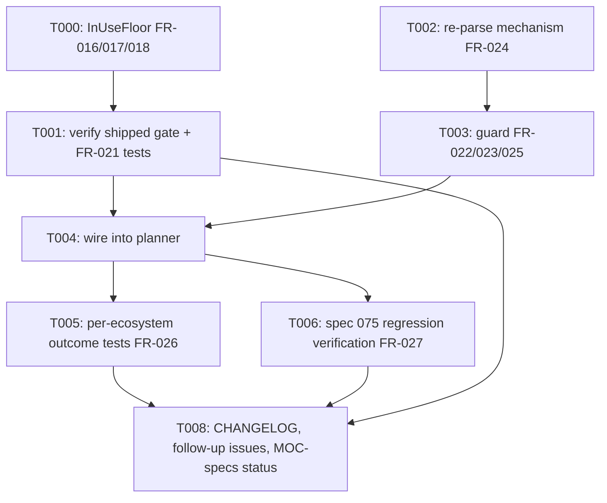

---
aliases:
  - cli update Cooldown Fallback No-Lockfile Extension Tasks
tags:
  - sdd
  - tasks
  - deps-cli
  - deps-core
  - deps-engine
created: 2026-09-27
status: shipped
related:
  - "[[spec]]"
  - "[[plan]]"
---

# Implementation Tasks: `deps-cli update`'s cooldown fallback for dependencies with no lockfile-resolved in-use version

> [!info] References
> **Spec**: [[spec]]
> **Plan**: [[plan]]
> **Total tasks**: 9 (T000-T008)

> [!warning] Implementation-design overrides (2026-09-27; see spec §3 amendment callout)
> - **T001**: no `CooldownVerdict`/`cooldown_verdict_for`. #1553's `cooldown_precedence` and gate
>   already ship FR-019/FR-020. Scope shrinks to SC-013's invariant tests only, with no production change.
> - **T002**: `parse_manifest_now` doc must state that re-parse is not pure. Cargo/Go/Deno/npm register
>   alternates (idempotent: `register_capped` is keyed by URL/chain key), and Cargo/NuGet/Gradle do sync
>   disk reads. Fix `parse_manifest_blocking`'s false "never actually yields" doc claim (Composer awaits).
>   Composer `Pending` → `None` (fail closed), no `block_in_place`. Add a blanket
>   `impl<F: Fn(&str) -> Option<Box<dyn ParseResult>>> ManifestReparse for F` plus one shared deps-cli test
>   helper that rebuilds the occurrence from the edited text at the same `version_range.start`.
> - **T003**: two-phase guard returning `FallbackEditVerdict` (spec FR-023 as amended), not `bool`.
>   SC-014 tests assert the exact `FallbackEditRejection` variant.
> - **T004**: callers branch on `FallbackEditVerdict::Writable`; `Rejected(r)` → `tracing::debug!` + the
>   existing `WithinFreshnessCooldown`/never-demoted handling.
> - **T000**: also invert `fetch.rs::no_in_use_version_yields_no_fallback_even_with_a_safe_cleared_candidate`.
> - **T007**: obsolete (#1551 closed by #1553). T008's §11 item 2 is now the Composer re-parse follow-up.

## Progress

- [x] T000: Shared `InUseFloor` classifier (FR-016, FR-017, FR-018)
- [x] T001: Verify #1553's shipped precedence/gate coverage; FR-021 invariant tests (FR-019, FR-020, FR-021)
- [x] T002: Sync-capped re-parse mechanism (FR-024)
- [x] T003: Uniform requirement-floor guard `fallback_edit_excludes_newer` (FR-022, FR-023, FR-025)
- [x] T004: Wire the guard into `deps-cli update`'s planner (replaces `fallback_satisfies_requirement`)
- [x] T005: Per-ecosystem real-parser outcome tests (FR-026)
- [x] T006: Spec 075 lockfile-path regression verification (FR-027)
- [x] T007: ~~`#1551` closure verification~~ — obsolete, #1551 closed by #1553 (FR-028)
- [x] T008: CHANGELOG, follow-up issues, MOC-specs status (§10, §11)

---

## Dependency Graph

Parallelizable: T000 and T002 have no shared files and can be implemented in either order (or by
two developers) before T001/T003 need their outputs.

---

### T000: Shared `InUseFloor` classifier

**Context**: FR-016/#1551 item 2 — `deps-engine/src/classify/fetch.rs` currently computes the same
`in_use_versions` → position lookup twice, independently: spec 074's GOSSIP filter (`protect_floor`
at `:894`) and spec 075's D2 floor (`floor` at `:1241`, via `.min()?`). The latter also has a live
bug (round-1 critic M2): a partial match (one in-use version locatable, one not) silently floors
at the locatable one and ignores that another in-use version could not be placed.
**Spec reference**: [[spec#FR-016]], [[spec#FR-017]], [[spec#FR-018]]
**Acceptance criteria**:
- [x] `enum InUseFloor { Absent, Located(usize), Unlocatable { newest_located: Option<usize> } }`
      added, engine-private
- [x] `fn in_use_floor(versions: &[Box<dyn Version>], in_use_versions: &[String]) -> InUseFloor`
      replaces BOTH `protect_floor` (`:894`) and the fallback `floor` lookup (`:1241`) — no third
      copy
- [x] Spec 074's GOSSIP-filter call site: `Located(idx)`/`Unlocatable { newest_located: Some(idx) }`
      both filter at `idx`; `Absent`/`Unlocatable { newest_located: None }` both no-op — BYTE FOR
      BYTE unchanged from today's shipped behavior (verify against every existing spec 074 test in
      `fetch.rs`, none of which may change expectation)
- [x] Fallback-candidate call site: `Located(idx)` sets the D2 floor unchanged;
      `Unlocatable` (either variant) now yields `cooldown_fallback: None` — STRICTER than today's
      shipped `.min()?`, which silently ignores an unplaceable entry
- [x] New unit test: a partial in-use-version match (one locatable, one not) at the fallback call
      site resolves `cooldown_fallback: None` (SC-010)
- [x] New unit test: spec 074's existing partial-match tests
      (`floor_exists_but_ecosystem_selection_rejects_the_remainder_is_a_no_op`,
      `filtered_pick_below_the_floor_is_rejected_in_favor_of_the_unfiltered_pick`) pass unchanged
      after the refactor (SC-011)
**Dependencies**: none
**Files**: `crates/deps-engine/src/classify/fetch.rs`
**Complexity**: medium

---

### T001: Verify #1553's shipped precedence/gate coverage; FR-021 invariant tests

**Context**: FR-019/FR-020 were shipped by #1553 before this spec's implementation:
`deps_core::lsp_helpers::cooldown_precedence` (`Cleared` | `Blocked(CooldownBlocker)`) is already the
single GOSSIP-vs-local primitive at `cooldown_disposition` and both `compute_cooldown_fallback` call
sites, and `compute_cooldown_fallback` already skips the scan when the known unfiltered pick is
`Cleared` (an unknown pick still scans). No production change here.
**Spec reference**: [[spec#FR-019]], [[spec#FR-020]], [[spec#FR-021]]
**Acceptance criteria**:
- [x] NO `CooldownVerdict`/`cooldown_verdict_for` is added (spec §3 amendment callout)
- [x] SC-012: confirm existing #1553 tests cover "known Cleared pick → no scan" and "unknown pick →
      full scan" (`unknown_list_based_pick_still_runs_the_full_fallback_search`); add a test only for a gap
- [x] SC-013: FR-021 gate-superset tests in `deps-engine` (3 proof cases + window-narrowed case asserting a
      skip, never an unsafe write)
- [x] NFR-007/SC-021: existing precedence/disposition/hover/diagnostics/report tests unchanged
**Dependencies**: T000 (shares `fetch.rs`)
**Files**: `crates/deps-engine/src/classify/fetch.rs` (tests only)
**Complexity**: low
---

### T002: Sync-capped re-parse mechanism

**Context**: FR-024, round-3 critic M2/M3 — the requirement-floor guard (T003) must validate the
manifest's EFFECTIVE post-edit requirement, not the replacement span's own text (proven wrong for
Swift/Bundler in round 2). This requires applying the candidate edit, re-parsing, and locating the
edited occurrence by a lookup key that survives every ecosystem's grammar, all from a synchronous
call site, without bypassing the existing `#796` dependency-count cap.
**Spec reference**: [[spec#FR-024]]
**Acceptance criteria**:
- [x] `pub fn parse_manifest_now(ecosystem: &dyn Ecosystem, content: &str, uri: &Url) ->
      Option<Box<dyn ParseResult>>` added to `deps_core::ecosystem` — drives
      `Ecosystem::parse_manifest` via `futures::FutureExt::now_or_never()`, then applies
      `dependency_cap::cap_dependencies(parsed, MAX_DEPENDENCIES_PER_DOCUMENT)`, the SAME call
      `parse_manifest_blocking` makes — `Pending` or an `Err` from the future maps to `None`
- [x] New test: `parse_manifest_now` on a manifest at/over `MAX_DEPENDENCIES_PER_DOCUMENT` is
      capped identically to `parse_manifest_blocking`'s async path (SC-016)
- [x] `pub trait ManifestReparse { fn reparse(&self, content: &str) -> Option<Box<dyn
      ParseResult>>; }` added to `deps_core::edit`
- [x] `pub struct EcosystemReparse<'a> { ecosystem: &'a dyn Ecosystem, uri: &'a Url }` implements
      `ManifestReparse` via `parse_manifest_now` — NOT a raw `now_or_never()` call (that would
      bypass the cap this task exists to enforce)
- [x] Occurrence lookup after re-parse is by `(formatter.normalize_package_name(dep.name()),
      version_range.start)` — NOT `name_range` equality; exactly one match required, zero or
      multiple fails closed (`None`)
- [x] New test: a NuGet `<PackageReference Version="1.0" Include="X"/>` (`Version` attribute
      before `Include`) fixture resolves correctly via this lookup key — proves the fix over a
      `name_range`-based lookup, which would silently fail closed here (SC-017)
**Dependencies**: none
**Files**: `crates/deps-core/src/ecosystem.rs`, `crates/deps-core/src/edit.rs`
**Complexity**: medium

---

### T003: Two-phase requirement guard `fallback_edit_excludes_newer` -> `FallbackEditVerdict`

**Context**: FR-022/FR-023 (as amended)/FR-025 — replaces spec 075's `fallback_satisfies_requirement`
(`crates/deps-cli/src/update/mod.rs`) with one guard in `deps-core`, applied identically to the
`Located` and `Absent` paths, no per-ecosystem override, no retry. Removes spec 075's Go bypass.
**Spec reference**: [[spec#FR-022]], [[spec#FR-023]], [[spec#FR-025]]
**Acceptance criteria**:
- [x] `pub enum FallbackEditVerdict { Writable, Rejected(FallbackEditRejection) }` and exhaustive
      `pub enum FallbackEditRejection { OriginalUncompilable, OriginalAlreadyUpToDate,
      OriginalResolvesPastFallback, ReparseFailed, OccurrenceNotUnique, EditedUncompilable,
      EditedExcludesFallback, EditedAdmitsNewer }` in `deps_core::lsp_helpers` (derive `Debug, Clone,
      Copy, PartialEq, Eq`; `///` docs + doctest)
- [x] `pub fn fallback_edit_excludes_newer(formatter, reparse: &dyn ManifestReparse, content, dep,
      candidate: &ManifestEdit, fallback, available) -> FallbackEditVerdict`, checks in this order,
      first failure wins:
      - Phase 1 on R0 = `dep.version_requirement()` (no parse): a0 `compile_requirement(R0)` is `Some`;
        c0 `!is_requirement_up_to_date(R0, fallback)`; d0 no `available` entry STRICTLY newer than
        `fallback` (newest-first list, `take_while(|v| v != fallback)`) has
        `requirement_already_resolves_to(R0, v)`
      - Re-parse: `apply_edits(content, &[candidate])` → `reparse.reparse(..)` (`None` → `ReparseFailed`)
        → exactly one dep with `normalize_package_name(name)` equal AND
        `version_range().start == dep.version_range().start` (else `OccurrenceNotUnique`)
      - Phase 2 on R1 = that dep's `version_requirement()`: a1 `compile_requirement(R1)` is `Some`;
        b1 matcher `matches(fallback) == Some(true)`; d1 no entry STRICTLY newer than `fallback` has
        `requirement_already_resolves_to(R1, v)`
      - Yanked entries are NOT filtered out of the d0/d1 scans (conservative)
- [x] No Go special case anywhere; `fallback_satisfies_requirement` is DELETED (the
      `manifest_requirement_is_resolved_version` trait method itself stays — other callers use it)
- [x] SC-014 unit tests in `deps-core`, one per `FallbackEditRejection` variant plus `Writable`, each
      asserting the EXACT variant, using stub formatters + closure `ManifestReparse` (see "Test
      location" below): d0 (R0 `^2.0`, fallback 1.9.0, 2.x available); c0 (NuGet-shaped floor stub, R0
      `2.0.0`, fallback 1.9.0); d1 (semver stub, R0 `1.0`, fallback 2.0.0, edit `2.0.0`, fresh 2.1.0);
      b1 (reparse closure yields R1 `^5`, only 1.x/2.x available); a0/a1 (stub with no
      `compile_requirement`); `ReparseFailed` (closure → `None`); `OccurrenceNotUnique` (closure yields
      two matching deps); `Writable` (semver stub, fallback 2.5.0, fresh 3.0.0)
- [x] SC-015: Swift `.exact(...)`/`.upToNextMinor` and Bundler multi-constraint evaluated on real
      re-parsed semantics — lives in `deps-swift`/`deps-bundler` tests (real formatter + `EcosystemReparse`)
- [x] SC-020: spec 075's Go-bypass tests inverted to prove Go's `ExactMatcher` alone yields the same
      outcome (lives in `deps-go` or `deps-cli` with the real `GoFormatter`)

**Test location (decided)**: `deps-core` cannot depend on ecosystem crates, so SC-014's variant
coverage lives in `deps-core` with stubs: a semver-backed stub (`compile_semver_requirement` +
default `resolves_to`/`up_to_date`, i.e. real semver semantics, Cargo-like) and a NuGet-floor stub
overriding `is_requirement_up_to_date`/`requirement_already_resolves_to` with the floor rule
(floor ≥ target → up to date; a floor never resolves forward). The REAL-formatter confirmations of
the same probe values live in the ecosystem crates as part of T005/SC-018: `deps-cargo` pins d0
(`1.0`/1.1.0/fresh 1.2.0), d1 (`1.0`/2.0.0/fresh 2.1.0), and `Writable` (fallback 1.1.0/fresh 3.0.0);
`deps-nuget` pins c0 (floor `2.0.0`/fallback 1.9.0) and the M2 loosening (floor `1.0.0`/fallback
1.1.0/fresh 1.2.0 → `Writable`).
**Dependencies**: T002
**Files**: `crates/deps-core/src/lsp_helpers/mod.rs` (or a new `lsp_helpers/fallback_edit.rs` submodule)
**Complexity**: high
---

### T004: Wire the guard into `deps-cli update`'s planner

**Context**: T000's `Absent` floor and T003's guard must actually reach `deps-cli update`'s
planner (`resolve_occurrence`, spec 075 FR-007's unified pipeline) so an `Absent`-floor occurrence
can be planned at all, and so every occurrence's candidate edit — `Located` or `Absent` — is
checked through T003 before being written.
**Spec reference**: [[spec#US-003]], [[spec#US-004]]
**Acceptance criteria**:
- [x] `plan_updates`/`resolve_occurrence` gain a `reparse: &dyn ManifestReparse` parameter
- [x] `crates/deps-cli/src/main.rs` builds an `EcosystemReparse` from the resolved ecosystem and
      `analysis.uri`, passing it through to `plan_updates`
- [x] Every fallback-view candidate — whether it came from `InUseFloor::Located` (spec 075's
      existing path) or `InUseFloor::Absent` (this spec's new path) — is checked through
      `fallback_edit_excludes_newer` before being marked `Planned`; there is no branch that skips
      the check for either origin
- [x] New test: a no-lockfile range dependency where no known newer version falls inside the
      ecosystem's default-rendered fallback edit resolves `Applied(fallback)` (US-003 criterion 1,
      SC-009)
- [x] New test: a no-lockfile Cargo dependency where a known newer version DOES fall inside the
      default-rendered `^X` edit resolves `NoneUsable` → `WithinFreshnessCooldown` (US-003
      criterion 2)
- [x] New test: the same Cargo scenario but with the newer version OUTSIDE the written `^X` range
      resolves `Applied(fallback)` — proves FR-025's rule is conditional, not a fixed per-ecosystem
      verdict (US-003 criterion 3)
**Dependencies**: T000, T003
**Files**: `crates/deps-cli/src/update/mod.rs`, `crates/deps-cli/src/main.rs`
**Complexity**: high

---

### T005: Per-ecosystem real-parser outcome tests

**Context**: FR-026, round-4 critic — replaces the round-3 `formatter_conformance!` macro (dropped:
no overridable trait method remains to force a declaration against). Each ecosystem crate needs
its own test proving `fallback_edit_excludes_newer` behaves as FR-025 describes for its canonical
declared-requirement shape, pinning drift in either the formatter's default rendering or the
re-parse lookup.
**Spec reference**: [[spec#FR-026]]
**Acceptance criteria**:
- [x] One test per ecosystem crate (14 total: Cargo, npm, Deno, PyPI, Go, Bundler, Dart, Maven,
      Gradle, Swift, Composer, NuGet, GitHub Actions, GitLab CI) drives
      `fallback_edit_excludes_newer` with that ecosystem's REAL formatter and a real
      `EcosystemReparse`
- [x] Where FR-025's rule is conditional on the fresh version's position relative to the written
      requirement (Cargo, Dart, PyPI's `~=`/default form, Swift `.upToNextMinor`), the test pins
      BOTH sub-cases (fresh version inside the range → fails closed; outside → writes) — not a
      single assertion (round-4 critic M5)
- [x] `deps-cargo` and `deps-nuget` tests additionally pin the real-formatter confirmations of T003's
      SC-014 probe values (see T003 "Test location"), asserting the exact `FallbackEditVerdict`
- [x] GitHub Actions/GitLab CI tests assert `Rejected(OriginalUncompilable)` (a0; `compile_requirement` is
      `None`) — documented as unchanged, pre-existing behavior, not a new fail-closed case (SC-018)
**Dependencies**: T004
**Files**: `crates/deps-cargo`, `crates/deps-npm`, `crates/deps-deno`, `crates/deps-pypi`,
`crates/deps-go`, `crates/deps-bundler`, `crates/deps-dart`, `crates/deps-maven`,
`crates/deps-gradle`, `crates/deps-swift`, `crates/deps-composer`, `crates/deps-nuget`,
`crates/deps-github-actions`, `crates/deps-gitlab-ci` (each crate's own test module)
**Complexity**: high

---

### T006: Spec 075 lockfile-path regression verification

**Context**: FR-027, round-4 critic M1 — T003's guard now also applies to spec 075's existing
`Located` (lockfile-resolved) path, which may invert a spec 075 test that asserted a written
caret/range-shaped fallback for Cargo, Dart, PyPI's default form, or Swift `from:`.
**Spec reference**: [[spec#FR-027]]
**Acceptance criteria**:
- [x] `crates/deps-cli/src/update/mod.rs::test_plan_updates_real_semver_formatter_applies_fallback`
      (~2386) is checked against T003's guard; if its written shape no longer passes, its
      expectation is corrected (NOT reverted — spec 075's table, like this spec's, is a design aid,
      the guard's actual behavior is the oracle) and the correction is documented in the PR
      description
- [x] Every other spec 075 test asserting a WRITTEN fallback for a Cargo/Dart/PyPI-default/Swift
      `from:` occurrence is likewise checked and corrected if needed (SC-019)
- [x] No spec 075 test for npm/Composer/Bundler/Go/Maven/Gradle/NuGet is affected (these ecosystems'
      default renderings are already exact/floor-shaped and pass T003's guard unchanged)
**Dependencies**: T004
**Files**: `crates/deps-cli/src/update/mod.rs`
**Complexity**: medium

---

### T007: ~~`#1551` closure verification~~ (obsolete)

#1551 was closed by #1553 (`a85946540`, all five items). Nothing to do; do not reference
`Closes #1551` in this spec's PR.
---

### T008: CHANGELOG, follow-up issues, MOC-specs status

**Context**: Bookkeeping required by this spec's own §10/§11, done once implementation has
actually shipped — mirroring spec 075's own T008, which deferred its `CHANGELOG.md` entry to its
implementation PR rather than writing it during spec-writing. UNLIKE spec 075's T008, the
`specs/075-.../spec.md` amendment notes are NOT part of this task — they were already written
during this spec's spec-writing session (spec 076 §10's 4 amendment callouts are live in
`specs/075-cli-update-cooldown-fallback/spec.md` today, per a review-round correction to this
spec's initial, overly narrow scope restriction).
**Spec reference**: [[spec#10-amendments-to-other-specs]], [[spec#11-required-follow-up]]
**Acceptance criteria**:
- [x] `CHANGELOG.md` gets a new `### Fixed` (or corrected existing) entry reflecting that the
      fallback no longer applies universally on either path for Cargo/Dart/PyPI-default/Swift
      `from:` — see spec 076 §10's exact wording concern about the existing `#1550` entry
- [x] Three follow-up GitHub issues are filed per spec 076 §11: (1) in-range-churn fail-closed
      outcome restoration research, (2) `#1551` items 3/5, (3) PyPI/Composer `!=X` exclusion
      specifiers — each with a category label plus a P0-P4 priority label per this project's issue
      convention
- [x] The implementation PR's description states which of #1544/#1528/#1551 it closes vs. partially
      addresses, per §9's Rollout Plan wording
- [x] `specs/MOC-specs.md`'s row for 076 is updated to `tasks` phase, `shipped` status, with the PR
      and issue numbers once merged
**Dependencies**: T001, T005, T006
**Files**: `CHANGELOG.md`, `specs/MOC-specs.md`
**Complexity**: low

---

## Implementation Notes

### Order of execution

T000 and T002 can run in parallel (no shared files). T001 needs T000's `InUseFloor` type in scope
at the fallback call site but not vice versa; T003 needs T002's re-parse mechanism. T004 needs both
T000 (for the `Absent` path to exist at all) and T003 (for the guard to check it). T005 and T006
both need T004; T007 is obsolete. T008 is strictly last.

### Common patterns

- Follow `deps-core`'s existing exhaustive-enum-over-bool convention for `InUseFloor` and
  `FallbackEditVerdict`/`FallbackEditRejection` — do not add a `bool`/`Option<bool>` where an enum is warranted.
- Reuse `deps_core::edit::apply_edits` (already exists, spec 068) for T002/T003's scratch-copy
  application — do not write a second edit-application helper.
- Mirror `cooldown_precedence`'s doctest style for `fallback_edit_excludes_newer`'s new `# Examples`.

### Gotchas

- Do NOT reintroduce a `format_version_pinned_for`-style per-ecosystem override, or a
  `formatter_conformance!` macro — three prior design rounds tried and abandoned this path once
  OQ-C made it unnecessary (see spec.md §8's design-history note). If a review comment suggests
  "just add an override for ecosystem X", that is exactly the reopened question OQ-C already
  closed — escalate to the user rather than implementing it.
- The re-parse mechanism MUST use `parse_manifest_now` (T002), never a raw `now_or_never()` call —
  the latter bypasses the `#796` dependency cap and reopens a resource-exhaustion vector
  specifically on the fallback-edit path.
- The occurrence lookup after re-parse MUST be `(name, version_range.start)`, never `name_range` —
  NuGet/Maven/Gradle's grammars put the version before the name on a single line, and `name_range`
  shifts under the edit there, silently losing the fallback (not unsafely, but incorrectly).
- Spec 075's decision table (§6) and this spec's own §6 are design aids, not gospel — if a named
  regression test (T006) disagrees with a table row once real code is written, the test wins and
  the table is corrected in the same PR (inherited convention from spec 075's own explicit
  instruction).
- Do not implement the §11 follow-up items (fail-closed boundary restoration, `#1551` items 3/5,
  `!=X` exclusion specifiers) "while you're in there" — each has its own follow-up issue, filed
  immediately, not deferred (T008).

## See Also

- [[spec]] — feature specification
- [[plan]] — technical plan
- [[075-cli-update-cooldown-fallback/tasks]] — the tasks this feature's T006 re-verifies against
- [[MOC-specs]] — all specifications
