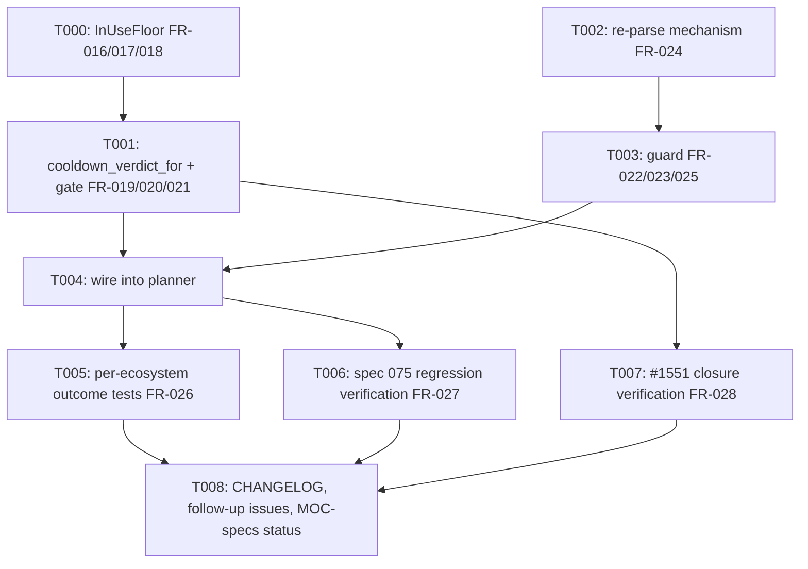

---
aliases:
  - cli update Cooldown Fallback No-Lockfile Extension Tasks
tags:
  - sdd
  - tasks
  - deps-cli
  - deps-core
  - deps-engine
created: 2026-09-27
status: ready
related:
  - "[[spec]]"
  - "[[plan]]"
---

# Implementation Tasks: `deps-cli update`'s cooldown fallback for dependencies with no lockfile-resolved in-use version

> [!info] References
> **Spec**: [[spec]]
> **Plan**: [[plan]]
> **Total tasks**: 9 (T000-T008)

## Progress

- [ ] T000: Shared `InUseFloor` classifier (FR-016, FR-017, FR-018)
- [ ] T001: `cooldown_verdict_for` extraction and the M4 fetch-time gate (FR-019, FR-020, FR-021)
- [ ] T002: Sync-capped re-parse mechanism (FR-024)
- [ ] T003: Uniform requirement-floor guard `fallback_edit_excludes_newer` (FR-022, FR-023, FR-025)
- [ ] T004: Wire the guard into `deps-cli update`'s planner (replaces `fallback_satisfies_requirement`)
- [ ] T005: Per-ecosystem real-parser outcome tests (FR-026)
- [ ] T006: Spec 075 lockfile-path regression verification (FR-027)
- [ ] T007: `#1551` closure verification (FR-028)
- [ ] T008: CHANGELOG, follow-up issues, MOC-specs status (§10, §11)

---

## Dependency Graph

Parallelizable: T000 and T002 have no shared files and can be implemented in either order (or by
two developers) before T001/T003 need their outputs.

---

### T000: Shared `InUseFloor` classifier

**Context**: FR-016/#1551 item 2 — `deps-engine/src/classify/fetch.rs` currently computes the same
`in_use_versions` → position lookup twice, independently: spec 074's GOSSIP filter (`protect_floor`
at `:894`) and spec 075's D2 floor (`floor` at `:1241`, via `.min()?`). The latter also has a live
bug (round-1 critic M2): a partial match (one in-use version locatable, one not) silently floors
at the locatable one and ignores that another in-use version could not be placed.
**Spec reference**: [[spec#FR-016]], [[spec#FR-017]], [[spec#FR-018]]
**Acceptance criteria**:
- [ ] `enum InUseFloor { Absent, Located(usize), Unlocatable { newest_located: Option<usize> } }`
      added, engine-private
- [ ] `fn in_use_floor(versions: &[Box<dyn Version>], in_use_versions: &[String]) -> InUseFloor`
      replaces BOTH `protect_floor` (`:894`) and the fallback `floor` lookup (`:1241`) — no third
      copy
- [ ] Spec 074's GOSSIP-filter call site: `Located(idx)`/`Unlocatable { newest_located: Some(idx) }`
      both filter at `idx`; `Absent`/`Unlocatable { newest_located: None }` both no-op — BYTE FOR
      BYTE unchanged from today's shipped behavior (verify against every existing spec 074 test in
      `fetch.rs`, none of which may change expectation)
- [ ] Fallback-candidate call site: `Located(idx)` sets the D2 floor unchanged;
      `Unlocatable` (either variant) now yields `cooldown_fallback: None` — STRICTER than today's
      shipped `.min()?`, which silently ignores an unplaceable entry
- [ ] New unit test: a partial in-use-version match (one locatable, one not) at the fallback call
      site resolves `cooldown_fallback: None` (SC-010)
- [ ] New unit test: spec 074's existing partial-match tests
      (`floor_exists_but_ecosystem_selection_rejects_the_remainder_is_a_no_op`,
      `filtered_pick_below_the_floor_is_rejected_in_favor_of_the_unfiltered_pick`) pass unchanged
      after the refactor (SC-011)
**Dependencies**: none
**Files**: `crates/deps-engine/src/classify/fetch.rs`
**Complexity**: medium

---

### T001: `cooldown_verdict_for` extraction and the M4 fetch-time gate

**Context**: FR-019/FR-020/FR-021, #1551 items 1 and 4 — `cooldown_disposition`'s inline
GOSSIP-vs-local-heuristic branching (`crates/deps-core/src/lsp_helpers/mod.rs:248-268`) must become
a standalone function so the fallback-candidate computation in `deps-engine` can share it, gated so
the full version-history scan only runs when the unfiltered pick is actually blocked.
**Spec reference**: [[spec#FR-019]], [[spec#FR-020]], [[spec#FR-021]]
**Acceptance criteria**:
- [ ] `pub enum CooldownVerdict { Blocked(CooldownBlocker), Cleared, NoPublishTime }` added to
      `deps_core::lsp_helpers`, with a `# Examples` doctest
- [ ] `pub fn cooldown_verdict_for(gossip, name, version, published_at, freshness, now) ->
      CooldownVerdict` extracted from `cooldown_disposition`'s existing GOSSIP/local branching —
      `cooldown_disposition` itself is rewritten to call it and map `NoPublishTime` to `Cleared`
      for `latest` (preserving today's exact behavior, NFR-007)
- [ ] `fetch_and_classify_package` calls `cooldown_verdict_for` on `unfiltered_pick_version` and
      runs `compute_cooldown_fallback` (the full scan) ONLY when the result is `Blocked(_)` —
      `Cleared`/`NoPublishTime` short-circuits to `cooldown_fallback: None` with zero extra
      GOSSIP/`select_latest_matching` calls
- [ ] The fallback-candidate's own cooled-subset filter (inside `compute_cooldown_fallback`) also
      calls `cooldown_verdict_for` per candidate, mapping `NoPublishTime` to NOT cleared (fail
      closed, spec 075 OQ2 — unchanged from today's existing per-candidate fail-closed behavior,
      just routed through the shared function)
- [ ] Spec 074's `is_gossip_cooldown` closure (`fetch.rs:856-859`) is explicitly left AS ITS OWN
      separate GOSSIP-only-Active check, not routed through `cooldown_verdict_for` — do not merge
      it in (FR-019's explicit carve-out)
- [ ] New test: zero fallback-candidate computation when `latest` is `Cleared`/`NoPublishTime`
      (SC-012)
- [ ] New tests: FR-021's gate-superset invariant, all 3 proof cases plus the
      cooldown-window-narrowed-between-fetch-and-read case asserting a skip (SC-013)
- [ ] NFR-007: every existing `cooldown_disposition`, `apply_outdated_rule`, `gossip_cooldown_for`,
      LSP hover, LSP diagnostics, and `deps-cli check`/`update` report test passes with UNCHANGED
      expectations (SC-021)
**Dependencies**: none
**Files**: `crates/deps-core/src/lsp_helpers/mod.rs`, `crates/deps-engine/src/classify/fetch.rs`
**Complexity**: medium

---

### T002: Sync-capped re-parse mechanism

**Context**: FR-024, round-3 critic M2/M3 — the requirement-floor guard (T003) must validate the
manifest's EFFECTIVE post-edit requirement, not the replacement span's own text (proven wrong for
Swift/Bundler in round 2). This requires applying the candidate edit, re-parsing, and locating the
edited occurrence by a lookup key that survives every ecosystem's grammar, all from a synchronous
call site, without bypassing the existing `#796` dependency-count cap.
**Spec reference**: [[spec#FR-024]]
**Acceptance criteria**:
- [ ] `pub fn parse_manifest_now(ecosystem: &dyn Ecosystem, content: &str, uri: &Url) ->
      Option<Box<dyn ParseResult>>` added to `deps_core::ecosystem` — drives
      `Ecosystem::parse_manifest` via `futures::FutureExt::now_or_never()`, then applies
      `dependency_cap::cap_dependencies(parsed, MAX_DEPENDENCIES_PER_DOCUMENT)`, the SAME call
      `parse_manifest_blocking` makes — `Pending` or an `Err` from the future maps to `None`
- [ ] New test: `parse_manifest_now` on a manifest at/over `MAX_DEPENDENCIES_PER_DOCUMENT` is
      capped identically to `parse_manifest_blocking`'s async path (SC-016)
- [ ] `pub trait ManifestReparse { fn reparse(&self, content: &str) -> Option<Box<dyn
      ParseResult>>; }` added to `deps_core::edit`
- [ ] `pub struct EcosystemReparse<'a> { ecosystem: &'a dyn Ecosystem, uri: &'a Url }` implements
      `ManifestReparse` via `parse_manifest_now` — NOT a raw `now_or_never()` call (that would
      bypass the cap this task exists to enforce)
- [ ] Occurrence lookup after re-parse is by `(formatter.normalize_package_name(dep.name()),
      version_range.start)` — NOT `name_range` equality; exactly one match required, zero or
      multiple fails closed (`None`)
- [ ] New test: a NuGet `<PackageReference Version="1.0" Include="X"/>` (`Version` attribute
      before `Include`) fixture resolves correctly via this lookup key — proves the fix over a
      `name_range`-based lookup, which would silently fail closed here (SC-017)
**Dependencies**: none
**Files**: `crates/deps-core/src/ecosystem.rs`, `crates/deps-core/src/edit.rs`
**Complexity**: medium

---

### T003: Uniform requirement-floor guard `fallback_edit_excludes_newer`

**Context**: FR-022/FR-023/FR-025 — replaces spec 075's span-text `fallback_satisfies_requirement`
(`crates/deps-cli/src/update/mod.rs:729`) with one re-parse-based guard in `deps-core`, applied
identically to spec 075's `Located` path and this spec's new `Absent` path, with no per-ecosystem
override and no retry. Also removes spec 075 FR-003's Go-bypass exception, which round-1 critic
proved guards an unreachable branch.
**Spec reference**: [[spec#FR-022]], [[spec#FR-023]], [[spec#FR-025]]
**Acceptance criteria**:
- [ ] `pub fn fallback_edit_excludes_newer(formatter, reparse: &dyn ManifestReparse, content, dep,
      candidate: &ManifestEdit, fallback, available) -> bool` added to `deps_core::lsp_helpers`
- [ ] Implementation: apply `candidate` to a scratch copy of `content` via
      `deps_core::edit::apply_edits`; re-parse via `reparse.reparse(..)` (T002); locate the
      occurrence by `(normalized name, version_range.start)` (T002); on its
      `version_requirement()`, return `true` iff (a) `compile_requirement` is `Some`, (b) the
      matcher admits at least one `available` entry, (c) `is_requirement_up_to_date(requirement,
      fallback)` is `false`, (d) no entry in `available` AT OR NEWER than `fallback` satisfies
      `requirement_already_resolves_to` — note check (d) includes the fallback's OWN position,
      unlike spec 075's original strictly-newer-only check
- [ ] `manifest_requirement_is_resolved_version`'s exception clause (spec 075 FR-003, Go bypass)
      is REMOVED — no special case for Go anywhere in this function
- [ ] `deps-cli`'s `fallback_satisfies_requirement` (`update/mod.rs:729`) is DELETED, not kept
      alongside the new function
- [ ] New test: NuGet `[2.0.0,)` bare-floor repro — a below-floor fallback is rejected via check
      (c), proving the guard is self-contained without relying on the NuGet formatter's own
      floor-carve-out as the only barrier (SC-014)
- [ ] New test: an unsatisfiable requirement (e.g. `^5` with only 1.x/2.x published) fails closed
      via check (b) (SC-014)
- [ ] New test: `>=2.0,<2.3` admits fresh `2.3.0` — check (d), including the fallback's own
      position — correctly rejects it (SC-014)
- [ ] New tests: Swift `.exact(...)` and `.upToNextMinor` are evaluated on their REAL re-parsed
      semantics, not the replacement span's literal text (SC-015)
- [ ] Existing Go fallback tests (`test_fallback_satisfies_requirement_go_exception_bypasses_compile_requirement`
      and its `plan_updates`-level equivalents) are INVERTED to prove Go's `ExactMatcher` alone —
      no bypass — still resolves the same outcome (SC-020)
**Dependencies**: T002
**Files**: `crates/deps-core/src/lsp_helpers/mod.rs`
**Complexity**: high

---

### T004: Wire the guard into `deps-cli update`'s planner

**Context**: T000's `Absent` floor and T003's guard must actually reach `deps-cli update`'s
planner (`resolve_occurrence`, spec 075 FR-007's unified pipeline) so an `Absent`-floor occurrence
can be planned at all, and so every occurrence's candidate edit — `Located` or `Absent` — is
checked through T003 before being written.
**Spec reference**: [[spec#US-003]], [[spec#US-004]]
**Acceptance criteria**:
- [ ] `plan_updates`/`resolve_occurrence` gain a `reparse: &dyn ManifestReparse` parameter
- [ ] `crates/deps-cli/src/main.rs` builds an `EcosystemReparse` from the resolved ecosystem and
      `analysis.uri`, passing it through to `plan_updates`
- [ ] Every fallback-view candidate — whether it came from `InUseFloor::Located` (spec 075's
      existing path) or `InUseFloor::Absent` (this spec's new path) — is checked through
      `fallback_edit_excludes_newer` before being marked `Planned`; there is no branch that skips
      the check for either origin
- [ ] New test: a no-lockfile range dependency where no known newer version falls inside the
      ecosystem's default-rendered fallback edit resolves `Applied(fallback)` (US-003 criterion 1,
      SC-009)
- [ ] New test: a no-lockfile Cargo dependency where a known newer version DOES fall inside the
      default-rendered `^X` edit resolves `NoneUsable` → `WithinFreshnessCooldown` (US-003
      criterion 2)
- [ ] New test: the same Cargo scenario but with the newer version OUTSIDE the written `^X` range
      resolves `Applied(fallback)` — proves FR-025's rule is conditional, not a fixed per-ecosystem
      verdict (US-003 criterion 3)
**Dependencies**: T000, T003
**Files**: `crates/deps-cli/src/update/mod.rs`, `crates/deps-cli/src/main.rs`
**Complexity**: high

---

### T005: Per-ecosystem real-parser outcome tests

**Context**: FR-026, round-4 critic — replaces the round-3 `formatter_conformance!` macro (dropped:
no overridable trait method remains to force a declaration against). Each ecosystem crate needs
its own test proving `fallback_edit_excludes_newer` behaves as FR-025 describes for its canonical
declared-requirement shape, pinning drift in either the formatter's default rendering or the
re-parse lookup.
**Spec reference**: [[spec#FR-026]]
**Acceptance criteria**:
- [ ] One test per ecosystem crate (14 total: Cargo, npm, Deno, PyPI, Go, Bundler, Dart, Maven,
      Gradle, Swift, Composer, NuGet, GitHub Actions, GitLab CI) drives
      `fallback_edit_excludes_newer` with that ecosystem's REAL formatter and a real
      `EcosystemReparse`
- [ ] Where FR-025's rule is conditional on the fresh version's position relative to the written
      requirement (Cargo, Dart, PyPI's `~=`/default form, Swift `.upToNextMinor`), the test pins
      BOTH sub-cases (fresh version inside the range → fails closed; outside → writes) — not a
      single assertion (round-4 critic M5)
- [ ] GitHub Actions/GitLab CI tests assert rejection via check (a) (`compile_requirement` is
      `None`) — documented as unchanged, pre-existing behavior, not a new fail-closed case (SC-018)
**Dependencies**: T004
**Files**: `crates/deps-cargo`, `crates/deps-npm`, `crates/deps-deno`, `crates/deps-pypi`,
`crates/deps-go`, `crates/deps-bundler`, `crates/deps-dart`, `crates/deps-maven`,
`crates/deps-gradle`, `crates/deps-swift`, `crates/deps-composer`, `crates/deps-nuget`,
`crates/deps-github-actions`, `crates/deps-gitlab-ci` (each crate's own test module)
**Complexity**: high

---

### T006: Spec 075 lockfile-path regression verification

**Context**: FR-027, round-4 critic M1 — T003's guard now also applies to spec 075's existing
`Located` (lockfile-resolved) path, which may invert a spec 075 test that asserted a written
caret/range-shaped fallback for Cargo, Dart, PyPI's default form, or Swift `from:`.
**Spec reference**: [[spec#FR-027]]
**Acceptance criteria**:
- [ ] `crates/deps-cli/src/update/mod.rs::test_plan_updates_real_semver_formatter_applies_fallback`
      (~2386) is checked against T003's guard; if its written shape no longer passes, its
      expectation is corrected (NOT reverted — spec 075's table, like this spec's, is a design aid,
      the guard's actual behavior is the oracle) and the correction is documented in the PR
      description
- [ ] Every other spec 075 test asserting a WRITTEN fallback for a Cargo/Dart/PyPI-default/Swift
      `from:` occurrence is likewise checked and corrected if needed (SC-019)
- [ ] No spec 075 test for npm/Composer/Bundler/Go/Maven/Gradle/NuGet is affected (these ecosystems'
      default renderings are already exact/floor-shaped and pass T003's guard unchanged)
**Dependencies**: T004
**Files**: `crates/deps-cli/src/update/mod.rs`
**Complexity**: medium

---

### T007: `#1551` closure verification

**Context**: FR-028 — `#1551` items 1, 2, and 4 are closed by T000/T001's shared helpers, but
closure requires a TEST proving both `cooldown_verdict_for` call sites (the fallback-candidate
filter and `cooldown_disposition`) actually route through the same function, not just that both
happen to produce the same answer today.
**Spec reference**: [[spec#FR-028]]
**Acceptance criteria**:
- [ ] A test (or code-level assertion the PR description points to) demonstrates both call sites
      invoke `cooldown_verdict_for` — e.g. a shared-fixture test that changes one input and
      observes both call sites' verdicts move together
- [ ] The PR description states `Closes #1551` is scoped to items 1, 2, and 4 only
- [ ] Items 3 and 5 are filed as their own follow-up issue (T008) — `Closes #1551` is NOT used if
      that would auto-close the issue with items 3/5 still open; state explicitly which items this
      PR closes
**Dependencies**: T001
**Files**: none (verification task; may add a test to `crates/deps-engine/src/classify/fetch.rs` or
`crates/deps-core/src/lsp_helpers/mod.rs`)
**Complexity**: low

---

### T008: CHANGELOG, follow-up issues, MOC-specs status

**Context**: Bookkeeping required by this spec's own §10/§11, done once implementation has
actually shipped — mirroring spec 075's own T008, which deferred its `CHANGELOG.md` entry to its
implementation PR rather than writing it during spec-writing. UNLIKE spec 075's T008, the
`specs/075-.../spec.md` amendment notes are NOT part of this task — they were already written
during this spec's spec-writing session (spec 076 §10's 4 amendment callouts are live in
`specs/075-cli-update-cooldown-fallback/spec.md` today, per a review-round correction to this
spec's initial, overly narrow scope restriction).
**Spec reference**: [[spec#10-amendments-to-other-specs]], [[spec#11-required-follow-up]]
**Acceptance criteria**:
- [ ] `CHANGELOG.md` gets a new `### Fixed` (or corrected existing) entry reflecting that the
      fallback no longer applies universally on either path for Cargo/Dart/PyPI-default/Swift
      `from:` — see spec 076 §10's exact wording concern about the existing `#1550` entry
- [ ] Three follow-up GitHub issues are filed per spec 076 §11: (1) in-range-churn fail-closed
      outcome restoration research, (2) `#1551` items 3/5, (3) PyPI/Composer `!=X` exclusion
      specifiers — each with a category label plus a P0-P4 priority label per this project's issue
      convention
- [ ] The implementation PR's description states which of #1544/#1528/#1551 it closes vs. partially
      addresses, per §9's Rollout Plan wording
- [ ] `specs/MOC-specs.md`'s row for 076 is updated to `tasks` phase, `shipped` status, with the PR
      and issue numbers once merged
**Dependencies**: T005, T006, T007
**Files**: `CHANGELOG.md`, `specs/MOC-specs.md`
**Complexity**: low

---

## Implementation Notes

### Order of execution

T000 and T002 can run in parallel (no shared files). T001 needs T000's `InUseFloor` type in scope
at the fallback call site but not vice versa; T003 needs T002's re-parse mechanism. T004 needs both
T000 (for the `Absent` path to exist at all) and T003 (for the guard to check it). T005 and T006
both need T004; T007 needs only T001. T008 is strictly last.

### Common patterns

- Follow `deps-core`'s existing exhaustive-enum-over-bool convention for `InUseFloor` and
  `CooldownVerdict` — do not add a `bool`/`Option<bool>` where an enum is warranted.
- Reuse `deps_core::edit::apply_edits` (already exists, spec 068) for T002/T003's scratch-copy
  application — do not write a second edit-application helper.
- Mirror spec 075's own `cooldown_disposition` doctest style for `cooldown_verdict_for`'s new
  `# Examples` section.

### Gotchas

- Do NOT reintroduce a `format_version_pinned_for`-style per-ecosystem override, or a
  `formatter_conformance!` macro — three prior design rounds tried and abandoned this path once
  OQ-C made it unnecessary (see spec.md §8's design-history note). If a review comment suggests
  "just add an override for ecosystem X", that is exactly the reopened question OQ-C already
  closed — escalate to the user rather than implementing it.
- The re-parse mechanism MUST use `parse_manifest_now` (T002), never a raw `now_or_never()` call —
  the latter bypasses the `#796` dependency cap and reopens a resource-exhaustion vector
  specifically on the fallback-edit path.
- The occurrence lookup after re-parse MUST be `(name, version_range.start)`, never `name_range` —
  NuGet/Maven/Gradle's grammars put the version before the name on a single line, and `name_range`
  shifts under the edit there, silently losing the fallback (not unsafely, but incorrectly).
- Spec 075's decision table (§6) and this spec's own §6 are design aids, not gospel — if a named
  regression test (T006) disagrees with a table row once real code is written, the test wins and
  the table is corrected in the same PR (inherited convention from spec 075's own explicit
  instruction).
- Do not implement the §11 follow-up items (fail-closed boundary restoration, `#1551` items 3/5,
  `!=X` exclusion specifiers) "while you're in there" — each has its own follow-up issue, filed
  immediately, not deferred (T008).

## See Also

- [[spec]] — feature specification
- [[plan]] — technical plan
- [[075-cli-update-cooldown-fallback/tasks]] — the tasks this feature's T006 re-verifies against
- [[MOC-specs]] — all specifications
